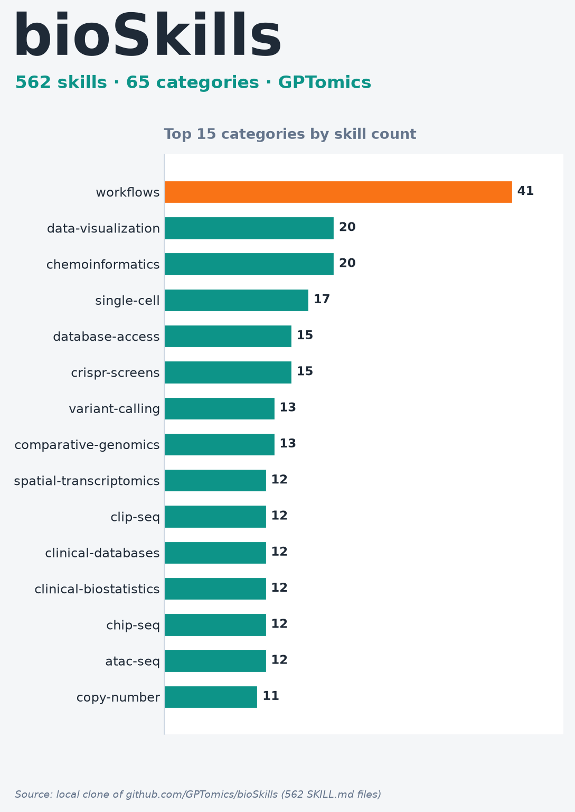

# 002｜bioSkills 使用体验记录

<!-- META
标题: bioSkills 使用体验记录
封面文字参考: 深度沉淀 ｜ bioSkills 与生信 AI 知识工程
/META -->

---

## 正文

做 AI 辅助编程，Agent Skills 已是成熟基础设施。但在生信这种工具链碎片化、版本依赖严苛的垂类，缺的不是语法，而是「领域边界与专家上下文」。

最近通读 bioSkills——生信领域最早系统化封装的开源 Skills 库，它的知识工程思路值得拆。

---

## 它解决的不是语法，是专家直觉

生信 AI 最缺三样东西：

- 不同算法对数据分布的模型假设（bulk 负二项 vs 单细胞零膨胀）
- 专用工具的隐式失效边界
- 极端严苛的版本兼容性

所以垂类 Skills 的本质：把生物学家的「分析决策逻辑 + 避坑直觉」标准化为 AI 可执行的协议。

---

## 三个架构亮点

1. **版本与环境强约束**：头部固化依赖与 API 签名，阻断用错语法。
2. **场景化决策树**：按实验设计直接给工作流选型，而不是罗列工具。
3. **失效模式四元组**（Trigger/Mechanism/Symptom/Fix）：把易错点拆成「触发条件—机理—表象—修复」，最见专业功力。

---

## 为什么值得逐个拆

生信机理散落在论文、文档、issue 里，碎片化遇到一个查一个，难成体系。逐类拆透，是补全认知盲区、吃透工具边界、沉淀自己随时可调用武器库的必经路。

## 标签

#生信 #bioSkills #AI编程 #知识工程 #GitHub #生物信息
