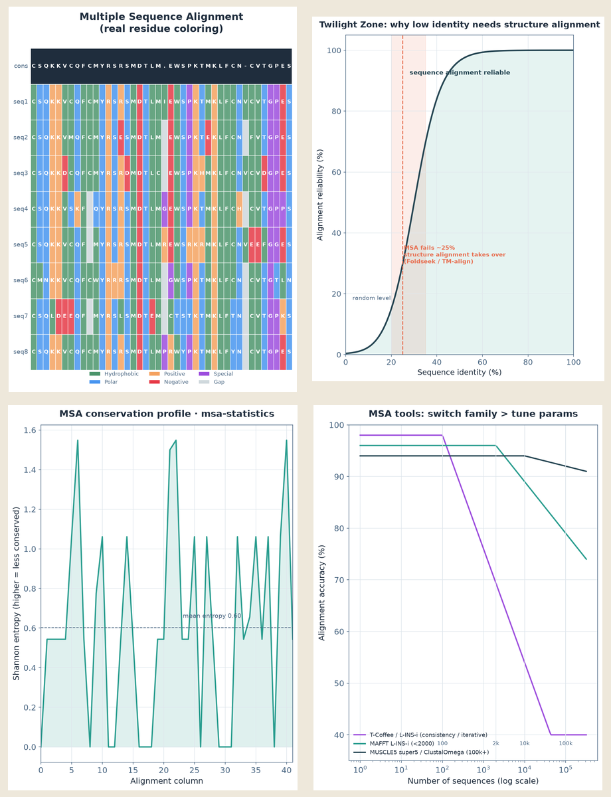

# 003｜bioSkills 拆解 01：alignment 比对体系

<!-- META
标题: bioSkills 拆解 01：alignment 比对体系
系列: 一个生信工程师的工作笔记 · skills 使用体验
配图: 1 张 2×2 拼图（4 子图）
参考仓库: https://github.com/GPTomics/bioSkills
封面文字参考: bioSkills 专项拆解 01 ｜ alignment 序列比对体系
/META -->

---

## 正文

生信的地基是比对：系统发育、变异分析、结构注释全靠它。bioSkills 的 alignment 大类有 **7 个子 skill**，展开的是一套完整比对决策体系。

---

**上图从左到右、从上到下：**

① **MSA 着色矩阵** — 真实蛋白多序列比对（8 seq × 42 列），按氨基酸化学性质着色，底部 consensus 标出 >60% 一致残基

② **黄昏区曲线** — 相似度 <25% 时序列比对可靠性骤降到近随机（红区），此时应跳到 3D 结构层（Foldseek / TM-align）

③ **Shannon 熵剖面** — 熵越低越保守；修剪铁律：去 <20% 缺失列安全，>40% 会破坏系统发育信号

④ **工具选型折线** — 小数据 T-Coffee/L-INS-i 精度最高，大数据 MUSCLE5 super5/ClustalOmega 稳如老狗

---

## 三条直觉

1. MSA 调优：**换流派 > 调参数**
2. 相似度 <25%：果断上结构比对
3. 修剪死守 **20%/40% 阈值**

> bioSkills 已 archived，建议 fork 自维护。

## 标签

#生信 #alignment #MAFFT #Foldseek #bioSkills #AI编程
