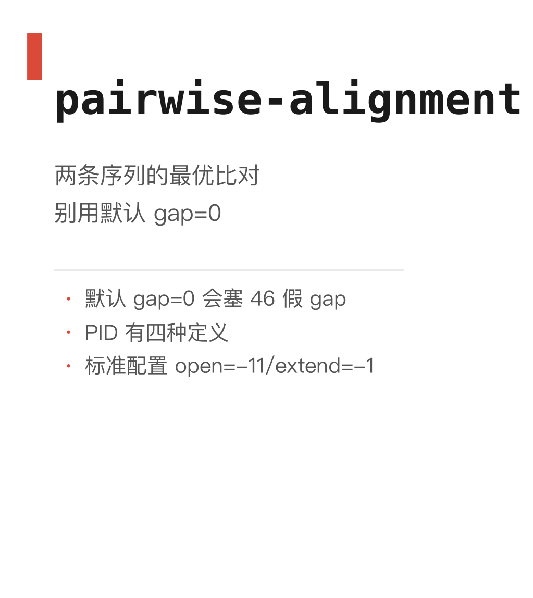

# 004｜bioSkills pairwise-alignment：默认参数下的 gap 与一致性计算

<!--
META
标题: bioSkills pairwise-alignment：默认参数下的 gap 与一致性计算
系列: bioSkills
配图: 
参考仓库: GPTomics/bioSkills (alignment/pairwise-alignment)
发布顺序: 004
/META
-->

## 功能定位

pairwise-alignment = **两条序列的动态规划最优比对**。丢两条蛋白/DNA 序列进去，它算出"怎么对齐最合理"——哪段对齐、哪段该插 gap、得分多少、相似度(PID)多少。

**解决啥问题**：拿到两条同源序列（比如同一蛋白的不同物种版本、突变前后），想知道"它们差多少、哪里保守、哪里变异"时，第一步就是做这个比对。Biopython 的 `PairwiseAligner` 是最常用工具——但参数坑很多（下面两个就是）。

**怎么跑的**：人血红蛋白 α 链 vs β 链（NCBI P69905 / P68871），严格按 skill 原方案复现。

---

## 默认 gap=0 会塞一堆假 gap

`PairwiseAligner()` 不传参数时 match=1 / mismatch=0 / **gap 全 0**。配合正分的 BLOSUM62，gap 不花钱 → aligner 疯狂插无意义短 gap 凑分。

| | 默认(gap=0) | 推荐(-11/-1) |
|---|---|---|
| 对齐长度 | 172 | **149** |
| Gap 数 | 55 | **9** |

多出 **46 个假 gap（+15.4%）**，score 反而更高（339 vs 286）——因为白送的 gap 撑高了匹配数。

skill 原文警告："Always specify gap penalties explicitly when using a substitution matrix." BLASTP 标准值 open=-11 / extend=-1。

---

## PID 有四种定义，差可达 11.5%

同一份比对，PID1–PID4 给出不同数字：

| 口径 | 分母 | 本例结果 |
|---|---|---|
| PID1 | 对齐长度(含 gap) | 43.6% |
| PID2 | 非_gap 配对位置 | 46.4% |
| PID3 | 较短序列长度 | 45.8% |
| PID4 | 平均序列长度 | 45.0% |

本例差 2.8 pct。skill 说极端情况可达 11.5 pct——**必须说清口径，否则结果不可比**。

`.counts()` 返回的近似是 PID2（排除 gap 的配对位置作分母）。

---

## 一句话结论

按 skill 教的 BLOSUM62 + **open=-11 / extend=-1** 跑，并明确 PID 口径。别用默认值。
