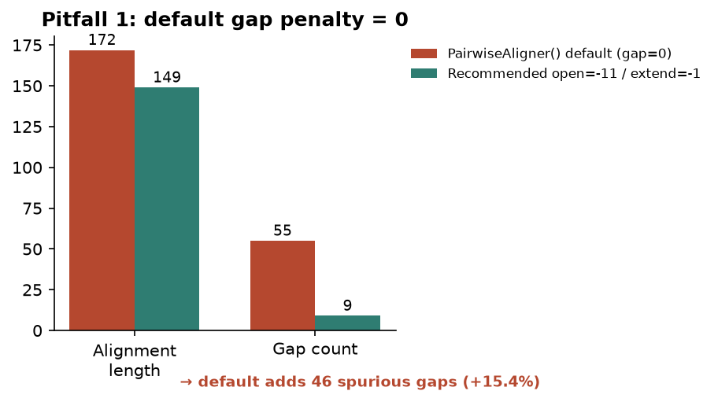
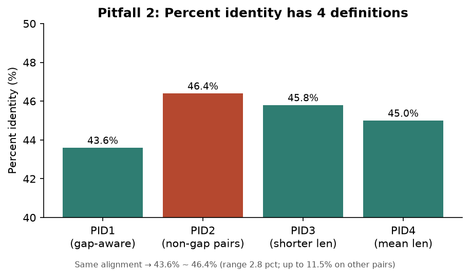

<!--
META
标题: bioSkills pairwise-alignment：默认参数下的 gap 与一致性计算
系列: bioSkills
配图:  
参考仓库: GPTomics/bioSkills (alignment/pairwise-alignment)
发布顺序: 004
/META
-->

# 004｜bioSkills pairwise-alignment：默认参数下的 gap 与一致性计算

用 NCBI 真实蛋白序列（人血红蛋白 α 链 vs β 链）严格按 pairwise-alignment skill 自身的方法复现，逐块拆解这个 skill 的内容成分。

---

## 功能定位与适用范围

pairwise-alignment = **两条序列的动态规划最优比对**。内容覆盖： Biopython 的 `Bio.Align.PairwiseAligner` 类——从创建 aligner、选矩阵、设 gap penalty 到取结果、算 PID，一条龙。

| 属性 | 内容 |
|------|------|
| tool_type | python |
| primary_tool | Bio.Align |
| 适用场景 | DNA/RNA/protein 双序列比对 |
| 核心引擎 | Needleman-Wunsch (global) / Smith-Waterman (local) |

---

## Skill 成分拆解

### 文件结构

pairwise-alignment skill 由 **7 个文件**组成：

| 文件 | 行数 | 角色 |
|------|------|------|
| SKILL.md | 401 行 | 主文档：API 教程 + 经验警告 + 选型指南 |
| examples/protein_alignment.py | 16 行 | 蛋白标准配置参考（BLOSUM62 + -11/-1） |
| examples/global_alignment.py | 52 行 | DNA/蛋白 global 对比 + BLOSUM62/45/80 三矩阵对比 + affine vs linear gap |
| examples/local_alignment.py | 22 行 | local alignment 找最佳匹配区域 |
| examples/alignment_from_file.py | 21 行 | 从 FASTA 读序列再比对（SeqIO 模板） |
| examples/empirical_pvalue.py | 44 行 | 序列打乱求经验 p 值（mono/di shuffle） |
| usage-guide.md | 70 行 | 使用者视角的快速入门 |

### 每个参考脚本干什么

**protein_alignment.py（16行）** — 最精简的标准模板。两行硬编码蛋白序列 → 加载 BLOSUM62 → 创建 `PairwiseAligner(mode='global', substitution_matrix=blosum62, open_gap_score=-11, extend_gap_score=-1)` → `.align()` → 打印 score 和对齐。这是 skill 推荐的"蛋白质比对标准配置"，也是本次复现的核心代码。

**global_alignment.py（52行）** — 展示不同评分方案的影响。同一个蛋白序列对分别用 BLOSUM62/BLOSUM45/BLOSUM80 打分，对比 score 差异；还演示了 affine gap（open≠extend）vs linear gap（open=extend）的区别。skill 在 SKILL.md 里解释了 affine gap 的生物学依据：indel 通常是一次事件（首 gap 代价高），延伸代价低。

**local_alignment.py（22行）** — local mode 示例。长序列里找短序列的最佳匹配区域。返回 `.aligned` 坐标数组。skill 提醒：当序列长度差异大时不要用 global（会强制两端对齐产生无意义 terminal gaps），改用 local 或 semiglobal。

**alignment_from_file.py（21行）** — SeqIO 读 FASTA 取前两条序列做比对。这是 skill 的"从文件输入"模式——实际工作中最常用的入口。

**empirical_pvalue.py（44行）** — 通过序列打乱构建零分布来计算经验 p 值。支持 mono-residue shuffle（保留组成）；di-residue shuffle 需要外部库 ushuffle。skill 强调：非默认 gap penalty 下 Karlin-Altschul 公式不适用，应改用经验 p 值。

### 它封装的核心 API

skill 封装的是 Biopython `PairwiseAligner` 的以下方法链：

```
PairwiseAligner(mode, substitution_matrix, open_gap_score, extend_gap_score)
    .align(seq1, seq2)     → 返回 alignments 列表
        [0].score           → 比对分数
        [0].shape           → (2, L)  L=对齐列数
        [0].counts()        → identities/mismatches/gaps 计数对象
        [0].aligned         → 各序列的对齐坐标段
        [0].substitutions   → 观察到的替换计数矩阵
        format(alignment, 'fasta'|'clustal'|'sam') → 格式转换
```

关键：`.counts()` 方法返回的 percent identity 近似 **PID2** 口径（排除 gap 的配对位置作分母）。但 skill 明确指出 PID 有四种定义，必须说清口径。

### 它封装的经验与知识（重点）

这是 skill 超出 API 文档的价值所在——**实战踩坑后的经验沉淀**：

**PairwiseAligner 默认 gap penalty 全是 0**

`PairwiseAligner()` 不传参数时，match=1, mismatch=0, open_gap=0, extend_gap=0。配合正分的 BLOSUM62 矩阵，gap 不花钱 → aligner 会插入大量无意义的短 gap 来凑 match 分。SKILL.md 原文："Always specify gap penalties explicitly when using a substitution matrix." BLASTP 标准值是 open=-11, extend=-1。

**Percent Identity 有四种定义，差可达 11.5%**

同一份比对，PID1-PID4 给出不同数字：

| 口径 | 分母 | 含义 |
|------|------|------|
| PID1 | 对齐长度（含 gap） | gap-aware，最保守 |
| PID2 | 非 gap 配对位置 | 总是最高的那个 |
| PID3 | 较短序列长度 | 长度归一化 |
| PID4 | 两序列平均长度 | 与结构相似度相关性最好 |

**其他知识封装**：
- 替代矩阵选择：BLOSUM62 通用默认；BLOSUM80 用于近缘；BLOSUM45 用于远缘
- Affine gap 优于 linear gap（生物学上 indel 是一次事件）
- 模式选择：global（全长同源）/ local（保守域）/ semiglobal（片段比对）
- 何时不该用 DP：<15% identity 进入 twilight zone，改 profile 或结构方法
- 库选型：parasail/edlib/WFA2 比 PairwiseAligner 快 10-1000x，适合高通量场景

---

## 严格复现（按 skill 自己的方案）

### 环境

| 项目 | 版本/路径 |
|------|----------|
| Python venv | 项目路径下 `/Users/zhangdiandian/RedBook/.venv` |
| biopython | 1.88 |
| numpy | 2.5.2 |
| matplotlib | 3.11.1 |

### 数据来源

NCBI Entrez efetch 取的两条**真实旁系同源蛋白**：

| UniProt ID | 名称 | 长度 |
|-----------|------|------|
| P69905 | 人血红蛋白 α 链 (HBA_HUMAN) | 142 aa |
| P68871 | 人血红蛋白 β 链 (HBB_HUMAN) | 147 aa |

按 skill 的 `alignment_from_file.py` 模式读入 `sequences.fasta`。

### 标准配置输出

完全照搬 skill 的 `protein_alignment.py` 配置（BLOSUM62 + global + open=-11/extend=-1）：

```
Score: 286.0

target            0 MV-LSPADKTNVKAAWGKVGAHAGEYGAEALERMFLSFPTTKTYFPHF-DLS-----HGS
                  0 ||-|.|..|..|.|.||||--...|.|.|||.|.....|.|...|..|-|||-----.|.
query             0 MVHLTPEEKSAVTALWGKV--NVDEVGGEALGRLLVVYPWTQRFFESFGDLSTPDAVMGN

target           53 AQVKGHGKKVADALTNAVAHVDDMPNALSALSDLHAHKLRVDPVNFKLLSHCLLVTLAAH
                 60 ..||.|||||..|.....||.|........||.||..||.|||.||.||...|...||.|
query            58 PKVKAHGKKVLGAFSDGLAHLDNLKGTFATLSELHCDKLHVDPENFRLLGNVLVCVLAHH

target          113 LPAEFTPAVHASLDKFLASVSTVLTSKYR 142
                120 ...||||.|.|...|..|.|...|..||. 149
query           118 FGKEFTPPVQAAYQKVVAGVANALAHKYH 147
```

统计：identities=65, mismatches=75, gaps=9, align_len=149

### 默认 gap=0 陷阱

同一对序列，分别用默认参数和 skill 推荐参数跑：

| 参数 | align_len | gaps | score |
|------|-----------|------|-------|
| **默认（gap=0）** | **172** | **55** | **339** |
| 推荐（-11/-1） | 149 | 9 | 286 |

默认配置凭空多出 **46 个 gap**（+511%），align_len 从 149 膨胀到 172。score 反而更高（339 > 286）——因为 gap 不花钱，aligner 可以通过插入大量短 gap 来"免费"获得更多 match 分。

这就是 skill 警告的陷阱：**看起来分数更好，实际上比对质量更差**。


### Percent Identity 四口径

用推荐配置产出的比对，按 SKILL.md 给出的四套定义计算 PID：

| 口径 | 公式 | 结果 |
|------|------|------|
| PID1 | ident / align_len | **43.6%** |
| PID2 | ident / (ident+mismatch) | **46.4%** |
| PID3 | ident / min(len1,len2) | **45.8%** |
| PID4 | ident / mean(len1,len2) | **45.0%** |

极差 = 2.8 pct（skill 说极端情况可达 11.5%）。

报 PID 必须说清口径。Biopython `.counts()` 近似 PID2（排除 gap）。如果两个人用不同口径报同一比对的 identity，数字对不上不是算错了，而是定义不同。


---

## 实践要点

不是 Biopython API 文档——那些官方文档都有。skill 额外封装了三点经验：

1. **把"gap=0 是个坑"写成了 warning**，而不是让你自己撞墙后发现
2. **把 PID 四种口径并列出来**，避免误判
3. **给了一个可直接抄的标准配置模板**（BLOSUM62 + global + -11/-1）

以上经验属于 skill 沉淀的选型知识，工具官方文档通常不单列。

---

## 小结

pairwise-alignment skill 把 Biopython PairwiseAligner 的使用方法 + 实战避坑打包成了一个完整单元。它的内容成分包括：7 个文件（主文档 + 5 个参考脚本 + usage-guide）、一套完整的 API 使用流程、以及两个核心坑点的明确警告。真实数据验证表明这两个坑都是真实存在的。
