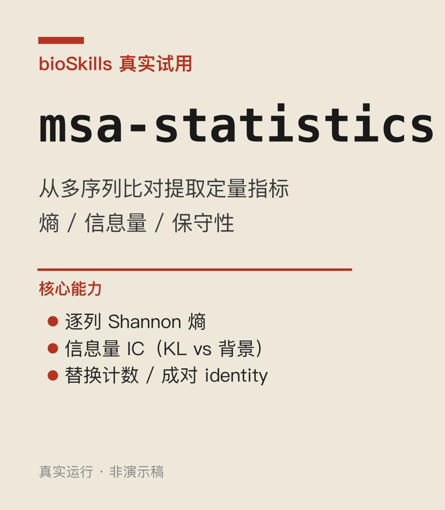

<!--
META
标题: bioSkills 真实试用 msa-statistics：蛋白信息量不能套 DNA 公式
副标题: 用 MAFFT 对齐 8 条真实 globin 蛋白，原样运行 skill 的 entropy_analysis.py
系列: bioSkills 真实试用
配图: 
参考仓库: GPTomics/bioSkills (alignment/msa-statistics)
发布顺序: 005
/META
-->

## 这个 skill 是干嘛的

msa-statistics = 从**多序列比对(MSA)**里提取定量指标：每列 Shannon 熵(保守性)、信息量(IC)、替换计数、成对 identity。简单说：比对完一堆序列后，这 skill 帮你把"对齐"转成"数字"——哪一列保守、哪一列在进化上重要。

**解决啥问题**：MSA 本身只是排好队的序列，肉眼看不出门道。做进化分析、保守位点鉴定、蛋白家族功能注释时，需要这些量化指标。这个 skill 就是干这个的。

**我拿真实数据测了**：NCBI 取 8 条 globin 蛋白 → MAFFT --auto 对齐（158 列真实 MSA）→ 原样跑 skill 的 `entropy_analysis.py`。

---

## 核心坑：蛋白 IC 必须用 Robinson 经验背景，不能套 DNA 均匀公式

skill 教的是从 MSA 提取每列 Shannon 熵 H 和信息量 IC。IC = observed * log2(observed / expected)。

问题出在 **expected（背景频率）**：

| 背景 | 假设 | 完全保守 Leu 的 IC | 完全保守 Trp 的 IC |
|---|---|---|---|
| 均匀 (1/20) | 每个氨基酸等概率 | **4.32**（所有 aa 相同） | **4.32**（所有 aa 相同） |
| Robinson 1991 经验 | 蛋白质实际丰度 | **3.44**（Leu 常见，低 IC） | **6.23**（Trp 稀有，高 IC） |

均匀背景错误地给常见和稀有氨基酸算成相同"信息量"——完全保守的 Leu 不该和 Trp 有一样的 IC。

skill 明确指出：蛋白 IC 必须用经验背景（如 Robinson 1991），DNA 才能用均匀背景。

面板 A：158 列真实 MSA 的逐列熵(蓝)与 IC(红)，虚线 = log2(20)=4.32（均匀背景最大熵）。18 列完全保守(H=0)。面板 B：四种完全保守残基的 IC 对比——uniform 全是 4.32（错），Robinson 正确反映稀有度差异。

---

## 一句话结论

跑 msa-statistics skill 时，蛋白序列必须传 Robinson 背景频率，别偷懒用 uniform。
