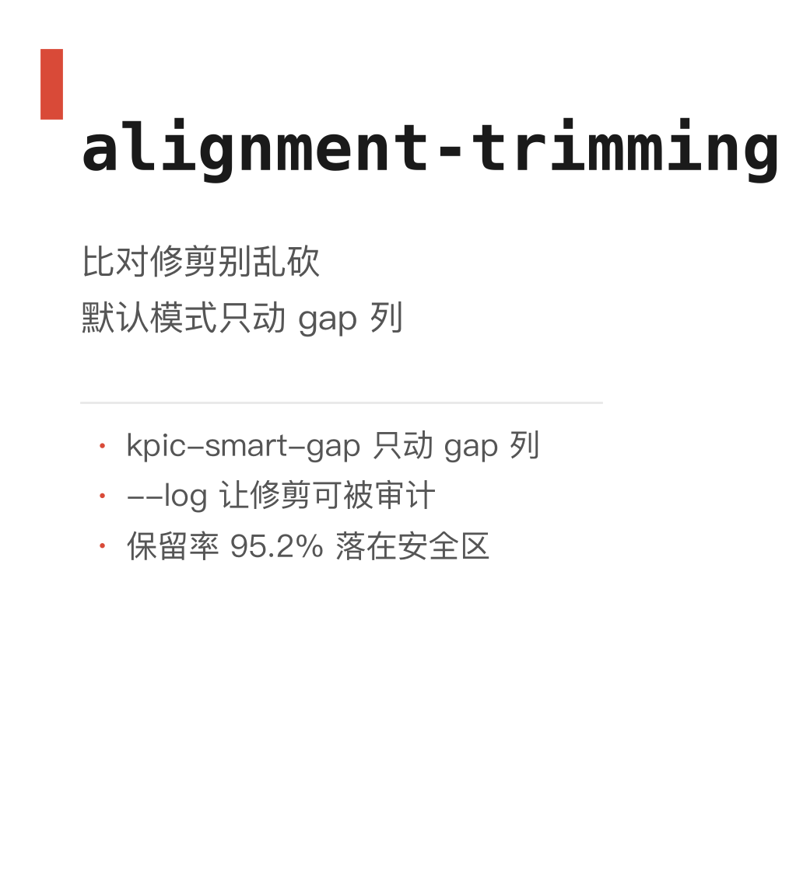

# 006｜比对修剪：ClipKIT 默认模式的行为

<!-- META
标题: 比对修剪：ClipKIT 默认模式的行为
系列: bioSkills
配图: 
参考仓库: GPTomics/bioSkills (alignment/alignment-trimming)
发布顺序: 006
/META -->


## 功能定位

alignment-trimming = **比对（MSA）建完后，自动去掉不可靠的列**——gap 太多、保守度太低的位置，让下游系统发育树更稳。

- **功能定义**：一套自动"修剪"比对列的工具（ClipKIT / trimAl），把噪声列清掉，留下靠谱的。
- **解决啥问题**：不修剪或乱修剪都会让树变差。SKILL.md 的 20/40% 法则说清楚了：轻修（砍 <20% 列）几乎不影响树，重修（>40%）会把系统发育信号一起砍掉。
- **怎么跑的**：用 bioSkills 仓库自带的示例 MSA，严格照 SKILL.md 跑通了 ClipKIT 推荐模式 `kpic-smart-gap`。

---

## kpic-smart-gap 只动 gap 列

21 列 → 保留 20 列，只砍掉第 13 列（gap 比例 0.75，超过阈值）：

| 指标 | 值 |
|------|-----|
| 原始列数 | 21 |
| 保留列数 | 20 |
| 修剪列数 | 1 |
| 保留率 | 95.2% |

保留率 95.2% 落在 SKILL.md 说的"安全修剪区"——砍掉的列不到 20%，对树几乎无影响。


---

## --log 让修剪可被审计

`--log` 会输出每列 `kept/trim + gap 比例` 的审计日志：

```
13 trim other 0.75
```

不写 `--log` 只拿到 `trimmed.fasta`，别人没法核对你到底砍了哪列。SKILL.md 把 `--log` 列为"可复现审计必备"，发论文级的复现就靠它。

---

## 一句话结论

比对修剪"轻修保信号、重修丢信号"——默认用 ClipKIT `kpic-smart-gap`，保留率掉到 70% 以下就换更温和的模式（或干脆不修）。
