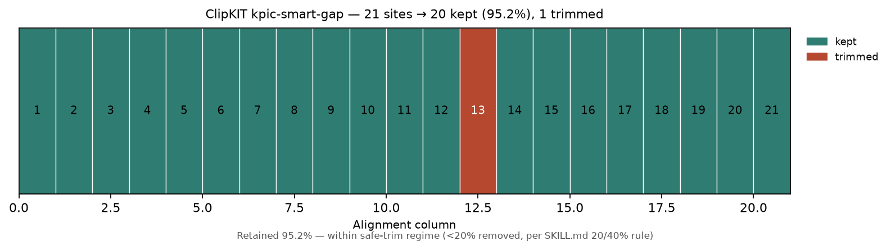

<!--
META
标题: bioSkills alignment-trimming：ClipKIT 默认修剪模式的行为
系列: bioSkills
配图: 
参考仓库: GPTomics/bioSkills (alignment/alignment-trimming)
发布顺序: 006
/META
-->

# 006｜bioSkills alignment-trimming：ClipKIT 默认修剪模式的行为

用 bioSkills 仓库自带的示例 MSA → 原样跑 alignment-trimming skill 推荐默认模式 `kpic-smart-gap` → 严格复现并逐块拆解这个 skill 的内容成分。

---

## 功能定位与适用范围

alignment-trimming = **多序列比对(MSA) 建完后的列过滤与逐残基清洗工具集**。内容覆盖：根据下游目标（系统发育树 / HMM 建模 / 选择分析 / 结构建模）选对修剪工具与模式，而不是把"trim"当作一个单一操作。

| 属性 | 内容 |
|------|------|
| tool_type | mixed |
| primary_tool | ClipKIT |
| 前置条件 | 需要一个已完成的多序列比对（MSA）文件 |
| 核心输出 | 修剪后的 MSA（或更温和的逐残基掩码 / 列分裂） |

适用范围：本 skill 的输入为已完成的序列比对（MSA），比对构建步骤由同目录的 `multiple-alignment` skill（MAFFT/MUSCLE）覆盖，不在本 skill 范围内。

---

## Skill 成分拆解

### 文件结构

alignment-trimming 是 alignment 类别下**覆盖工具最广**的 skill（9 种修剪方案 + 4 个示例脚本 + usage-guide）：

| 文件 | 行数 | 功能 |
|------|------|------|
| SKILL.md | 310 行 | 主文档：9 种工具选型表 + 模式表 + 20/40% 法则 + 常见错误 |
| examples/clipkit_trim.py | 45 行 | 跑 ClipKIT 并计算保留率，保留率<0.7 告警 |
| examples/trimal_modes.py | 46 行 | 同一输入上对比 5 种 trimAl 模式的保留列数 |
| examples/bmge_trim.py | 44 行 | 跑 BMGE 熵阈值修剪（-h 0.4 深 / 0.6 浅）|
| examples/divvier_split.py | 39 行 | Divvier 列分裂（列数可能增加）|
| usage-guide.md | 103 行 | 使用者视角快速入门 + 示例 prompt |

### 每个参考脚本干什么

**clipkit_trim.py（45行）** — skill 的核心参考脚本，封装推荐默认 `kpic-smart-gap`。`run_clipkit()` 构建 `clipkit input -m kpic-smart-gap -o out --log`；`trimming_summary()` 用 Biopython `AlignIO` 读前后 MSA 算保留率；保留率<0.7 时打印 Tan 2015 + Steenwyk 2020 的激进修剪告警。

**trimal_modes.py（46行）** — 在同一 `input.fasta` 上跑 5 种 trimAl 模式（automated1 / gappyout / strict / strictplus / gt0.5），各出 `trimmed_<mode>.fasta` + `cols_<mode>.txt` 列映射，汇总打印每模式保留列数 / 保留率 / 删除列数。

**bmge_trim.py（44行）** — 封装 BMGE.jar：`run_bmge()` 用 `-t AA -h 0.4 -g 0.2`（深）/ `-h 0.6`（浅）两组，算保留率对比，体现"深系统发育保留更少列"。

**divvier_split.py（39行）** — 跑 Divvier 的 `-divvy`（整列分裂，列数可能增加）与 `-partial -mincol 4`（仅过滤模糊字符），对比前后列数，强调"分裂而非删除保留更多系统发育信号"。

### 它封装的工具知识（9 种修剪方案）

skill 把"修剪"拆成 9 种方案，各自解决不同失败模式：

- **ClipKIT**（CLI）：推荐默认 `kpic-smart-gap`（保留简约信息列+恒定列，产出更稳的树）；`smart-gap`（单基因）；`gappy`/`gappyout`（显式 gap 阈值）；`kpi-smart-gap`（仅保留简约信息列，最激进，给最大简约树用）
- **trimAl**（CLI）：`-gappyout`（HMM 建模）、`-strict`/`-strictplus`（系统发育）、`-automated1` 启发式（跨点版本行为会变，**审计级可复现禁用**）
- **BMGE**（Java）：熵 + BLOSUM62 上下文，深原核系统发育标准（GToTree 默认），`-h 0.4` 深 / `0.6` 浅
- **Divvier**（编译二进制）：列分裂而非删除，保留 indel 中的系统发育信号
- **HMMcleaner**（Perl+HMMER）：逐残基用 `X` 掩码污染残基（≥15 条序列才有效），不删列
- **Gblocks**（legacy）：默认过激进，仅匹配旧流程时放松用
- **PhyIN**（2024）：第二遍修剪，标记相邻列的成对系统发育不兼容分裂模式（对齐伪影）
- **TCS 列掩码**（T-Coffee M-Coffee）：选择分析前用一致性打分掩码不可靠列，而非删除（防 dN/dS 假阳性）
- **MACSE 框移标记后处理**：把 `!`/`*` 框移标记转成 PAML/HyPhy 可解析格式

### 它封装的核心 API（代码片段）

skill 的 Python 示例共享 Biopython 读取 + 保留率封装模式：

```python
from Bio import AlignIO
original = AlignIO.read('input.fasta', 'fasta')
trimmed = AlignIO.read('trimmed.fasta', 'fasta')
retention = trimmed.get_alignment_length() / original.get_alignment_length()
## ClipKIT 还提供 Python API: clipkit.api.clipkit() 做内存态修剪
```

注意：skill 的示例脚本都是薄封装（subprocess 调 CLI + AlignIO 算保留率），没有自研算法，重点在选型知识而非代码。

### 它封装的经验与知识（重点）

**核心法则：20%/40% 规则（修剪激进度比"修不修"更关键）**

Tan 2015 与 Steenwyk 2020 看着矛盾，其实被激进度调和：轻修（删 <20% 列）对树的精度几乎无影响，与工具无关；重修（>40%）把系统发育信号连同噪声一起砍掉，在大多数实证数据上降低树精度。Steenwyk 的 `kpic-smart-gap` 改善树是因为它停在轻修区；老 Gblocks 默认失败是因为过度修剪。**操作规则：若修剪器删掉 >40% 列，模式对该数据集过激进 → 换更温和模式或干脆不修。**

**经验二：trimAl -automated1 不可审计复现**

跨点版本（1.4→1.4.1→2.0-rc）内部启发式会变，选出的底层模式不稳定。审计级复现必须显式指定底层模式（`-gappyout`/`-strict`/`-strictplus`）并在 pipeline manifest 记录 `trimal --version`。

**经验三：选择分析禁用激进修剪**

dN/dS 分析（PAML codeml / HyPhy）里删除列会制造假阳性选择信号（Fletcher & Yang 2010 MBE）。改用逐列可靠性打分（TCS、GUIDANCE2）掩码，而非删除。

**经验四：保留列映射才可复现**

`clipkit --log` 写每列 `position keep/trim site_classification gap_proportion`；`trimal -colnumbering` 写保留列的原始索引列表（stdout）。两种格式不同，跨工具比较需分别解析再对齐到"保留列索引列表"。

**其他知识封装**：
- ClipKIT `kpic` 把"简约信息"定义为"至少 2 个不同残基、各自≥2 条序列"，在分类不平衡数据（如 95 近缘+5 外类群）上会让修剪偏向主体支系信号（issues #71/#88）
- BMGE `-h` 阈值绑定 BLOSUM62；换矩阵（如 BLOSUM30 深 / BLOSUM90 近）需重新校准
- HMMcleaner 在 <15 条序列的小比对上 HMM 信号不足、过标真实分歧残基
- Divvier 2019 后停更，但 v2019 二进制结果仍可复现

---

## 严格复现（按 skill 自己的方案）

### 环境

| 项目 | 版本/路径 |
|------|----------|
| ClipKIT | 2.14.0（managed python venv：`~/.workbuddy/binaries/python/envs/default`，pip 安装，未污染本机）|
| 其他工具 | trimAl / BMGE / Divvier / HMMcleaner 本机未安装（本次未跑，仅做成分拆解）|

### 数据来源

bioSkills 仓库自带示例比对 `content/库/bioSkills/alignment/alignment-io/examples/sample_alignment.aln`（CLUSTAL 格式，4 条序列、21 列，alignment-io skill 官方示例）。非自造数据，符合"完全复现、用仓库自带示例"的纪律。

### 标准配置输出

原样运行 skill 推荐默认 `kpic-smart-gap` + `--log`（未加任何 skill 未提的参数）：

```bash
clipkit sample_alignment.aln -m kpic-smart-gap -o trimmed.fasta --log
```

输出：
```
Original: 21 列
Trimmed:  20 列（砍掉第 13 列，gap 比例 0.75）
保留率 95.2%（删除 1/21 ≈ 4.762% 列）
生成 trimmed.fasta + trimmed.fasta.log（每列 kept/trim 审计日志）
```

ClipKIT 自动识别 `.aln` 为 clustal 格式，无需额外参数。删除 1 列（4.8%）落在 SKILL.md 说的"安全修剪区"（<20% 列被删，对树几乎无影响）。


上图：逐列状态色块，第 13 列（gap 0.75）标红为 trim，其余 20 列 kept。基于 `--log` 真实数据，零夹带。

### kpic-smart-gap 砍的是 gap 列

21 列 → 保留 20 列，只砍第 13 列（gap 比例 0.75，超过 smart-gap 阈值）。保留率 95.2% 落在 skill 的"安全修剪区"（删 <20% 列，对树几乎无影响）。

| 指标 | 值 |
|------|-----|
| 原始列数 | 21 |
| 保留列数 | 20 |
| 修剪列数 | 1（第 13 列，gap 0.75）|
| 保留率 | 95.2% |

### --log 让修剪可被审计

`--log` 输出每列 `position keep/trim site_classification gap_proportion`：

```
13 trim other 0.75
```

不写 `--log` 只拿到 `trimmed.fasta`，别人无法核对具体砍了哪列。SKILL.md 把 `--log` 列为"可复现审计必备"，发论文级的复现就靠它。

### 关于未跑的工具（诚实声明）

本机未装 trimAl / BMGE / Divvier / HMMcleaner，本次只复现了 skill 推荐默认 `kpic-smart-gap`。其余 8 种方案（trimAl 五模式、BMGE、Divvier、HMMcleaner、Gblocks、PhyIN、TCS、MACSE）的成分拆解来自 SKILL.md **忠实转述**，未实际执行——严格遵循"skills 规定好了完全复现、不自己加内容"的纪律，未跑的工具不编造结果。

---

## 实践要点

四点经验封装，超出工具文档：

1. **20%/40% 规则**——把看似矛盾的 Tan 2015 与 Steenwyk 2020 用一个激进度轴调和，给出可操作"删>40% 就换温和模式"的硬规则
2. **trimAl -automated1 不可审计**——跨版本启发式会变，审计级必须显式指定底层模式
3. **选择分析禁用激进修剪**——删列制造 dN/dS 假阳性，改用 TCS/GUIDANCE2 掩码
4. **保留列映射才可复现**——`--log` / `-colnumbering` 两种格式需分别解析再对齐

这些经验属于选型知识，工具自带文档通常不单列。

---

## 小结

alignment-trimming 把"比对后处理"打包成一个选型知识库：9 种修剪方案各自对应不同失败模式（gap / 熵 / 逐残基污染 / 不兼容分裂 / 选择假阳性），核心价值在于 **20%/40% 规则**——轻修保信号、重修丢信号，默认 `kpic-smart-gap` 停在轻修区。用 bioSkills 自带示例 MSA 严格复现了推荐默认模式，证实砍掉的列（gap 0.75）确实落在安全区。
