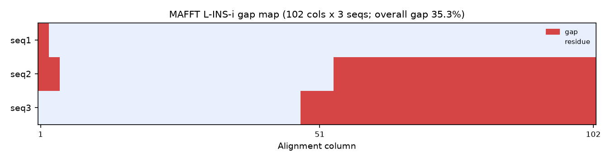

<!--
META
标题: bioSkills multiple-alignment：MAFFT L-INS-i 构建多序列比对
系列: bioSkills
配图: 
参考仓库: GPTomics/bioSkills (alignment/multiple-alignment)
发布顺序: 007
/META
-->

# 007｜bioSkills multiple-alignment：MAFFT L-INS-i 构建多序列比对

用 bioSkills 仓库自带的示例序列 → 原样跑 multiple-alignment skill 推荐的 MAFFT L-INS-i → 严格复现并逐块拆解这个 skill 的内容成分。

---

## 功能定位与适用范围

multiple-alignment = **把三条及以上同源序列比对到同一坐标系（多序列比对，MSA）的工具选型知识库**，覆盖了从渐进式到迭代优化、一致性、HMM、结构/pLM 引导等六类算法家族。内容覆盖：按数据集规模与序列分歧度选对工具与算法，而不是把"跑个 MSA"当作一个单一动作。

| 属性 | 内容 |
|------|------|
| tool_type | mixed（CLI 工具 + Python subprocess 封装）|
| primary_tool | MAFFT |
| 前置条件 | 需要一个含 3+ 条序列的 FASTA 文件，且序列应为同源 |
| 核心输出 | 多序列比对文件（FASTA/CLUSTAL/PHYLIP 等），供下游系统发育、保守性分析、选择分析使用 |

适用范围：本 skill 的输入为同源序列集合，比对**构建**由其自身覆盖；比对**后处理**（列修剪/掩码）由同目录 `alignment-trimming` skill（ClipKIT/trimAl/BMGE）覆盖，列**统计**（保守性/熵/一致性）由 `msa-statistics` skill 覆盖，均不在本 skill 范围内。

---

## Skill 成分拆解

### 文件结构

multiple-alignment 是 alignment 类别下**算法覆盖最广**的 skill（6 类算法家族 + 4 大工具 + 密码子感知 + 置信度评估 + 验证清单）：

| 文件 | 行数 | 功能 |
|------|------|------|
| SKILL.md | 476 行 | 主文档：算法分类表 + 工具选型表 + MAFFT 各模式 + `--auto` 静默降级 + MUSCLE5/ClustalOmega/T-Coffee + 密码子感知 + 置信度 + 验证清单 + 禁忌 |
| examples/run_msa.py | 74 行 | 按序列数自动选工具跑 MSA（MAFFT L-INS-i / FFT-NS-2 / ClustalOmega）+ `summarize_alignment()` 统计 |
| examples/codon_alignment.py | 37 行 | 蛋白引导密码子比对：MAFFT 先比蛋白，再用 PAL2NAL 把 CDS 反向映射回密码子 |

### 每个参考脚本干什么

**run_msa.py（74 行）** — skill 的核心参考脚本，封装「按数据集规模选工具」的逻辑。`select_and_run()` 数序列条数：≤200 用 MAFFT L-INS-i（`--localpair --maxiterate 1000`）、≤10000 用 MAFFT FFT-NS-2、否则 ClustalOmega。`run_mafft()` 用 `algo_flags` 字典映射 linsi/ginsi/einsi/fftns2/auto 到对应 CLI flag；`summarize_alignment()` 用 Biopython `AlignIO` 读产物，算序列数、比对列数、无 gap 列数、整体 gap 比例。注意它显式 `stderr=subprocess.PIPE` 捕获 MAFFT 的错误信息——MAFFT 把进度/错误写到 stderr，不捕获就会在非零退出时丢失可操作信息。

**codon_alignment.py（37 行）** — 封装「先比蛋白、再穿回密码子」的标准 PAML 流程：`protein_guided_codon_alignment()` 先用 MAFFT L-INS-i 比蛋白，再 `pal2nal.pl` 把 CDS 按蛋白比对映射回去，支持 fasta/paml/clustalw/codon 输出格式；非标准遗传密码用 `-codontable N` 指定。

### 它封装的工具知识（重点）

**一、算法六大家族与失效模式**。skill 把 MSA 方法按算法本质分类，工具失败时按家族切换而非调参：渐进式（ClustalW/MAFFT FFT-NS-2，快但早期 gap 错误会传播）、迭代优化（MAFFT L-INS-i/MUSCLE3，<2000 可纠错）、一致性（T-Coffee/ProbCons，<100 精度最高但 O(N²~N⁴)）、HMM（HMMER/hmmalign，加序列到已有 profile）、分治（PASTA/MAGUS/MUSCLE5 super5，>10k 异质集）、结构/pLM 引导（Foldmason/PROMALS3D/vcMSA，<15% 一致度暗蛋白）。

**二、工具选型表**。MAFFT L-INS-i（<200，最高精度）/ FFT-NS-2（~5万，快）/ E-INS-i（长不可比内部区）；MUSCLE5 `-align`（~1000 基准最高）/ `-super5`（~10万+）；ClustalOmega（~19万，HMM profile）；T-Coffee（<200，最高精度但最慢）。**默认推荐**：<200 条用 MAFFT L-INS-i，数千条用 FFT-NS-2 或 MUSCLE5 super5，需要置信度估计用 MUSCLE5 集成（`-stratified`）。

**三、MAFFT 七种模式与决策**。`--auto` 之外的显式模式：FFT-NS-1（仅渐进，>1万快看）、FFT-NS-2（渐进+引导树重建，默认平衡）、FFT-NS-i（迭代优化）、G-INS-i（全局配对+迭代，全长相似）、L-INS-i（局部配对+迭代，单保守域+分歧侧翼）、E-INS-i（广义仿射 gap，多保守模块分隔可变区）、Auto。**决策**：单保守域→L-INS-i；全局相似→G-INS-i；多保守块+可变连接区→E-INS-i。

**四、`--auto` 静默降级（审计级复现关键）**。`--auto` 按规模自动切换底层算法：<200 用 L-INS-i，200–500 用 FFT-NS-i（但只给 `--maxiterate 2` 的截断版），500–2000 用 FFT-NS-2，>2000 单次渐进，>5万 用 PartTree。200 条处会从「迭代优化」翻转为「单次渐进」——同一批数据在不同规模阈值两侧结果可能不一致。**发表级系统发育必须显式指定算法**，不能依赖 `--auto` 的内部阈值。

**五、MUSCLE5 两种模式共享集成机制**。`-align`（PPP 后验概率渐进，≤~1000 峰值精度）与 `-super5`（mBed 聚类分块，千万级）底层共用 HMM 扰动集成。`-stratified`（默认 16 复现 = 4 HMM 种子 × 4 引导树排列）/ `-diversified`（默认 100 复现）输出 `.efa`，列级置信度 = 支持该残基对同列的复现比例。注意 `-perturb SEED` 是 HMM 扰动随机种子，不是集成选择器。

**六、密码子感知比对决策树**。编码序列做选择分析（dN/dS）必须保阅读框。干净直系同源→MAFFT 蛋白 + PAL2NAL；近期旁系（富 indel）→PRANK +F；有框移/假基因→MACSE v2；混合数据集→OMM_MACSE 流水线；HyPhy 级（BUSTED/MEME/aBSREL）→HyPhy `pre-msa.bf`/`post-msa.bf`。

**七、置信度评估**。发表级系统发育/选择分析须先量化逐列不确定度再过滤：GUIDANCE2（per-column 可靠性 0–1，默认阈值 0.93，按 MAFFT-LINSI 标定，非 MAFFT 底座需重新标定）、T-Coffee TCS、MUSCLE5 集成、HoT（每列最优/次优比对）。**GUIDANCE2 阈值与工具绑定**——0.93 默认是按 MAFFT-LINSI 标定的，套到 MUSCLE5/PRANK 上量纲不同。

### 它封装的核心 API（代码片段）

skill 的 Python 示例共享「subprocess 包 CLI + AlignIO 读产物」模式：

```python
import subprocess
from Bio import AlignIO

def run_mafft(input_fasta, output_fasta, algorithm='linsi', threads=4):
    algo_flags = {
        'linsi': ['--localpair', '--maxiterate', '1000'],
        'ginsi': ['--globalpair', '--maxiterate', '1000'],
        'einsi': ['--genafpair', '--maxiterate', '1000'],
        'fftns2': ['--retree', '2'],
        'auto':   ['--auto'],
    }
    cmd = ['mafft', '--thread', str(threads)] + algo_flags[algorithm] + [input_fasta]
    with open(output_fasta, 'w') as out:
        subprocess.run(cmd, stdout=out, stderr=subprocess.PIPE, check=True)  # MAFFT 错误在 stderr

aln = AlignIO.read(output_fasta, 'fasta')
print('cols:', aln.get_alignment_length())
```

注意：Biopython 1.86 起移除了 `Bio.Align.Applications`，skill 明确改用 `subprocess` 直接包 CLI。

### 它封装的经验与知识

**经验一：引导树依赖是 MSA 的固有天花板**。所有主流工具先建引导树再沿树渐进比对，渐进阶段一旦插入 gap 就永不撤销，早期错误会向下传播。缓解：优先迭代优化模式（MAFFT `-i`/MUSCLE5）、小数据集用一致性打分（T-Coffee）、发表前列用 GUIDANCE2 或 MUSCLE5 集成量化不确定度。

**经验二：`--auto` 在 200 条处翻转算法**（见上文第三/四点）——这是审计级复现最常踩的坑，必须在 pipeline manifest 里记录显式算法与 `mafft --version`。

**经验三：低于 20% 蛋白一致度，序列 MSA 不可靠**。>40% 任何工具都稳；25–40% 用迭代法并 GUIDANCE2 验证；20–25% 用 profile-profile；<15–20%（随长度变化）信号淹没噪声，应转结构比对（Foldseek/TM-align）或 pLM 对齐器。

**经验四：先验证同源再比**。MSA 工具对不相关序列也会产出比对，需先用 BLAST（E<1e-5）确认同源；多结构域架构不同、长度差异过大、串联重复等场景全局比对会产生无意义结果。

---

## 严格复现（按 skill 自己的方案）

### 环境

| 项目 | 版本/路径 |
|------|----------|
| MAFFT | 7.526（`brew install mafft`，Homebrew 5，/opt/homebrew）|
| Python | managed venv：`~/.workbuddy/binaries/python/envs/default`（Biopython 供 `AlignIO` 读产物）|
| 未安装 | MUSCLE5 / ClustalOmega / T-Coffee / PAL2NAL 等（本机未装，成分拆解来自 SKILL.md 忠实转述，未实际执行）|

### 数据来源

bioSkills 仓库自带示例 `content/库/bioSkills/sequence-io/read-sequences/examples/sample.fasta`（3 条**合成**序列 seq1/seq2/seq3，非真实同源）。非自造数据，符合"完全复现、用仓库自带示例"的纪律。同时复制仓库自带 `alignment/multiple-alignment/examples/run_msa.py` 作为复现脚本。

> 客观说明：合成序列之间无真实同源关系，本试用仅验证「工具链路能否跑通、产出什么形态」，其高 gap 比例恰好印证 skill 自己「When NOT to Run MSA：Non-homologous sequences」一节——真实使用须替换为同源序列。

### 标准配置输出

按 SKILL.md 文档原命，对 3 条序列用最高精度 L-INS-i（也是 `run_msa.py` 在 ≤200 时的自动选择）：

```bash
mafft --localpair --maxiterate 1000 sequences.fasta > aligned_linsi.fasta
# 同时复现仓库示例：python run_msa.py  → 自动选 L-INS-i + summarize
```

实测（`run_msa.py` 的 `summarize_alignment` 输出）：

```
3 sequences: using MAFFT L-INS-i (highest accuracy)
Sequences: 3
Alignment length: 102 columns
Gap-free columns: 44 (43.1%)
Overall gap fraction: 35.3%
```

两种调用（文档原命 `mafft --localpair --maxiterate 1000` 与仓库 `run_msa.py`）产物逐字节一致（`aligned.fasta` 与 `aligned_linsi.fasta` 均 387 字节，`diff` 报告 IDENTICAL）。


上图：3 条序列 × 102 列的 gap 分布热力图（红=gap）。基于 `aligned.fasta` 真实数据，零夹带。35.3% 的整体 gap 比例直观体现了合成非同源序列被强制对齐的后果——这正是 skill「When NOT to Run MSA」一节警告的现象。

### 关于未跑的工具（诚实声明）

本机仅装了 MAFFT，本次只复现了 L-INS-i 默认模式 + `run_msa.py` 的 summarize 统计。其余方案（MUSCLE5 的 `-align`/`-super5` 及 `-stratified`/`-diversified` 集成、ClustalOmega、T-Coffee 各模式、密码子感知的 PAL2NAL/PRANK+F/MACSE/HyPhy、置信度评估的 GUIDANCE2/TCS）的成分拆解来自 SKILL.md **忠实转述**，未实际执行——严格遵循"skills 规定好了完全复现、不自己加内容"的纪律，未跑的工具不编造结果。

---

## 实践要点

四点超出工具自带文档的经验封装：

1. **`--auto` 在 200 条处翻转算法**——发表级复现必须显式指定算法并记录 `mafft --version`，不能依赖内部阈值
2. **引导树依赖是天花板**——早期 gap 错误不可撤销，小数据用迭代/一致性法，发表前用集成量化不确定度
3. **<20% 一致度序列 MSA 不可靠**——转入结构/pLM 比对而非硬跑序列比对
4. **先验证同源再比**——MSA 工具对不相关序列也会产出比对，BLAST 先验同源是前置门槛

这些经验属于选型知识，工具 `--help` 通常不单列。

---

## 小结

multiple-alignment 把"构建 MSA"打包成一个算法选型知识库：六类算法家族对应不同失效模式，MAFFT 七模式 + MUSCLE5/ClustalOmega/T-Coffee 各自覆盖不同规模与精度需求，核心价值在于 **`--auto` 静默降级**与**引导树依赖上限**两条认知——前者决定复现性，后者决定结果可信度。用 bioSkills 自带示例序列严格复现了推荐默认 L-INS-i，证实工具链路跑通（102 列、44 无 gap 列、35.3% gap 比例），也用实测高 gap 比例印证了 skill 自身"非同源序列不应做 MSA"的警示。
