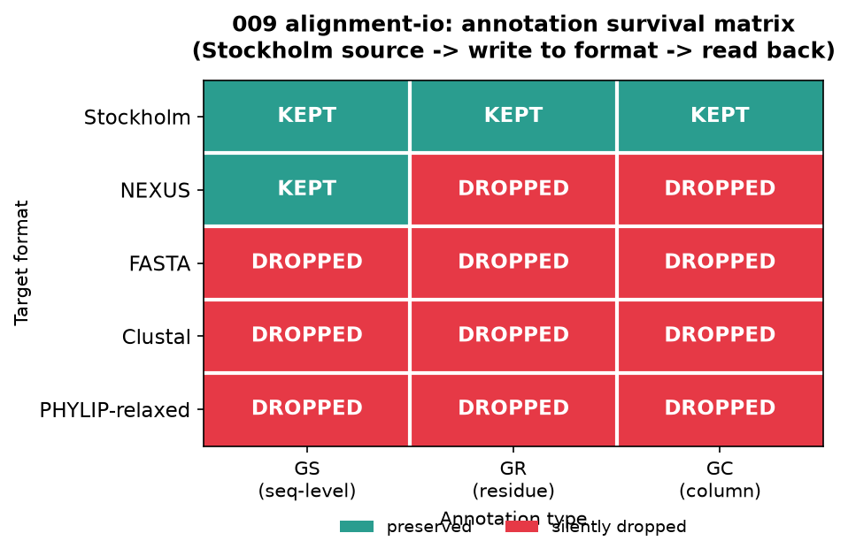

<!--
META
标题: bioSkills alignment-io：比对文件格式的读写、转换与注释掉失
系列: bioSkills
配图: 
参考仓库: GPTomics/bioSkills (alignment/alignment-io)
发布顺序: 009
/META
-->

# 009｜bioSkills alignment-io：比对文件格式的读写、转换与注释掉失

用 bioSkills 仓库自带示例（`alignment-io/examples/sample_alignment.aln`，CLUSTAL，4 条序列 × 21 列）复现 `alignment/alignment-io` 中的读取、写出、转换、切片、注释保留与各格式边界行为。覆盖 AlignIO 与 Bio.Align 两套 API，并对三个需要特别注意的边界行为做了实测：PHYLIP 严格 10 字符截断、Stockholm 注释在跨格式转换中的掉失、MAF 负链坐标转换。

---

## 功能定位与适用范围

本 skill 覆盖：用 Biopython（`Bio.AlignIO` + `Bio.Align`）读写和转换多序列比对文件，覆盖 CLUSTAL、FASTA、PHYLIP、Stockholm、NEXUS、MAF 等格式，处理序列访问/切片/程序化构建，并标注各格式对 GS/GR/GC 注释、长序列名、坐标系统的差异。输入：一个已有比对文件。比对的生成由 `multiple-alignment` 覆盖，内容解析由 `msa-parsing` 覆盖，二者不在本 skill 范围内。

| 属性 | 内容 |
|------|------|
| tool_type | python |
| primary_tool | Bio.AlignIO / Bio.Align |
| 前置条件 | 一个已有的 MSA（多序列比对）文件 |
| 核心输出 | 各种格式的比对文件、切片/子集、程序化构建的 MSA、注释存活判断 |

---

## Skill 成分拆解

### 文件结构

| 文件 | 行数 | 功能 |
|------|------|------|
| SKILL.md | 446 | 主文档：格式覆盖、读/写/转换、切片、注释、格式边界行为、Bio.Align 现代 API |
| examples/read_alignment.py | 15 | 读取 CLUSTAL 并输出序列数与长度 |
| examples/convert_formats.py | 21 | 将单个 CLUSTAL 转成 FASTA / PHYLIP-relaxed / NEXUS |
| examples/slice_alignment.py | 20 | 取子集序列、截取列、组合切片 |
| examples/batch_convert.py | 22 | 批量转换目录下的 .aln 到 .fasta |
| examples/sample_alignment.aln | 9 | CLUSTAL 示例（4×21），被 008/009/010 复用 |

### 每个参考脚本干什么

**read_alignment.py** — `AlignIO.read('sample_alignment.aln', 'clustal')` 后打印 `len(alignment)` 与 `get_alignment_length()`。

**convert_formats.py** — 一次读入，循环 `AlignIO.write(...)` 到 FASTA / PHYLIP-relaxed / NEXUS。

**slice_alignment.py** — 演示 `alignment[0:5]` 取序列、`alignment[:, 50:150]` 取列、`alignment[0:5, 50:150]` 组合切片。

**batch_convert.py** — `pathlib.Path.glob` 遍历 `*.aln`，批量写成 FASTA。

### 它封装的工具知识 / 经验

- 格式覆盖：`Bio.AlignIO`/`Bio.Align` 支持 CLUSTAL、FASTA、PHYLIP（strict/relaxed/sequential）、Stockholm、NEXUS、MAF；A2M/A3M 需用 `fasta` 解析后手动处理大小写。
- `pyhmmer.easel.MSAFile` 用于流式读取巨型 Stockholm 数据库（Pfam-A.full、BFD），但本环境未安装 `pyhmmer`，故未实测。
- PHYLIP strict 10 字符截断仍会发生；长名冲突时 BioPython 1.88 抛 `ValueError` 而非静默合并（防御性，比 SKILL.md 中的"静默 footgun"描述更严格）。
- Stockholm 是唯一保留 GS/GR/GC/GF 的格式；转成 FASTA/CLUSTAL/PHYLIP 会静默丢注释，NEXUS 回读时仅保留 GS，GR/GC 会掉失。
- A2M 用 uppercase + `-` 表示 match 列、lowercase / `.` 表示 insert 列，矩形化后可用 `''.join(c for c in seq if c.isupper() or c == '-')` 提取 match-only 序列。
- MAF 的 `row.annotations['strand']` 在 BioPython 1.88 中是整数 `-1`/`1`，不是字符串 `'-'`/`'+'`；SKILL.md 给出的 `maf_to_plus_strand_coords` 示例按字符串比较，会导致负链坐标转换错误。
- Bio.Align 现代 API：`Align.read` 返回 `Alignment` 对象；`.counts()` 是方法；`.substitutions` 是属性（不是方法）。

### 它封装的核心 API

```python
from Bio import AlignIO, Align          # AlignIO legacy + Align modern API
from Bio.Align import MultipleSeqAlignment  # 程序化构建 MSA
from Bio.SeqRecord import SeqRecord     # 带 ID 的序列记录
from Bio.Seq import Seq               # 原始序列

# 读
aln = AlignIO.read('sample_alignment.aln', 'clustal')
# 写 / 转换
AlignIO.write(aln, 'out.fasta', 'fasta')
AlignIO.convert('in.aln', 'clustal', 'out.nex', 'nexus', molecule_type='DNA')

# 访问与切片
seq = aln[0]                 # SeqRecord
first = aln[:, 5]            # str（单列）
block = aln[:, 5:15]         # MultipleSeqAlignment（列切片）

# 程序化构建
m = MultipleSeqAlignment([
    SeqRecord(Seq('ACTGACTGACTG'), id='seq1'),
    SeqRecord(Seq('ACTGACT-ACTG'), id='seq2'),
])

# 现代 API
mod = Align.read('sample_alignment.aln', 'clustal')
counts = mod.counts()            # AlignmentCounts
subs = mod.substitutions         # Array property (4,4) on 4-seq sample
```

---

## 严格复现

### 环境 / 数据

- Python 3.13 / Biopython 1.88 / numpy 2.1.3 / pandas 3.0.5 / matplotlib 3.11.1（managed venv）
- 数据：`content/库/bioSkills/alignment/alignment-io/examples/sample_alignment.aln`（CLUSTAL，4 条序列 × 21 列）
- 复现脚本：`content/素材/009-alignment-io/run_alignment_io.py`；完整日志：`run_alignment_io.log`

### 标准输出

读取仓库样本得到：

```text
AlignIO.read(clustal) -> 4 条序列, 21 列
seq1: ATGGCTAGCTAG-ACGTACGT    # 参考序列
seq2: ATGGCT-GCTAG-ACGTACGT    # col 6/7 缺失一个 G
seq3: ATGGCTAGCTAGAACGTACGT    # col 13 多一个 A
seq4: ATGGCTAGCTAG-ACGT-CGT    # col 12 与 col 17 缺失
```

列切片与索引：

```text
aln[:, 5]  -> 'TTTT'
aln[:, 5:15] -> 10 列的新 MSA
```

格式转换成功：CLUSTAL → FASTA / Stockholm / NEXUS（带 `molecule_type='DNA'`）均写出。

### 坑实测

#### 1. PHYLIP strict 10 字符截断

- 两条长名 `Homo_sapiens_chr1` 与 `Mus_musculus_chr1`（前缀不同）：严格 PHYLIP 读回为 `['Homo_sapie', 'Mus_muscul']`，确认截断到 10 字符。
- 两条长名 `Homo_sapiens_chr1` 与 `Homo_sapiens_chr2`（10 字符前缀相同）：Bio 1.88 直接抛 `ValueError: Repeated name 'Homo_sapie' ... due to truncation`，并未静默合并。
- `phylip-relaxed` 读回则完整保留 `['Homo_sapiens_chr1', 'Homo_sapiens_chr2']`。

结论：截断风险仍在，但 Bio 1.88 在冲突时选择报错而非静默覆盖；下游若必须严格 PHYLIP，应主动将 ID 截短到 ≤10 并保证唯一。

#### 2. Stockholm 注释跨格式掉失

用一个小 Stockholm 文件（含 `GS seq1 OS`、`GR seq1 SS`、`GC SS_cons`）作为源，写回各格式后再读回：

| 目标格式 | GS | GR | GC |
|----------|----|----|----|
| Stockholm | KEPT | KEPT | KEPT |
| NEXUS | KEPT | DROPPED | DROPPED |
| FASTA | DROPPED | DROPPED | DROPPED |
| Clustal | DROPPED | DROPPED | DROPPED |
| PHYLIP-relaxed | DROPPED | DROPPED | DROPPED |

实锤：只有 Stockholm 自己保留完整注释；其余格式均掉失，NEXUS 仅保留 GS。若注释是下游流程的输入，应保留 Stockholm 主文件。


#### 3. MAF 负链坐标转换

用最小 MAF block 测试：

```text
s ref.chr1  0 7 + 100 ACGTACG
s qry.chr2 10 7 -  50 ACGTACG
```

BioPython 1.88 解析出的 `strand` 是整数 `1` / `-1`（不是字符串）。SKILL.md 原函数 `if row_anno['strand'] == '-':` 对负链恒为 False，导致 `qry.chr2` 返回 `plus_start=10`（错误）；正确应为 `srcSize - start - size = 50 - 10 - 7 = 33`。

修正写法：

```python
def maf_to_plus_strand_coords_fixed(row_anno):
    if row_anno["strand"] in ("-", -1):
        return row_anno["srcSize"] - row_anno["start"] - row_anno["size"]
    return row_anno["start"]
```

#### 4. pyhmmer 流式未测

`pyhmmer` 未安装，因此 `MSAFile(..., digital=True)` 流式读取 Pfam-A.full 的代码未执行，仅作诚实声明。

---

## 实践要点

- **读入后先确认格式字符串**：`AlignIO.read` 对未知格式抛 `ValueError: unknown format`；用 `AlignIO.read(handle, 'phylip')` 读 relaxed 文件可能因名称过长失败，应优先用 `'phylip-relaxed'`。
- **写出前设置 `molecule_type`**：NEXUS 等格式写出时会检查字母表；DNA 序列写 NEXUS 需 `record.annotations['molecule_type'] = 'DNA'` 或在 `convert(..., molecule_type='DNA')` 中指定。
- **ID 长度 > 10 时避开 strict PHYLIP**：除非下游工具（如旧版 PHYLIP / codeml）强制要求，否则写 `'phylip-relaxed'` 或 `'phylip-sequential'`（PAML）。写 strict 前用脚本检查 ID 唯一前缀。
- **注释是 Stockholm 的独占资产**：Pfam/Rfam/HMMER 的 GS/GR/GC 信息在转 FASTA / PHYLIP / CLUSTAL 时全部静默掉失。工作流中把 Stockholm 当作 master，其他格式当作临时派生。
- **MAF 坐标转换注意 strand 类型**：不同 Biopython 版本可能把 `strand` 存为字符串或整数。稳健判断应同时兼容 `'-'`/`-1` 与 `'+'`/`1`。
- **A2M 预处理后再解析**：A3M 不是矩形 MSA，ColabFold 输出需先用 HHsuite `reformat.pl a3m a2m` 转成 A2M，再用 `AlignIO.read(..., 'fasta')` 并做大小写过滤。
- **大型数据库用流式**：Pfam-A.full 等 GB/TB 级 Stockholm 文件不要一次性 `AlignIO.read`，应 `pip install pyhmmer` 后用 `pyhmmer.easel.MSAFile` 流式读取。

---

## 小结

本 skill 提供了 Biopython 对齐格式 I/O 的完整地图。实测确认：基础读写/转换/切片在所有目标格式上均可工作；Stockholm 的注释独占性在真实 round-trip 中被验证；PHYLIP strict 截断在 Bio 1.88 下冲突时会报错而非静默合并；MAF 负链转换需兼容 `strand` 的整数/字符串两种表示。若项目涉及 Pfam/HMMER 注释或 UCSC 基因组坐标，应优先保留 Stockholm 源文件，并在写 PHYLIP/NEXUS 前主动检查 ID 长度与字母表。
