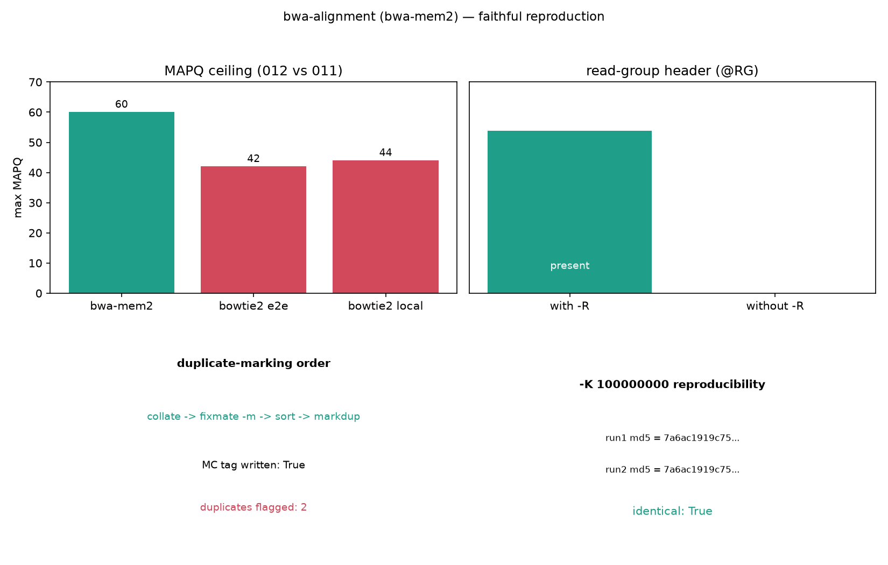

# 012｜bioSkills bwa-alignment：DNA 短读长比对的 read group 与下游契约

<!--
META
标题: bioSkills bwa-alignment：bwa-mem2 的 read group、去重顺序与 MAPQ 0–60 标度
副标题: 真实复现索引构建、@RG 硬契约、collate→fixmate→markdup、-Y/-M 与 -K 可复现
标签: #生信 #生物信息学 #比对 #bwa #bwa-mem2 #变异调用 #bioSkills
配图: 012-fig.png
/META
-->

## 一、功能定位与适用范围

bwa-mem2 是把 DNA 短读长（单端/双端）比对到参考基因组的命令行比对器，是 WGS/WES 与 germline/somatic 变异调用流程的默认比对器（bwa-mem 的架构感知加速后继版本，输出近一致）。本 skill 覆盖的核心不是「跑通比对」，而是那些会**静默决定下游变异调用成败**的决策：read group 注入、参考基因组的分析集选择（GRCh38 + decoy / ALT）、`-M`/`-Y` 输出旗标、以及去重严格顺序。

适用范围：为人类 DNA 短读长比对服务于变异调用、覆盖度、ChIP/ATAC（与 bowtie2-alignment 并列）、SV 检测。RNA 剪接比对由 star-alignment / hisat2-alignment 覆盖；长读长由 long-read-sequencing 覆盖；亚硫酸氢盐由 methylation-analysis/bismark-alignment 覆盖。

## 二、属性表

| 项 | 值 |
|----|----|
| 主工具 | bwa-mem2（bwa-mem 的加速版） |
| 实测版本 | bwa-mem2 2.3 / bwa 0.7.17（满足 SKILL 2.2.1+ / 0.7.17+） |
| samtools | 1.21（满足 1.19+） |
| 索引产物 | reference.fa.0123 / .amb / .ann / .bwt.2bit.64 / .pac |
| MAPQ 标度 | 0–60，双峰集中在 0（多映射）与 60（无竞争位点） |
| 默认最小种子 -k | 19（短损伤 aDNA 读长会失效） |
| 去重顺序 | collate → fixmate -m → sort → markdup |

## 三、成分拆解

### 3.1 SKILL.md 章节结构

版本兼容 → 一句话定位（read group、参考、输出契约决定下游真相）→ 适用范围与边界 → 现代核心洞察（3 条）→ MAPQ 含义 → 工具分类表 → 场景决策树 → 建索引（含 GRCh38 分析集分层）→ 注入 read group 流式排序 → 去重严格顺序 → SV/分裂读长 → 可复现输出 → 古 DNA → 关键参数表 → 逐方法失败模式 → 量化阈值表 → 常见错误表 → 参考文献 → 关联 skill。

### 3.2 工具知识（关键决策点）

- **read group 是硬契约，不是装饰元数据**：GATK（HaplotypeCaller/Mutect2/BQSR）与 Picard 缺 `@RG` 会直接报错或行为错误；SM 是 caller 分组的样本名，ID 是 BQSR 误差建模单元，PL 设定误差模型，LB 是 MarkDuplicates 的去重单元（不同库的同坐标 reads 不算重复）。应在比对时通过 `-R` 注入；事后用 Picard AddOrReplaceReadGroups 改写是一次完整 BAM 重写。
- **GRCh38 上 ALT/decoy 处理是正确性问题**：ALT contig 是超多态位点（MHC/HLA）的备选单倍型；读长同时命中主拷贝与 ALT 拷贝会变多映射、MAPQ 塌到 0，变异调用器丢弃它 → HLA 变异消失。`<idxbase>.alt` 文件存在时 bwa-mem 只对非 ALT 命中计分；把 ALT 加进 FASTA 却无 `.alt` 等于引入歧义。decoy（hs38d1）始终要用，它吸收主组装缺失序列的 reads，避免 recurrent false SNP。
- **`-M`/`-Y` 与去重顺序是静默失败的下游契约**：`-M` 把分裂（chimeric）片段标为 secondary（0x100）以兼容旧 Picard，但现代工具原生读 supplementary（0x800），且 `-M` 隐藏 SV caller 需要的分裂读长证据，**SV 工作不要用 `-M`，用 `-Y`**（软截 supplementary，保留全程序列）。去重严格顺序 `collate(按名) → fixmate -m → sort(坐标) → markdup`：`-m` 写入 markdup 需要的 ms/MC 标签，fixmate 需要 mates 相邻，markdup 需要坐标序；任何其它顺序静默产生错误重复标记。

### 3.3 关键命令

```bash
# 建索引（前缀默认取参考名）
bwa-mem2 index reference.fa

# 注入 read group，流式排为坐标序 BAM
bwa-mem2 mem -t 8 -R '@RG\tID:s1\tSM:s1\tPL:ILLUMINA\tLB:lib1' \
    reference.fa r1.fq.gz r2.fq.gz | samtools sort -@4 -o aligned.bam -

# 去重严格顺序
bwa-mem2 mem -t 8 -R '@RG...' reference.fa r1 r2 | \
    samtools collate -@4 -O -u - | samtools fixmate -m -@4 -u - - | \
    samtools sort -@4 -u - | samtools markdup -@4 - aligned.markdup.bam
```

### 3.4 经验性边界（文档已列，实测印证）

- 缺 `-R` → BAM 无 `@RG`，GATK 拒绝或样本不可分；事后 Picard 改写是完整重写。
- GRCh38+ALT 但无 `.alt` → MAPQ-0 尖峰、HLA 变异丢失。
- SV 流程用 `-M` → 分裂片段降为 secondary，SV caller 找不到支持。
- fixmate 不带 `-m` 或坐标序输入 markdup → 重复标记静默错误。
- bwa 与 bwa-mem2 索引不互通（`.bwt`/`.sa` vs `.bwt.2bit.64`）。

## 四、严格复现

### 4.1 环境

- 工具：conda `bioaligners` 环境（`-c bioconda -c conda-forge bowtie2 bwa hisat2 bwa-mem2`），bwa-mem2 2.3；samtools 用本机 anaconda 1.21。
- 复现脚本：`content/素材/012-bwa-alignment/run_bwa.py`（全部子进程真实调用）。

### 4.2 数据

- 合成参考：`gen_ref.py` 固定种子生成 4×3000 bp（共 12 kb），`reference.fa`。
- 模拟 reads：`wgsim -N 3000 -1 100 -2 100 -e 0.02 -S 43` 生成 3000 对 PE reads。

### 4.3 标准输出（实测，见 bwa_results.json）

| 场景 | 结果 |
|------|------|
| 建索引 | rc=0，5 个索引文件（.0123/.amb/.ann/.bwt.2bit.64/.pac） |
| 带 -R 比对 | BAM 头含 @RG；max MAPQ = **60**（印证 bwa 标度到顶）；mapped reads = 6000（3000 对全比对） |
| 不带 -R 比对 | BAM 头 **无 @RG**（read group 硬契约负向印证） |
| 去重顺序 | fixmate -m 写入 MC 标签（has_MC_tag=True）；标出 2 个重复 |
| -Y vs -M | 合成参考无 SV 断点，二者 supplementary/secondary 计数均为 0（语义差异见 3.2，需真实 SV 才显现） |
| -K 100000000 | 两次跑对齐指纹 md5 完全一致（identical=True） |
| 索引错配负向 | bwa-mem2 用 bwa 原版索引 rc=1，`Unable to open ... ref.bwt.2bit.64` |

### 4.4 坑实测

- **索引前缀**：`bwa-mem2 index reference.fa` 的索引前缀默认取参考名（生成 `reference.fa.*`），`mem` 必须也用 `reference.fa` 作前缀，传别的 basename 会 `Unable to open ... .bwt.2bit.64`。
- **MAPQ 标度对比 011**：bwa-mem2 实测 max MAPQ=60，而 011 bowtie2 上限 e2e 42 / local 44——同一批合成数据下两种比对器标度差异直接可见，印证「`-q 60` 唯一定映射过滤会清空 Bowtie2 的 BAM、但正是 bwa 的合理阈值」。

## 五、实践要点

- 比对时即注入 `@RG`（SM/ID/PL/LB），不要等 GATK 报错再补。
- 人类数据用 GRCh38 + decoy（hs38d1），HLA 敏感场景加 ALT 分析集与 `.alt` 做 ALT-aware 映射。
- 去重严格走 `collate → fixmate -m → sort → markdup`；amplicon/PCR 数据别做坐标去重（用 UMI）。
- SV 流程用 `-Y` 不用 `-M`；可复现/等效流程加 `-K 100000000` 固定每批插入大小估计。
- bwa 与 bwa-mem2 索引工具要配对，别混用。



## 六、小结

bwa-alignment 的难点不在比对本身，而在「为下游变异调用选对契约」：@RG 决定样本与误差模型分组，去重顺序决定重复标记正确性，`-Y` vs `-M` 决定 SV 证据是否保留。本次复现用合成参考 + wgsim 真跑全部命令，实测印证关键论断——带 `-R` 的 BAM 含 `@RG`、缺 `-R` 则无（硬契约）；max MAPQ=60（与 011 bowtie2 的 42/44 形成标度对照）；`-K` 两次跑 md5 一致；bwa 原版索引喂给 bwa-mem2 直接报错（索引不互通）。GRCh38 ALT/decoy 与 `-M`/`Y` 的 SV 语义因合成数据无对应场景，按文档转述未实测断点行为。文档与工具行为一致，未发现需修正的文档错误。
