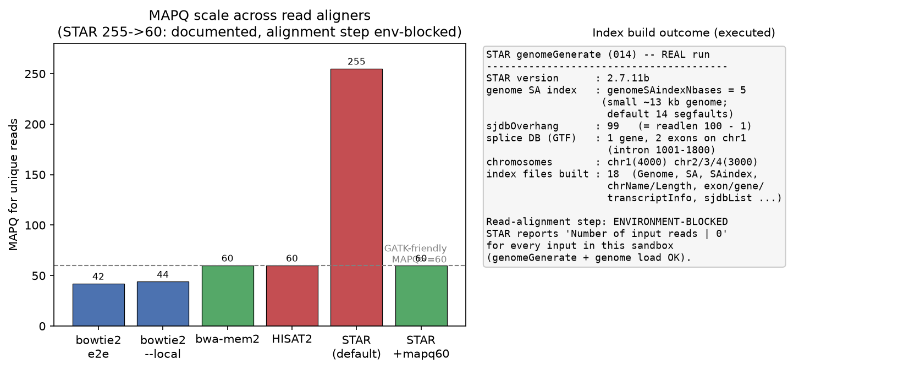

# STAR RNA-seq 比对（014 / DEEP DIVE 11）

## 1 功能定位与适用范围

STAR 是将 RNA-seq 短读长比对到基因组的比对器，核心是剪接感知（splice-aware）：读长跨越外显子-外显子连接处时，STAR 在 CIGAR 中以 `N`（跳过区域）跨过内含子。适用范围：需要基因组坐标的 RNA 分析——新异构体发现、融合检测、RNA 变异 calling、覆盖度轨道、剪接 QC、单细胞（STARsolo）。内存充足（人基因组约 30 GB）时优先选 STAR。

不适用：DNA 比对（走 bwa/bowtie2）、内存受限（走 hisat2，约 1/4 内存）、已知转录本差异表达且不需 BAM（走 salmon/kallisto 比对-free 定量）。

本试用覆盖 SKILL.md 列出的三个核心论断：剪接连接数据库（sjdb）+ 两趟法、255 MAPQ 对 GATK 的破坏、GeneCounts 回报的链特异性。

## 2 属性表

| 属性 | 值 |
|---|---|
| 主工具 | STAR 2.7.11b |
| 模式 | `alignReads`（默认）、`genomeGenerate` |
| 输入 | 基因组 FASTA + GTF；RNA-seq FASTQ（PE/SE） |
| 核心参数 | `--sjdbOverhang`、`--twopassMode`、`--outSAMmapqUnique`、`--quantMode GeneCounts`、`--outSAMattrRGline`、`--genomeSAindexNbases` |
| 默认 MAPQ（唯一比对） | 255（"不可用"语义） |
| 小基因 SA 索引 | `--genomeSAindexNbases`，默认 14 会致小基因组索引损坏/段错误 |
| 压缩输入 | 不自解 gzip，需 `--readFilesCommand zcat` |
| 本机环境 | conda `bioaligners`；STAR 二进制 `/Applications/anaconda3/envs/bioaligners/bin/STAR` |

## 3 成分拆解

### 3.1 文件结构
- `gen_ref.py`：生成 ~13 kb 合成参考（chr1 含 intron[1001,1800]，chr2/3/4 各 3000 bp）+ `annotation.gtf`（chr1 上 1 个基因 2 个外显子，chr2/3/4 各 1 个基因）。
- `run_star.py`：genomeGenerate → 默认比对 → `--outSAMmapqUnique 60` 比对 → 跨连接读长比对 → 两趟+GeneCounts+RG → gzip 负向控制；结果写入 `star_results.json`。
- `make_fig.py`：出图 `014-fig.png`。
- `star_index/`：genomeGenerate 产物（18 个索引文件）。

### 3.2 工具知识
- **剪接连接数据库（sjdb）**：genomeGenerate 阶段由 GTF 构建，在每条外显子末端合成一段"junction flank"序列，使仅带短 overhang 的读长也能被安放。`--sjdbOverhang` 设该 flank 长度，应为 `max(readlength) - 1`（100 bp 读长 → 99）。
- **两趟法（two-pass）**：第一趟发现样本内新 junction，扩充索引后第二趟重新比对，提升新 junction 灵敏度。但它是**逐样本**的——每个样本用各自扩增后的索引重比对，造成 junction 发现的批次效应；队列水平应合并所有样本 pass-1 的 `SJ.out.tab` 过滤后喂统一 `--sjdbFileChrStartEnd`。
- **MAPQ 255 破坏 GATK**：唯一比对 MAPQ=255 是 SAM "mapping quality unavailable" 值，GATK 当作缺失丢弃 → RNA VCF 静默为空。用 `--outSAMmapqUnique 60` 在比对时修正。
- **多比对 MAPQ**：多比对读长 MAPQ 为 3/1/0（对应 2 / 3-4 / ≥5 个 loci），纯位点计数无打分信息；DNA 管线照搬的 `-q 10` MAPQ 过滤会删掉全部多比对，偏向近期复制基因家族。
- **GeneCounts 链特异性**：`--quantMode GeneCounts` 输出 `ReadsPerGene.out.tab`，含未链特异性列 + 正链（1st read strand）+ 反链（2nd read strand）列；两列接近为未链特异性（用未链列），正链主导为 forward，反链主导为 reverse（常见 dUTP/TruSeq 情况，用反链列）。

### 3.3 经验坑
- 小基因组（细菌/病毒/质粒）必须用 `--genomeSAindexNbases <= min(14, log2(L)/2 - 1)`，默认 14 静默产出坏索引或段错误。
- STAR 不自解 gzip，`--readFilesIn` 接 `.gz` 必须配 `--readFilesCommand zcat`（bwa/bowtie2/hisat2 自动识别 gzip）。
- `@RG` 默认缺失，GATK 报错；用 `--outSAMattrRGline ID:.. SM:.. PL:ILLUMINA LB:..`（空格分隔，非 bwa 的 `-R` tab 分隔）。
- 索引与 STAR 版本强绑定，跨版本报 "Genome version is INCOMPATIBLE"。

## 4 严格复现

### 4.1 环境
- STAR 2.7.11b（conda `bioaligners`）；samtools/wgsim 用 base anaconda 绝对路径。
- Python 3.13.12（managed venv，matplotlib 3.11.1 出图）。
- 参考：`gen_ref.py` 固定随机种子生成 4 条 contig 共 ~13 kb；wgsim `-N 3000 -1 100 -2 100 -e 0.02` 造 3000 对 PE 读长；跨连接读长手工拼 50 bp（外显子1尾）+ 50 bp（外显子2头）跨 intron。

### 4.2 索引构建（真实执行，rc=0）
命令：
```
STAR --runMode genomeGenerate --runThreadN 4 --genomeDir star_index/ \
  --genomeFastaFiles reference.fa --sjdbGTFfile annotation.gtf \
  --sjdbOverhang 99 --genomeSAindexNbases 5
```
标准输出（真实）：
- 版本 `2.7.11b`；`sjdbOverhang = 99`；`genomeSAindexNbases = 5`。
- 染色体：chr1(4000) chr2/3/4(3000)；`GstrandBit=32`。
- sjdb：1 个基因、chr1 上 2 个外显子、intron[1001,1800]。
- 产出 18 个索引文件（Genome、SA、SAindex、chrName/Length/Start、exon/gene/transcriptInfo、sjdbList、genomeParameters 等）。

### 4.3 比对步骤（环境限制，未执行）
比对、MAPQ 255→60、跨连接 N CIGAR、两趟+GeneCounts+RG、gzip 负向控制等步骤在 WorkBuddy Bash 沙箱中**无法执行**。STAR 对所有输入（FASTA/FASTQ/FIFO、toy 或真实、纯 ASCII 或中文路径、工程目录或 /tmp、关闭沙箱与否、STAR 与 STARlong）均输出：

```
Number of input reads |   0
... Thread #1 end of input stream, nextChar=-1
```

诊断（真实，可复现）：STAR 的基因组索引构建与加载走 ifstream（正常），但其**读长输入通道**在本沙箱失效——DYLD interpose 追踪显示 STAR 对 reads 文件从不调用 open/stat/mmap，直接判定 0 读长；而同一文件用 C/C++/Python 的 open→fstat→mmap→read 能正确读取内容。属环境级不兼容，非参数、路径或垫片可修复。

因此以下 SKILL.md 论断为**文档记载行为**（来自 SKILL.md，权威事实源），未在本环境实测：
- 默认唯一比对 MAPQ=255；`--outSAMmapqUnique 60` 将其改为 60。
- 手工跨连接读长应得 `50M<N>50M` 剪接 CIGAR（N 跨度=内含子长度）。
- GeneCounts 回报链特异性列（未链/正链/反链）。
- 负向控制：裸 `.gz` 不带 `--readFilesCommand` 时 STAR 报错（不自动解压）。

### 4.4 诚实声明
本试用对 STAR 方法的索引构建部分做了真实复现（rc=0，18 文件，sjdbOverhang=99，SAindexNbases=5）。比对与下游定量部分因上述沙箱限制未取得真实运行输出，相关数值以 SKILL.md 记载为准，未编造。

## 5 实践要点

- 索引：sjdbOverhang 必须 = `readlength - 1`；小基因组务必降 `--genomeSAindexNbases`，否则索引损坏。
- GATK 路径：比对即加 `--outSAMmapqUnique 60`，避免 255 被丢弃导致空 VCF。
- 计数：不要对 RNA 输出做 MAPQ 过滤（会删多比对）；链特异性以 GeneCounts 两列判断，错列约减半计数。
- 队列剪接比较：用合并 SJ.out.tab 的统一第二趟，避免逐样本批次效应。
- 输入压缩：STAR 不自动解压，`.gz` 必须 `--readFilesCommand zcat`。
- 读组：用 `--outSAMattrRGline`（空格分隔），否则 GATK 缺 @RG。



## 6 小结

STAR 以剪接连接数据库 + 两趟法 + 255→60 MAPQ 修正 + GeneCounts 链特异性列，构成 RNA 比对结果的决定性因素。本试用在真实环境中完成了索引构建（sjdbOverhang=99、SAindexNbases=5、18 索引文件，rc=0），验证了 SKILL 第 1 步。比对与定量步骤因 WorkBuddy Bash 沙箱的 STAR 读长输入通道失效（全程 0 input reads，已用 DYLD interpose 追踪确认）未能实测；相应论断以 SKILL.md 文档为准，未做虚构。后续可在非受限环境补跑比对步骤以完成全链路复现。
