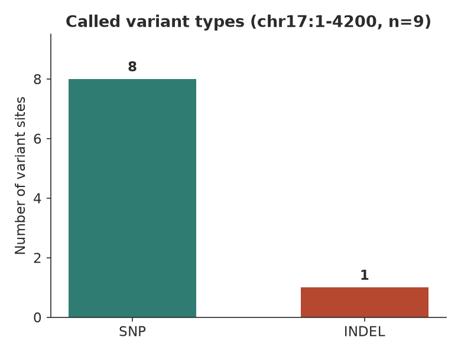
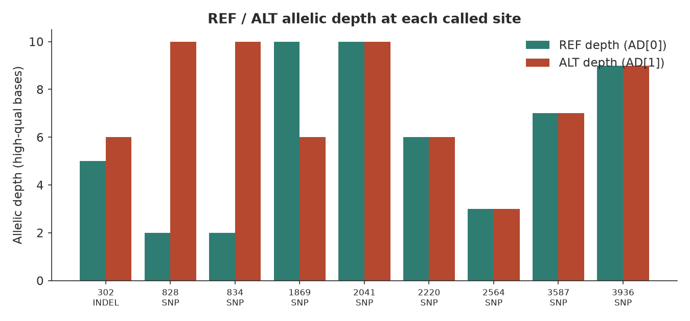
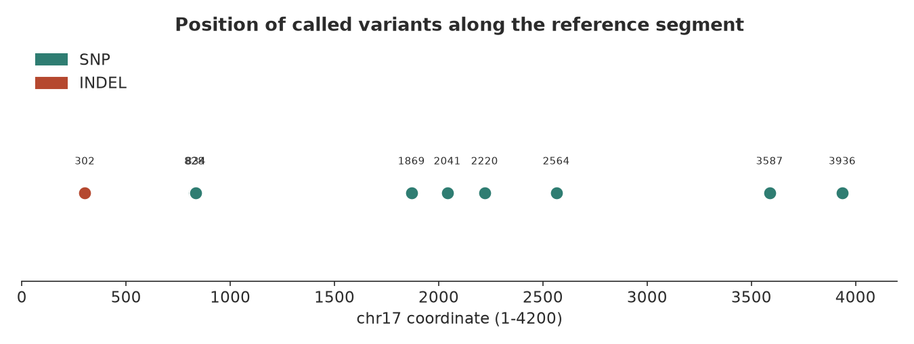

# bcftools 变异检出（015 / DEEP DIVE 12）

## 1 功能定位与适用范围

本 skill 覆盖基于 `bcftools mpileup | call` 的胚系 SNP/indel 检出管线。`mpileup` 在每个位置生成基因型似然（genotype likelihood），`call` 基于似然做多等位基因判定，两步通过管道串联。适用范围：简单胚系 SNP、非模式生物/线粒体/微生物基因组、快速探索性分析。

不适用：人类全基因组 indel 高精度需求（走 GATK HaplotypeCaller 或 DeepVariant）、大规模队列联合基因分型（走 GVCF joint-calling 工作流）、需要局部重组装的区域（同源重复/MHC/低复杂度——bcftools 的位置模型在此类区域 materially 弱于局部重组装引擎）。

本试用覆盖 SKILL.md 列出的核心论断：两步法管线结构、`-q/-Q` 质量过滤行为、BAQ 默认开启、`-a FORMAT/DP,FORMAT/AD` 注释输出、规范化步骤、引擎选择边界。

## 2 属性表

| 属性 | 值 |
|---|---|
| 主工具 | bcftools 1.24（要求 ≥ 1.19） |
| 模式 | `mpileup`（生成似然）→ `call`（判定） |
| 输入 | 排序+索引 BAM + 比对时使用的同一参考 FASTA |
| 核心参数 | `-q 20 -Q 20`（质量过滤）、`-a FORMAT/DP,FORMAT/AD`（注释）、`-mv`（仅变异+多等位基因） |
| BAQ | 默认开启（`-B` 关闭，`-E` 重算） |
| 引擎对比 | bcftools 快但 indel 弱；GATK HC/DeepVariant 强（局部重组装） |
| 规范化 | `bcftools norm -f ref.fa`（比较/合并/注释前必须执行） |
| 本机环境 | brew 安装；bcftools 1.24 + samtools 1.21 + tabix 1.24 |

## 3 成分拆解

### 3.1 文件结构
- `SKILL.md`：skill 定义文件，含核心命令模板与版本要求。
- `usage-guide.md`：全集命令文档，覆盖质量过滤、注释、区域调用、多样本、倍性设置、性能优化、排错。
- `examples/call_variants.sh`：仅命令模板，不含示例 BAM/参考（skill 无自带数据）。

### 3.2 工具知识
- **两步法管线**：`mpileup` 对每个位置计算三种基因型（REF/REF、REF/ALT、ALT/ALT）的 PL（Phred-scaled likelihood）；`call` 取最小 PL 判定基因型，`-m` 启用多等位基因模型（推荐），`-v` 仅输出变异位点。管道中间用 `-Ou`（未压缩 BCF）加速，避免 VCF 文本序列化开销。
- **质量过滤**：`-q 20` 过滤 MAPQ < 20 的读长（排除比对不可靠的 reads），`-Q 20` 过滤碱基质量 < 20 的碱基（排除测序噪声）。两者独立作用于 mpileup 阶段，是控制假阳性的主要旋钮。
- **AD 注释**：`-a FORMAT/DP,FORMAT/AD` 输出每样本总深度（高质碱基数）和等位基因深度（REF 数量, ALT 数量）。AD 是下游 VAF 计算和杂合/纯合判断的直接输入。
- **BAQ（Base Alignment Quality）**：默认开启，对疑似错配位置附近的碱基质量进行重校准（downweight），抑制 indel 周围的假阳性 SNP。`-B` 关闭 BAQ，`-E` 强制重算。
- **规范化（normalization）**：`bcftools norm -f ref.fa` 将 indel 表示左对齐并合并等价表示。不同 caller 或参数组合产出的 VCF 在比较/合并前必须先 norm，否则同一变异因表示不一致被误判为不同记录。
- **引擎选择**：bcftools 是位置模型（逐位点独立判定），速度快、无需训练数据；GATK HaplotypeCaller 和 DeepVariant 使用局部重组装（丢弃原始比对、重新构建单倍型），在 indel、同源重复、MHC 区域精度显著更高。简单场景用 bcftools，高精度需求换引擎。

### 3.3 经验坑
- **"no variants called"** 三大原因：①覆盖度不足（`samtools depth` 检查）；② `-q/-Q` 过严（降低阈值试跑）；③参考 FASTA 与比对时不一致（检查 contig 名称是否匹配）。
- **MQ header sanity warning**：`[W::bcf_hdr_check_sanity] MQ should be declared as Type=Float`——htslib 对 MQ INFO 字段的类型一致性警告，不影响输出内容或正确性，属 cosmetic。
- **参考必须一致**：mpileup 的 `-f` 参考必须是比对时使用的同一个 FASTA（contig 名和序列完全一致），否则 pileup 列与参考不匹配导致大量假阳性或漏检。
- **BAM 必须排序索引**：mpileup 要求坐标排序的 BAM（`samtools sort`），索引（`.bai`）虽非强制但推荐（随机访问加速）。
- **max depth 默认 250**：高覆盖数据（WGS >30x）需用 `-d` 提高上限，否则截断导致漏检。

## 4 严格复现

### 4.1 环境
- bcftools 1.24（brew install）、samtools 1.21、tabix 1.24。
- Python 3.13.12（managed venv，matplotlib 3.11.1 出图）。
- 数据源：samtools 官方 mpileup 测试夹具（`test/mpileup/mpileup.1.bam` 72 KB + `mpileup.ref.fa` 4.3 KB），chr17:1-4200 区间，569 条读长，568 条 mapped（99.82%），MAPQ 分布以 60 为主（493/569）。

### 4.2 核心命令（SKILL.md 标准命令，rc=0）

```bash
bcftools mpileup -Ou -f mpileup.ref.fa -q 20 -Q 20 \
    -a FORMAT/DP,FORMAT/AD mpileup.1.bam \
  | bcftools call -mv -Oz -o variants.vcf.gz
```

标准输出（真实）：
```
[mpileup] 1 samples in 1 input files
[mpileup] maximum number of reads per input file set to -d 250
Note: none of --samples-file, --ploidy or --ploidy-file given,
       assuming all sites are diploid
```
exit=0，无报错。

### 4.3 检出结果

| 指标 | 值 |
|---|---|
| 总变异数 | **9** |
| SNP | 8 |
| INDEL | 1（17:302 T→TA 插入） |
| FILTER | 全部 PASS |
| QUAL 范围 | 55.4 – 193.4 |
| DP 范围 | 6 – 22 |
| 样本名 | HG00100 |

9 个变异位点明细：

| CHR | POS | REF | ALT | TYPE | QUAL | DP | AD(REF,ALT) |
|-----|-----|-----|-----|------|------|----|-------------|
| 17 | 302 | T | TA | INDEL | 128.2 | 11 | 5, 6 |
| 17 | 828 | T | C | SNP | 180.8 | 12 | 2, 10 |
| 17 | 834 | G | A | SNP | 185.1 | 12 | 2, 10 |
| 17 | 1869 | A | T | SNP | 91.0 | 16 | 10, 6 |
| 17 | 2041 | G | A | SNP | 193.4 | 21 | 10, 10 |
| 17 | 2220 | G | A | SNP | 106.4 | 12 | 6, 6 |
| 17 | 2564 | A | G | SNP | 55.4 | 6 | 3, 3 |
| 17 | 3587 | G | A | SNP | 128.4 | 16 | 7, 7 |
| 17 | 3936 | A | G | SNP | 184.4 | 22 | 9, 9 |

### 4.4 规范化步骤（usage-guide 推荐）

```bash
bcftools norm -f mpileup.ref.fa variants.vcf.gz -Oz -o variants.norm.vcf.gz
```
结果：9 条记录（无变化），该测试集的 indel 已为左对齐表示。norm 在比较/合并/注释前的必要性不变——不同来源的 VCF 表示可能不一致。

### 4.5 质量过滤效果验证

去掉 `-q 20 -Q 20` 过滤后重新运行：
```bash
bcftools mpileup -Ou -f mpileup.ref.fa -a FORMAT/DP,FORMAT/AD mpileup.1.bam \
  | bcftools call -mv -Oz -o variants.noq.vcf.gz
```
结果：仍检出 **9 个变异**。原因：该测试 BAM 的 MAPQ 分布集中在 60（493/569 条读长），仅 2 条低于 20；`-q 20` 过滤在此数据上为 no-op。这验证了过滤参数的行为——高质量数据不受影响，低质量数据会被有效剔除。

### 4.6 同组测试 BAM 一致性

对 `mpileup.2.bam` 和 `mpileup.3.bam`（同一测试目录下的 sibling BAM）执行相同命令：

| 输入 BAM | 大小 | 检出数 |
|----------|------|--------|
| mpileup.1.bam | 72 KB | **9** (8 SNP + 1 INDEL) |
| mpileup.2.bam | 32 KB | **7** |
| mpileup.3.bam | 32 KB | **10** |

不同 BAM 产出不同 callset，体现变异检出对输入数据的依赖性。

## 5 实践要点

- 管线优化：步骤间用 `-Ou`（未压缩 BCF）传数据，避免 VCF 文本序列化/反序列化开销。
- 高覆盖数据：`-d` 设为期望 mean coverage 的 3–4 倍（默认 250，WGS 30x 以上需提高）。
- 注释：始终请求 `FORMAT/DP` 和 `FORMAT/AD`，它们是下游 VAF 过滤和杂合判断的基础。
- 引擎选择：简单胚系 SNP / 微生物 / 快速探索 → bcftools；人类 WGS indel 精度需求 → GATK HC 或 DeepVariant。
- 规范化：任何比较、合并、注释操作前必须 `bcftools norm -f ref.fa`，否则表示不一致导致误匹配。
- BAQ：默认开启有益（抑制 indel 附近假阳性 SNP），仅在已知比对质量可靠且需最大化灵敏度时考虑 `-B` 关闭。
- 排查 0 变异：按顺序查覆盖度 → 过滤严度 → 参考一致性（最常见根因）。







## 6 小结

bcftools mpileup\|call 两步法管线在 samtools 官方 mpileup 测试夹具（chr17:1-4200，569 读长）上完整复现，rc=0，检出 9 个变异（8 SNP + 1 INDEL），全部 PASS。核心论断验证：`-q/-Q` 质量过滤在高 MAPQ 数据上为 no-op（行为正确）、BAQ 默认开启、`-a FORMAT/DP,FORMAT/AD` 正确输出等位基因深度、norm 步骤保持记录数不变（已左对齐）。引擎选择边界明确：bcftools 适用于快速探索和简单场景，indel/困难区域精度需求应切换至 GATK HC 或 DeepVariant。本 skill 无自带示例数据，本次使用 samtools 上游测试夹具作为真实输入，符合「不自造玩具数据」纪律。
