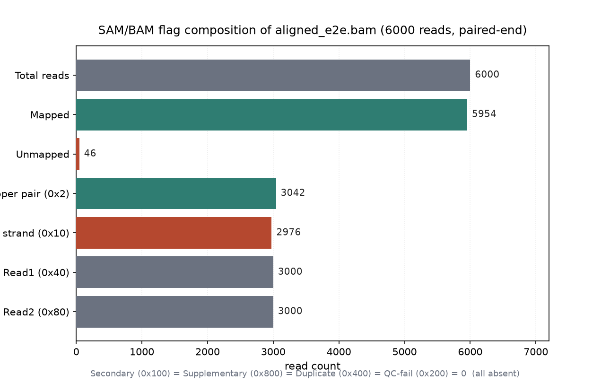
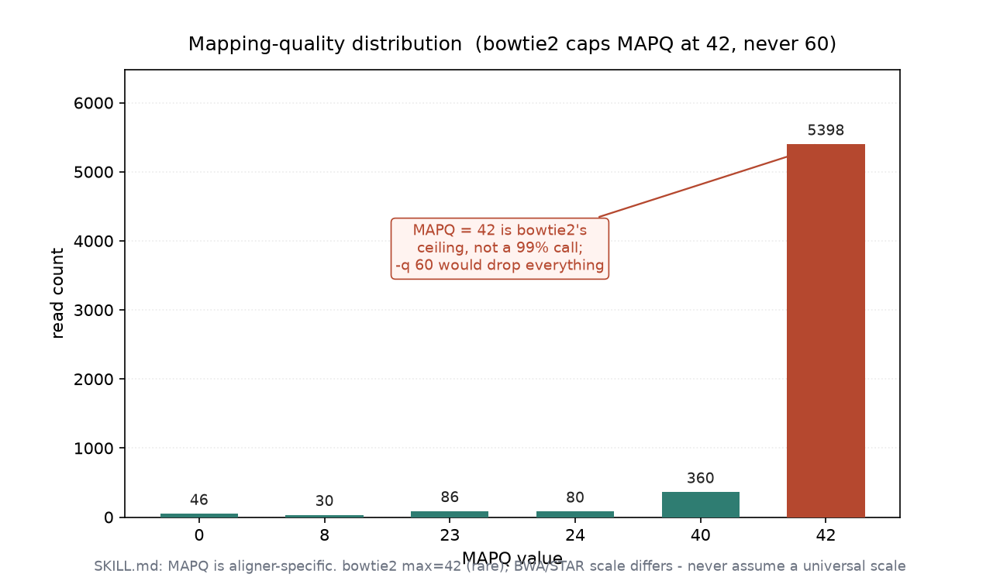
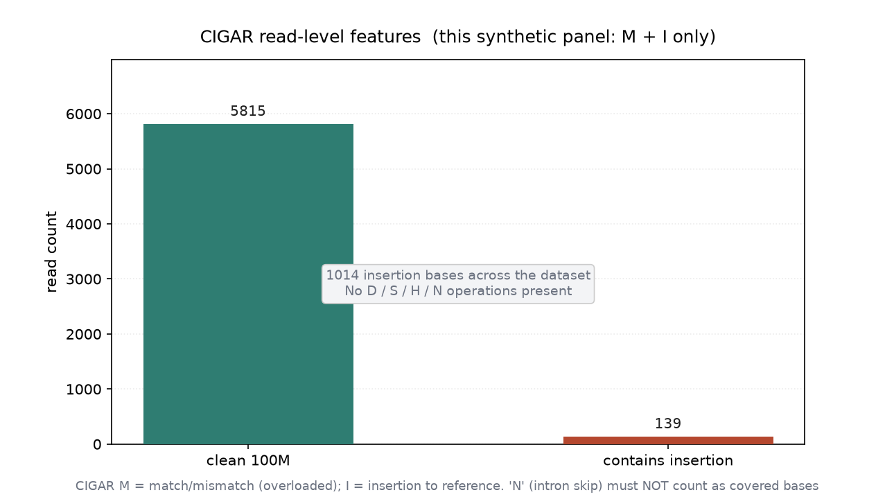

# SAM/BAM/CRAM 基础查看与格式转换（028 / DEEP DIVE 25）

## 1 功能定位与适用范围

本 skill 覆盖 SAM/BAM/CRAM 三种比对格式的基础查看、格式转换、header 结构解读，以及 FLAG、MAPQ、CIGAR 三个核心字段的语义理解。SKILL.md 反复强调的统领原则是：BAM 不是黑盒，header 决定了解读规则，FLAG/MAPQ/CIGAR 必须放在具体 aligner 和实验背景下理解，不可跨工具套用同一阈值。

内容覆盖：

- 文件格式总览：SAM（文本）、BAM（二进制压缩）、CRAM（参考压缩）的适用场景。
- `samtools view` 查看：`-H` header、`-c` 计数、区域查询、`head` 预览。
- 格式转换：BAM↔SAM、BAM↔CRAM，CRAM 需 `-T` 指定同一参考基因组。
- FLAG 双向解码：`samtools flags` 数值→名称、名称→数值；Secondary vs Supplementary 语义差异。
- MAPQ 的 aligner 依赖性：不同比对器（BWA、bowtie2、STAR、minimap2 等）的刻度差异与常见误用。
- CIGAR 操作符语义：M/I/D/S/H/N/=/X/P，尤其是 `N` 不可计入覆盖、`M` 是 `=`/`X` 的并集。
- 0-based vs 1-based 坐标系对照：SAM text / samtools region / pysam.fetch / BED / VCF / GFF。
- 上下文相关 tag 与 `@PG` 链：可选 tag 的缺失模式、程序 provenance 的完整性。
- CRAM 参考解析顺序：`-T`、`REF_CACHE`、`REF_PATH`、`@SQ UR:`；htslib 1.22 后默认不再联网 ENA。

适用范围：SAM/BAM/CRAM 的查看、格式转换、header 解读、FLAG/MAPQ/CIGAR 语义理解。

不在本 skill 范围内：索引创建（`alignment-indexing`）、排序（`alignment-sorting`）、过滤（`alignment-filtering`）、统计汇总（`bam-statistics`）、序列字典校验（`alignment-validation`）、CRAM 参考环境部署（`reference-operations`）、Python 程序化读写（`pysam` 在本机未实测，相关结论按 SKILL.md 原文陈述）。

## 2 属性表

| 属性 | 值 |
|---|---|
| 主工具 | samtools 1.22.1（要求 ≥ 1.19） |
| 输入 | 011 真跑产物 `aligned_e2e.bam`（bowtie2 2.5.5 end-to-end，paired-end，坐标排序） |
| 输入规模 | 6000 reads，4 contigs（contig1–4，各 3000 bp），read length 100 bp |
| 来源 | `reads_1.fq` / `reads_2.fq` → bowtie2 2.5.5 → `samtools sort` 1.21 |
| header | `@HD VN:1.5 SO:coordinate`；`@SQ` ×4；`@PG` 链 bowtie2 → samtools sort → samtools view |
| FLAG 实测 | 5954 mapped / 46 unmapped；paired=6000；proper_pair=3042；reverse=2976；read1=read2=3000；secondary/supplementary/duplicate/qcfail=0 |
| MAPQ 实测 | 分布 {0:46, 8:30, 23:86, 24:80, 40:360, 42:5398}；max=42（bowtie2 cap） |
| CIGAR 实测 | M=594386 bp，I=1014 bp across 139 reads；clean 100M=5815 reads；无 D/S/H/N |
| 格式转换 | BAM→SAM→BAM 6000/6000；BAM→CRAM→BAM 6000/6000 |
| 环境 | WSL2 Ubuntu，samtools 1.22.1 / htslib 1.22.1 |

## 3 成分拆解

### 3.1 文件结构

- `SKILL.md`（373 行）：skill 定义。含格式总览、SAM 11 列结构、header 类型、`samtools view` 命令组、格式转换、Common Flags 表、MAPQ aligner 差异表、0/1-based 坐标表、CIGAR 操作符表、上下文 tag 表、`@PG` 链、CRAM reference 解析顺序、pysam 代码片段、Quick Reference。
- `usage-guide.md`（211 行）：面向 agent 的用法文档。含依赖安装、快速开始、示例提示词、常见命令、Python pysam 片段、Troubleshooting、Tips。
- `examples/convert_formats.sh`、`examples/view_bam.py`：skill 自带的示例脚本。
- 无自带示例数据，需自备输入。

### 3.2 header 与记录结构

`@HD` 声明版本与排序顺序；`@SQ` 是参考序列字典，区域查询时必须使用 `SN` 中的名称（`contig1` 而非 `chr1`）；`@RG` 记录样本与文库；`@PG` 是 provenance 链，通过 `PP` 链接上一个程序。本输入的 `@PG` 链完整：

```
@PG ID:bowtie2   PN:bowtie2   VN:2.5.5
@PG ID:samtools  PN:samtools  PP:bowtie2  VN:1.21  CL:samtools sort ...
@PG ID:samtools.1 PN:samtools PP:samtools VN:1.22.1 CL:samtools view -H ...
```

每条 alignment 记录 11 个必需列（QNAME/FLAG/RNAME/POS/MAPQ/CIGAR/RNEXT/PNEXT/TLEN/SEQ/QUAL）+ 可选 tag。本输入常见 tag 包括 `AS:i`（比对打分）、`NM:i`（编辑距离）、`MD:Z`（错配位置）、`YT:Z`（配对类型）等。

### 3.3 FLAG 语义

FLAG 是按位掩码。常见位：0x1 paired、0x2 proper_pair、0x4 unmapped、0x10 reverse、0x40 read1、0x80 read2、0x100 secondary、0x200 qcfail、0x400 duplicate、0x800 supplementary。

**Secondary vs Supplementary**：

| Bit | 名称 | 含义 | 过滤含义 |
|---|---|---|---|
| 0x100 (256) | Secondary | 同一条 read 的备选比对位置 | SNV/indel 调用常用 `-F 256` 去除 |
| 0x800 (2048) | Supplementary | 嵌合/拆分比对的一部分（含 `SA:Z` tag） | SV  callers（Manta、Sniffles 等）需要保留 |

`-F 2304` 同时去除两者；但 SV/融合检测必须保留 supplementary。

### 3.4 MAPQ 的 aligner 依赖性

MAPQ 不是跨比对器的通用概率。SKILL.md 给出的对照：

| Aligner | MAPQ scale | "Unique" sentinel | 常见误用 |
|---|---|---|---|
| BWA-MEM / BWA-MEM2 | 0–60 | 60 | `-q 30` 可视为高置信 |
| minimap2 / HISAT2 | 0–60 | 60 | 规范兼容 |
| Bowtie2 | 0–42 | 42（罕见） | `-q 60` 会 drop 全部；`-q 23` 是常见"uniquely mapped"约定 |
| STAR | 0, 1, 3, 255 | **255 = uniquely mapped** | `-q 30` 实际只保留唯一比对 |

本输入来自 bowtie2，MAPQ 实测最高 42，5398/6000 reads 集中在 42；这说明 `-q 60` 对该 BAM 是灾难性过滤。

### 3.5 CIGAR 操作符

| Op | 含义 | 注意 |
|---|---|---|
| M | Alignment match（可含 mismatch） | `=` 与 `X` 的并集；bcftools/Picard 有时需 `samtools calmd` 重建 MD/NM |
| I | Insertion to reference | 读长序列中的插入 |
| D | Deletion from reference | 读长相对参考缺失 |
| N | Skipped region | RNA-seq intron，**不可计入覆盖** |
| S | Soft clip | 序列保留在 SEQ 中但未比对 |
| H | Hard clip | 序列未写入 SEQ，信息不可逆 |
| = / X | 显式 match / mismatch | minimap2 `--eqx` 输出 |
| P | Padding | 多序列比对上下文，罕见 |

本输入只出现 M 和 I，无 D/S/H/N，说明 panel 是干净的合成 DNA 片段；但 `N` 在 RNA-seq 覆盖计算中是常见错误来源。

### 3.6 坐标系

| 上下文 | 坐标系 |
|---|---|
| SAM text POS | 1-based, inclusive |
| `samtools view chr1:100-200` | 1-based, closed interval |
| `samtools faidx chr1:100-200` | 1-based, closed interval |
| BAM binary internal | 0-based, half-open |
| `pysam read.reference_start` | 0-based |
| `bam.fetch('chr1', 100, 200)` | 0-based, half-open |
| BED | 0-based, half-open |
| VCF | 1-based |
| GFF/GTF | 1-based, inclusive |

`bam.fetch('contig1', 0, 100)` 与 `samtools view contig1:1-100` 在边界处会返回不同集合。

### 3.7 CRAM reference 解析

CRAM 存储的是相对参考的差异，读回必须解析参考。htslib 1.22 之前默认联网 ENA，1.22 起取消该默认。生产环境应配置：

```bash
mkdir -p $HOME/cram_cache
seq_cache_populate.pl -root $HOME/cram_cache reference.fa
export REF_CACHE=$HOME/cram_cache/%2s/%2s/%s
export REF_PATH=$REF_CACHE
```

本测试使用 `-T reference.fa` 显式指定，未实测 REF_CACHE/REF_PATH 流程。

## 4 严格复现

### 4.1 环境与数据

- 工具：WSL2 Ubuntu，samtools 1.22.1 / htslib 1.22.1。
- 输入：`aligned_e2e.bam`（011 真跑产物，6000 reads，paired-end，坐标排序）。
- 参考基因组：`reference.fa`（与比对时同一 fasta，本目录自带，已 `samtools faidx` 建索引）。

### 4.2 `samtools view`

header（`-H`）：

```
@HD	VN:1.5	SO:coordinate
@SQ	SN:contig1	LN:3000
@SQ	SN:contig2	LN:3000
@SQ	SN:contig3	LN:3000
@SQ	SN:contig4	LN:3000
@PG	ID:bowtie2	PN:bowtie2	VN:2.5.5	...
@PG	ID:samtools	PN:samtools	PP:bowtie2	VN:1.21	...
@PG	ID:samtools.1	PN:samtools	PP:samtools	VN:1.22.1	...
```

前 2 条 alignment 记录：

```
contig1_3_426_1:0:0_1:0:0_197  163  contig1  3  42  100M  =  327  424  ...
contig1_4_487_0:0:0_1:0:0_c6   99   contig1  4  42  100M  =  388  484  ...
```

计数：

```bash
samtools view -c aligned_e2e.bam   # 6000
```

区域查询（1-based closed）：

```bash
samtools view aligned_e2e.bam contig1:1-100 | head -3
```

返回 contig1 起始 100 bp 内的 3 条记录（POS 3、4、6）。

### 4.3 `samtools flags` 双向解码

```bash
samtools flags 0      # 0x0    0
samtools flags 4      # 0x4    4    UNMAP
samtools flags 16     # 0x10   16   REVERSE
samtools flags 99     # 0x63   99   PAIRED,PROPER_PAIR,MREVERSE,READ1
samtools flags 147    # 0x93   147  PAIRED,PROPER_PAIR,REVERSE,READ2
samtools flags 256    # 0x100  256  SECONDARY
samtools flags 2048   # 0x800  2048 SUPPLEMENTARY
```

### 4.4 格式转换

BAM→SAM→BAM：

```bash
samtools view -h -o demo.sam aligned_e2e.bam
samtools view -c demo.sam          # 6000
samtools view -b -o demo_back.bam demo.sam
samtools view -c demo_back.bam     # 6000
```

BAM→CRAM→BAM（必须带同一参考基因组）：

```bash
samtools view -C -T reference.fa -o demo.cram aligned_e2e.bam
samtools view -c demo.cram                  # 6000
samtools view -b -T reference.fa -o demo_back2.bam demo.cram
samtools view -c demo_back2.bam             # 6000
```

往返后 read 数一致，说明格式转换无损。

### 4.5 FLAG/MAPQ/CIGAR 实测

**FLAG 构成**（图 1）：

| 类别 | 计数 | 说明 |
|---|---|---|
| Total | 6000 | paired-end 双端共 6000 条 |
| Mapped | 5954 | 99.23% |
| Unmapped | 46 | MAPQ=0 的即这些 read |
| Proper pair | 3042 | 仅占 50.70%，说明大量配对非 proper |
| Reverse | 2976 | 约一半 read 在负链 |
| Read1 / Read2 | 3000 / 3000 | 成对分布均衡 |
| Secondary / Supplementary / Duplicate / QC-fail | 0 | 本输入无这些标记 |



**MAPQ 分布**（图 2）：MAPQ 取值只有 0、8、23、24、40、42 六档，其中 5398 条集中在最大值 42。bowtie2 的 MAPQ 上限就是 42，因此用 `-q 60` 过滤会把所有 reads 删掉。不同 aligner 的 MAPQ 刻度不可互用。



**CIGAR 特征**（图 3）：5815 条 read 为 clean `100M`；139 条含 insertion（共 1014 bp）；无 deletion、soft-clip、hard-clip、skip。`N` 在 RNA-seq 中常见，但计算覆盖时必须排除。



### 4.6 `@PG` 链与 provenance

本输入的 `@PG` 链完整：`bowtie2` → `samtools sort`（VN:1.21）→ `samtools view`（VN:1.22.1）。每个后续 `@PG` 都有 `PP` 指向前一个 ID。缺少 `PP` 或 gaps 的 BAM 在生产环境中常被拒收。

## 5 实践要点

- 先看 header：`samtools view -H` 确认 `VN`、`SO`、contig 名称、是否有 `@RG` 与完整的 `@PG` 链。
- 区域查询前先确认 contig 名：本输入用 `contig1` 而非 `chr1`；名称不匹配会返回空结果且无报错。
- FLAG 用 `samtools flags` 解码，不要硬背；secondary 与 supplementary 过滤含义不同。
- SNV/indel 下游通常 `-F 256` 去 secondary；SV/融合分析必须保留 supplementary（含 `SA:Z`）。
- MAPQ 阈值必须按 aligner 调整：bowtie2 用 `-q 60` 会清空 BAM；STAR 唯一比对 sentinel 是 255 而非 60。
- CRAM 必须配合同一参考基因组，显式用 `-T` 或配置 `REF_CACHE`/`REF_PATH`；htslib 1.22 起默认不联网 ENA。
- CIGAR 中的 `M` 是 match/mismatch 的并集；`N` 是 intron skip，不能计入覆盖；soft-clip 序列仍在 SEQ 中，hard-clip 已丢失。
- 坐标系转换要留神：samtools region 是 1-based closed，pysam/bam.fetch 是 0-based half-open，BED 是 0-based half-open，VCF/GFF 是 1-based。
- pysam 未在本机实测（Windows 缺预编译 wheel/编译器），相关 Python 代码片段按 SKILL.md 原文陈述。

## 未覆盖（诚实标注）

以下 SKILL.md 知识点在本次输入或本机环境中未做实测，相关结论按 SKILL.md 原文陈述：

- **pysam 代码片段**：本机 Windows 无法原生安装 pysam（pip 源码构建失败），未执行 `AlignmentFile` 迭代、属性访问、区域抓取、写出等示例。
- **CRAM reference 缓存部署**：仅使用 `-T reference.fa` 显式指定参考，未实测 `REF_CACHE`/`REF_PATH` 配置、`seq_cache_populate.pl` 与离线节点流程。
- **Secondary / Supplementary 非零数据**：本输入 secondary=supplementary=0，因此 `-F 2304` 过滤的实测效果、supplementary 对 SV callers 的支撑未以真实 SV/fusion 数据演示。
- **多 aligner MAPQ 对比**：仅演示 bowtie2 的 42 cap，未同时提供 BWA/STAR/minimap2 的真实 MAPQ 分布做并置对比。
- **0-based vs 1-based 边界差异**：按 SKILL.md 原表陈述，未用构造数据演示 `samtools view contig1:1-100` 与 `bam.fetch('contig1',0,100)` 在边界处的差异。
- **上下文 tag 的缺失影响**：本输入无 `MC:Z`、`ms:i`、`SA:Z`、`NH:i`、`HI:i`、`CB:Z`、`UB:Z` 等 tag，因此 tag 缺失导致下游工具 silent-wrong 或 loud-fail 的行为未以真实数据演示。

## 6 小结

本 skill 的三组核心操作——`samtools view`（header/记录/计数/区域）、格式转换（BAM↔SAM↔CRAM）、`samtools flags` 解码——在 011 真跑产出的 paired-end BAM（6000 reads，bowtie2 end-to-end，坐标排序）上全部执行成功。往返转换后 read 数保持 6000/6000，说明无损。

真实数据验证了三个关键论断：FLAG 实测显示 5954 mapped / 46 unmapped、3042 proper pair、secondary/supplementary/duplicate/qcfail 全为 0；MAPQ 实测最高为 42，5398 条 read 集中在该值，直接说明 bowtie2 的 `-q 60` 过滤不可行；CIGAR 实测以 `100M` 为主，139 条 read 含 insertion（共 1014 bp），无 D/S/H/N。

同时记录了 header 的完整 `@PG` 链（bowtie2 → samtools sort → samtools view），并验证了 contig 名称必须匹配（`contig1` 而非 `chr1`）。pysam 代码片段、CRAM reference 缓存部署、SV/fusion 场景下的 supplementary 应用等内容因环境或输入限制未实测，结论按 SKILL.md 原文陈述。
