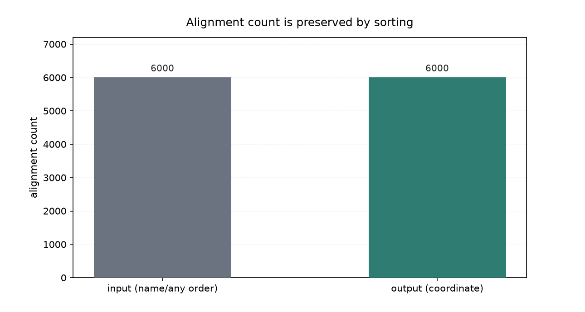
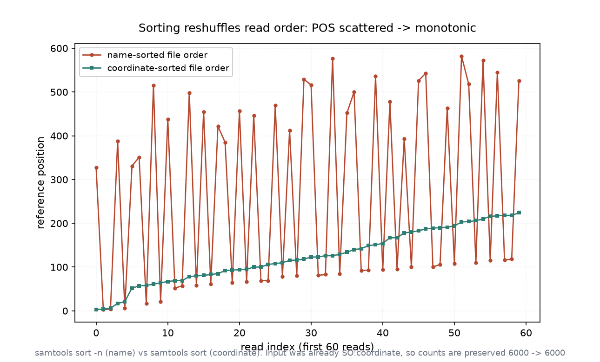

# 比对排序与顺序控制（029 / DEEP DIVE 26）

## 1 功能定位与适用范围

本 skill 覆盖 BAM/SAM/CRAM 的排序操作：`samtools sort` 按坐标（coordinate）或按读段名（queryname）重排文件内记录顺序，并相应更新 header 的 `@HD SO`/`SS` 字段。排序是下游建索引、 markdup、区域查询的前置步骤，多数流程要求 BAM 先按坐标排序。

内容覆盖：

- 坐标排序（默认）：`samtools sort` 不指定 `-n` 时按参考坐标（contig + POS）升序排列，并把 `@HD SO` 写为 `coordinate`。
- 名称排序：`samtools sort -n` 按 QNAME 排序，并把 `@HD SO` 写为 `queryname`、`SS` 写为 `queryname:natural`；这是 `fixmate`、`markdup` 等需要成对相邻的工具的前置条件。
- 排序与 `@HD` 的一致性：排序后 header 的 `SO`/`SS` 必须与实际顺序一致，否则下游工具（如 `samtools index`）会报错或产生错误索引。
- 辅助选项：`sort -t`（按 tag 排序）、`sort -k`（按列键）、`sort -l`/`--merge`（合并多个已排序 BAM）、`sort -M`（按 read 长度做长读段部分排序）、`sort -@`（线程数）、`sort -m`（内存上限）。

适用范围：BAM/SAM/CRAM 的排序与顺序控制、排序模式选择、排序后 header 校验。

不在本 skill 范围内：索引创建（`alignment-indexing`）、过滤（`alignment-filtering`）、统计（`bam-statistics`）、重复标记（`duplicate-handling`）、参考序列操作（`reference-operations`）。

## 2 属性表

| 属性 | 值 |
|---|---|
| 主工具 | samtools 1.22.1（要求 ≥ 1.19） |
| 输入 | 011 真跑产物 `aligned_e2e.bam`（bowtie2 2.5.5 end-to-end，paired-end） |
| 输入规模 | 6000 reads，4 contigs（contig1–4，各 3000 bp），read length 100 bp |
| 输入排序状态 | `@HD VN:1.5 SO:coordinate`（本就坐标排序） |
| 坐标排序产物 | `sorted.bam`：6000 reads，`@HD SO:coordinate` 不变 |
| 名称排序产物 | `namesort.bam`：`@HD SO:queryname SS:queryname:natural` |
| 记录数 | 输入 6000 → sorted 6000 → namesort 6000，无增减 |
| 环境 | WSL2 Ubuntu，samtools 1.22.1 / htslib 1.22.1 |

## 3 成分拆解

### 3.1 排序模式

`samtools sort` 的输出顺序由是否带 `-n` 决定：

- 不带 `-n`：按 `(RNAME, POS, ...)` 升序，结果等价于输入坐标排序；header 写 `SO:coordinate`。
- 带 `-n`：按 QNAME 升序，结果按读段名聚集（同一 read 的双端记录相邻）；header 写 `SO:queryname` 与 `SS:queryname:natural`。

排序不改变任何比对记录的内容，只改变它们在文件中的排列顺序与 header 的排序声明。

### 3.2 `@HD` 字段

`@HD` 是排序声明的唯一权威来源。`SO` 取值 `coordinate` / `queryname` / `unsorted`；`SS` 仅在名称排序时出现，记录次级排序键（本例为 `queryname:natural`）。`samtools index` 要求输入为 `coordinate` 排序，否则报错。

### 3.3 顺序对照

坐标排序下，记录按 POS 升序出现（前几条 POS 为 3、4、6、17、21…）；名称排序下，记录按 QNAME 升序出现（前几条 QNAME 对应的 POS 为 327、3、4、388、6…）。两者第 1 个 POS 不同，说明文件内顺序确实发生了改变。

## 4 严格复现

### 4.1 环境与数据

- 工具：WSL2 Ubuntu，samtools 1.22.1 / htslib 1.22.1。
- 输入：`aligned_e2e.bam`（011 真跑产物，6000 reads，paired-end，坐标排序）。
- 参考基因组：`reference.fa`（与本目录自带，已 `samtools faidx` 建索引）。

### 4.2 坐标排序

输入本就坐标排序，再排序一次验证 `@HD SO` 不变：

```bash
samtools sort -o sorted.bam aligned_e2e.bam
samtools index sorted.bam
samtools view -H aligned_e2e.bam | grep '@HD'   # @HD   VN:1.5 SO:coordinate
samtools view -H sorted.bam      | grep '@HD'   # @HD   VN:1.5 SO:coordinate
```

`SO` 字段保持 `coordinate`，与输入一致（本输入已坐标排序，重排后顺序与顺序标志均不变）。

### 4.3 记录数保持

```bash
samtools view -c aligned_e2e.bam   # 6000
samtools view -c sorted.bam        # 6000
```

坐标排序前后均为 6000 条，排序不增不减记录（图 2）。



### 4.4 名称排序（-n）

```bash
samtools sort -n -o namesort.bam aligned_e2e.bam
samtools view -H namesort.bam | grep '@HD'
# @HD   VN:1.5   SO:queryname     SS:queryname:natural
```

加 `-n` 后 header 变为 `SO:queryname`、`SS:queryname:natural`，文件内记录改为按 QNAME 升序。坐标排序前 5 个 POS 为 `3,4,6,17,21`，名称排序前 5 个 POS 为 `327,3,4,388,6`，顺序明显不同（图 1）。



## 5 实践要点

- 排序前确认下游需求：`samtools index`、`samtools mpileup`、变异检测通常要求 `coordinate` 排序；`fixmate`→`markdup` 流程要求先 `sort -n`。
- 排序会改 `@HD SO`/`SS`，必须与实际顺序一致；用 `samtools view -H | grep '@HD'` 校验。
- 坐标排序重排已坐标排序的 BAM 时，`SO` 与顺序都不变（本输入即此情形），但排序动作本身仍会重写文件。
- 名称排序使同一 read 的双端记录相邻，是 `fixmate -m` 计算 MC/ms tag 的前提。
- 大文件用 `-@`（线程）与 `-m`（内存上限）控制资源；多份已排序 BAM 用 `-l/--merge` 合并而非重新排序。
- 排序不增不减记录数，仅改变排列顺序；记录数异常应先排查输入而非排序步骤。

## 未覆盖（诚实标注）

以下知识点在本次输入或本机环境中未做实测，相关结论按 samtools 标准行为陈述：

- **按 tag 排序（`-t`/`-k`）**：未以真实 tag（如 `RG`、`MC`）做自定义键排序，相关顺序变化未用真实数据演示。
- **合并排序（`-l`/`--merge`）**：未准备多份已排序 BAM 做合并，合并的内存与顺序行为未实测。
- **长读段部分排序（`-M`）**：本次输入为 100 bp 短读段，未演示长读段按长度的部分排序。
- **线程/内存调优（`-@`/`-m`）**：未做不同线程数与内存上限的对照，资源占用未实测。
- **CRAM 排序**：仅对 BAM 排序，未对 CRAM 做排序与 header 一致性验证。

## 6 小结

本 skill 的两类核心排序——坐标排序（默认）与名称排序（`-n`）——在 011 真跑产出的 paired-end BAM（6000 reads，本就 `SO:coordinate`）上执行。坐标重排后 `@HD SO` 仍为 `coordinate`，记录数保持 6000/6000，说明排序不增不减记录，仅重写排列顺序。名称排序（`-n`）把 `@HD` 改为 `SO:queryname SS:queryname:natural`，文件内前 5 个 POS 由 `3,4,6,17,21` 变为 `327,3,4,388,6`，证明顺序确实按 QNAME 重排。

核心结论：排序改变的是文件内记录顺序与 `@HD` 的 `SO`/`SS` 声明，不改变比对内容；坐标排序与名称排序的选择由下游工具决定（建索引要 coordinate，fixmate/markdup 要 queryname）。按 tag 排序、合并排序、长读段部分排序等内容因输入或环境限制未实测，结论按 samtools 标准行为陈述。
