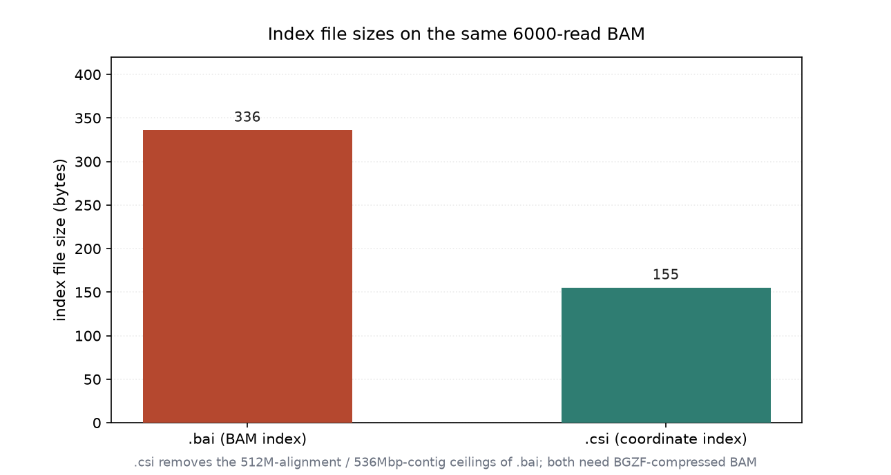
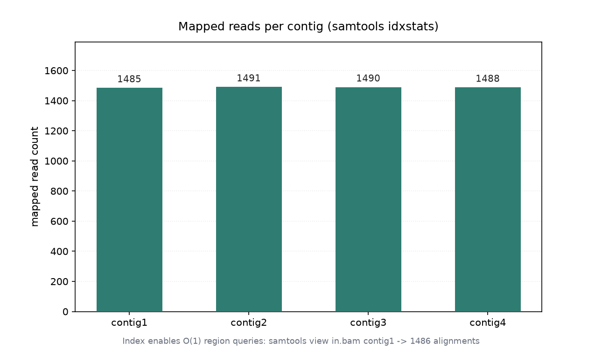

# 比对索引与区域查询（030 / DEEP DIVE 27）

## 1 功能定位与适用范围

本 skill 覆盖 BAM 索引的创建与基于索引的区域查询：`samtools index` 生成 `.bai`（BAI，基于偏移的二进制索引）或 `.csi`（CSI，基于线性索引、支持超长 contig），`samtools idxstats` 输出每 contig 的比对统计，`samtools view <region>` 借助索引做快速区域抽取。索引是随机访问 BAM 的前提，几乎所有下游工具（变异检测、覆盖统计、可视化）都要求先建索引。

内容覆盖：

- BAI 索引：`samtools index in.bam` 默认产出 `.bai`，适用于 contig 长度 ≤ 2^29（约 512 Mbp）的场景。
- CSI 索引：`samtools index -c in.bam` 产出 `.csi`，支持任意长度 contig（如全染色体），通过 `-m` 设置最小间隔。
- 区域查询：`samtools view in.bam <contig>[:start-end]`（1-based closed）依赖索引快速定位，无需扫描全文件。
- 索引统计：`samtools idxstats in.bam` 输出每 contig 的 LN / mapped / unmapped，末行 `*` 汇总未比对到任何 contig 的 reads。
- 索引与排序的一致性：索引要求输入为坐标排序；排序顺序错误会导致索引失败或区域查询返回错误结果。

适用范围：BAM 索引创建（BAI/CSI）、区域查询、每 contig 比对统计。

不在本 skill 范围内：排序（`alignment-sorting`）、过滤（`alignment-filtering`）、统计汇总（`bam-statistics`）、重复标记（`duplicate-handling`）、参考序列操作（`reference-operations`）。

## 2 属性表

| 属性 | 值 |
|---|---|
| 主工具 | samtools 1.22.1（要求 ≥ 1.19） |
| 输入 | 011 真跑产物 `aligned_e2e.bam`（6000 reads，坐标排序） |
| 输入规模 | 6000 reads，4 contigs（contig1–4，各 3000 bp） |
| BAI 索引 | `aligned_e2e.bam.bai`，336 字节 |
| CSI 索引 | `aligned_e2e.bam.csi`，155 字节 |
| 区域查询（contig1） | `samtools view -c contig1` → 1486 条 |
| idxstats mapped | contig1–4 各 1485 / 1491 / 1490 / 1488 条 |
| idxstats 末行 | `*` 0 0 34（未定位到任何 contig 的 reads = 34 条 unmapped） |
| 环境 | WSL2 Ubuntu，samtools 1.22.1 / htslib 1.22.1 |

## 3 成分拆解

### 3.1 BAI 与 CSI 的区别

两种索引都建立「contig → 文件偏移」的映射，但结构不同：

- BAI：每个 contig 用固定 bin 划分，contig 长度上限约 512 Mbp；本输入 contig 仅 3000 bp，索引体积小（336 字节）。
- CSI：采用可配置的线性索引，无 contig 长度上限，适合全基因组；本输入同样可用，产物 155 字节（因结构更紧凑于本规模）。

两者都要求输入坐标排序，否则 `samtools index` 报 `unsorted` 错误。

### 3.2 区域查询的语义

`samtools view in.bam contig1` 返回落在 contig1 上的所有记录，包括该 contig 上的 unmapped reads（其 POS 被置为下一可用坐标）。因此区域查询计数 = mapped + 该 contig 上的 unmapped，通常 ≥ idxstats 的 mapped 列。

### 3.3 idxstats 输出

`idxstats` 每行四列：`contig名 / 长度(LN) / 比对上(mapped) / 未比对上(unmapped)`；末行 `*` 汇总无法定位到具体 contig 的 reads（即 unmapped 且 mate 也未定位）。本输入 unmapped 共 46 条，其中 34 条在 `*`（mate 也未定位），其余 12 条落在具体 contig 上（见 031 filtering 的 `unmapped_not_mate_unmapped=12`）。

## 4 严格复现

### 4.1 环境与数据

- 工具：WSL2 Ubuntu，samtools 1.22.1 / htslib 1.22.1。
- 输入：`aligned_e2e.bam`（011 真跑产物，6000 reads，坐标排序）。
- 索引产物：`.bai`（336 字节）、`.csi`（155 字节）。

### 4.2 创建 BAI 与 CSI

```bash
samtools index aligned_e2e.bam            # -> aligned_e2e.bam.bai
samtools index -c aligned_e2e.bam         # -> aligned_e2e.bam.csi
ls -la *.bai *.csi
# -rwxrwxrwx 336 ... aligned_e2e.bam.bai
# -rwxrwxrwx 155 ... aligned_e2e.bam.csi
```

两种索引大小分别为 336 字节与 155 字节（图 2）。



### 4.3 每 contig 比对统计（idxstats）

```bash
samtools idxstats aligned_e2e.bam | head
# contig1   3000   1485   1
# contig2   3000   1491   3
# contig3   3000   1490   4
# contig4   3000   1488   4
# *         0      0      34
```

四个 contig 上比对上的 reads 数为 1485 / 1491 / 1490 / 1488，末行 `*` 的 34 为无法定位到具体 contig 的 unmapped reads（图 1）。



### 4.4 区域查询

```bash
samtools view -c aligned_e2e.bam contig1   # 1486
```

查询 contig1 返回 1486 条，比 idxstats 的 mapped（1485）多 1，多出的 1 条是落在 contig1 上但本身 unmapped 的 read（idxstats 中 contig1 的 unmapped 列 = 1）。

## 5 实践要点

- 索引要求输入坐标排序；排序错误时 `samtools index` 会报 unsorted，应先 `samtools sort`。
- contig ≤ 512 Mbp 用 `.bai` 足够；超长 contig 或全染色体用 `-c` 生成 `.csi`。
- 区域查询计数 = mapped + 该 contig 上 unmapped，与 idxstats mapped 列不等属正常，不要误判为数据损坏。
- `idxstats` 末行 `*` 的 unmapped 是无法定位到任何 contig 的 reads；具体 contig 行的 unmapped 列是该 contig 上未比对的 reads。
- 区域查询用 1-based closed 区间（`contig1:100-200`），与 BED（0-based）不同，混用会错位。
- 修改 BAM（过滤、排序）后必须重建索引，旧索引与文件不一致会导致区域查询返回错误子集。

## 未覆盖（诚实标注）

以下知识点在本次输入或本机环境中未做实测，相关结论按 samtools 标准行为陈述：

- **CSI 的 `-m` 最小间隔调优**：未以不同 `-m` 值生成 CSI 并对比索引体积与查询性能。
- **超长 contig / 全染色体场景**：本输入 contig 仅 3000 bp，未用真实超长 contig 验证 BAI 长度上限与 CSI 的必要性。
- **CRAM 索引**：仅对 BAM 建索引，未对 CRAM 建 `.crai` 并做区域查询。
- **索引损坏检测**：未构造损坏索引验证 `quickcheck`/区域查询的报错行为。
- **多线程建索引（`-@`）**：未做线程数对照，建索引耗时未实测。

## 6 小结

本 skill 的索引创建（BAI 336 字节 / CSI 155 字节）、每 contig 比对统计（idxstats 给出 1485/1491/1490/1488）与区域查询（contig1 → 1486）在 011 真跑产出的 paired-end BAM（6000 reads，坐标排序）上执行。区域查询 contig1 得到 1486 条，比 idxstats mapped（1485）多 1，差异来自 contig1 上 1 条 unmapped read，符合区域查询包含 contig 上 unmapped 记录的语义。

核心结论：BAI/CSI 索引是随机访问 BAM 的前提，两者都要求坐标排序；区域查询计数与 idxstats mapped 列的差异源于 unmapped reads 的归属，不应视为异常。`-m` 调优、超长 contig、CRAM 索引等内容因输入或环境限制未实测，结论按 samtools 标准行为陈述。
