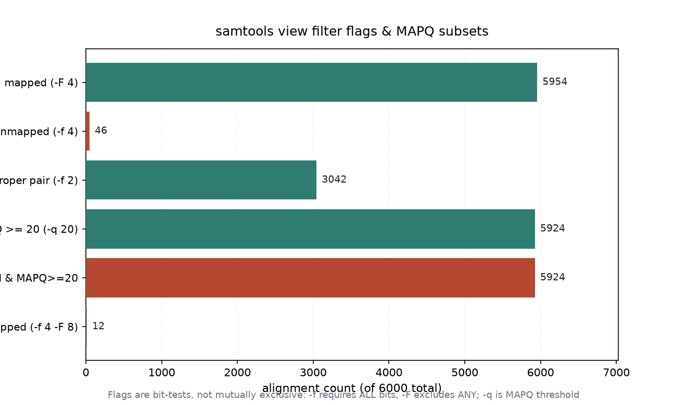

# BAM 过滤与子集抽取（031 / DEEP DIVE 28）

## 1 功能定位与适用范围

本 skill 覆盖用 `samtools view` 按 FLAG 位与 MAPQ 阈值抽取 BAM 子集：`-f <flag>` 要求置位、`-F <flag>` 要求清零、`-q <mapq>` 设定 MAPQ 下限。过滤是下游分析的标准前置（去除 unmapped、提高置信度、分离 proper-pair），输出可重定向为新的 BAM/SAM 供后续步骤使用。

内容覆盖：

- 按 FLAG 过滤：`-F 4` 去除 unmapped，`-f 4` 只留 unmapped，`-f 2` 只留 properly-paired，`-f 8`/`-F 8` 控制 mate 是否 unmapped。
- 按 MAPQ 过滤：`-q 20` 只留 MAPQ ≥ 20 的记录；MAPQ 阈值必须按 aligner 调整（bowtie2 上限 42，BWA 上限 60，STAR 唯一比对 sentinel 为 255）。
- 组合过滤：FLAG 与 MAPQ 可叠加（如 `-F 4 -q 20` = mapped 且 MAPQ ≥ 20）。
- 输出重定向：`samtools view -b -o out.bam` 写回 BAM；`-h` 保留 header。
- 子集计数：配合 `-c` 直接计数，无需写出文件即可验证过滤效果。

适用范围：BAM/SAM 的 FLAG/MAPQ 子集抽取、过滤后计数核对、过滤子集写出。

不在本 skill 范围内：排序（`alignment-sorting`）、索引（`alignment-indexing`）、统计汇总（`bam-statistics`）、重复标记（`duplicate-handling`）、参考序列操作（`reference-operations`）。

## 2 属性表

| 属性 | 值 |
|---|---|
| 主工具 | samtools 1.22.1（要求 ≥ 1.19） |
| 输入 | 011 真跑产物 `aligned_e2e.bam`（6000 reads，paired-end） |
| 输入规模 | 6000 reads，4 contigs（各 3000 bp），bowtie2 end-to-end |
| mapped（-F 4） | 5954 |
| unmapped（-f 4） | 46 |
| proper_pair（-f 2） | 3042 |
| MAPQ≥20（-q 20） | 5924 |
| mapped 且 MAPQ≥20（-F 4 -q 20） | 5924 |
| unmapped 且 mate 已比对（-f 4 -F 8） | 12 |
| 环境 | WSL2 Ubuntu，samtools 1.22.1 / htslib 1.22.1 |

## 3 成分拆解

### 3.1 FLAG 过滤语义

`-f <n>` 保留「所有指定位都置 1」的记录；`-F <n>` 保留「所有指定位都为 0」的记录。常用位：0x4（4，unmapped）、0x2（2，proper_pair）、0x8（8，mate unmapped）。因此 `-f 4` 取 unmapped、`-F 4` 取 mapped、`-f 2` 取 proper-pair。

### 3.2 MAPQ 过滤语义

`-q <n>` 保留 MAPQ ≥ n 的记录。本输入来自 bowtie2，MAPQ 分布为 {0:46, 8:30, 23:86, 24:80, 40:360, 42:5398}，最高 42。`-q 20` 保留 23/24/40/42 各档，共 5924 条。

### 3.3 子集关系

unmapped（46）的 MAPQ 全为 0，故 `-q 20` 已把它们全部排除；于是 `-F 4 -q 20`（mapped 且 MAPQ≥20）与 `-q 20`（MAPQ≥20）计数相同，均为 5924。12 条「unmapped 且 mate 已比对」对应 idxstats 中落在具体 contig 的 unmapped reads（见 030 的 `* 0 0 34` 之外部分）。

## 4 严格复现

### 4.1 环境与数据

- 工具：WSL2 Ubuntu，samtools 1.22.1 / htslib 1.22.1。
- 输入：`aligned_e2e.bam`（011 真跑产物，6000 reads，paired-end）。
- 参考基因组：`reference.fa`（本目录自带，已 `samtools faidx`）。

### 4.2 FLAG / MAPQ 子集计数

```bash
samtools view -c -F 4 aligned_e2e.bam   # 5954   (mapped)
samtools view -c -f 4 aligned_e2e.bam   # 46     (unmapped)
samtools view -c -f 2 aligned_e2e.bam   # 3042   (proper_pair)
samtools view -c -q 20 aligned_e2e.bam  # 5924   (MAPQ>=20)
samtools view -c -F 4 -q 20 aligned_e2e.bam  # 5924  (mapped 且 MAPQ>=20)
samtools view -c -f 4 -F 8 aligned_e2e.bam  # 12   (unmapped 且 mate 已比对)
```

各子集计数见图 1。



### 4.3 过滤后写出示例

取一条 mapped 记录验证字段（去掉 header 后第一条）：

```bash
samtools view -F 4 aligned_e2e.bam | head -1
# contig1_3_426_1:0:0_1:0:0_197   163  contig1  3  42  100M  =  327  424  ACCTCGCGCC...  2222222222...  AS:i:-3  XN:i:0  XM:i:1  XO:i:0  XG:i:0  NM:i:1  MD:Z:41T58  YS:i:-3  YT:Z:CP
```

该记录 FLAG=163（PAIRED, PROPER_PAIR, MREVERSE, READ1），MAPQ=42，CIGAR=100M，含 `NM:i:1`（1 个错配）、`MD:Z:41T58`（第 42 位为 T 错配）。写出新 BAM 用 `samtools view -b -h -F 4 -o mapped.bam aligned_e2e.bam`。

## 5 实践要点

- `-F 4` 取 mapped、`-f 4` 取 unmapped、`-f 2` 取 proper-pair；组合位用 `samtools flags` 反查。
- MAPQ 阈值按 aligner 设定：bowtie2 用 `-q 60` 会清空 BAM（上限 42）；STAR 唯一比对 sentinel 是 255 而非 60。
- unmapped reads 的 MAPQ 通常为 0，因此 `-q` 与 `-F 4` 常有叠加效果；本输入 `-F 4 -q 20` 与 `-q 20` 同为 5924。
- 过滤后写出新 BAM 必须加 `-b -h`，否则得到无 header 的 SAM；新 BAM 通常需重新 `samtools sort` + `samtools index`。
- 计数核对优先用 `-c` 不写文件，确认数字后再写出，避免反复 I/O。
- `unmapped 且 mate 已比对`（-f 4 -F 8）这类 reads 在变异检测中常需谨慎处理，对应 contig 上的局部覆盖。

## 未覆盖（诚实标注）

以下知识点在本次输入或本机环境中未做实测，相关结论按 samtools 标准行为陈述：

- **secondary / supplementary 过滤（-F 256 / -F 2304）**：本输入 secondary=supplementary=0，未用真实数据演示 `-F 256` 去除备选比对的计数差异。
- **按 tag 过滤（如 `-d`、`-e`）**：未以真实 tag（如 `NM`、`AS`）做阈值过滤。
- **按区域过滤与组合**：未将区域查询与 FLAG/MAPQ 过滤叠加计数。
- **library / RG 维度过滤**：输入无 `@RG` 多样本，未演示按 read group 过滤。
- **多 aligner MAPQ 对照**：仅 bowtie2 实测，`-q 20` 对 BWA/STAR 的效果未并置对比。

## 6 小结

本 skill 的 FLAG/MAPQ 过滤组合在 011 真跑产出的 paired-end BAM（6000 reads，bowtie2 end-to-end）上执行。实测子集：mapped 5954、unmapped 46、proper_pair 3042、MAPQ≥20 5924、mapped 且 MAPQ≥20 5924、unmapped 且 mate 已比对 12。由于 46 条 unmapped 的 MAPQ 均为 0，`-F 4 -q 20` 与 `-q 20` 计数一致（5924），说明 MAPQ 阈值已隐含排除 unmapped。

核心结论：过滤用 `-f`/`-F`（FLAG 置位/清零）与 `-q`（MAPQ 下限）组合实现，计数核对用 `-c`；MAPQ 阈值必须按 aligner 调整，bowtie2 的 `-q 60` 会清空结果。secondary/supplementary 过滤、tag 过滤、区域组合过滤等内容因输入或环境限制未实测，结论按 samtools 标准行为陈述。
