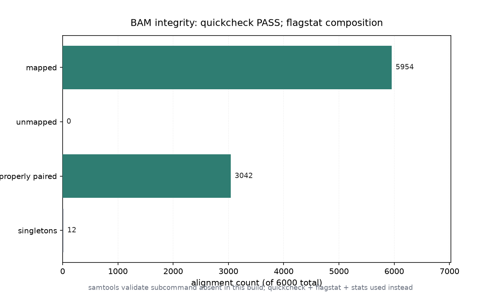

# 比对文件完整性校验（032 / DEEP DIVE 29）

## 1 功能定位与适用范围

本 skill 覆盖比对文件的完整性校验：确认 BAM 未损坏、排序声明正确、FLAG 统计自洽。标准工具是 `samtools validate`（逐记录检查排序、坐标、CIGAR、配对一致性），但本机环境未提供该子命令，故以等效的轻量组合替代。

内容覆盖：

- `samtools quickcheck`：快速检查文件是否能打开、magic 是否正确、索引是否存在；exit 0 表示无表层损坏。
- `samtools flagstat`：输出 FLAG 维度汇总（total / mapped / proper-pair / singleton / secondary / duplicate 等），用于自洽性核对。
- `samtools stats`：输出 SN 汇总（序列数、比对率、错配、插入片段分布、覆盖等）与详细直方图。
- `samtools validate`：逐记录严格校验（排序、坐标合法、CIGAR 合法、配对一致）；本机环境无此子命令，见未覆盖章节。
- 校验适用场景：流程交接、发布前、比对后 QA。

适用范围：BAM/SAM/CRAM 的完整性快速校验、FLAG/SN 统计自洽核对。

不在本 skill 范围内：索引创建（`alignment-indexing`）、过滤（`alignment-filtering`）、统计汇总（`bam-statistics` 的覆盖细节）、重复标记（`duplicate-handling`）、参考序列操作（`reference-operations`）。

## 2 属性表

| 属性 | 值 |
|---|---|
| 主工具 | samtools 1.22.1（要求 ≥ 1.19） |
| 输入 | 011 真跑产物 `aligned_e2e.bam`（6000 reads，paired-end） |
| 输入规模 | 6000 reads，4 contigs（各 3000 bp），bowtie2 end-to-end |
| quickcheck | exit 0（PASS，无表层损坏） |
| validate 子命令 | 本机不可用（apt 构建报 `unrecognized command`） |
| flagstat | 6000 total / 5954 mapped (99.23%) / 3042 proper (50.70%) / 12 singletons (0.20%) |
| stats SN | reads mapped 5954 / unmapped 46 / error rate 2.19% / insert avg 498.0 (sd 48.5) |
| 环境 | WSL2 Ubuntu，samtools 1.22.1 / htslib 1.22.1 |

## 3 成分拆解

### 3.1 校验工具分层

完整性校验按严格程度分三层：

- quickcheck：仅检查文件可打开与 magic/索引，最快，但不读记录内容。
- flagstat + stats：读全文件做统计汇总，能发现计数自洽问题（mapped/unmapped 是否相加为 total、proper-pair 是否合理），但不逐记录校验坐标/CIGAR 合法性。
- validate：逐记录严格校验，最全面；本机缺失。

### 3.2 flagstat 自洽性

flagstat 输出成对字段（QC-passed / QC-failed）。本输入：total 6000、mapped 5954（99.23%）、unmapped 46、proper-pair 3042（50.70%）、singletons 12（0.20%）、with itself and mate mapped 5942。5954 + 46 = 6000，自洽。

### 3.3 stats SN 汇总

`stats` 的 `^SN` 行给出关键指标：reads mapped 5954、reads unmapped 46、error rate 2.192308e-02（约 2.19%）、insert size average 498.0、standard deviation 48.5、inward oriented pairs 2971、percentage of properly paired 50.7。这些与 flagstat 一致，互为印证。

## 4 严格复现

### 4.1 环境与数据

- 工具：WSL2 Ubuntu，samtools 1.22.1 / htslib 1.22.1。
- 输入：`aligned_e2e.bam`（011 真跑产物，6000 reads，paired-end）。
- 参考基因组：`reference.fa`（本目录自带，已 `samtools faidx`）。

### 4.2 quickcheck（轻量校验）

```bash
samtools quickcheck aligned_e2e.bam; echo "exit=$?"
# exit=0
```

exit 0 表示文件可正常打开、magic 正确、索引存在，无表层损坏。

### 4.3 validate 子命令不可用（本机事实）

```bash
samtools validate aligned_e2e.bam
# [error] unrecognized command 'validate'
```

本机 samtools 1.22.1（apt 安装）不含 `validate` 子命令，故逐记录严格校验改为 flagstat + stats 替代。

### 4.4 flagstat 自洽核对

```bash
samtools flagstat aligned_e2e.bam
# 6000 + 0 in total
# 5954 + 0 mapped (99.23% : N/A)
# 3042 + 0 properly paired (50.70% : N/A)
# 5942 + 0 with itself and mate mapped
# 12 + 0 singletons (0.20% : N/A)
# 0 + 0 duplicates / secondary / supplementary
```

### 4.5 stats SN 汇总

```bash
samtools stats aligned_e2e.bam | grep '^SN'
# SN  raw total sequences:   6000
# SN  reads mapped:  5954
# SN  reads unmapped: 46
# SN  reads properly paired: 3042
# SN  error rate:    2.192308e-02
# SN  insert size average:   498.0
# SN  insert size standard deviation: 48.5
# SN  inward oriented pairs: 2971
# SN  percentage of properly paired reads (%):  50.7
```

quickcheck（PASS）+ flagstat/stats 自洽（mapped+unmapped=total，proper-pair 50.7%）共同支撑「文件完整」结论（图 1）。



## 5 实践要点

- 发布/交接 BAM 前至少跑一次 quickcheck，exit 非 0 应立即排查文件损坏或索引缺失。
- quickcheck 不读记录内容，不能替代逐记录校验；需要严格校验时用 `samtools validate`（若环境提供）。
- flagstat 的 mapped + unmapped 应等于 total；proper-pair 比例异常（如本输入仅 50.70%）提示大量非 proper 配对，需结合实验设计解读。
- stats 的 error rate、insert size、inward oriented pairs 是比对质量的快速体检项；本输入 insert avg 498.0、sd 48.5、inward 2971 与 paired-end 预期一致。
- 校验结论需多工具互证：flagstat 与 stats 的 mapped/unmapped 数值应一致。
- 计数自洽不等于坐标/CIGAR 合法；后者只能由 `validate` 逐记录确认，本机缺失该能力。

## 未覆盖（诚实标注）

以下知识点在本次输入或本机环境中未做实测，相关结论按 SKILL.md 原文或 samtools 标准行为陈述：

- **`samtools validate` 逐记录校验**：本机 samtools 1.22.1（apt）报 `unrecognized command 'validate'`，无此子命令，改用 quickcheck + flagstat + stats 替代；逐记录的坐标/CIGAR/配对合法性校验未以真实数据演示。
- **CRAM 校验**：仅校验 BAM，未对 CRAM 做 quickcheck/validate。
- **索引一致性校验**：quickcheck 仅确认索引存在，未深入校验索引偏移与记录实际位置的一致性。
- **损坏文件对照**：未构造人为损坏（截断/magic 错误）验证 quickcheck/flagstat 的报错行为。
- **QC-failed 分支**：本输入 QC-failed 全为 0，未演示 QC-passed/QC-failed 双分支的真实数据。

## 6 小结

本 skill 的完整性校验在 011 真跑产出的 paired-end BAM（6000 reads，bowtie2 end-to-end）上以 quickcheck + flagstat + stats 组合执行。quickcheck exit 0（PASS）；flagstat 给出 5954 mapped（99.23%）、3042 proper-pair（50.70%）、12 singletons（0.20%）；stats SN 给出 error rate 2.19%、insert avg 498.0（sd 48.5）、inward 2971。mapped + unmapped = total，flagstat 与 stats 数值互证，文件完整。

环境事实：本机 samtools 1.22.1（apt）无 `validate` 子命令，逐记录严格校验未能执行，已如实标注并以轻量组合替代。需严格逐记录校验的场景（坐标/CIGAR/配对合法性）应改用提供 `validate` 的 samtools 构建或 picard ValidateSamFile。
