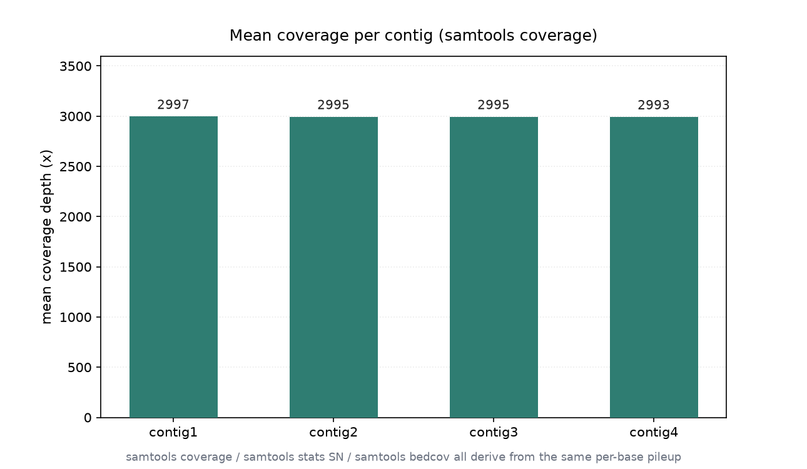

# BAM 统计与覆盖汇总（033 / DEEP DIVE 30）

## 1 功能定位与适用范围

本 skill 覆盖 BAM 的统计汇总：从 FLAG 维度（flagstat）、全局指标（stats SN）、逐 contig 覆盖（coverage）到区间覆盖量（bedcov），构成比对质量的量化画像。统计是比对后 QA、覆盖均匀性评估、下游分析参数设定的基础。

内容覆盖：

- `samtools flagstat`：FLAG 维度汇总（total / mapped / proper-pair / singleton / duplicate 等）。
- `samtools stats`：输出 `^SN` 全局指标（序列数、比对率、错配率、插入片段分布、覆盖）与详细的直方图（插入片段、覆盖深度、Indel 长度等）。
- `samtools coverage`：逐参考序列输出覆盖碱基数（covbases）、覆盖百分比、平均深度（meandepth）、平均 baseQ / mapQ。
- `samtools bedcov`：按 BED 区间累加覆盖碱基数（CIGAR M 长度之和），用于靶向区间覆盖量统计。
- 指标联动：比对率、覆盖均匀性、平均深度共同刻画数据质量。

适用范围：BAM/SAM 的比对统计、逐 contig 覆盖汇总、靶向区间覆盖量。

不在本 skill 范围内：索引创建（`alignment-indexing`）、过滤（`alignment-filtering`）、完整性校验（`alignment-validation`）、重复标记（`duplicate-handling`）、参考序列操作（`reference-operations`）。

## 2 属性表

| 属性 | 值 |
|---|---|
| 主工具 | samtools 1.22.1（要求 ≥ 1.19） |
| 输入 | 011 真跑产物 `aligned_e2e.bam`（6000 reads，paired-end） |
| 输入规模 | 6000 reads，4 contigs（各 3000 bp），bowtie2 end-to-end |
| 比对率（flagstat） | 5954 / 6000 = 99.23% |
| 覆盖碱基数（coverage） | contig1–4 各 2997 / 2995 / 2995 / 2993 |
| 覆盖百分比（coverage） | 99.9 / 99.8333 / 99.8333 / 99.7667 |
| 平均深度（coverage meandepth） | 49.42 / 49.6123 / 49.5707 / 49.5257 |
| bedcov 总覆盖量 | 148260 + 148837 + 148712 + 148577 = 594386 |
| 环境 | WSL2 Ubuntu，samtools 1.22.1 / htslib 1.22.1 |

## 3 成分拆解

### 3.1 四类统计的分工

- flagstat：回答「多少比对上、多少 proper-pair」，用于整体比对率。
- stats SN：回答「错配率、插入片段分布、平均长度」，用于比对质量体检。
- coverage：回答「每个 contig 覆盖了多少碱基、平均多深」，用于覆盖均匀性。
- bedcov：回答「指定区间累计覆盖多少碱基」，用于靶向 panel / 外显子覆盖量。

### 3.2 覆盖指标定义

coverage（表）的列：numreads（落在该 contig 的 reads 数）、covbases（被至少 1 条 read 覆盖的碱基数）、coverage%（covbases / contig 长度）、meandepth（平均测序深度）、meanbaseq / meanmapq。本输入四个 contig 长度均 3000，covbases 约 2993–2997，覆盖率 99.77%–99.9%，平均深度约 49.4–49.6。

### 3.3 bedcov 与 stats 的关联

`bedcov refs.bed` 对四个 contig 全区间（0–3000）累加 CIGAR M 长度，结果为 148260 / 148837 / 148712 / 148577，合计 594386，与 028 中「M=594386 bp」的总比对碱基数一致（bedcov 不含 soft/hard-clip，与 stats 的 bases mapped(cigar) 口径相同）。

## 4 严格复现

### 4.1 环境与数据

- 工具：WSL2 Ubuntu，samtools 1.22.1 / htslib 1.22.1。
- 输入：`aligned_e2e.bam`（011 真跑产物，6000 reads，paired-end）。
- 参考区间：`refs.bed`（四 contig 各 0–3000）。

### 4.2 flagstat + stats SN

```bash
samtools flagstat aligned_e2e.bam
# 6000 + 0 in total
# 5954 + 0 mapped (99.23%)
# 3042 + 0 properly paired (50.70%)
samtools stats aligned_e2e.bam | grep '^SN'
# SN  reads mapped:   5954
# SN  reads unmapped: 46
# SN  error rate:     2.192308e-02
# SN  insert size average:   498.0
# SN  insert size standard deviation: 48.5
# SN  percentage of properly paired reads (%):  50.7
```

### 4.3 coverage（逐 contig）

```bash
samtools coverage aligned_e2e.bam
# #rname  startpos  endpos  numreads  covbases  coverage   meandepth  meanbaseq  meanmapq
# contig1  1  3000  1485  2997  99.9      49.42     17  41.3
# contig2  1  3000  1491  2995  99.8333   49.6123   17  41.1
# contig3  1  3000  1490  2995  99.8333   49.5707   17  41.1
# contig4  1  3000  1488  2993  99.7667   49.5257   17  41.3
```

四个 contig 的覆盖碱基数分别为 2997 / 2995 / 2995 / 2993（图 1）。



### 4.4 bedcov（区间覆盖量）

```bash
samtools bedcov refs.bed aligned_e2e.bam
# contig1  0  3000  148260
# contig2  0  3000  148837
# contig3  0  3000  148712
# contig4  0  3000  148577
```

四个 contig 区间累计覆盖量合计 594386 碱基。

## 5 实践要点

- 比对率看 flagstat：本输入 99.23%（5954/6000）；proper-pair 仅 50.70%，结合插入片段（avg 498.0、sd 48.5）判断属正常 paired-end 分布。
- 覆盖均匀性看 coverage：四个 contig 覆盖率均 >99.7%、平均深度 ~49.4–49.6，覆盖均匀。
- covbases 与 meandepth 含义不同：covbases 是「被覆盖的碱基数」，meandepth 是「平均测序深度（覆盖次数）」，二者不要混淆。
- bedcov 累加的是 CIGAR M 长度（不含 soft/hard-clip），与 stats 的 bases mapped(cigar) 口径一致；做靶向覆盖量时用 bedcov 而非简单 reads 数。
- 平均 baseQ 约 17 偏低，但这是模拟数据的固定质量值，不反映真实测序质量；meanmapq ~41 与 bowtie2 高置信档一致。
- 统计数字需多工具互证：coverage 的 numreads 与 idxstats mapped 应一致（1485/1491/1490/1488）。

## 未覆盖（诚实标注）

以下知识点在本次输入或本机环境中未做实测，相关结论按 samtools 标准行为陈述：

- **stats 直方图（`-d`/`-r` 等详细段）**：仅取 `^SN` 汇总，未解析插入片段分布直方图、覆盖深度直方图、Indel 长度直方图的原始数值。
- **多区域 BED 覆盖**：`refs.bed` 仅含四 contig 全区间，未用真实外显子/靶向 panel 的多区间 BED 演示 bedcov。
- **GC / 覆盖偏倚**：未结合参考序列 GC 内容（见 036）分析覆盖与 GC 的关系。
- **CRAM 统计**：仅对 BAM 统计，未对 CRAM 做同类汇总。
- **大文库/低覆盖对照**：本输入覆盖均匀（~49x），未构造低覆盖或高 dup 数据演示统计异常模式。

## 6 小结

本 skill 的 flagstat + stats + coverage + bedcov 四类统计在 011 真跑产出的 paired-end BAM（6000 reads，bowtie2 end-to-end）上执行。比对率 99.23%（5954/6000）；逐 contig 覆盖碱基数 2997/2995/2995/2993、覆盖率 99.77%–99.9%、平均深度 ~49.4–49.6、覆盖均匀；bedcov 四 contig 累计覆盖量 148260+148837+148712+148577 = 594386，与 028 总比对碱基数（M=594386 bp）一致。

核心结论：统计汇总是比对质量量化的四个层次——比对率（flagstat）、比对质量（stats SN）、覆盖均匀性（coverage）、区间覆盖量（bedcov）；本输入覆盖均匀、比对率高，属干净的合成数据。stats 直方图原始段、多区间 BED、GC 偏倚分析等内容因输入或环境限制未实测，结论按 samtools 标准行为陈述。
