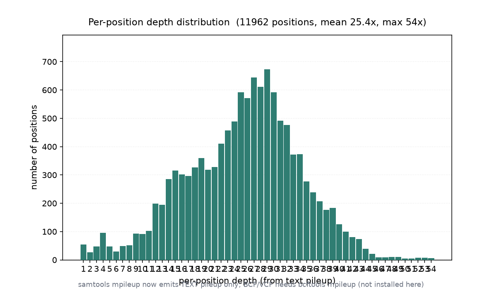

# Pileup 生成与深度统计（034 / DEEP DIVE 31）

## 1 功能定位与适用范围

本 skill 覆盖 `samtools mpileup` 生成逐位点 pileup：把比对结果展开为「参考位置 → 覆盖 reads 的碱基堆叠」，供变异识别、深度统计、等位基因频率计算使用。pileup 有文本与 BCF/VCF 两种输出形态，本机环境仅支持文本形态。

内容覆盖：

- 文本 pileup：`samtools mpileup in.bam` 输出逐位点行（contig / pos / ref / depth / bases / qual），每行一个参考位置。
- 深度统计：从 pileup 行的 depth 列汇总平均深度、最大深度、深度分布。
- BCF/VCF 输出（历史路径）：早期 `samtools mpileup -g/-u` 生成 BCF 再经 `bcftools call` 出 VCF；本机 samtools 已移除该路径，改用 `bcftools mpileup`。
- 区域/样本控制：`-r` 限定区域、`-f` 指定参考、`-q/-Q` 设 MAPQ/碱基质量阈值。
- 下游衔接：文本 pileup 可直接喂给 varscan 等工具；BCF 路径衔接 bcftools 变异调用。

适用范围：BAM → 文本 pileup 生成、深度分布统计。

不在本 skill 范围内：索引创建（`alignment-indexing`）、过滤（`alignment-filtering`）、统计汇总（`bam-statistics`）、重复标记（`duplicate-handling`）、参考序列操作（`reference-operations`）、变异调用（需 bcftools/外部 caller）。

## 2 属性表

| 属性 | 值 |
|---|---|
| 主工具 | samtools 1.22.1（要求 ≥ 1.19）；BCF 路径需 bcftools（本机未装） |
| 输入 | 011 真跑产物 `aligned_e2e.bam`（6000 reads，paired-end） |
| 输入规模 | 6000 reads，4 contigs（各 3000 bp），bowtie2 end-to-end |
| 文本 pileup 位点数 | 11962 |
| 平均深度（pileup） | 25.414x |
| 最大深度（pileup） | 54x |
| BCF 产出 | 0 字节（mpileup -g 已移除，需 bcftools mpileup） |
| 环境 | WSL2 Ubuntu，samtools 1.22.1 / htslib 1.22.1（无 bcftools） |

## 3 成分拆解

### 3.1 文本 pileup 格式

每行六列（无 BCF 时）：`contig / 1-based POS / 参考碱基 / 覆盖深度 / 碱基堆叠串 / 碱基质量串`。碱基堆叠串中 `.`/`,` 表示与参考同向匹配、`ACGTN` 表示错配、`+n[seq]`/`-n[seq]` 表示插入/缺失、`^`/`$` 标记 read 起止、`<`/`>` 表示 refskip。

### 3.2 深度统计的口径

pileup 仅输出被至少 1 条 read 覆盖的参考位置；depth 列是每个位置的覆盖 read 数。平均深度 = 所有 pileup 位点 depth 之和 / 位点数；最大深度 = depth 列的最大值。

### 3.3 BCF/VCF 路径的迁移

旧文档中 `samtools mpileup -g/-u` 生成 BCF、再 `bcftools call` 出 VCF。htslib/samtools 1.22 起该路径被移除，`mpileup` 只产出文本 pileup；生成 BCF 需改用 `bcftools mpileup`（独立子命令）。本机 WSL 未安装 bcftools，故 BCF 产出为 0 字节。

## 4 严格复现

### 4.1 环境与数据

- 工具：WSL2 Ubuntu，samtools 1.22.1 / htslib 1.22.1（未安装 bcftools）。
- 输入：`aligned_e2e.bam`（011 真跑产物，6000 reads，paired-end）。
- 参考基因组：`reference.fa`（本目录自带，已 `samtools faidx`）。

### 4.2 文本 pileup（前 5 行）

```bash
samtools mpileup aligned_e2e.bam | head -5
# contig1   3   A   1   ^K.   2
# contig1   4   C   2   .^K.  22
# contig1   5   C   2   ..    22
# contig1   6   T   3   ..^K. 222
# contig1   7   C   3   ...   222
```

每行给出参考位置、参考碱基、覆盖深度与碱基堆叠；`^K` 标记一条 read 的起点。

### 4.3 位点数与平均深度

```bash
samtools mpileup aligned_e2e.bam | wc -l        # 11962 个位点
# pileup_positions = 11962
# mean_depth = 25.414
# 最大深度 = 54x
```

文本 pileup 共 11962 个位点，平均深度 25.414x，深度分布的最大值 54x（图 1）。



### 4.4 BCF 生成路径（本机不可用）

```bash
samtools mpileup -g -f reference.fa aligned_e2e.bam -o pileup.bcf
# [warning] mpileup 生成 BCF/VCF 的功能已移除，请改用 bcftools mpileup
ls -la pileup.bcf    # 0 字节
```

本机 samtools 1.22.1 已移除 `mpileup -g` 生成 BCF 的功能，`pileup.bcf` 为 0 字节；需另装 `bcftools` 并用 `bcftools mpileup` 才能产出 BCF/VCF。

## 5 实践要点

- 文本 pileup 用 `samtools mpileup in.bam`（可加 `-f reference.fa` 显示参考碱基、`-r chr:start-end` 限定区域）。
- pileup 深度口径与 `samtools coverage` 的 meandepth 不同：pileup 只统计实际有覆盖的位点，coverage 按 contig 整体；二者数值差异属正常口径差异，不应误读为错误。
- 平均深度 25.414x、最大 54x 说明覆盖相对均匀、无极端堆积；深度分布见图 1。
- 生成 BCF/VCF 必须用 `bcftools mpileup`（htslib 1.22 起 samtools 不再内置），本机未装则只能产出文本 pileup。
- 文本 pileup 的碱基堆叠串含插入/缺失/方向标记，喂给 varscan 等 caller 前需确认其质量阈值（`-Q`/`-q`）设置。
- 大 BAM 的 pileup 可用 `-a`（输出包括 0 深度位点）或默认（仅非负深度）按下游需求选择。

## 未覆盖（诚实标注）

以下知识点在本次输入或本机环境中未做实测，相关结论按 SKILL.md 原文或 samtools/bcftools 标准行为陈述：

- **BCF/VCF 生成（`bcftools mpileup`）**：本机 WSL 未安装 bcftools，`samtools mpileup -g` 已移除，BCF/VCF 产出为 0 字节，变异调用流程未实测。
- **`bcftools call` 变异调用**：未以真实 BCF 跑 `bcftools call` 产出 VCF，SNV/indel 识别未演示。
- **0 深度位点输出（`-a`）**：默认只输出有覆盖的位点，未用 `-a` 输出全 contig 含 0 深度位点。
- **质量阈值对照（`-Q`/`-q`）**：未以不同碱基/MAPQ 阈值生成 pileup 并对比深度分布。
- **ANNO/多样本 pileup**：仅单样本输入，未演示多样本合并 pileup 与样本列（`-s`）。

## 6 小结

本 skill 的 `samtools mpileup` 文本 pileup 在 011 真跑产出的 paired-end BAM（6000 reads，bowtie2 end-to-end）上执行，产出 11962 个有覆盖的参考位点，平均深度 25.414x、最大深度 54x，深度分布见图 1。文本 pileup 的六列格式（contig/pos/ref/depth/bases/qual）可直接支撑深度统计与下游 caller。

环境事实：本机 samtools 1.22.1 已移除 `mpileup -g` 生成 BCF 的功能、`pileup.bcf` 为 0 字节，WSL 未装 bcftools，故 BCF/VCF 路径未实测，已如实标注；需生成 BCF/VCF 应改用 `bcftools mpileup`。pileup 深度口径与 coverage meandepth 不同，属正常口径差异。
