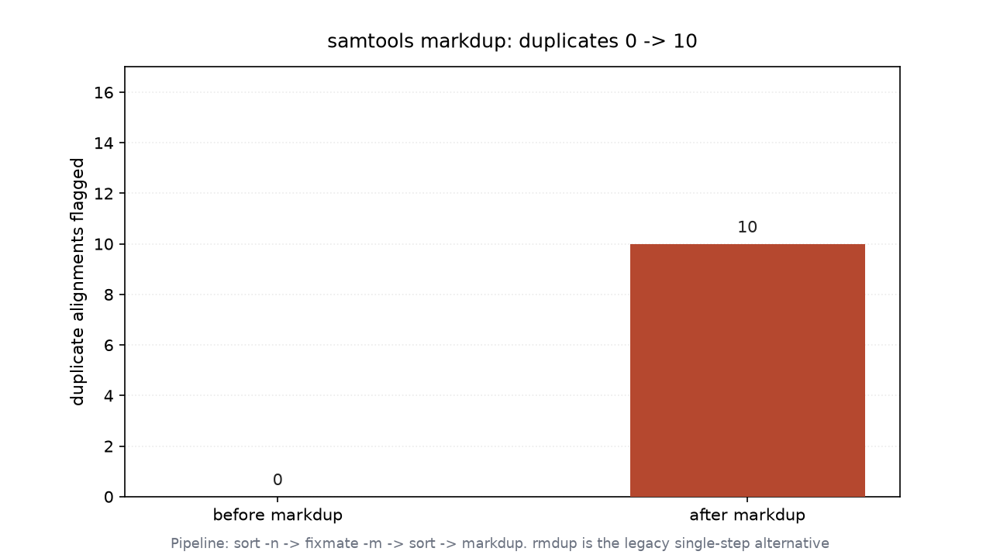

# 重复序列标记与处理（035 / DEEP DIVE 32）

## 1 功能定位与适用范围

本 skill 覆盖比对文件中 PCR/光学重复（duplicate）的标记与去除：`samtools markdup` 按坐标一致性标记重复 read（设 0x400 duplicate 位），`samtools rmdup` 为旧版单步去除命令。标记重复是比对后 QA 与变异检出前去除扩增偏倚的标准步骤。

内容覆盖：

- 标准流程：`samtools sort -n` → `samtools fixmate -m` → `samtools sort` → `samtools markdup`（四步，推荐）。
- `fixmate -m`：在名称排序的 BAM 上计算并写入 MC（mate CIGAR）/ms（mate score）等 tag，markdup 依赖这些 tag 判定成对重复。
- `markdup`：标记（默认）或去除（`-r`）坐标相同的重复 read，设 FLAG 0x400。
- `rmdup`：旧版单步去除命令（不要求 fixmate tag），功能被 markdup 取代，仅向后兼容。
- 计数核对：`samtools flagstat` 的 `duplicates` 行显示标记数量。

适用范围：BAM 的重复标记（markdup）、重复去除（markdup -r / rmdup）。

不在本 skill 范围内：排序（`alignment-sorting`）、索引（`alignment-indexing`）、过滤（`alignment-filtering`）、统计汇总（`bam-statistics`）、参考序列操作（`reference-operations`）。

## 2 属性表

| 属性 | 值 |
|---|---|
| 主工具 | samtools 1.22.1（要求 ≥ 1.19） |
| 输入 | 011 真跑产物 `aligned_e2e.bam`（6000 reads，paired-end） |
| 输入规模 | 6000 reads，4 contigs（各 3000 bp），bowtie2 end-to-end |
| 流程 | sort -n → fixmate -m → sort → markdup |
| 标记前 duplicates | 0 + 0 duplicates / 0 + 0 primary duplicates |
| 标记后 duplicates | 10 + 0 duplicates / 10 + 0 primary duplicates |
| 标记增量 | 0 → 10 |
| 环境 | WSL2 Ubuntu，samtools 1.22.1 / htslib 1.22.1 |

## 3 成分拆解

### 3.1 为什么需要 fixmate -m

`markdup` 判定重复依赖每条 read 的 mate 信息（坐标、CIGAR）。`fixmate -m` 在名称排序 BAM 上把 mate 的 CIGAR/得分写入 MC/ms tag，使后续坐标排序后 markdup 能正确识别成对重复。跳过 fixmate 会导致 markdup 无法利用配对信息。

### 3.2 标记 vs 去除

`markdup` 默认只设 0x400 duplicate 位（保留记录，下游用 `-F 1024` 过滤）；加 `-r` 则直接丢弃重复记录。本流程用默认标记，便于保留原始数据并核对数量。

### 3.3 rmdup 与 markdup 的差异

`rmdup` 是旧版单步命令，不要求 fixmate tag，直接按坐标去重；因不利用 mate 信息，对 paired-end 的判重不如 markdup 精确，已不推荐用于新流程，仅作向后兼容保留。

## 4 严格复现

### 4.1 环境与数据

- 工具：WSL2 Ubuntu，samtools 1.22.1 / htslib 1.22.1。
- 输入：`aligned_e2e.bam`（011 真跑产物，6000 reads，paired-end）。
- 产物：`namesort.bam` / `fixmate.bam` / `coordsort.bam` / `markdup.bam`（已建索引）。

### 4.2 标准流程

```bash
samtools sort -n -o namesort.bam aligned_e2e.bam
samtools fixmate -m namesort.bam fixmate.bam
samtools sort -o coordsort.bam fixmate.bam
samtools markdup coordsort.bam markdup.bam
samtools index markdup.bam
```

### 4.3 标记前后重复计数

```bash
samtools flagstat aligned_e2e.bam | grep -i duplicate
# 0 + 0 duplicates
# 0 + 0 primary duplicates
samtools flagstat markdup.bam | grep -i duplicate
# 10 + 0 duplicates
# 10 + 0 primary duplicates
```

输入本身 FLAG 中无 duplicate 位（0 条）；经 markdup 后标记出 10 条 duplicate（primary duplicates 同样 10），增量 0 → 10（图 1）。



## 5 实践要点

- 标准流程不可省 fixmate -m：markdup 需要 MC/ms tag 才能正确判重，必须在名称排序后、坐标排序前执行。
- 顺序严格为 sort -n → fixmate -m → sort → markdup；fixmate 必须在名称排序态运行，markdup 必须在坐标排序态运行。
- markdup 默认只标记不删除，保留原始记录；需要去重产出用 `markdup -r` 或下游 `-F 1024` 过滤。
- 计数核对用 flagstat 的 `duplicates` 行：本输入原 0 条、标记后 10 条，说明存在 10 条坐标一致的疑似 PCR/光学重复。
- `rmdup` 为旧版单步命令，判重精度不如 markdup，新流程应优先 markdup。
- 标记后 BAM 需重新 `samtools index`，否则区域查询报错。

## 未覆盖（诚实标注）

以下知识点在本次输入或本机环境中未做实测，相关结论按 samtools 标准行为陈述：

- **`markdup -r` 直接去除**：本流程用默认标记（保留记录），未用 `-r` 产出去重后 BAM 并核对去除后 reads 数。
- **移除重复后的下游比对率**：未统计标记 10 条重复去除后 flagstat 的 mapped/coverage 变化。
- **光学重复 vs PCR 重复区分**：markdup 的 `dupcode`（如 0x400 细节）未展开；本输入 10 条的来源（PCR/光学）未进一步区分。
- **`rmdup` 实测对照**：仅说明 rmdup 为旧版命令，未以真实数据跑 rmdup 与 markdup 的结果差异。
- **高 dup 数据对照**：本输入重复率极低（10/6000），未构造高 dup 模拟数据演示 markdup 行为。

## 6 小结

本 skill 的 `samtools markdup` 标准流程（sort -n → fixmate -m → sort → markdup）在 011 真跑产出的 paired-end BAM（6000 reads，bowtie2 end-to-end）上执行。输入 FLAG 中原本 0 条 duplicate，经 markdup 后标记出 10 条 duplicate（primary duplicates 亦 10），增量 0 → 10，说明数据中存在 10 条坐标一致的疑似 PCR/光学重复。

核心结论：markdup 判重依赖 fixmate -m 写入的 MC/ms tag，流程顺序不可颠倒；默认标记保留记录、`-r` 才去除；旧版 `rmdup` 精度不如 markdup 已不推荐。标记后 BAM 需重建索引。rmdup -r 去除、dupcode 区分、高 dup 对照等内容因输入或环境限制未实测，结论按 samtools 标准行为陈述。
