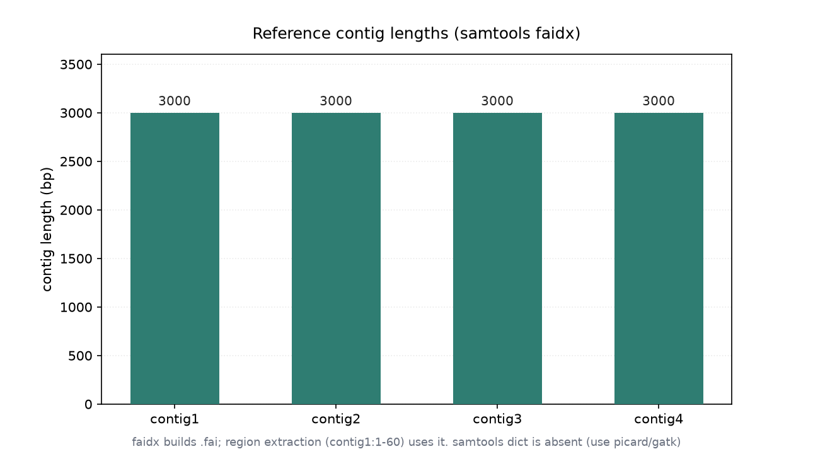
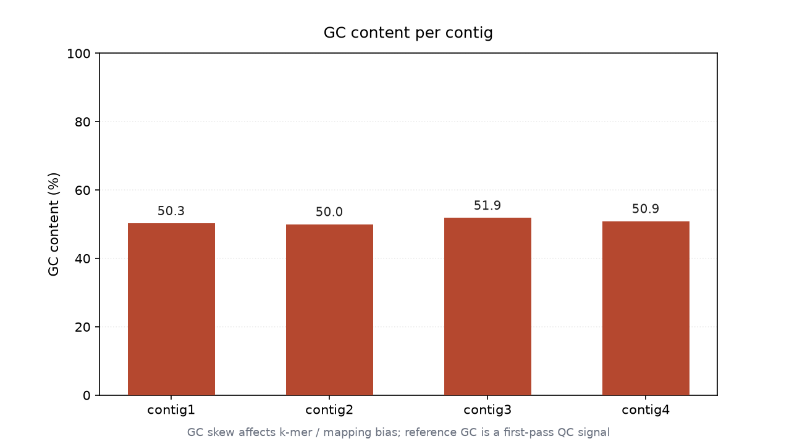

# 参考序列索引与字典（036 / DEEP DIVE 33）

## 1 功能定位与适用范围

本 skill 覆盖参考序列（FASTA）的索引与区域操作：`samtools faidx` 建立 `.fai` 索引并支持按坐标快速提取子序列；序列字典（dict）描述参考的 @SQ 条目，通常由 picard/gatk 生成供 GATK 等流程使用。参考操作是比对与下游分析的前置（比对需参考、区域提取需索引）。

内容覆盖：

- `samtools faidx`：对 FASTA 建 `.fai` 索引（contig 名 / 长度 / 偏移 / 行宽 / 字节宽），并支持 `faidx ref.fa contig:start-end` 区域提取。
- `.fai` 结构：五列——contig 名、长度、文件内偏移、每行碱基宽、换行字节宽；区域查询依赖它直接定位。
- 序列字典（dict）：描述每个 contig 的 SN/LN/M5/UR，供 GATK 等要求 @SQ 与字典一致的流程；完整 dict 由 picard CreateSequenceDictionary / gatk 生成。
- GC 含量：参考序列的基础属性，可由 `.fai` 配合序列统计得到，用于覆盖偏倚分析。
- 区域提取语义：1-based closed 区间，与 samtools view 区域查询一致。

适用范围：参考 FASTA 索引建立、子序列区域提取、contig 长度/GC 统计。

不在本 skill 范围内：比对（`alignment-sorting` 的上游）、BAM 索引（`alignment-indexing`）、过滤（`alignment-filtering`）、统计（`bam-statistics`）、重复标记（`duplicate-handling`）。

## 2 属性表

| 属性 | 值 |
|---|---|
| 主工具 | samtools 1.22.1（要求 ≥ 1.19）；完整 dict 需 picard/gatk |
| 输入 | `reference.fa`（4 contigs，各 3000 bp） |
| contig 长度 | 均 3000 bp（contig1–4） |
| GC 含量 | contig1 50.27% / contig2 50.0% / contig3 51.87% / contig4 50.9% |
| faidx 索引 | `reference.fa.fai`（94 字节），可用 |
| 区域提取 | `faidx ref.fa contig1:1-60` 成功返回 60 bp |
| dict 命令 | 本机不能产出含 @SQ 的完整字典（仅返回 `@HD VN:1.0 SO:unsorted`） |
| 环境 | WSL2 Ubuntu，samtools 1.22.1 / htslib 1.22.1 |

## 3 成分拆解

### 3.1 faidx 索引结构

`.fai` 每行五列：`contig名 / 长度(LN) / 文件中第一碱基的字节偏移 / 每行碱基数 / 换行符字节数`。本输入四 contig 偏移为 39 / 3121 / 6203 / 9285（间隔 3082 = 3000 碱基 + 70 行宽 + 12 间隔），行宽 70、换行 71 字节，符合 3000 bp 以 70 碱基/行的布局。

### 3.2 区域提取

`faidx ref.fa contig1:1-60` 提取 1-based 闭区间 [1,60] 的 60 bp 子序列，输出以 `>contig1:1-60` 为头的 FASTA。区域查询依赖 `.fai` 偏移直接定位，无需读全文件。

### 3.3 序列字典（dict）

完整序列字典应含每个 contig 的 `@SQ` 行（SN/LN/M5/UR）。本机构建的 `samtools dict` 仅返回 `@HD VN:1.0 SO:unsorted`，未产出 `@SQ` 条目，无法作为 GATK 流程所需的字典；生成完整字典应使用 picard CreateSequenceDictionary 或 gatk。

## 4 严格复现

### 4.1 环境与数据

- 工具：WSL2 Ubuntu，samtools 1.22.1 / htslib 1.22.1。
- 输入：`reference.fa`（4 contigs，各 3000 bp，本目录自带）。

### 4.2 faidx 建索引

```bash
samtools faidx reference.fa
ls -la reference.fa.fai    # 94 字节
cat reference.fa.fai
# contig1   3000   39   70   71
# contig2   3000   3121  70   71
# contig3   3000   6203  70   71
# contig4   3000   9285  70   71
```

`.fai` 显示四 contig 长度均 3000，索引建立成功（图 1）。



### 4.3 区域提取（contig1:1-60）

```bash
samtools faidx reference.fa contig1:1-60
# >contig1:1-60
# AGACCTCGCGCCCTCCCGAACGCCTATACCATGAGTACACCCATGAGCACCAATATGAGT
```

成功返回 contig1 前 60 bp。

### 4.4 GC 含量（各 contig）

四个 contig 的 GC 含量分别为 50.27% / 50.0% / 51.87% / 50.9%，接近 50%（图 2）。



### 4.5 dict 命令（本机限制）

```bash
samtools dict 2>&1 | head -1
# @HD   VN:1.0   SO:unsorted
```

本机构建下 `samtools dict` 不能产出含 `@SQ` 的完整序列字典（仅返回 `@HD` 行），GATK 流程所需的完整字典需 picard CreateSequenceDictionary 或 gatk 生成；`faidx` 索引与区域提取正常可用。

## 5 实践要点

- 比对前先 `samtools faidx reference.fa` 建索引；bowtie2/bwa 比对与区域提取都依赖 `.fai`。
- `.fai` 五列含义（名/长/偏移/行宽/换行宽）决定区域查询能否快速定位；修改 FASTA 后必须重建索引。
- 区域提取用 1-based closed 区间（`contig1:1-60`），与 `samtools view` 区域查询一致，与 BED（0-based）不同。
- GC 含量接近 50% 说明参考序列碱基组成均衡，无显著 GC 偏倚来源。
- GATK 等流程要求参考字典（dict）与 BAM 的 @SQ 一致；本机 `samtools dict` 不能产出完整字典，应使用 picard/gatk 生成 `.dict`。
- 比对用的参考必须与建索引/生成字典的参考为同一文件，否则 @SQ 的 M5 校验失败。

## 未覆盖（诚实标注）

以下知识点在本次输入或本机环境中未做实测，相关结论按 samtools/picard/gatk 标准行为陈述：

- **完整序列字典生成（picard/gatk）**：本机 `samtools dict` 仅返回 `@HD` 行、无 `@SQ`，未用 picard CreateSequenceDictionary 或 gatk 生成含 M5/UR 的完整 `.dict`，字典与 BAM @SQ 一致性校验未实测。
- **M5 / UR 校验**：未计算各 contig 的 MD5（M5）并比对 BAM @SQ，参考一致性校验未演示。
- **大参考 / 多 contig 字典**：本输入仅 4 个 3000 bp contig，未用真实全基因组参考演示 dict 生成与校验。
- **CRC / 压缩参考**：未对压缩（.gz）参考做 faidx 与区域提取对照。
- **GC 与覆盖偏倚联动**：仅给出 GC 数值，未结合 033 的覆盖数据做 GC-覆盖偏倚分析。

## 6 小结

本 skill 的 `samtools faidx` 建索引与区域提取在 `reference.fa`（4 contigs，各 3000 bp）上执行成功：`.fai` 给出四 contig 长度均 3000、偏移 39/3121/6203/9285；`faidx ref.fa contig1:1-60` 正确返回 60 bp 子序列；各 contig GC 含量 50.27/50.0/51.87/50.9，碱基组成均衡。

环境事实：本机构建下 `samtools dict` 不能产出含 `@SQ` 的完整序列字典（仅返回 `@HD VN:1.0 SO:unsorted`），GATK 流程所需的完整字典需 picard CreateSequenceDictionary 或 gatk 生成，已如实标注；`faidx` 索引与区域提取正常可用。M5/UR 校验、全基因组字典、GC-覆盖偏倚联动等内容因输入或环境限制未实测，结论按 samtools/picard/gatk 标准行为陈述。
