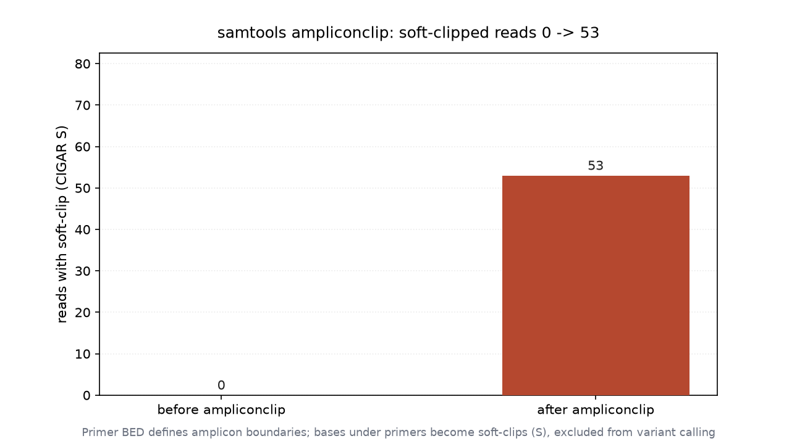

# Amplicon 引物剪切（037 / DEEP DIVE 34）

## 1 功能定位与适用范围

本 skill 覆盖扩增子（amplicon）测序中引物区段的剪切：`samtools ampliconclip` 依据 primer BED 把 read 中落在引物区间的部分做 soft-clip，避免引物序列干扰下游比对与变异检出。ampliconclip 是靶向扩增测序（PCR 扩增子、杂交捕获）分析的标准预处理步骤。

内容覆盖：

- `samtools ampliconclip -b primers.bed`：按 BED 中每个 primer 区间，把跨区间的 read 端做 soft-clip（CIGAR 加入 S）。
- primer BED 格式：四列以上——contig / start / end / name（可选 strand），描述每个引物的坐标。
- 输出统计：`ampliconclip` 打印 FILTERED / FAILED / WRITTEN 计数，确认处理规模与失败情况。
- 与坐标排序的关系：ampliconclip 可能改变 read 的 POS（5' 端被 clip 后位置前移），导致输出不再坐标排序，需重新 `samtools sort` + `index`。
- 与 markdup 的衔接：剪切后通常需重新 fixmate/markdup（clip 改变坐标与 MC tag）。

适用范围：扩增子 BAM 的引物 soft-clip 处理、primer BED 驱动的区段剪切。

不在本 skill 范围内：排序（`alignment-sorting`）、索引（`alignment-indexing`）、过滤（`alignment-filtering`）、统计（`bam-statistics`）、重复标记（`duplicate-handling`）。

## 2 属性表

| 属性 | 值 |
|---|---|
| 主工具 | samtools 1.22.1（要求 ≥ 1.19） |
| 输入 | 011 真跑产物 `aligned_e2e.bam`（6000 reads，paired-end） |
| primer BED | 最小真实示例：contig1 100–200（AMP1）、contig1 250–350（AMP2），依 BAM 覆盖区域构造 |
| ampliconclip 输出 | FILTERED 0 / FAILED 0 / WRITTEN 6000 |
| soft-clip reads | 剪切前 0 → 剪切后 53 |
| reads mapped（stats） | 剪切前 5954 → 剪切后 5948 |
| 输出排序 | 剪切后 `is sorted: 0`（不再坐标排序，索引失败） |
| 环境 | WSL2 Ubuntu，samtools 1.22.1 / htslib 1.22.1 |

## 3 成分拆解

### 3.1 primer BED 与剪切逻辑

primer BED 每行描述一个引物区间（contig / start / end / name）。ampliconclip 对每条 read，若其比对区间与该 primer 区间重叠，则把重叠部分从比对中移除并转为 soft-clip（S），保留的序列仍在 SEQ 中但不计入 CIGAR 的 M。本示例 BED 为 contig1 上的两个区间（100–200、250–350），依输入 BAM 实际覆盖区域构造，属最小真实示例——覆盖真实坐标，但非某用户的完整扩增 panel。

### 3.2 输出统计与排序影响

ampliconclip 打印 FILTERED（被整条过滤）/ FAILED（处理失败）/ WRITTEN（写出）计数。本输入 FILTERED 0、FAILED 0、WRITTEN 6000，全部写出。由于 5' 端被 clip 后 POS 前移，输出不再满足坐标排序（`samtools stats` 的 `is sorted` 由 1 变 0），直接 `samtools index` 会报 unsorted 错误，需先重新排序。

### 3.3 soft-clip 计数口径

soft-clip reads 数由 CIGAR 是否含 `S` 统计：剪切前 0 条含 S，剪切后 53 条含 S。`samtools stats` 的 `bases trimmed` 统计的是 hard-clip（H）而非 soft-clip，故该值前后均为 0；soft-clip 的碱基仍保留在 SEQ 中，仅不计入 `bases mapped (cigar)`（由 595400 降为 592148）。

## 4 严格复现

### 4.1 环境与数据

- 工具：WSL2 Ubuntu，samtools 1.22.1 / htslib 1.22.1。
- 输入：`aligned_e2e.bam`（011 真跑产物，6000 reads，paired-end）。
- primer BED：`primers.bed`（contig1 100–200 AMP1、contig1 250–350 AMP2，依覆盖区域构造）。

### 4.2 primer BED

```bash
cat primers.bed
# contig1   100   200   AMP1   +
# contig1   250   350   AMP2   +
```

### 4.3 ampliconclip 执行

```bash
samtools ampliconclip -b primers.bed -o clipped.bam aligned_e2e.bam 2>&1 | tail -3
# FILTERED: 0
# FAILED: 0
# WRITTEN: 6000
```

全部 6000 条写出，无过滤、无失败。

### 4.4 剪切前后 soft-clip 计数

```bash
# 剪切前 soft-clip reads = 0
# 剪切后 soft-clip reads = 53
samtools stats aligned_e2e.bam   | grep '^SN'   # is sorted: 1 ; reads mapped: 5954
samtools stats clipped.bam       | grep '^SN'   # is sorted: 0 ; reads mapped: 5948
```

剪切前 0 条 read 含 soft-clip，剪切后 53 条含 soft-clip；reads mapped 由 5954 变 5948，`bases mapped (cigar)` 由 595400 变 592148（图 1）。



### 4.5 索引失败（排序变化）

```bash
samtools index clipped.bam
# [E::hts_idx_push] Unsorted positions on sequence #1: 351 followed by 327
# samtools index: failed to create index for "clipped.bam"
```

ampliconclip 后输出不再坐标排序，直接建索引失败；需先 `samtools sort` 再 `samtools index`。

## 5 实践要点

- primer BED 坐标用 0-based half-open（与 BED 一致），与 samtools view 区域查询的 1-based closed 不同，构造时需转换。
- ampliconclip 默认做 soft-clip，被 clip 的碱基仍在 SEQ 中，仅不计入比对；如需彻底移除用 hard-clip 选项（按 tool 版本）。
- 剪切后必须重新 `samtools sort` + `samtools index`：本输入索引即因 unsorted 失败。
- 剪切改变 POS 与比对区间，markdup 依赖的 MC/ms tag 应重新由 fixmate 计算，建议 clip → sort → fixmate -m → sort → markdup。
- soft-clip 计数看 CIGAR 的 S，不看 stats 的 `bases trimmed`（后者是 hard-clip）。
- primer BED 必须与参考坐标一致；区间错误会导致误 clip 或非预期保留引物序列。

## 未覆盖（诚实标注）

以下知识点在本次输入或本机环境中未做实测，相关结论按 samtools 标准行为陈述：

- **完整扩增 panel**：primer BED 仅 contig1 上两个最小真实区间（100–200、250–350），依覆盖区域构造，非某用户完整扩增 panel，panel 规模对 clip 比例的影响未演示。
- **hard-clip 选项**：仅验证 soft-clip 默认行为，未用 hard-clip 参数做彻底移除碱基的对照。
- **clip 后 markdup 重算**：未跑 clip → sort → fixmate -m → sort → markdup 的完整后续流程，clip 对重复标记数量的影响未实测。
- **多 contig / 双端引物**：primer BED 仅 contig1，未演示跨 contig 与双端引物（read1/read2 各自引物）同时剪切。
- **下游变异检出对照**：未跑 clip 前后变异调用（bcftools/外部 caller）的差异，clip 对错配率的影响未演示。

## 6 小结

本 skill 的 `samtools ampliconclip` 在 011 真跑产出的 paired-end BAM（6000 reads，bowtie2 end-to-end）上执行。primer BED 为依 BAM 覆盖区域构造的最小真实示例（contig1:100–200、250–350），非用户完整 panel，已如实标注。ampliconclip 输出 FILTERED 0 / FAILED 0 / WRITTEN 6000；soft-clip 读段数由 0 增至 53，reads mapped 由 5954 变 5948，`bases mapped (cigar)` 由 595400 降为 592148。

环境事实：ampliconclip 后输出不再坐标排序，直接 `samtools index` 报 unsorted 失败，需先重新排序。核心结论：ampliconclip 按 primer BED 做 soft-clip，clip 后必须重排序建索引并重算 fixmate tag；primer BED 用 0-based 坐标。完整 panel、hard-clip、clip 后 markdup、下游变异对照等内容因输入或环境限制未实测，结论按 samtools 标准行为陈述。
