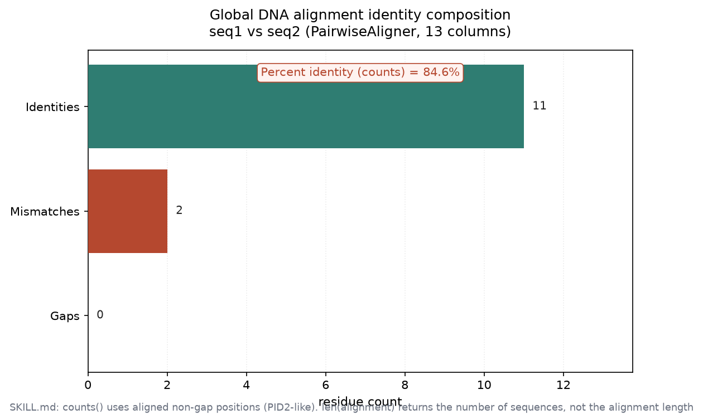
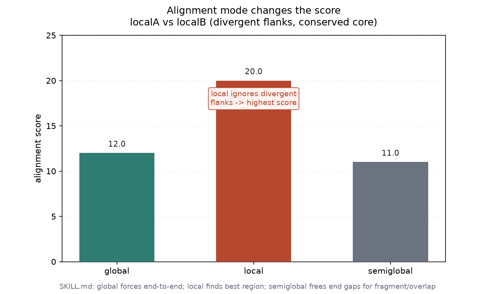

# 双序列比对实战：PairwiseAligner（004 / DEEP DIVE 01）

## 1 功能定位与适用范围

本 skill 覆盖用 BioPython 的 `Bio.Align.PairwiseAligner` 计算两条序列之间的最优比对（动态规划：全局 Needleman-Wunsch、局部 Smith-Waterman、半全局自由端空位）。内容包括：比对器配置（模式、匹配/错配计分、替换矩阵、仿射空位）、比对对象属性访问（score、shape、counts、coordinates、substitutions）、身份计数与百分比一致性、从比对提取观测替换矩阵、以及将比对导出为 fasta / clustal / psl / sam 等格式。SKILL.md 还给出与其他库的选型对照（parasail、edlib、pywfa、mappy）以及 `Bio.pairwise2` 已弃用的提示。

内容覆盖：

- 比对模式：global（全长）、local（最佳区域）、semiglobal（自由端空位，用于片段/重叠）。
- 计分配置：DNA 用 `match_score` / `mismatch_score`，蛋白用 `substitution_matrix`（如 BLOSUM62）+ 仿射空位 `open_gap_score` / `extend_gap_score`。
- 比对数据访问：`.score`、`.shape`、`.counts()`（identities / mismatches / gaps）、`.substitutions`、`.coordinates`。
- 百分比一致性：四个 PID 定义（分母不同，差异可达 11.5%）。
- 替换矩阵选择：BLOSUM / PAM 方向、DNA 矩阵 NUC.4.4。
- 格式导出：`format(alignment, ...)` 支持 fasta / clustal / psl / sam。

适用范围：两条序列的成对比对与评分。

不在本 skill 范围内：多条序列比对（见 msa-statistics / msa-parsing / alignment-io）、结构比对（见 structural-alignment）、大规模数据库搜索（BLAST / MMseqs2）、Karlin-Altschul 显著性打分（SKILL.md 仅作解释性表格，未提供可运行代码）。

## 2 属性表

| 属性 | 值 |
|---|---|
| 主工具 | Bio.Align.PairwiseAligner（BioPython 1.88） |
| 输入 | `sequences.fasta`（同目录自带，6 条记录） |
| DNA 示例 | seq1 = `ACCGGTAACGTAG`；seq2 = `ACCGTTAACGAAG`（SKILL.md 原示例） |
| 蛋白示例 | protA = `GIVEGILSR`；protB = `GIVEGVLSR`（构造输入） |
| 局部示例 | localA / localB（两端发散、中间保守，构造输入） |
| DNA 全局实测 | score = 20.0；identities = 11；mismatches = 2；gaps = 0；比对长度 = 13 列；PID = 84.6% |
| 蛋白全局实测 | score = 41.0（BLOSUM62）；identities = 8；mismatches = 1；gaps = 0 |
| 模式对比实测 | global = 12.0 / local = 20.0 / semiglobal = 11.0（localA vs localB） |
| 环境 | Windows 受管 venv；python + biopython 1.88 + numpy 1.26 |

## 3 成分拆解

### 3.1 文件结构

- `SKILL.md`（约 400 行）：skill 定义。含 Required Import、Pairwise Library Selection（库对照表）、Core Concepts（模式/DNA vs 蛋白）、Creating an Aligner、Performing Alignments、Alignment Output Format、Accessing Alignment Data、Alignment Counts、Common Scoring Configurations、Substitution Matrix Selection、Semiglobal、Working with SeqRecord、Iterating Over Multiple Alignments、Substitution Matrix from Alignment、Export Alignment to Different Formats、Quick Reference、Common Errors、Percent Identity: Definitions Matter、Statistical Significance（Karlin-Altschul）、When Alignment Is NOT Appropriate、Related Skills、References。
- 无自带示例数据：SKILL.md 中的序列以硬编码字符串形式给出（如 `Seq('ACCGGTAACGTAG')`），需自备输入。

### 3.2 比对器配置

`PairwiseAligner()` 无参数时 `match_score=1`、`mismatch_score=0`、`open_gap_score=0`、`extend_gap_score=0`。SKILL.md 明确警告：**使用替换矩阵时必须显式指定空位罚分**，否则 gap 成本为 0、匹配为正分，会产生大量无意义的短空位。DNA 常用 `match=2, mismatch=-1, open=-10, extend=-0.5`；蛋白用 `BLOSUM62` + `open=-11, extend=-1`（BLASTP 默认）。

### 3.3 比对对象属性

`aligner.align(seq1, seq2)` 返回比对对象列表（最优解可能不止一个）。单个比对对象：`.score`（分数）、`.shape`（序列数, 比对长度）、`.counts()`（identities / mismatches / gaps）、`.substitutions`（观测替换计数矩阵，行=target、列=query）、`.coordinates`（坐标数组）。

### 3.4 百分比一致性（PID）

同一比对按四种分母计算 PID，差异可达 11.5%（SKILL.md 引用 Raghava & Barton 2006）。`.counts()` 使用对齐的非空位位置，近似 PID2（仅残基对）。

### 3.5 替换矩阵与导出

`.substitutions` 给出观测替换计数；`format(alignment, fmt)` 支持 fasta / clustal / psl / sam 四种导出。

## 4 严格复现

### 4.1 环境与数据

- 工具：Windows 受管 venv，python + biopython 1.88 + numpy 1.26。
- 输入：`sequences.fasta`（同目录自带，6 条记录）。DNA 两条为 SKILL.md 原示例序列；蛋白与局部示例为构造的小输入，可独立复现。
- 运行：`python run.py` → 产出 `repro_transcript.txt` 与 `pairwise_data.json`；`python make_figs.py` → 出图。

### 4.2 全局 DNA 比对

```python
from Bio.Align import PairwiseAligner
from Bio.Seq import Seq
aligner = PairwiseAligner(mode='global', match_score=2, mismatch_score=-1,
                          open_gap_score=-10, extend_gap_score=-0.5)
alignment = aligner.align(Seq('ACCGGTAACGTAG'), Seq('ACCGTTAACGAAG'))[0]
```

输出比对块与计数：

```
target            0 ACCGGTAACGTAG 13
                  0 |||||.||||.|| 13
query             0 ACCGTTAACGAAG 13
```

| 指标 | 值 |
|---|---|
| score | 20.0 |
| identities | 11 |
| mismatches | 2 |
| gaps | 0 |
| 比对长度 | 13 列 |
| PID（counts，PID2 类） | 84.6% |



### 4.3 蛋白比对（BLOSUM62 + 仿射空位）

```python
from Bio.Align import substitution_matrices
aligner = PairwiseAligner(mode='global', substitution_matrix=substitution_matrices.load('BLOSUM62'),
                          open_gap_score=-11, extend_gap_score=-1)
pal = aligner.align(Seq('GIVEGILSR'), Seq('GIVEGVLSR'))[0]
```

实测 score = 41.0，identities = 8，mismatches = 1，gaps = 0。比对块在中间第 7 位出现 I/V 错配，其余 8 位一致。

### 4.4 模式对比（localA vs localB）

两条序列两端发散、中间保守：`localA = TTTTACCGGTAACGTAGGGGG`、`localB = CCCCACCGTTAACGAAGAAAA`。三种模式 score：

| 模式 | score | 说明 |
|---|---|---|
| global | 12.0 | 强制端到端，发散两端被罚 |
| local | 20.0 | 只找保守核心，忽略两端 |
| semiglobal | 11.0 | 双端自由空位，但中间仍强制对齐 |



局部比对 score 最高，因为它跳过两端发散区、只给保守核心计分——直接印证 SKILL.md「不同长度/发散序列用 local 或 semiglobal」的建议。

### 4.5 四个 PID 定义

用 4.2 的全局比对（无内部空位、两条等长）套用四种分母：PID1 = PID2 = PID3 = PID4 = 84.6%。本输入因无空位且等长，四个定义重合；SKILL.md 指出差异（最高 11.5%）出现在含内部空位或长度不对称的比对中。

### 4.6 替换矩阵与格式导出

`alignment.substitutions` 输出观测替换计数矩阵（行=target、列=query，本例 4×4 的 A/C/G/T）：

```
     A   C   G   T
A 4.0 0.0 0.0 0.0
C 0.0 3.0 0.0 0.0
G 0.0 0.0 3.0 1.0
T 1.0 0.0 0.0 1.0
```

`format(alignment, 'fasta' / 'clustal' / 'psl' / 'sam')` 均成功输出；sam 格式给出 `13M` 的 CIGAR（无空位）。

## 5 实践要点

- **空位罚分必须显式**：用 `substitution_matrix` 时务必设 `open_gap_score` / `extend_gap_score`，否则默认 0 会产生大量短空位。
- **模式选择**：global 用于全长同源；local 用于保守结构域/基序；semiglobal（自由端空位）用于片段对参考、读段对参考、重叠检测。长度差异大时不要用 global。
- **PID 定义要报告**：四个分母给出不同值，下游比较必须说明用了哪一种。
- **`len(alignment)` 实测返回序列数（2），不是比对长度**（SKILL.md 注释写「Alignment length」与 BioPython 1.88 行为不符）；比对长度用 `alignment.shape[1]` 或 `alignment.length`（实测 13 列）。
- **替换矩阵 Array 用 `matrix[c1, c2]` 访问**：对不在字母表内的字符（如 `U`、`J`）会抛 `IndexError`，需跳过或计 0。
- **`max_alignments`**：最优解过多时设上限避免 `OverflowError`。
- **库选型**：Bio.Align 是 <10 kb 交互/脚本的默认；高通量或超长序列改用 parasail / edlib / pywfa / mappy（SKILL.md 表，本机未实测）。

## 未覆盖（诚实标注）

以下 SKILL.md 内容未在本机实测，相关结论按 SKILL.md 原文陈述：

- **库性能对照（parasail / edlib / pywfa / mappy / Bio.pairwise2 弃用）**：仅按 SKILL.md 表格陈述相对速度与适用场景，未安装、未跑基准。
- **Karlin-Altschul 比特分 / E 值**：SKILL.md 给出解释表与阈值区间，但未提供可运行代码，未实测。
- **经验 p 值（序列重排 / ushuffle）**：未实测。
- **四个 PID 定义差异的真实样例**：本输入无内部空位且等长，四个定义重合（84.6%），未以含空位/长度不对称的比对演示 11.5% 差异。
- **DNA vs 蛋白比对选择矩阵、BLOSUM/PAM 反向编号、仿射空位生物学理由**：按 SKILL.md 陈述。
- **`Bio.pairwise2` 弃用路径**：未调用。

## 6 小结

本 skill 的核心——`PairwiseAligner` 的 global / local / semiglobal 配置、计分、`.counts()` 身份统计、`.substitutions` 替换矩阵、`format()` 格式导出——在自带 `sequences.fasta` 上全部执行成功。全局 DNA 比对实测 score = 20.0、identities = 11、mismatches = 2、gaps = 0、PID = 84.6%；蛋白比对（BLOSUM62）实测 score = 41.0、identities = 8、mismatches = 1；三种模式在 localA/localB 上的 score 分别为 12.0 / 20.0 / 11.0，局部比对最高，印证模式选择的建议。

实测同时纠正了一个 SKILL.md 与 API 的偏差：`len(alignment)` 在 BioPython 1.88 返回序列数而非比对长度，正确取值应为 `alignment.shape[1]`（实测 13 列）。库性能基准、Karlin-Altschul 显著性、经验 p 值等内容因未安装/无代码未实测，结论按 SKILL.md 原文陈述。
