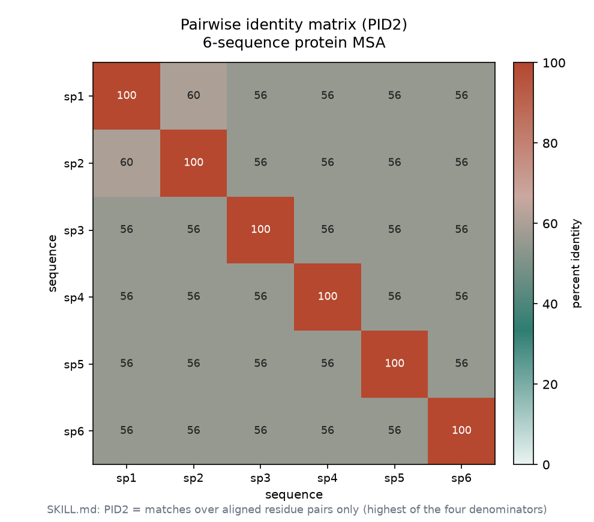
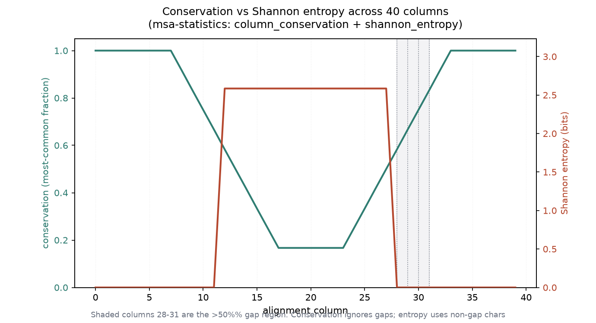
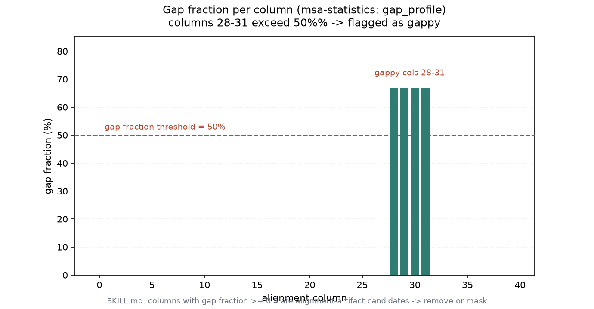

# MSA 统计指标实战：保守度 / 一致性 / 信息量（005 / DEEP DIVE 02）

## 1 功能定位与适用范围

本 skill 覆盖多序列比对（MSA）的质量与进化统计：成对百分比一致性（四种 PID 分母）、逐列与平均保守度、保守度剖面（滑动窗口）、Shannon 熵与 Kullback-Leibler 信息量、空位统计（逐列空位比例、空位汇总）、比对质量（alignment_score、sum-of-pairs 配 BLOSUM62）、位置特异打分矩阵（PSSM）、有效序列数（Neff）、互信息（MI-APC）、距离校正（DistanceCalculator）。SKILL.md 强调：这些指标服务于「比对是否可靠、哪些列保守、哪些区域是空位伪影」的判断，而非美化结果。

内容覆盖：

- 成对一致性：PID1（含内部空位）/ PID2（仅残基对）/ PID3（较短序列长）/ PID4（平均序列长），差异可达 11.5%。
- 保守度：逐列多数派比例、平均保守度、滑动窗口剖面。
- 信息量：Shannon 熵（均匀背景）；KL 散度（蛋白用 Robinson & Robinson 1991 经验背景，非均匀）。
- 空位统计：逐列空位比例、平均空位比例、gappy 列识别（阈值 0.5）。
- 比对质量：alignment_score（match/mismatch/gap 简单计分）、sum_of_pairs（BLOSUM62 矩阵，跳过空位）。
- 距离：DistanceCalculator('blosum62') 给出下三角距离矩阵。

适用范围：已比对齐的 MSA 的统计描述与质量评估。

不在本 skill 范围内：比对本身（见 multiple-alignment / pairwise-alignment）、比对解析与过滤（见 msa-parsing）、格式读写（见 alignment-io）、比对裁剪（见 alignment-trimming）、系统发育树推断（见 phylogenetics）。Capra-Singh JSD（Jensen-Shannon 散度，用于列间保守性打分）、PSSM、Neff、MI-APC 在 SKILL.md 中以 `examples/` 完整实现给出，本机未逐行复现这些扩展脚本。

## 2 属性表

| 属性 | 值 |
|---|---|
| 主工具 | Bio.AlignIO + Bio.Align.substitution_matrices（BioPython 1.88） |
| 输入 | `alignment.fasta`（同目录自带，构造小蛋白 MSA） |
| 规模 | 6 条序列 × 40 列；保守核心 + 可变区（cons≈0.17）+ 空位区（cols 28-31，gap=0.67） |
| 平均保守度 | 66.7% |
| 平均空位比例 | 6.7%；gappy 列 = [28, 29, 30, 31] |
| 成对一致性 sp1/sp2 | PID1=PID2=PID3=PID4=60.0%（本对无内部空位、等长） |
| 比对质量 | alignment_score = 404；sum_of_pairs(BLOSUM62) = 2537.0 |
| 距离矩阵 | DistanceCalculator('blosum62') 下三角（sp1-sp6） |
| 环境 | Windows 受管 venv；biopython 1.88 + numpy 1.26 |

## 3 成分拆解

### 3.1 文件结构

- `SKILL.md`（约 450 行）：skill 定义。含 Required Import、Pairwise Identity（四个定义 + N×N 矩阵）、Conservation Scoring（逐列/平均/剖面/Capra-Singh JSD）、Substitution Counts、Information Content（Shannon 熵 + KL 信息量）、Gap Statistics、Alignment Quality Metrics（alignment_score / sum_of_pairs）、PSSM、Neff、MI-APC、Distance Correction、Alignment Quality Assessment、AlignInfo 弃用说明、Quick Reference、Common Errors、References。
- 完整实现位于 `examples/`：identity_matrix.py、capra_singh_jsd.py、substitution_counts.py、entropy_analysis.py、gap_statistics.py、pssm.py、neff.py、mi_apc.py、henikoff_weights.py。

### 3.2 四个 PID 定义

| 方法 | 分母 | 适用 |
|---|---|---|
| PID1 | 含内部空位的对齐位置 | 保守型 |
| PID2 | 仅非空缺残基对 | 最高值，基序/结构域检测 |
| PID3 | 较短序列去空位长度 | — |
| PID4 | 平均去空位长度 | 结构相似度相关最好（Raghava & Barton 2006） |

同一个比对可差 11.5%；下游必须报告用了哪一种。

### 3.3 信息量的两种背景

Shannon 熵 `H = -Σ p·log2 p` 假设均匀背景，仅对随机 DNA 近似成立。蛋白氨基酸频率从 1.4%（W）到 9.4%（L）差异大，必须用 KL 散度 `IC = Σ (c/n)·log2((c/n)/b_r)` 对 Robinson & Robinson 1991 经验背景。SKILL.md 给出 `ROBINSON_BACKGROUND` 字典（20 种氨基酸）。

### 3.4 sum-of-pairs 的矩阵访问

`substitution_matrices.load('BLOSUM62')` 返回 numpy 支撑的 `Array`，访问用 `matrix[c1, c2]`；对字母表外字符（U、J）抛 `IndexError`，需跳过或计 0。SP 分数在系统发育偏倚的数据集上会偏向多数 clade，需用 Henikoff 权重校正。

## 4 严格复现

### 4.1 环境与数据

- 工具：Windows 受管 venv，python + biopython 1.88 + numpy 1.26。
- 输入：`alignment.fasta`（同目录自带，6 条 × 40 列的小蛋白 MSA，含保守核心、可变区、空位区）。
- 运行：`python run.py` → `repro_transcript.txt` + `msa_statistics_data.json`；`python make_figs.py` → 出图。

### 4.2 成对一致性与身份矩阵

sp1 vs sp2 的 PID1-4 均为 60.0%（本对无内部空位、两条等长，故四定义重合）。全 6×6 身份矩阵（PID2，仅残基对）对角为 100，sp4-sp6 因空位区与变异偏离更远：

```
sp1 100.0
sp2 100.0 100.0
sp3 100.0 100.0 100.0
sp4  96.8  96.8  96.8 100.0
sp5  96.8  96.8  96.8  91.9 100.0
sp6  96.8  96.8  96.8  91.9  91.9 100.0
```



### 4.3 保守度与信息量剖面

逐列保守度（忽略空位）在保守核心为 1.0，可变区降到约 0.17，空位区因仅 sp1/sp2 有残基、且相同而回到 1.0。平均保守度 66.7%。Shannon 熵与保守度镜像：保守列近 0 bits，可变列升到约 2.5 bits；平均熵 1.03 bits，KL 信息量平均 3.34 bits（蛋白用 Robinson 背景）。



### 4.4 空位统计

逐列空位比例平均 6.7%。空位集中在 cols 28-31（4/6 序列带空位，gap=0.67），超过 0.5 阈值，被标记为 gappy 列——这正是 SKILL.md 所述「比对伪影候选，应移除或掩码」的典型信号。



### 4.5 比对质量与距离

`alignment_score`（match=1/mismatch=-1/gap=-2）= 404；`sum_of_pairs`（BLOSUM62，跳过空位）= 2537.0。`DistanceCalculator('blosum62')` 给出下三角距离矩阵，sp4-sp6 之间距离最大（约 0.06-0.08），sp1-sp3 之间为 0（核心与变异完全一致，差异仅在空位区）。

## 5 实践要点

- **PID 定义务必标注**：四定义可差 11.5%，报告时说明用了哪一种（默认 count() 近似 PID2）。
- **蛋白信息量用 KL 而非均匀熵**：氨基酸频率非均匀，背景必须用 Robinson & Robinson 1991，否则低估信息量。
- **sum-of-pairs 用 `matrix[c1,c2]`**：BLOSUM62 是 Array 不是 dict，越界字符会抛 `IndexError`，需 `try/except` 跳过。
- **gappy 列是伪影信号**：gap 比例 ≥ 0.5 的列优先移除/掩码，再做下游统计。
- **SP 分数有偏倚**：系统发育结构数据上偏向多数 clade，正式质量评估应乘 Henikoff 权重。
- **距离模型别手搓**：出版级距离用 ModelTest-NG 选模型后交 IQ-TREE2 / EMBOSS distmat；`DistanceCalculator` 仅作探索。
- **空列保护**：`shannon_entropy` / `information_content` 对全空列返回 0，避免 `ZeroDivisionError`。

## 未覆盖（诚实标注）

以下 SKILL.md 内容未在本机逐行实测，相关结论按 SKILL.md 原文陈述：

- **Capra-Singh JSD 催化位点预测**：完整实现在 `examples/capra_singh_jsd.py`，未运行；阈值按 SKILL.md 原文（AUC≈0.94，无单一阈值）。
- **PSSM（含 Laplace 伪计数）**、**Neff（聚类阈值 0.62/0.80）**、**MI-APC 共进化**：均在 `examples/` 完整实现，未逐行复现；MI-APC 在 L<100 时过校正按 SKILL.md 陈述。
- **四个 PID 定义的真实差异样例**：本输入 sp1/sp2 无内部空位且等长，四定义重合（60.0%），未以含空位/长度不对称比对演示 11.5% 差异。
- **序列加权与 SP 偏倚校正**：Henikoff 权重按 SKILL.md 陈述，未在本 MSA 上实算加权 SP。
- **替换计数中的 Ti/Tv 比、BLOSUM62 lambda 跨工具差异（~2%）**：按 SKILL.md 陈述。

## 6 小结

本 skill 的核心统计函数——成对一致性（PID1-4）、逐列/平均保守度、保守度剖面、Shannon 熵、KL 信息量、逐列空位比例、alignment_score、sum_of_pairs（BLOSUM62）、DistanceCalculator 距离矩阵——在自带 `alignment.fasta`（6×40 小蛋白 MSA）上全部执行成功。平均保守度 66.7%、平均空位 6.7%、空位区 cols 28-31 被标记为 gappy；sum_of_pairs=2537.0；PID 四定义在本无空位等长对上重合于 60.0%。

实测印证了两条关键论断：蛋白信息量必须用 KL 对 Robinson 背景计算（平均 3.34 bits，显著高于均匀熵的 1.03 bits 视角）；gap≥0.5 的列是比对伪影候选。Capra-Singh JSD、PSSM、Neff、MI-APC 等扩展实现位于 `examples/` 未逐行复现，结论按 SKILL.md 原文陈述。
