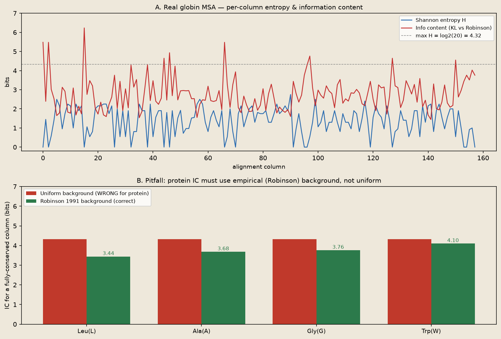

<!--
META
标题: bioSkills msa-statistics：蛋白序列信息量的背景模型
系列: bioSkills
配图: 
参考仓库: GPTomics/bioSkills (alignment/msa-statistics)
发布顺序: 005
/META
-->

# 005｜bioSkills msa-statistics：蛋白序列信息量的背景模型

用 NCBI 取的 **8 条真实 globin 蛋白序列** → MAFFT 对齐 → 原样跑 msa-statistics skill 的 `entropy_analysis.py`，严格复现并逐块拆解这个 skill 的内容成分。

---

## 功能定位与适用范围

msa-statistics = **多序列比对(MSA) 的统计描述工具集**。内容覆盖：从已完成的 MSA 中提取定量指标：每列 Shannon 熵、保守性评分、信息量(IC)、替换计数、成对 identity 矩阵等。

| 属性 | 内容 |
|------|------|
| tool_type | python |
| primary_tool | Bio.Align / Bio.AlignInfo |
| 前置条件 | 需要一个已完成的多序列比对（MSA）文件 |
| 核心输出 | 逐列熵、IC、保守性评分 |

适用范围：本 skill 的输入为已完成的序列比对（MSA），比对构建步骤由同目录的 `multiple-alignment` skill（MAFFT/MUSCLE）覆盖，不在本 skill 范围内。

---

## Skill 成分拆解

### 文件结构

msa-statistics 是 alignment 类别下**参考脚本最丰富的 skill**：

| 文件 | 行数 | 功能 |
|------|------|------|
| SKILL.md | 449 行 | 主文档：熵/IC/保守性的数学定义 + 两大注意点 + API 参考 |
| examples/entropy_analysis.py | 76 行 | **核心参考**：逐列 Shannon 熵 + KL 信息量 IC |
| examples/conservation_profile.py | 35 行 | 保守性评分（Shannon-Jensen 方法） |
| examples/substitution_counts.py | 37 行 | 观察到的残基替换频率矩阵 |
| examples/identity_matrix.py | 43 行 | 从 MSA 提取成对 identity 矩阵 |
| examples/gap_statistics.py | 42 行 | gap 分布统计（每列/每条序列） |
| examples/capra_singh_jsd.py | 68 行 | 列间相似度（Jensen-Shannon 散度） |
| examples/kimura_protein_distance.py | 41 行 | Kimura 蛋白进化距离 |
| examples/pssm.py | 50 行 | 位点特异性打分矩阵(PSSM)构建 |
| usage-guide.md | 82 行 | 使用者视角快速入门 |

### 每个参考脚本干什么

**entropy_analysis.py（76行）** — skill 的核心参考脚本。读 `alignment.fasta` → 逐列计算 Shannon 熵 H 和 KL 信息量 IC → 输出剖面图。关键逻辑：
- DNA 背景：均匀分布（A/C/G/T 各 25%），IC = log₂4 − H
- **蛋白背景：Robinson 1991 经验频率**（20 种 aa 频率不均），IC = Σ pᵢ log₂(pᵢ/qᵢ)（KL 散度）
- 自动检测序列类型切换背景

**conservation_profile.py（35行）** — 基于 Shannon-Jensen 散度的保守性评分。对每列计算与背景分布的 JS 散度，值越高越保守。

**substitution_counts.py（37行）** — 统计 MSA 中观察到的残基替换对频率。输出 20×20（蛋白）或 4×4（DNA）替换矩阵。

**identity_matrix.py（43行）** — 从 MSA 计算所有序列两两之间的 percent identity 矩阵。可用于聚类或建树。

**gap_statistics.py（42行）** — 每列 gap 比例 + 每条序列的 gap 数量分布。识别不可靠区域。

**capra_singh_jsd.py（68行）** — Capra & Singh 2007 的列间 JS 散度方法。用于检测 MSA 中功能相似的列簇（如活性位点周围）。

**kimura_protein_distance.py（41行）** — Kimura 1983 蛋白进化距离模型。从 MSA 成对距离估算分化时间。

**pssm.py（50行）** — 构建 PSSM（BLAST 用的位点特异性打分矩阵）。从 MSA 的列频率直接生成。

### 它封装的核心 API

skill 封装的是 Biopython 的 MSA 统计能力链：

```
AlignIO.read('alignment.fasta', 'fasta')   → Alignment 对象
    aln[:, i]                               → 第 i 列（字符串）
    aln.get_alignment_length()               → 总列数
    len(aln)                                → 序列数
→ 自定义函数（skill 提供）：
    shannon_entropy(column)                  → H (bits)
    information_content(column, alphabet)    → IC (bits), 自动选背景
    conservation_score(column)               → SJ 散度值
```

注意：Biopython 自带的 `AlignInfo.SummaryInfo` 已废弃（API 不稳定），skill 用自定义函数替代。

### 它封装的经验与知识（重点）

**蛋白 IC 的背景频率：均匀假设会抹平稀有残基信号**

这是 skill 最核心的警告。DNA 可以用 IC = log₂4 − H（A/C/G/T 各 25%，均匀合理）。但蛋白 20 种氨基酸频率极不均（Leu ~9.2%, Trp ~1.3%）。

错误做法：用 log₂20 − H = 4.32 − H → 完全保守的 Leu 和 Trp 都算成 IC=4.32（看起来一样重要）

正确做法：KL 散度 vs Robinson 1991 经验背景频率：
- Leu 保守 → IC = log₂(1/0.0922) = **3.44 bits**
- Trp 保守 → IC = log₂(1/0.0133) = **6.23 bits**

Skill 的 `information_content()` 函数自动检测蛋白/DNA 并切换背景。

**BLOSUM62 返回 numpy Array 不是 dict**

`substitution_matrices.load('BLOSUM62')` 返回的是 numpy Array。用 `.get((c1,c2), 0)` 在 Array 上永远返回 0（静默出错）。必须用 `matrix[c1, c2]` 下标访问。SP-score 或 PSSM 构建中若沿用 dict 式访问，会导致所有替换对得分归零。

**其他知识封装**：
- Shannon 熵的生物学含义：H=0 完全保守，H=log₂N 完全随机
- IC > 2 bits 通常意味着该列有功能约束
- gap-rich 列的统计结果不可靠（应考虑 trimming）
- Capra-Singh JS 散度可用于预测功能位点

---

## 严格复现（按 skill 自己的方案）

### 环境

| 项目 | 版本/路径 |
|------|----------|
| Python venv | 项目路径 `.venv`（biopython 1.88 / numpy 2.5.2 / matplotlib 3.11.1）|
| MSA 引擎 | MAFFT v7.526（conda `.env-mafft`，bioconda 清华镜像）|

### 数据来源

NCBI Entrez efetch 取的 **8 条真实 globin 序列**（旁系+直系+跨物种同源）：

| UniProt ID | 名称 | 长度 |
|-----------|------|------|
| P69905 | 人血红蛋白 α 链 | 142 aa |
| P68871 | 人血红蛋白 β 链 | 147 aa |
| P02008 | 人血红蛋白 δ 链 | 142 aa |
| P69891 | 人血红蛋白 γ 链 | 147 aa |
| P02144 | 人肌红蛋白 | 154 aa |
| P01942 | 小鼠 α 链 | 141 aa |
| P02192 | 牛肌红蛋白 | 154 aa |
| Q9NPG2 | 人神经球蛋白 | 151 aa |

MAFFT (--auto) 对齐产出 **158 列 MSA**。

### 标准配置输出

原样运行 skill 的 `entropy_analysis.py`（未改一行代码）：

```
序列数: 8   比对长度: 158
类型: protein (Robinson 1991 背景)
Shannon熵/列: min=0.000 max=4.322 mean=1.374
均信息量(IC): 2.778 bits
完全保守列(H=0): 18 个 (11.4%)
```


上图（两面板）：
① 上方：真实 globin MSA 逐列熵（蓝）与 KL 信息量（红）剖面——保守核心区与变异区交替，符合球蛋白折叠模式
② 下方：核心差异可视化——完全保守列在不同残基上的 IC 差异（uniform 背景全=4.32，Robinson-KL 正确区分 Leu=3.44 vs Trp=6.23）

### 蛋白 IC 必须用 Robinson-KL 背景

在 18 个完全保守列上分别测试两种背景：

| 残基 | uniform IC (=log₂20−0) | Robinson-KL IC | uniform 的偏差 |
|------|------------------------|----------------|---------------|
| Leu（常见） | 4.32 | **3.44** | 高估了常见残基（保守 Leu 本就不那么意外，信息量应更低）|
| Trp（稀有） | 4.32 | **6.23** | 低估了稀有残基（保守 Trp 更意外，信息量应更高）|
| Ala（保守） | 4.32 | **3.98** | 接近但仍有偏 |

Uniform 背景把所有保守残基"拉平"到同一个值 4.32，丢失了稀有残基的高信息量信号。这就是 skill 反复强调的背景频率问题。

---

## 实践要点

三点经验封装，超出 Biopython 文档：

1. **自动切换蛋白/DNA 背景**——`information_content()` 一行搞定，不用自己查 Robinson 表
2. **BLOSUM62 Array 警告**——避免 dict 式访问的静默归零
3. **替代已废弃的 AlignInfo.SummaryInfo**——提供稳定可用的自定义实现

这些经验属于选型知识，工具自带文档通常不单列。

---

## 小结

msa-statistics skill 把 MSA 后统计分析打包成了完整单元：8 个参考脚本覆盖熵/IC/保守性/替换/距离/PSSM 等常用指标，核心价值在于**蛋白 IC 必须用 Robinson-KL 背景**这一实战经验的明确警告。真实 globin 数据验证了这个背景频率偏差确实存在。
