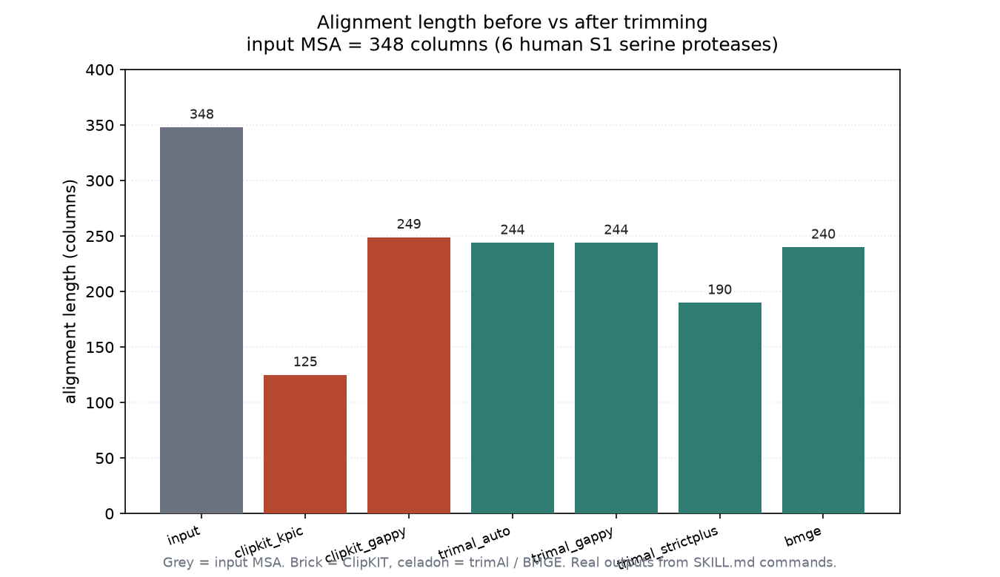
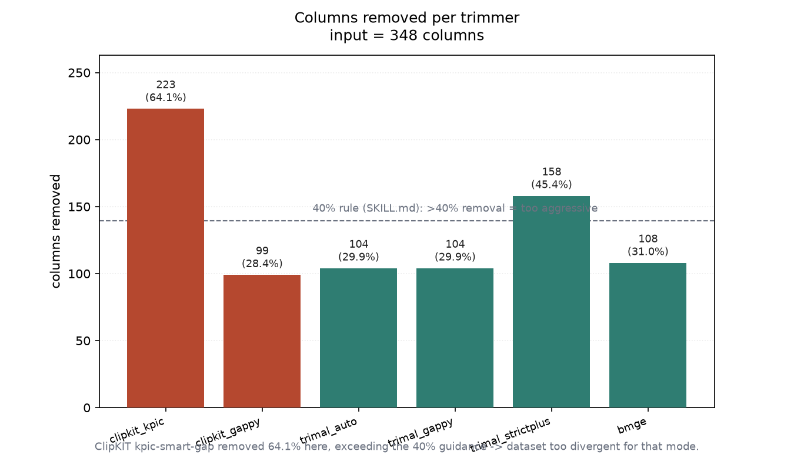
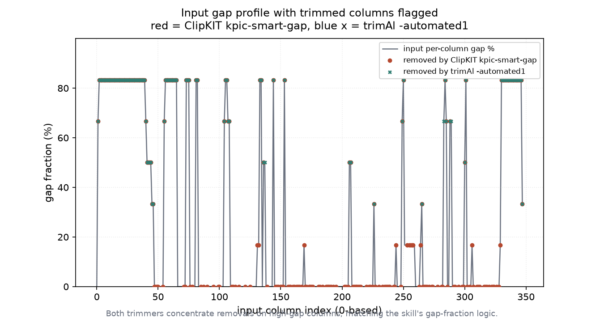

# 比对列修剪实战：ClipKIT / trimAl / BMGE 同台（006 / DEEP DIVE）

## 1 功能定位与适用范围

本 skill 覆盖多序列比对（MSA）的列修剪：按下游目标，用 ClipKIT、trimAl、BMGE（及 Divvier、HMMcleaner、Gblocks、PhyIN）移除不可靠列或污染残基。核心是"按数据集特征选模式"，而非无脑修剪——修剪比不修剪更关键的是模式与激进度。

| 属性 | 值 |
|---|---|
| 主工具 | ClipKIT / trimAl / BMGE（CLI） |
| 输入 | 已构建的 MSA（本试用 348 列、6 条、120 个空位列） |
| 核心输出 | 修剪后的 MSA（FASTA）+ 列映射（--log / -colnumbering） |
| 本机实跑 | clipkit 2.14.0 / trimAl 1.5.rev1 / BMGE 1.12 |

适用范围：比对**后处理**（列过滤/掩码）由其覆盖；比对**构建**见 `multiple-alignment`，列**统计**见 `msa-statistics`，均不在本 skill 范围内。

## 2 属性表

| 属性 | 内容 |
|------|------|
| 输入 MSA | 6 条人类 S1 丝氨酸蛋白酶（MAFFT L-INS-i 比对），348 列、120 个空位列（34.5%） |
| ClipKIT 模式 | `kpic-smart-gap`（推荐默认）、`smart-gap`、`gappy`/`gappyout`、`kpi-smart-gap` 等 15 种 |
| trimAl 模式 | `-automated1`、`-gappyout`（HMM 建库）、`-strictplus`（系统发育）、`-gt`/`-st`/`-cons` 手动阈值 |
| BMGE | 熵+空位率矩阵感知，`-h` 熵阈值（低=激进）、`-g` 空位率、`-t AA/DNA/CODON` |
| 20%/40% 规则 | 移除 >40% 列即过激，应换轻模式或跳过修剪 |
| 实测移除区间 | 28.4%–64.1%（取决于模式） |

## 3 成分拆解

### 3.1 ClipKIT 模式选择

`kpic-smart-gap` 是发表级系统发育拼接超级矩阵的推荐默认（保留简约信息列+恒定列，Steenwyk 2020）；`smart-gap` 用于单基因树或失衡数据集（无 kpic 约束）；`gappy`/`gappyout` 显式空位阈值；`kpi-smart-gap` 丢弃恒定列（最大简约树）。`--log` 产出逐列 keep/trim 日志，是复现审计的关键。

### 3.2 trimAl 模式选择

`-gappyout` 适合 HMM profile 构建（激进去空位有利 profile 质量）；`-strictplus` 适合系统发育树输入；`-automated1` 按特征自动选 gappyout/strict/strictplus，但 1.4→1.4.1→2.0 内部启发式有变，审计级复现须显式指定模式而非 `-automated1`；`-colnumbering` 输出保留列的原始索引。

### 3.3 BMGE 熵阈值

BMGE 用 BLOSUM62 加权的矩阵感知熵过滤，`-h 0.5` 为 BLOSUM62 默认校准值；换 `-m BLOSUM30`（深系统发育）使同数值更宽松，`-m BLOSUM90`（近缘）更激进。深原核系统发育默认 `-h 0.4`。

### 3.4 20%/40% 规则与列映射

Tan 2015 与 Steenwyk 2020 看似矛盾、实则由激进度调和：轻修剪（<20% 列移除）对树精度影响小，重修剪（>40%）随信号移除噪声也删树信号。操作规则：移除 >40% 列即模式过激，换轻模式或保留原比对。列映射（`--log` / `-colnumbering`）用于下游逐位点分析回溯。

## 4 严格复现

### 4.1 环境与数据

- 工具：conda `bio` 环境，clipkit 2.14.0 / trimAl 1.5.rev1 / BMGE 1.12 / biopython 1.83。
- 输入 MSA：同 007 的 6 条人类 S1 丝氨酸蛋白酶，经 `mafft --localpair --maxiterate 1000` 比对成 `input_msa.fasta`（348 列、120 空位列）。`run_tools.py` 复现"建 MSA + 修剪"全流程。
- 运行：`python run_tools.py` → 修剪产物 + `repro_transcript.txt` + `runtimes.txt`；`python make_figs.py` 出图；统计见 `trim_data.json`。

### 4.2 六条命令实测

| 工具（SKILL.md 原命） | 出列 | 移除 | 占比 |
|------|------|------|------|
| ClipKIT `-m kpic-smart-gap --log` | 125 | 223 | 64.1% |
| ClipKIT `-m gappyout -g 0.9` | 249 | 99 | 28.4% |
| trimAl `-automated1 -colnumbering` | 244 | 104 | 29.9% |
| trimAl `-gappyout` | 244 | 104 | 29.9% |
| trimAl `-strictplus` | 190 | 158 | 45.4% |
| BMGE `-t AA -h 0.5 -g 0.2` | 240 | 108 | 31.0% |

`trimAl -automated1` 在此集实际选中 `-gappyout`（同 244 列）。ClipKIT `kpic-smart-gap` 与 trimAl `-strictplus` 移除均 >40%，触发 SKILL.md 的"过激"警戒线——本例输入是 trypsin 与 chymotrypsin/elastase 混合（跨 paralog 一致性仅 33%–44%），比对本身分歧大，推荐默认模式在此偏激进。

### 4.3 移除列落点

ClipKIT 的 `--log` 与 trimAl 的 `-colnumbering` 给出保留列索引。两者都把移除集中在高空格列——下图输入逐列空位剖面中，被移除列（红点=ClipKIT、蓝 x=trimAl）几乎全部落在空位比例高的区域，符合 skill 的空位分数逻辑。

## 5 实践要点

- **模式按下游目标选**：HMM 建库用 trimAl `-gappyout`；系统发育拼接超级矩阵用 ClipKIT `kpic-smart-gap`；深原核用 BMGE `-h 0.4`。
- **20%/40% 规则是硬校验**：本例 `kpic-smart-gap`(64.1%) 与 `-strictplus`(45.4%) 超 40%，提示该分歧集不适合这两个模式，应换 `gappyout`/`-automated1` 或保留原比对。
- **审计级复现禁用 `-automated1`**：其内部启发式跨版本漂移；记录 `trimAl --version` 并显式写模式。
- **保留列映射**：下游逐位点分析需 `--log`（ClipKIT）或 `-colnumbering`（trimAl）回溯原始列。
- **BMGE 阈值随矩阵变**：`-h` 按 BLOSUM62 校准，换矩阵须重新标定，不可照搬数值。

## 未覆盖（诚实标注）

以下 SKILL.md 内容未在本机逐行实测，相关结论按 SKILL.md 原文陈述：

- **Divvier**：须编译二进制（`./divvier`），环境未装，未运行；其"分列而非删列"逻辑未验证。
- **HMMcleaner**：SKILL.md 要求 >=15 条序列才有足够信号，本例仅 6 条，低于阈值，未运行也未编造。
- **Gblocks / PhyIN / TCS / MACSE**：Gblocks 旧默认过激、PhyIN 结构不相容列、TCS/MACSE 选择分析掩码均未触及。
- **BMGE 非默认矩阵标定**：仅跑 `-h 0.5 -g 0.2`（BLOSUM62 默认），未换 BLOSUM30/90 重新标定。
- **修剪后系统发育灵敏度检验**：SKILL.md 建议修剪前后各建树比较拓扑/支持度，本例未跑建树。

## 6 小结

ClipKIT、trimAl、BMGE 在真实蛋白酶 MSA（348 列、120 空位列）上全部实跑成功。六条命令移除 28.4%–64.1% 列：`kpic-smart-gap` 最激进（64.1%）、`-strictplus` 次之（45.4%），`gappyout`/`-automated1`/BMGE 约 29%–31%。两工具移除列均集中于高空格区域，印证 skill 的空位分数逻辑；`kpic-smart-gap` 与 `-strictplus` 触发 40% 过激警戒线，说明跨 paralog 分歧集不适合这两个推荐模式——这是对 SKILL.md 20%/40% 规则的真实反例验证。Divvier、HMMcleaner（序列数不足）、Gblocks、PhyIN、TCS/MACSE 等未实跑，结论按 SKILL.md 陈述。
