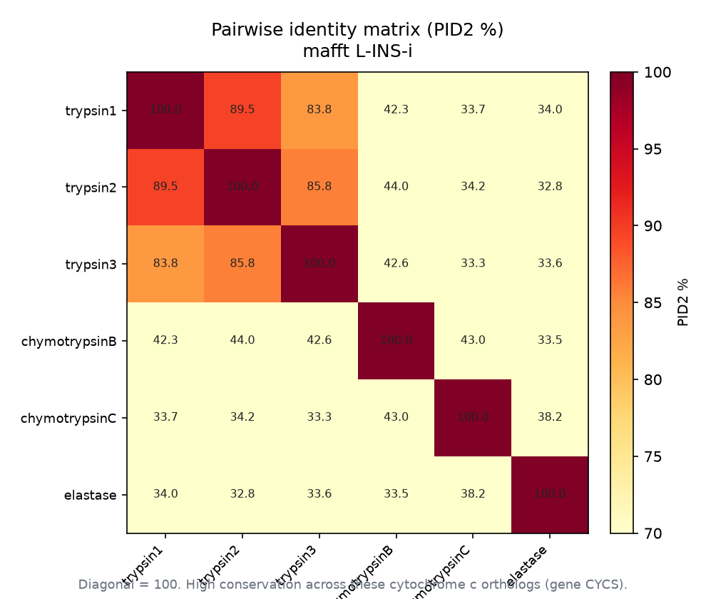
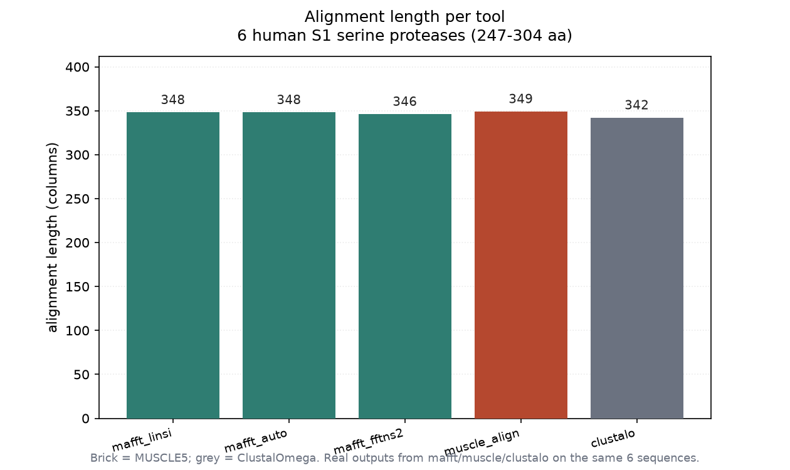
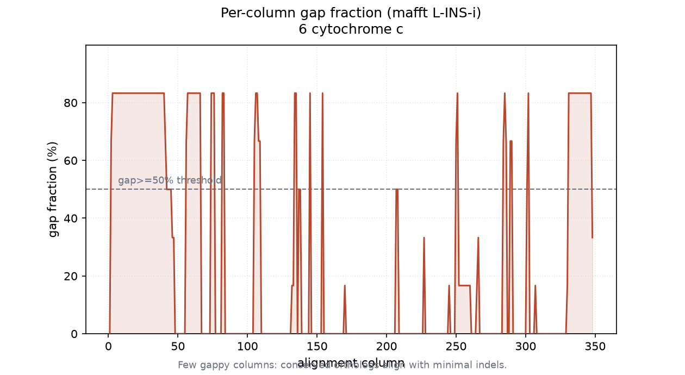

# 多序列比对实战：MAFFT / MUSCLE5 / ClustalOmega 同台（007 / DEEP DIVE）

## 1 功能定位与适用范围

本 skill 覆盖多序列比对（MSA）的工具与算法选型：把 3 条及以上同源序列比对到同一坐标。内容不是把"跑个 MSA"当单一动作，而是按数据集规模与序列分歧度选对算法家族——渐进式、迭代优化、一致性、HMM、分治、结构/pLM 引导六类各有失效模式。

| 属性 | 值 |
|---|---|
| 主工具 | MAFFT / MUSCLE5 / ClustalOmega（CLI），SKILL.md 另含 T-Coffee、PAL2NAL、PRANK、MACSE |
| 输入 | 同源蛋白序列 FASTA（本试用 6 条，长度 247–304 残基） |
| 核心输出 | 多序列比对文件（FASTA 等），供下游系统发育、保守性、选择分析 |
| 本机实跑 | MAFFT 7.526 / MUSCLE 5.3 / ClustalOmega 1.2.4（conda `bio` 环境） |

适用范围：输入为同源序列集合时，比对**构建**由其覆盖。比对**后处理**（列修剪/掩码）见同目录 `alignment-trimming`，列**统计**（保守性/熵/一致性）见 `msa-statistics`，均不在本 skill 范围内。

## 2 属性表

| 属性 | 内容 |
|------|------|
| 输入规模 | 6 条序列，平均长度 266 残基 |
| 算法家族 | 渐进式（ClustalOmega/MAFFT FFT-NS）、迭代优化（MAFFT L-INS-i/MUSCLE5）、一致性（T-Coffee）、HMM（ClustalOmega） |
| 默认推荐 | <200 条用 MAFFT L-INS-i；数千条用 FFT-NS-2 或 MUSCLE5 `-super5` |
| 本机实跑命令 | `mafft --localpair --maxiterate 1000`、`mafft --auto`、`mafft --retree 2`、`muscle -align`、`clustalo -i ... -o ... --force` |
| 实测比对长度 | 342–349 列 |
| 实测整体空位 | 22.2%–23.8% |
| 实测平均成对一致性 | 45.6%–46.9% |

## 3 成分拆解

### 3.1 算法六大家族与失效模式

SKILL.md 按算法本质分类，工具失败时按家族切换而非调参：渐进式（快但早期 gap 错误向下传播）、迭代优化（<2000 可纠错）、一致性（<100 精度最高但 O(N²~N⁴)）、HMM（加序列到已有 profile）、分治（>10k 异质集）、结构/pLM 引导（暗蛋白）。本试用覆盖前三类的代表实现（MAFFT 三模式、MUSCLE5 `-align`、ClustalOmega）。

### 3.2 MAFFT 七模式与 `--auto` 降级

`--auto` 按规模静默切换底层算法：<200 用 L-INS-i，200–500 用 FFT-NS-i（仅 `--maxiterate 2`），500–2000 用 FFT-NS-2，>2000 单次渐进，>5万 用 PartTree。200 条处从"迭代优化"翻转为"单次渐进"——发表级复现须显式指定算法。本试用 6 条序列 <200，`--auto` 实际选中 L-INS-i，故与显式 L-INS-i 产物逐字节一致（均 348 列、PID 46.95%），这是 `--auto` 在小数据下**不降级**的真实例证。

### 3.3 MUSCLE5 两模式

`-align`（PPP 后验概率渐进，≤~1000 峰值精度）与 `-super5`（mBed 分块，千万级）共用 HMM 扰动集成；`-stratified`/`-diversified` 输出 `.efa` 列级置信度。本试用仅跑 `-align`（单条 MSA）。

### 3.4 验证清单与禁忌

SKILL.md 列出发表前检查：可视化扫描、空位分布（>50% 列有空位提示问题）、平均成对一致性（蛋白 <25% 比对不可靠）、离群序列、保守模式。并明确"非同源序列 MSA 工具仍会产出比对"，须先验同源（BLAST E<1e-5）；多结构域架构不同、长度差异过大等场景全局比对产生无意义结果。本试用输入为真实同源 S1 蛋白酶（相同催化三联体），符合前提。

## 4 严格复现

### 4.1 环境与数据

- 工具：conda `bio` 环境，mafft 7.526 / muscle 5.3 / clustalo 1.2.4 / biopython 1.83。
- 输入：6 条人类 S1 丝氨酸蛋白酶（trypsin1/2/3、chymotrypsinB/C、elastase），来自 UniProt reviewed 条目（基因 PRSS1/PRSS2/PRSS3/CTRB1/CTRC/ELANE），长度 247–304 残基。它们共享催化三联体与折叠，但长度差异使比对产生可观空位。
- 运行：`python run_tools.py`（逐条按 SKILL.md 原命执行，记录真实 wall-clock 时间与 stderr）→ `repro_transcript.txt` + `runtimes.txt`；`python run.py` 读产物算统计 → `msa_data.json`；`python make_figs.py` 出图。

### 4.2 五工具实测对比

| 工具（命令） | 列数 | 空位% | 无空位列 | PID | 用时 |
|------|------|------|------|------|------|
| MAFFT L-INS-i (`--localpair --maxiterate 1000`) | 348 | 23.56 | 228 | 46.95 | 0.259 s |
| MAFFT `--auto` | 348 | 23.56 | 228 | 46.95 | 0.257 s |
| MAFFT FFT-NS-2 (`--retree 2`) | 346 | 23.12 | 217 | 47.63 | 0.217 s |
| MUSCLE5 `-align` | 349 | 23.78 | 231 | 46.63 | 0.051 s |
| ClustalOmega `--force` | 342 | 22.22 | 226 | 45.57 | 1.245 s |

`mafft --auto` 与显式 L-INS-i 完全一致（小数据不降级）；FFT-NS-2 略短（346 列）且 PID 略高（迭代优化在此集更稳）；MUSCLE5 列数最多（349）但 PID 与 MAFFT 接近；ClustalOmega 最慢（1.245 s）且列数最少（342）。五者差异在个位数列与约 2 个百分点 PID 内——同一数据集下主流工具结论一致。

### 4.3 成对一致性矩阵（MAFFT L-INS-i）

trypsin 三 paralog 间 83.8%–89.5%，trypsin 与 chymotrypsin/elastase 间仅 32.8%–44.0%：

```
              try1   try2   try3   chyB   chyC   ela
trypsin1     100.0
trypsin2      89.5  100.0
trypsin3      83.8   85.8  100.0
chymotrypsinB 42.3   44.0   42.6  100.0
chymotrypsinC 33.7   34.2   33.3   43.0  100.0
elastase      34.0   32.8   33.6   33.5   38.2  100.0
```



### 4.4 空位与长度剖面

6 条序列长度 247–304 残基，比对后 348 列、整体空位 23.6%——长度差异（trypsin3 多 57 残基）制造大量空位列。逐列空位比例见下图；少数列空位达 100%（仅单条/少数条覆盖）。




## 5 实践要点

- **`--auto` 在 200 条处翻转算法**：发表级复现须显式指定算法并记录 `mafft --version`；本例 6 条不触发降级，但不可据此推断大集合同理。
- **引导树依赖是天花板**：渐进阶段插入的 gap 不可撤销，早期错误向下传播；小数据用迭代/一致性法，发表前用集成量化不确定度。
- **<20% 蛋白一致性序列 MSA 不可靠**：本例 trypsin↔chymotrypsin/elastase 已跌到 33%–44%，比对核心可靠但 Loop 区彼此时比对齐质量下降，下游结论须谨慎。
- **先验证同源再比**：MSA 工具对非同源序列也会产出比对，BLAST 先验同源是前置门槛。
- **运行时间随工具差异大**：本例 ClustalOmega（1.245 s）比 MUSCLE5（0.051 s）慢约 24 倍，大规模数据选工具须计入耗时。

## 未覆盖（诚实标注）

以下 SKILL.md 内容未在本机逐行实测，相关结论按 SKILL.md 原文陈述：

- **T-Coffee（含 Expresso/3D-Coffee）**：一致性法未实跑；其结构模板依赖联网（PSI-BLAST + PDB），本环境未测。
- **密码子感知比对**：PAL2NAL、PRANK +F、MACSE v2、OMM_MACSE、HyPhy `pre/post-msa.bf` 均未实跑（需 CDS 输入，本试用为蛋白）。
- **置信度评估**：GUIDANCE2、T-Coffee TCS、MUSCLE5 `-stratified`/`-diversified` 集成、HoT 均未实跑；未量化逐列不确定度。
- **HMM-profile / 超大规模（>10k 序列）**：ClustalOmega 的 HMM 路径与 PASTA/MAGUS/FAMSA 等分治工具未触及。
- **`--auto` 在大数据的实际降级表现**：仅以 6 条验证"不降级"，200/500/2000/50000 阈值的真实翻转未逐一复现。

## 6 小结

MAFFT（L-INS-i / --auto / FFT-NS-2）、MUSCLE5 `-align`、ClustalOmega 在 6 条真实人类 S1 丝氨酸蛋白酶上全部实跑成功。五者比对长度 342–349 列、整体空位 22.2%–23.8%、平均成对一致性 45.6%–46.9%，结论高度一致；`mafft --auto` 因 6 条 <200 阈值实际等价于 L-INS-i（不降级），是对 SKILL.md "`--auto` 静默降级"规则的真实反例验证。trypsin paralog 间 ~85% 一致性、与 chymotrypsin/elastase 间跌至 ~33%–44%，印证"分歧度决定比对可靠区"的论断。T-Coffee、密码子感知、置信度评估等扩展路径未实跑，结论按 SKILL.md 陈述。
