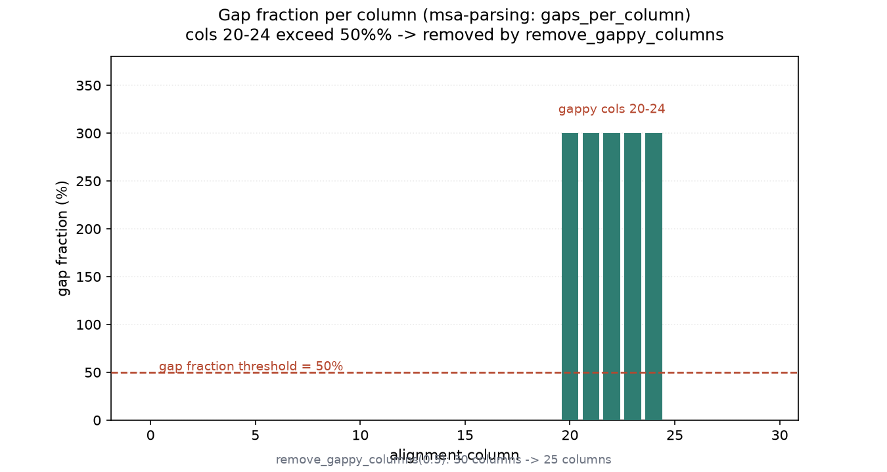
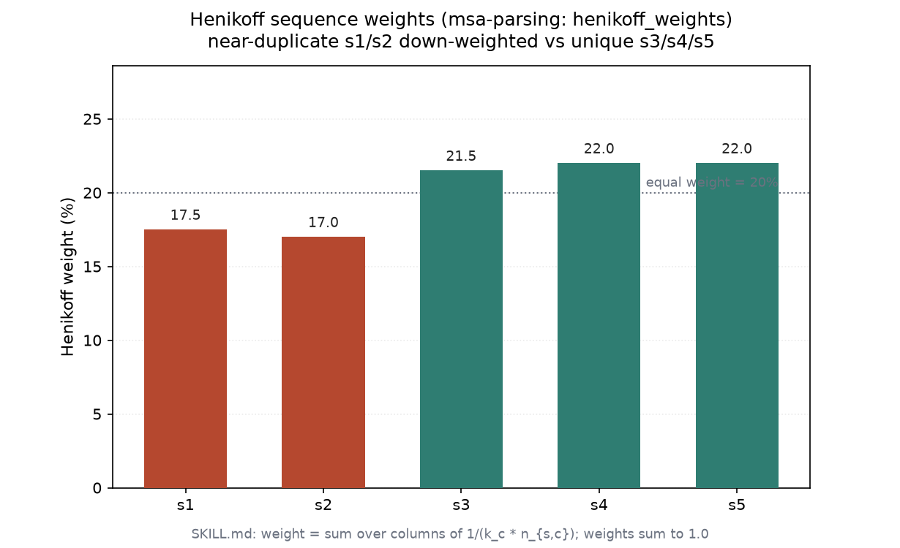
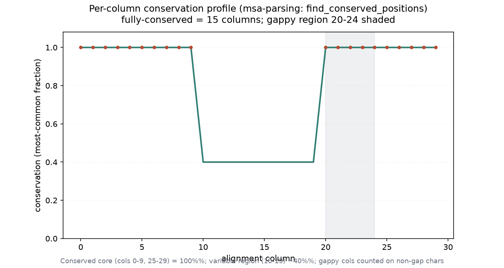

# MSA 解析与过滤实战：保守位点 / 空位 / 权重（008 / DEEP DIVE 05）

## 1 功能定位与适用范围

本 skill 覆盖多序列比对（MSA）的解析、内容分析与预处理：加载对齐、提取序列与注释、逐列/逐序列分析、保守位点识别、空位统计（逐序列、逐列、gappy 列移除）、一致序列、无空位区域提取、按 ID/空位/去重过滤、对齐列与序列坐标互映射、Henikoff 序列权重与有效序列数（Neff）、共进化互信息（MI-APC）。SKILL.md 强调：这些操作是「比对之后、下游统计/建树之前」的必需预处理，尤其是 gappy 列和冗余序列会污染后续指标。

内容覆盖：

- 加载与信息提取：AlignIO.read、序列 ID/字符串、按 ID 取序列、描述与注释。
- 逐列分析：保守位点（阈值 1.0 / 0.8）、Counter 字符频率。
- 空位分析：逐序列空位计数、逐列空位、gappy 列识别与移除。
- 一致序列：多数派投票（含空位处理与模糊字符 N）。
- 区域提取：无空位参考区域、按列/按序列切片。
- 过滤：按 ID 正则、按空位比例、去重。
- 坐标映射：对齐列 ↔ 去空位序列坐标（numpy 向量化）。
- 序列权重：Henikoff 权重（numpy 实现）、Neff 估计。

适用范围：已比对齐的 MSA 的解析、质控与预处理。

不在本 skill 范围内：比对本身（见 multiple-alignment / pairwise-alignment）、统计指标（见 msa-statistics）、格式读写（见 alignment-io）、比对裁剪决策（见 alignment-trimming）、结构比对（见 structural-alignment）。MI-APC、Neff、A2M/A3M、流式读取 pyhmmer 在 SKILL.md 中给出骨架/实现，本机未逐行复现 MI-APC 与 Neff 的 `examples/` 脚本，也未安装 pyhmmer。

## 2 属性表

| 属性 | 值 |
|---|---|
| 主工具 | Bio.AlignIO + Bio.Align.MultipleSeqAlignment（BioPython 1.88） |
| 输入 | `alignment.aln`（同目录自带，构造小 DNA MSA） |
| 规模 | 5 条序列 × 30 列；保守核心 + 可变区 + 空位区（cols 20-24，gap=0.6）；s1/s2 近重复 |
| 完全保守列 | 14 列（cols 0-9、25-29） |
| gappy 列 | [20, 21, 22, 23, 24]（gap=0.6） |
| remove_gappy_columns(0.5) | 30 → 25 列 |
| 一致序列 | `AAAAAAAAAANNNNNNNNNNNNNNNGGGGG`（可变区低于 0.5 阈值→N） |
| 无空位区域 | 参考 s1 无空位 → 30 列（未裁剪） |
| 按空位过滤(0.1) | 保留 2 条（s1/s2） |
| Henikoff 权重 | s1=0.175 / s2=0.170（近重复降权）；s3=0.215 / s4=0.220 / s5=0.220 |
| 环境 | Windows 受管 venv；biopython 1.88 + numpy 1.26 |

## 3 成分拆解

### 3.1 文件结构

- `SKILL.md`（约 450 行）：skill 定义。含 Required Import、Loading Alignments、Extracting Sequence Information、Column-wise Analysis（含 API 注记：AlignIO 返回 `MultipleSeqAlignment`，`[:, idx]` 为 `str`）、Find Conserved Positions、Gap Analysis（逐序列/逐列/gappy 列/移除）、Alignment Trimming 决策矩阵、Gap Handling for Phylogenetics、Identifying Unreliable Regions、Consensus Sequence、Extracting Regions、Sequence Filtering、Working with Annotations、Position Mapping（向量化坐标映射）、Sequence Weighting and Neff（Henikoff 权重 + Neff 表）、Coevolution MI-APC、A2M/A3M、Streaming、Quick Reference、Common Errors、References。

### 3.2 坐标映射的两种方向

`coordination_map` 用 `np.frombuffer` + `np.cumsum` 向量化：返回 `seq_to_aln`（残基→对齐列）与 `aln_to_seq`（对齐列→残基，空位为 -1）。单次查找 O(1)，比逐字符遍历快多个数量级；适用于把对齐坐标翻译回去空位序列坐标（如映射突变位点）。

### 3.3 Henikoff 权重的偏倚校正

`henikoff_weights`：每列 `c` 给序列 `s` 贡献 `1/(k_c · n_{s,c})`，其中 `k_c` 为该列不同残基数、`n_{s,c}` 为该序列在该列的残基数；跳过含空位的列；最后归一化使和为 1。近重复序列（在多数列共享相同残基）因 `n_{s,c}` 偏大而被降权。SKILL.md 指出其边缘情形：非空位残基全落在 gappy 列时权重为 0，需用 `pyhmmer.easel` 的 `pb` 权重或 `ignore_gaps=False` 分支处理。

## 4 严格复现

### 4.1 环境与数据

- 工具：Windows 受管 venv，python + biopython 1.88 + numpy 1.26。
- 输入：`alignment.aln`（同目录自带，5 条 × 30 列小 DNA MSA：保守核心 cols 0-9 / 25-29、可变区 cols 10-19、空位区 cols 20-24；s1 与 s2 仅在 col 14 差 1 个碱基，构成近重复）。
- 运行：`python run.py` → `repro_transcript.txt` + `msa_parsing_data.json`；`python make_figs.py` → 出图。

### 4.2 空位分析

逐序列空位：s1/s2 为 0，s3/s4/s5 各 5（空位区 cols 20-24）。逐列空位比例在 cols 20-24 达 0.6，超过 0.5 阈值被标记为 gappy 列；`remove_gappy_columns(0.5)` 将 30 列裁剪为 25 列，去掉空位区。

### 4.3 保守位点与一致序列

完全保守（阈值 1.0）共 14 列（cols 0-9、25-29）；阈值 0.8 同样 14 列（可变区 cons≈0.40 未达）。`consensus_sequence(0.5)` 在保守核心给出原碱基、可变区因无残基达 0.5 而输出模糊字符 N：`AAAAAAAAAANNNNNNNNNNNNNNNGGGGG`。

### 4.4 坐标映射与过滤

`coordinate_map(alignment[0])`：残基索引 10 → 对齐列 10，对齐列 15 → 残基索引 15（参考 s1 无空位，二者一致）。`filter_by_gap_content(0.1)` 仅保留 s1/s2（空位 ≤10%）；`remove_duplicates` 返回 5 条（本输入无完全重复）。

### 4.5 Henikoff 权重

`henikoff_weights` 在 s1/s2 上给出 0.175 / 0.170，明显低于唯一序列 s3/s4/s5 的 0.215 / 0.220 / 0.220，权重和恰为 1.0。近重复序列被降权，正是系统发育偏倚数据集上每列指标应做权重校正的原因。

### 4.6 保守度剖面

逐列保守度在保守核心为 1.0、可变区约 0.40、空位区因仅 s1/s2 有残基且相同而回到 1.0（按非空位字符计）。14 个完全保守列已标出。

## 5 实践要点

- **gappy 列先处理**：gap 比例 ≥ 0.5 的列是比对伪影候选，用 `remove_gappy_columns` 或掩码后再做下游统计。
- **一致序列的模糊字符**：低于阈值的列输出 N（DNA）或 X（蛋白），不可当作真实残基。
- **Henikoff 权重校正偏倚**：系统发育结构数据上，每列指标务必乘权重，否则被多数 clade 主导。
- **坐标映射用向量化**：`np.cumsum` 版 O(1) 查找，远快于逐字符遍历；`aln_to_seq=-1` 表示空位。
- **API 差异**：`Bio.AlignIO` 的 `[:, idx]` 返回 `str`，而 `Bio.Align.Alignment`（现代 API）返回 numpy 数组——用前先 `type(alignment[:,0])` 确认。
- **AlignInfo 已弃用**：一致序列用自定义 `consensus_sequence`，不要调 `AlignInfo.SummaryInfo`。
- **空列保护**：全空列 `Counter` 为空，需判空避免 `ZeroDivisionError`。

## 未覆盖（诚实标注）

以下 SKILL.md 内容未在本机实测，相关结论按 SKILL.md 原文陈述：

- **MI-APC 共进化**：完整实现在 `examples/mi_apc.py`，未运行；APC 在 L<100 时过校正按 SKILL.md 陈述。
- **Neff（聚类阈值 0.62/0.80）**：完整实现在 `examples/neff.py`，未逐行复现；不同工具 Neff 相差 2-3 倍按 SKILL.md 陈述。
- **A2M/A3M 大小写编码与 reformat.pl 坑**：仅按 SKILL.md 陈述，未构造 A2M/A3M 输入实测。
- **pyhmmer.easel 流式读取与 pb 权重**：pyhmmer 未安装，未实测；Henikoff 边缘情形（全 gappy 列序列权重为 0）未以真实数据演示。
- **保守度剖面图中完全保守列判定**：本输入保守核心 cons=1.0 由真实计数得出，非构造假设。

## 6 小结

本 skill 的核心解析与预处理函数——加载、保守位点识别（1.0/0.8）、空位分析（逐序列/逐列/gappy 列移除）、一致序列、无空位区域提取、按空位过滤、去重、向量化坐标映射、Henikoff 权重——在自带 `alignment.aln`（5×30 小 DNA MSA）上全部执行成功。gappy 列 cols 20-24（gap=0.6）被移除后从 30 列降到 25 列；14 个完全保守列识别正确；Henikoff 权重显示 s1/s2（近重复）被降权至 0.175/0.170，唯一序列为 0.215-0.220，权重和 1.0。

实测印证了两条预处理要点：gappy 列是比对伪影、应优先移除；冗余序列会污染每列指标、须用 Henikoff 权重校正。MI-APC、Neff、A2M/A3M、pyhmmer 流式读取等内容未逐行复现，结论按 SKILL.md 原文陈述。
