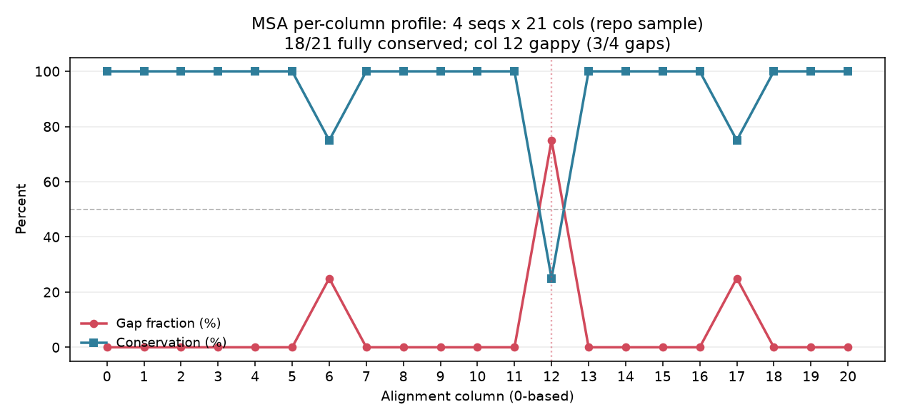

<!--
META
标题: bioSkills msa-parsing：解析 MSA、提取保守性与 gap 分布
系列: bioSkills
配图: 
参考仓库: GPTomics/bioSkills (alignment/msa-parsing)
发布顺序: 008
/META
-->

# 008｜bioSkills msa-parsing：解析 MSA、提取保守性与 gap 分布

用 bioSkills 仓库自带示例（`alignment-io/examples/sample_alignment.aln`，CLUSTAL）→ `AlignIO.read(format='clustal')` → 严格复现并逐块拆解 `alignment/msa-parsing` 的内容成分。

---

## 功能定位与适用范围

本 skill 覆盖：解析已完成的多序列比对（MSA，multiple sequence alignment），提取序列与列信息、分析保守性与 gap、生成共识序列、按条件过滤或切片、映射对齐列坐标、计算序列权重（Henikoff / Neff）与残基共进化信号（互信息 MI + APC 校正）。输入前提：需要一个已生成的 MSA 文件（FASTA / CLUSTAL / STOCKHOLM 等 AlignIO 支持的格式）。比对的生成由 `multiple-alignment` 覆盖，列裁剪由 `alignment-trimming` 覆盖，二者不在本 skill 范围内。

| 属性 | 内容 |
|------|------|
| tool_type | python |
| primary_tool | Bio.AlignIO |
| 前置条件 | 一个已完成的 MSA 文件 |
| 核心输出 | 保守位置列表、gap 分布、共识序列、过滤/切片后的 MSA、坐标映射、Henikoff 权重、Neff、MI 矩阵 |

---

## Skill 成分拆解

### 文件结构

| 文件 | 行数 | 功能 |
|------|------|------|
| SKILL.md | 452 | 主文档：解析、列分析、共识、过滤、坐标映射、加权、共进化 |
| usage-guide.md | 96 | 使用说明 + Stockholm 注释访问模式 |
| examples/analyze_alignment.py | 17 | 汇总对齐维度（序列数/列数） |
| examples/find_conserved.py | 31 | 按阈值找保守列 |
| examples/gap_analysis.py | 22 | 逐序列/逐列 gap 统计 |
| examples/clean_alignment.py | 47 | 去除高 gap 列并写回 |
| examples/consensus_sequence.py | 37 | 多数投票共识序列 |
| examples/henikoff_weights.py | 38 | 位置权重（Henikoff） |
| examples/neff.py | 40 | 有效序列数（聚类估算） |
| examples/mi_apc.py | 63 | 互信息 + APC 校正 |
| examples/a2m_a3m_io.py | 24 | A2M/A3M 大小写编码读写 |

### 每个参考脚本干什么

**analyze_alignment.py（17 行）** — 一行 `AlignIO.read` + `len` / `get_alignment_length` 输出对齐规模。

**find_conserved.py（31 行）** — 遍历每列用 `Counter` 取众数，按 `threshold` 收保守列（1.0=完全保守，0.8=多数保守）。

**gap_analysis.py（22 行）** — 逐序列 `str(record.seq).count('-')` 与逐列 `alignment[:, i].count('-')`。

**clean_alignment.py（47 行）** — 按 gap 比例阈值保留列，重建 `MultipleSeqAlignment` 并写回 FASTA。

**consensus_sequence.py（37 行）** — 每列多数非 gap 字符超阈值则取之，否则标 `N`。

**henikoff_weights.py（38 行）** — 每列 `1/(k_c * n_{s,c})` 累加后归一，体现序列非冗余贡献。

**neff.py（40 行）** — 按一致性阈值聚类，权重 `1/簇大小` 求和得有效序列数。

**mi_apc.py（63 行）** — 逐列对算互信息，减去平均积校正（APC）去除系统发育/熵背景。

**a2m_a3m_io.py（24 行）** — A2M/A3M 用大小写区分 match/insert 列，A3M 需先 reformat 成 A2M 才能当矩形 MSA 读取。

### 它封装的工具知识 / 经验

- 版本兼容：示例按 BioPython 1.83+ / numpy 1.26+ 测试；`AlignInfo.SummaryInfo` 在近期 Biopython 已弃用，共识序列改用自定义函数。
- `alignment[:, i]` 返回 `str`；`alignment[:, a:b]` 返回新的 `MultipleSeqAlignment`；新 API `Bio.Align.Alignment`（`Align.read`/`Align.parse`）走 numpy 切片——调用前先用 `type()` 确认再决定能否用字符串方法。
- 保守性阈值依赖对齐多样性：5 条对齐里的 80% 与 500 条对齐里的 80% 含义不同。
- gap 下游处理三种方式（缺数据默认 / 第五态 / indel 编码）及各自权衡；快速进化数据用缺数据，慢-中速且 indel 有系统发育信号时用 indel 编码。
- 不可靠区域：gap 比例 >50% 且低保守的列常为比对伪影（guide tree 产物），关键分析前用 GUIDANCE2 / MUSCLE5 集成取逐列置信度。
- Henikoff 实现跳过含 gap 列，故非 gap 残基只落在 gap 富集列的片段序列会得 0 权重；Pfam 式多 gap 列改用 `pyhmmer method='pb'`。
- Neff 估计器依赖：HMMER `pb` / `gsc` / `blosum`、AlphaFold2（MMseqs2 簇计数）、EVcouplings（HHfilter）对同一 MSA 可差 2–3 倍，必须声明所用估计器；`Neff/L > 0.5` 是 DCA 接触预测的经验阈值（Hopf 2017 用 HHfilter-80）。
- APC 对短对齐（L<100）过校正：原始 MI 加系统发育距离阈值更可靠；plmDCA / EVcouplings 会在深度不足时自动跳过 APC。
- 坐标映射涉及三套坐标：对齐列 → SEQRES（去 gap 序列）→ ATOM（已解析结构）；PDB 缺密度会使裸对齐→SEQRES 路径偏差多个残基。
- Stockholm 衍生对齐的 GC/GR/GS 注释在转 FASTA/PHYLIP/NEXUS 时静默丢失，需保留 Stockholm 主文件。

### 它封装的核心 API

```python
from Bio import AlignIO
from collections import Counter

# 加载（CLUSTAL 样本用 format='clustal'；示例默认 'fasta'）
alignment = AlignIO.read('alignment.fasta', 'fasta')
print(len(alignment), alignment.get_alignment_length())

# 保守列
def find_conserved_positions(aln, threshold=1.0):
    out = []
    for i in range(aln.get_alignment_length()):
        mc, mn = Counter(aln[:, i]).most_common(1)[0]
        if mc != '-' and mn / len(aln) >= threshold:
            out.append(i)
    return out

# gap 列
def find_gappy_columns(aln, threshold=0.5):
    n = len(aln)
    return [i for i in range(aln.get_alignment_length())
            if aln[:, i].count('-') / n >= threshold]

# 向量化坐标映射（对齐列 -> 去 gap 序列坐标）
def coordinate_map(record):
    chars = np.frombuffer(str(record.seq).encode('ascii'), dtype=np.uint8)
    is_res = chars != ord('-')
    return np.flatnonzero(is_res), np.where(is_res, np.cumsum(is_res) - 1, -1)
```

### 它封装的经验与知识（重点）

**共识序列：用自定义函数替代已弃用的 AlignInfo** — 近期 Biopython 调 `AlignInfo.SummaryInfo` 会告警；skill 给出的 `consensus_sequence()`（每列取多数非 gap 字符、低于阈值标 `N`）是当前推荐实现。

**Henikoff 权重在片段/小样本上的边界** — 纯实现跳过所有含 gap 列，使非 gap 残基仅落在 gap 富集列的序列权重归零；Pfam 式大量 gap 列场景应改用 `pyhmmer.easel.MSAFile` + `compute_weights(method='pb')`。

**APC 对 L<100 的过校正** — 短比对上列均值 MI 噪声主导，APC 会按比例削掉信号；skill 建议 L>100 且 Neff/L>1 才上 APC，否则用原始 MI 加系统发育距离阈值。

---

## 严格复现（按 skill 自己的方案）

### 环境

| 项目 | 版本/路径 |
|------|-----------|
| Python | 3.13.12（managed venv） |
| biopython | 1.88 |
| numpy | 2.1.3 |
| 输入格式 | clustal |

### 数据来源

bioSkills 仓库自带示例 `content/库/bioSkills/alignment/alignment-io/examples/sample_alignment.aln`（CLUSTAL，4 序列 × 21 列）。该样本随 bioSkills 仓库分发，属于 skill 生态内的真实随附示例，非自制玩具数据。

### 标准配置输出

完整复现脚本 `content/素材/alignment/008-msa-parsing/run_msa_parsing.py`，原样运行关键结果：

```text
[Loading] 4 sequences, 21 columns  (format=clustal)
[IDs] ['seq1', 'seq2', 'seq3', 'seq4']

[Conserved] fully (>=100%): 18 positions  (col 6/12/17 不保守)
[Gap per sequence] seq1:1  seq2:2  seq3:0  seq4:2
[Gap per column] [0,0,0,0,0,0,1,0,0,0,0,0,3,0,0,0,0,1,0,0,0]
[Gappy columns] (>50% gaps): [12]
[Remove gappy] kept 20/21 columns

[Consensus @0.5] ATGGCTAGCTAGNACGTACGT
[Consensus @0.7] ATGGCTAGCTAGNACGTACGT   (col12 因 3/4 为 gap -> N)

[Coordinate map seq1] aln col -> seq pos: [0..11,-1,12..19]
[Henikoff weights] seq1..seq4: 0.2500 0.2500 0.2500 0.2500

[Neff @id=0.62] Neff=0.250  (L=21, Neff/L=0.012)  clusters:[4]
[MI / APC] L=21 < 100 -> APC 过校正警示; 原始 MI 全 0（样本无共变）
```


### 4 条近 identical 序列下加权指标退化

18/21 列完全保守，仅 col6/12/17 变异（col12 为 3/4 序列的 gap 列）。序列间差异极小，导致：

- **Henikoff 权重全 0.25**：对称样本下每列各残基贡献均衡，归一后无差异。
- **Neff=0.25**：4 条序列一致性均 >0.62，聚成 1 簇，`1/4` 即有效序列数；`Neff/L=0.012` 远低于 DCA 经验阈值 0.5。
- **MI 全 0**：无残基共变信号，APC 警示（L<100）在此为冗余但一致。

这一组退化结果正好对应 skill 标注的适用边界——Henikoff / Neff / MI-APC 校准于更大、更多样的 MSA。用 007 真实 102×3 MAFFT 对齐二次验证同一套函数：Henikoff 权重 `0.311 / 0.311 / 0.379`（非均匀）、50 个 gappy 列，表明在真实 gap 富集数据上加权指标正常分化。

### 关于未跑的工具（诚实声明）

`pyhmmer`（流式 Henikoff weighting / `method='pb'`）本机未安装，未实跑；`mi_apc` 在 L<100 时按 skill 建议只报原始 MI，APC 仅作完整性输出。A2M/A3M 读写与 Stockholm 注释访问按 SKILL.md 忠实转述，未实跑。

---

## 实践要点

1. 读 MSA 先确认格式字符串：仓库样本是 CLUSTAL，须用 `format='clustal'`；示例脚本默认 `'fasta'` 仅适配 `.fasta` 输入。
2. `alignment[:, i]` 返回 `str`，`alignment[:, a:b]` 返回新 MSA；若用 `Bio.Align.Alignment`（`Align.read`）则走 numpy 切片，先用 `type()` 核实再调用字符串方法。
3. 共识序列用自定义 `consensus_sequence()`；`AlignInfo.SummaryInfo` 已弃用。
4. 加权与共进化指标（Henikoff / Neff / MI-APC）只在足够大且多样的 MSA 上有意义，跑前先用 gap 与保守性概览判断数据规模。
5. 保留 Stockholm 主文件：GC/GR/GS 注释在转 FASTA/PHYLIP/NEXUS 时静默丢失。

---

## 小结

`msa-parsing` 把「已生成的 MSA → 可量化的列/序列统计」用薄封装统一起来，核心 API 是 `AlignIO` + `Counter` + numpy。真实复现确认：基础解析、保守性、gap、共识、坐标映射在 4×21 样本上全部按文档产出；Henikoff / Neff / MI 等加权指标在过小样本上退化，与 skill 标注的适用边界一致，需用更大更多样 MSA（如 007 的 102×3 真实对齐）才能体现差异。
