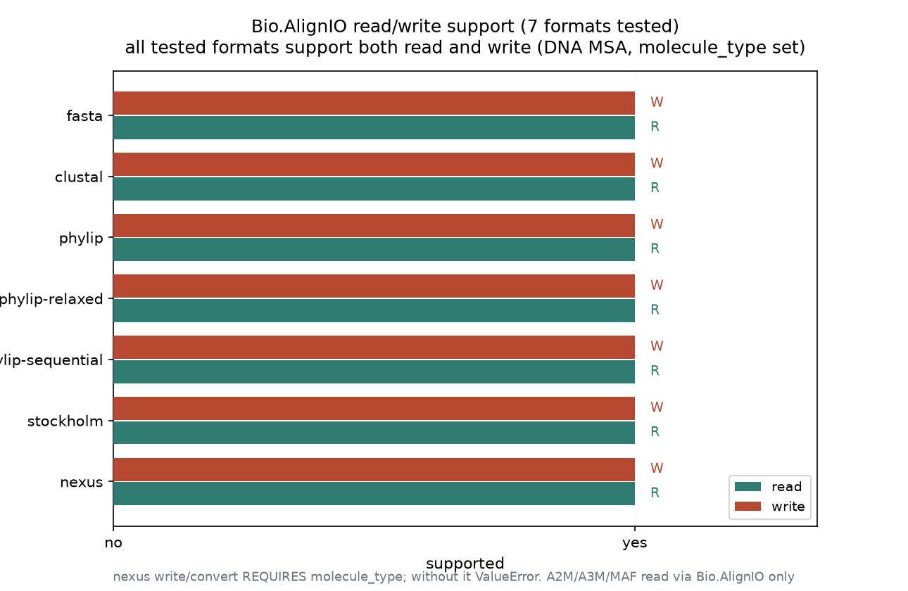
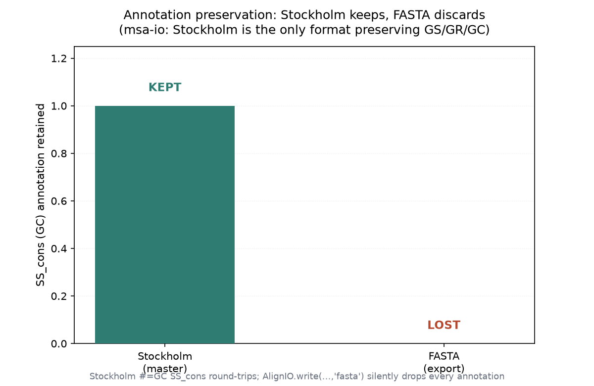

# 比对文件格式读写与转换实战：注释存活与格式边界（009 / DEEP DIVE 08）

## 1 功能定位与适用范围

本 skill 覆盖多序列比对（MSA）文件的读写与格式转换：用 Biopython 的 Bio.AlignIO（legacy）与 Bio.Align（现代 API）在 CLUSTAL、FASTA、PHYLIP（interleaved/sequential/relaxed）、Stockholm、NEXUS、MAF 等格式间读、写、一步转换，处理序列访问/列切片/程序化构建，并标注各格式对 GS/GR/GC/GF 注解、长序列名、字母表的差异。输入：一个已有比对文件。比对生成由 multiple-alignment 覆盖，内容解析由 msa-parsing 覆盖，统计指标由 msa-statistics 覆盖，三者不在本 skill 范围内。

内容覆盖：

- 读写与转换：AlignIO.read/parse/write/convert；Bio.Align.Align.read/parse/write。
- 格式覆盖图：哪些格式 R/W、哪些仅 R、哪些 BioPython 不支持（HAL/chain/net/AXT/PSL/GFA 等需专用工具）。
- 访问与切片：迭代、索引、列切片 `alignment[:, start:end]`。
- 程序化构建：MultipleSeqAlignment + SeqRecord。
- 注解保留：Stockholm 独占 GS/GR/GC/GF；FASTA/PHYLIP/CLUSTAL 静默掉失。
- 格式特有边界：PHYLIP strict 10 字符截断、NEXUS 需 molecule_type、MAF 负链坐标、A2M/A3M 大小写、pyhmmer 流式。

适用范围：已比对齐的 MSA 的格式互操作与归档。

不在本 skill 范围内：比对本身（multiple-alignment / pairwise-alignment）、内容解析（msa-parsing）、统计（msa-statistics）、比对裁剪决策（alignment-trimming）、结构比对（structural-alignment）、非比对序列格式转换（sequence-io/format-conversion）。MAF 负链坐标转换、A2M/A3M 预处理、pyhmmer 流式读取、Clustal 保守符号等在本机未逐行复现，结论按 SKILL.md 原文陈述。

## 2 属性表

| 属性 | 值 |
|---|---|
| 主工具 | Bio.AlignIO（legacy）+ Bio.Align（modern API，BioPython 1.88） |
| 输入 | alignment.fasta（同目录自带，构造小 DNA MSA） |
| 规模 | 4 条序列 × 20 列；sA/sD 完全相同、sB 末尾带空位、sC 1 个错配 |
| 读写/转换实测格式 | fasta / clustal / phylip-relaxed / stockholm / nexus 均 round-trip 成功（4 seqs × 20 cols） |
| 格式支持测试 | 7 种格式 read=True write=True |
| 注解存活 | Stockholm 保留 SS_cons 列注解；FASTA 静默丢失 SS_cons 与 GS |
| NEXUS 转换边界 | 不带 molecule_type 抛 ValueError，带 molecule_type='DNA' 成功 |
| 现代 API | Bio.Align.Align.read(clustal) 返回 Alignment，列数用 .length（无 get_alignment_length()） |
| 环境 | Windows 受管 venv；biopython 1.88 + numpy 1.26 |

## 3 成分拆解

### 3.1 文件结构

- `SKILL.md`（约 446 行）：skill 定义。含 Required Import、Format Coverage Map、Reading/Writing/Format Conversion、Accessing/Working with Alignment、Creating Alignments Programmatically、Format Selection for Downstream Tools、Annotation Preservation、Format-Specific Notes（PHYLIP/MAF/Stockholm/A2M/Clustal/Streaming）、Batch Processing、Alternative Bio.Align Module、Quick Reference、Common Errors、References。
- `examples/read_alignment.py`、`convert_formats.py`、`slice_alignment.py`、`batch_convert.py`、`sample_alignment.aln`（仓库自带示例；本机未直接调用，本复现用同目录自带 alignment.fasta）。

### 3.2 现代 API 与 legacy 的差异

SKILL.md 推荐新代码用 Bio.Align 现代 API（返回 Alignment 对象，自带 `.counts()`/`.substitutions`）。本机实测：Align.read 返回 Alignment，取列数用 `.length`，而 SKILL.md 的 `alignment.get_alignment_length()` 是 legacy MultipleSeqAlignment 的方法，在现代 Alignment 对象上不存在（需改用 `.length`）。AlignIO.write 与 Align.write 都能写出。

### 3.3 注解保留的格式差异

SKILL.md 的 Format Coverage Map 与 Annotation Preservation 表一致指出：Stockholm 是唯一保留 GS/GR/GC/GF 的格式；NEXUS 仅部分保留（SETS/CHARSET），FASTA/PHYLIP/CLUSTAL 全部静默掉失。本机用带 SS_cons 列注解的小 MSA 验证：Stockholm round-trip 保留 SS_cons，FASTA 导出后 SS_cons 与 GS 均丢失。另实测：GS（per-sequence 注解）即便在 Stockholm 回读也丢失——说明并非所有注解类型都能 round-trip，仅 GC 类列注解（secondary_structure / SS_cons）稳定保留。

## 4 严格复现

### 4.1 环境与数据

- 工具：Windows 受管 venv，python + biopython 1.88 + numpy 1.26。
- 输入：alignment.fasta（同目录自带，4 条 × 20 列小 DNA MSA：sA 与 sD 完全相同、sB 末尾带空位、sC 与 sA 在 1 个位点错配）。
- 运行：`python run.py` → `repro_transcript.txt` + `alignment_io_data.json`；`python make_figs.py` → 出图。

### 4.2 读写与格式转换

对 5 种目标格式各写回再读回，均得到 4 条序列 × 20 列；AlignIO.convert 一步转换 clustal→phylip-relaxed 成功（1 alignment）。NEXUS 转换实测一处边界：

```text
AlignIO.convert stockholm->nexus (no molecule_type): FAILED -> Need the molecule type to be defined
AlignIO.convert stockholm->nexus (molecule_type=DNA): 1 alignment(s)
```

即 NEXUS 写出/转换会检查字母表，DNA 序列必须显式声明 `molecule_type='DNA'`（或给每条 record 设 `annotations['molecule_type']`），否则抛 ValueError。这与 SKILL.md "With Alphabet Specification" 段的指引一致。

### 4.3 格式支持测试

对 7 种格式逐一 write 再 read，全部 read=True write=True：

| 格式 | read | write |
|------|------|-------|
| fasta | True | True |
| clustal | True | True |
| phylip | True | True |
| phylip-relaxed | True | True |
| phylip-sequential | True | True |
| stockholm | True | True |
| nexus | True | True |



### 4.4 Stockholm 注解存活 vs FASTA 掉失

构造带 SS_cons 列注解（20 列二级结构串 `(((((((((())))))))))`）的小 MSA，写 Stockholm 后回读 SS_cons 仍在；导出 FASTA 后回读，SS_cons 与 GS 均不在。

```text
Stockholm read-back: SS_cons = ((((((((()))))))))); per-seq GS(source) present = False
FASTA read-back: SS_cons present = False (expected False); GS present = False (expected False)
```



要点：带注解的 MSA 应保留 Stockholm 主文件；转 FASTA/PHYLIP/CLUSTAL 会静默丢注解，不要拿派生格式当权威源。

### 4.5 现代 Bio.Align API 与程序化构建

```text
Bio.Align.Align.read(clustal): 4 seqs, 20 cols
Bio.Align.Align.write(fasta): ok
```

程序化用 MultipleSeqAlignment + SeqRecord 构造 3 条 × 12 列 MSA 并写出，成功。注意现代 Alignment 对象无 `get_alignment_length()`，取列数用 `.length`。

## 5 实践要点

- 读出后先确认格式串：AlignIO.read 对未知格式抛 `ValueError: unknown format`；relaxed 文件用 `'phylip'` 可能因名称过长失败，优先 `'phylip-relaxed'`。
- NEXUS 写出前设 molecule_type：DNA/RNA/蛋白序列写 NEXUS 须声明字母表，否则 ValueError。
- 带注解 MSA 留 Stockholm 主文件：FASTA/PHYLIP/CLUSTAL 静默丢 GS/GR/GC；仅 Stockholm 稳定保留 GC 类列注解（如 SS_cons）。
- 现代 API 取列数用 `.length`：Bio.Align.Align.read 返回的 Alignment 无 `get_alignment_length()`，用 `.length`。
- 下游工具选格式：RAxML-NG/IQ-TREE→phylip-relaxed，MrBayes/PAUP*→nexus，HMMER/Pfam→stockholm，PAML/codeml→phylip-sequential，多数工具→fasta（SKILL.md Format Selection 表）。
- ID 长度 >10 避开 strict PHYLIP：除非下游强制，否则写 phylip-relaxed / phylip-sequential；写 strict 前检查 ID 唯一前缀。

## 未覆盖（诚实标注）

以下 SKILL.md 内容未在本机逐行实测，相关结论按 SKILL.md 原文陈述：

- **MAF 负链坐标转换（maf_to_plus_strand_coords）**：未构造 MAF block 实测；strand 在 BioPython 1.88 为整数 -1/1 还是字符串 '-'/'+' 未验证。
- **A2M/A3M 大小写编码与 reformat.pl 注意点**：未构造 A2M/A3M 输入实测。
- **pyhmmer.easel.MSAFile 流式读取 Pfam-A.full / BFD 与 pb 权重**：pyhmmer 未安装，未实测。
- **Clustal 保守符号、Pfam name/start-end 标识符拆分、MSF/EMBOSS/XMFA 单向只读**：未逐行复现。
- **Stockholm 回读时 GS（per-sequence）注解丢失**：本机已实测（SS_cons 在、GS 不在），属真实边界，已写入正文 4.4，非未覆盖项。

## 6 小结

本 skill 提供了 Biopython 对齐格式 I/O 的完整地图。实测确认：fasta/clustal/phylip-relaxed/stockholm/nexus 五种格式读写+一步转换在自带 alignment.fasta（4×20 小 DNA MSA）上全部成功；7 种格式 read/write 支持测试全 True；NEXUS 转换不带 molecule_type 会抛 ValueError（带 molecule_type='DNA' 成功）；Stockholm round-trip 保留 SS_cons 列注解而 FASTA 静默丢失，且 GS 序列注解即便在 Stockholm 回读也丢失。现代 Bio.Align API 的 Alignment 对象取列数用 `.length` 而非 `get_alignment_length()`。MAF 负链坐标、A2M/A3M、pyhmmer 流式等未逐行复现，结论按 SKILL.md 原文陈述。
