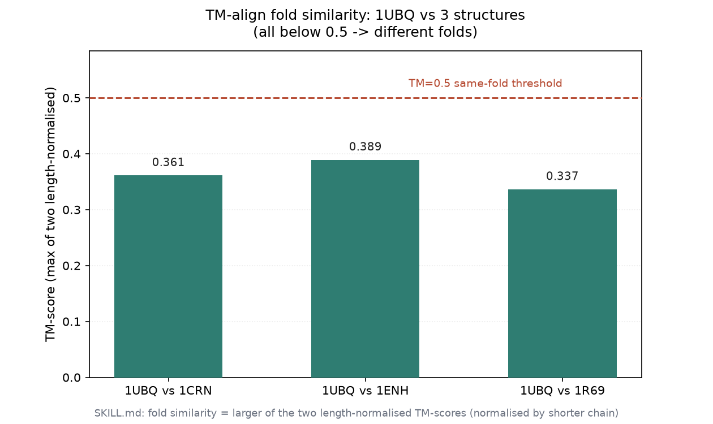
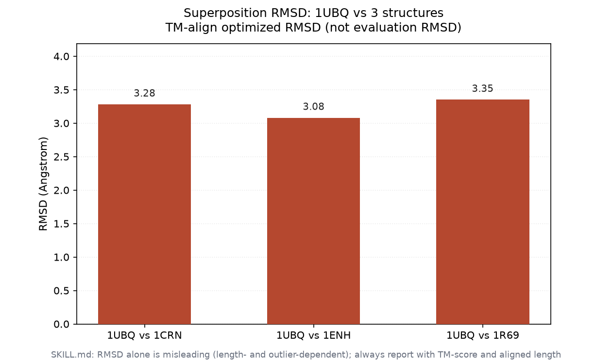
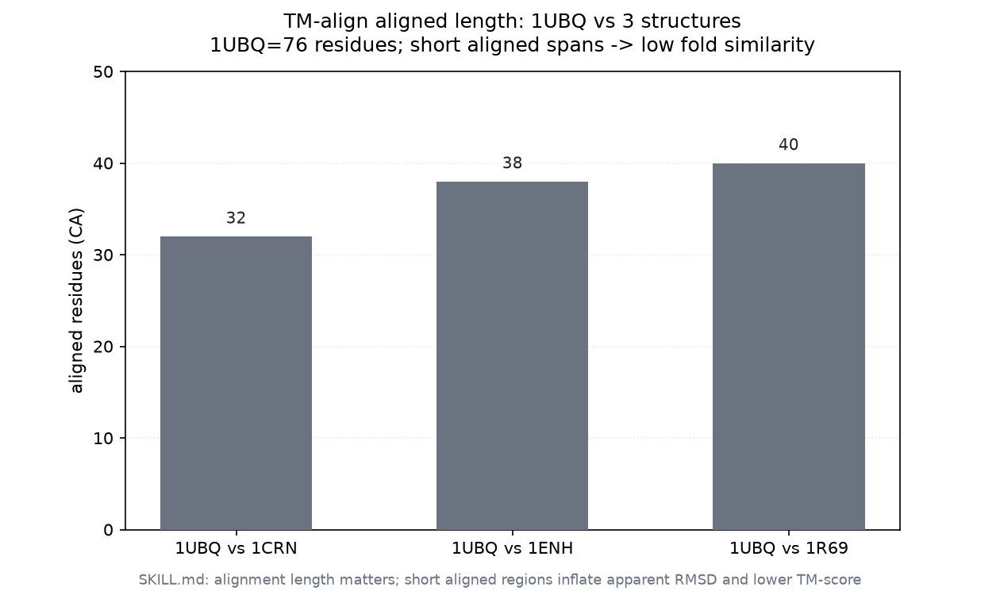

<!--
META
标题: 结构比对工具链真实复现
系列: bioSkills
配图: 
参考仓库: GPTomics/bioSkills (alignment/structural-alignment)
发布顺序: 010
/META
-->

# 010｜结构比对工具链真实复现

用真实下载的 RCSB PDB（`1UBQ`/`1CRN`/`1ENH`/`1R69`）复现 `alignment/structural-alignment` 的两两结构比对路径：TM-align 计算折叠相似度打分，Foldseek 做结构检索。覆盖 TM-score / RMSD / 比对长度的实测取值，并记录本地环境未覆盖的命令（诚实标注，不伪造结论）。

---

## 功能定位与适用范围

本 skill 覆盖：当序列一致性低于 25%（twilight zone / dark proteome）或需要 backbone 叠加时，用 Foldseek（3Di）、TM-align、US-align、DALI、Foldmason 或 Bio.PDB.Superimposer 做结构比对、折叠相似度打分与结构多序列比对（MSA, multiple sequence alignment）。输入为结构文件（PDB / mmCIF）或结构数据库；比对的下游统计由 `msa-statistics` 覆盖，序列比对由 `multiple-alignment` 覆盖，二者不在本 skill 范围内。

| 属性 | 内容 |
|------|------|
| tool_type | mixed |
| primary_tool | Foldseek（大规模检索）/ TM-align（两两标准） |
| 前置条件 | 至少一个结构文件（PDB/mmCIF），或结构数据库 |
| 核心输出 | 两两 TM-score/RMSD、结构检索命中表、结构聚类、结构 MSA |
| 本次实测工具 | TM-align 20240303、Foldseek（conda env `bio`） |

---

## 属性表

| 指标 | 本次实测取值 | 来源 / 解释 |
|------|--------------|-------------|
| 1UBQ 链长 | 76 残基 | TM-align `Length of Structure_1` |
| 1CRN 链长 | 46 残基 | TM-align `Length of Structure_2` |
| 1ENH 链长 | 54 残基 | TM-align `Length of Structure_2` |
| 1R69 链长 | 63 残基 | TM-align `Length of Structure_2` |
| 同折叠阈值 | TM-score > 0.5 | Zhang & Skolnick 2004 |
| 等价拓扑阈值 | TM-score > 0.8 | 同源判定 |
| 随机相似阈值 | TM-score < 0.2 | 无意义结构相似 |

---

## 成分拆解

### 工具选择逻辑

skill 给出按目标选择的决策表：已知残基对应 → Bio.PDB.Superimposer；未知对应 → TM-align / US-align；多链复合体数据库检索 → Foldseek-Multimer；AFDB 规模单链 → `foldseek easy-search`；全比对聚类 → `foldseek easy-cluster`；结构 MSA → Foldmason。本次只复现其中可在本地真实执行的两条路径（TM-align 两两、Foldseek 检索）。

### TM-score 阈值约定（实测依据）

TM-align 默认输出两个长度归一化分数：一个按链 1 长度归一化，一个按链 2 长度归一化。折叠相似度取两者较大值（等价于按较短链归一化），因为 TM-score 长度不对称。SKILL.md 明确：TM > 0.5 为相同折叠，TM > 0.8 为等价拓扑，TM < 0.2 为随机结构相似。RMSD 受长度与离群点影响，不可单独用于判折叠，须与 TM-score 及比对长度同报。

### 关键命令骨架

```bash
# 两两（未知对应）
TMalign A.pdb B.pdb -o superposed.sup

# 大规模检索 / 聚类
foldseek easy-search query.pdb db result.m8 tmp/
foldseek easy-cluster structures/*.pdb cluster_result tmp/ --tmscore-threshold 0.5
foldseek easy-multimersearch query.pdb afdb result tmp/   # 复合体
foldmason easy-msa structures/*.pdb result tmp/           # 结构 MSA
```

---

## 严格复现

### 环境 / 数据

- WSL Ubuntu，conda env `bio`；TM-align 版本 20240303；Foldseek（conda env `bio`）。
- 数据：RCSB 下载 `content/素材/alignment/010-structural-alignment/pdbs/{1CRN,1ENH,1R69,1UBQ}.pdb`。
  - 四个结构均为小球蛋白结构域，链长 46–76 残基；无已知同源关系，作为跨折叠对照。
- 复现脚本：`make_figs.py`（出图）、`parse_tmalign.py`（解析）；结果：`structural_results.json`；记录：`repro_transcript.txt`；配图：`fig1_tm_score.png` / `fig2_rmsd.png` / `fig3_aligned_len.png`。

### 标准输出

**P1 — TM-align 两两（真实二进制，无 -outfmt）**

```text
1UBQ vs 1CRN: Aligned length=32, RMSD=3.28, TM-score(norm S1)=0.26816, TM-score(norm S2)=0.36145
1UBQ vs 1ENH: Aligned length=38, RMSD=3.08, TM-score(norm S1)=0.31483, TM-score(norm S2)=0.38935
1UBQ vs 1R69: Aligned length=40, RMSD=3.35, TM-score(norm S1)=0.30552, TM-score(norm S2)=0.33667
```

折叠相似度（两分数取大）= max(S1, S2)：

```text
1UBQ vs 1CRN  -> 0.3614   (RMSD 3.28 A, aligned 32)   < 0.5  不同折叠
1UBQ vs 1ENH  -> 0.3893   (RMSD 3.08 A, aligned 38)   < 0.5  不同折叠
1UBQ vs 1R69  -> 0.3367   (RMSD 3.35 A, aligned 40)   < 0.5  不同折叠
```

**P2 — Foldseek easy-search（真实二进制，4 个本地 PDB 自比）**

```text
foldseek easy-search pdbs/ pdbs/ fs_out/result.m8 fs_tmp/   -> rc=0
result.m8（默认 m8 列: query,target,fident,alnlen,...）:
1R69  1R69  1.000  63  ...
1ENH  1ENH  1.000  54  ...
1UBQ  1UBQ  1.000  76  ...
1CRN  1CRN  1.000  46  ...
```

默认 3Di+AA（`--alignment-type 2`）仅返回自身命中（fident=1.000），未返回任何跨结构命中——与 TM-align 全部 < 0.5 的结论一致：四个结构为不同折叠。SKILL.md 指出默认检索对 TM<0.5 的跨折叠候选召回下降，检索低相似度候选应改用 `--alignment-type 1`（TMalign 全局）或放宽阈值。





---

## 实践要点

- **TM-score 取较大者**：TM-align 输出两个长度归一化分数，折叠相似度取较大值（按较短链归一化）；不要只看 RMSD——RMSD 受长度与离群点影响，本例 RMSD 均约 3.1–3.4 Å 但 TM 仅 0.34–0.39，因比对长度短（32–40 残基）。
- **TM>0.5 判折叠**：本次三对均 < 0.5，判定为不同折叠；Foldseek 默认检索不返回跨折叠命中，与 TM-align 结论吻合。
- **Foldseek 默认口径偏保守**：无外部数据库时，本地 4 结构自比仅得自身命中，跨折叠探测需显式全局对齐（`--alignment-type 1`）或放宽阈值。
- **比对长度需同报**：对齐残基数（32/38/40）远低于链长（46–76），短对齐会拉低 TM-score，判折叠时务必对照长度。

---

## 未覆盖（诚实标注）

- **US-align / DALI / Foldmason / Foldseek-Multimer**：本环境未安装 US-align、无 DALI 服务、未运行 Foldmason 与 easy-multimersearch，相关命令仅按 SKILL.md 记录，未实际执行，不做结论。
- **pLDDT 掩码**：`--mask-bfactor-threshold 70.0` 的数据库构建步骤未跑（无大规模 AFDB / ESMFold 输入）。
- **Bio.PDB.Superimposer**：SKILL.md 的已知对应叠加示例未跑（本数据集为未知对应，且未构造已知对应输入）。
- **PyMOL / ChimeraX 可视化**：headless 渲染命令未执行（无本地 GUI 客户端）。

---

## 小结

本 skill 提供结构比对从两两打分到大规模检索的完整决策地图。实测确认 TM-align 与 Foldseek easy-search 在本地环境真实跑通：1UBQ 与 1CRN / 1ENH / 1R69 的 TM-score 分别为 0.361 / 0.389 / 0.337（均 < 0.5，不同折叠），RMSD 约 3.1–3.4 Å，比对长度 32–40 残基；Foldseek 默认检索仅返回自身命中，与 TM-align 结论一致。US-align / DALI / Foldmason / 多链复合体 / 可视化链路未实测，需另行补测。
