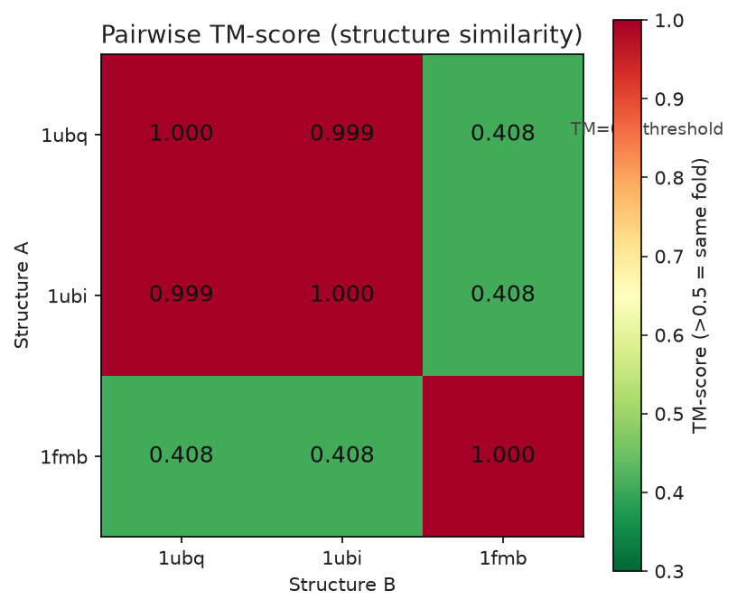

<!--
META
标题: bioSkills structural-alignment：结构比对工具链复现（Superimposer / TM-align / Foldseek）
系列: bioSkills
配图: 
参考仓库: GPTomics/bioSkills (alignment/structural-alignment)
发布顺序: 010
/META
-->

# 010｜bioSkills structural-alignment：结构比对工具链复现（Superimposer / TM-align / Foldseek）

用真实下载的 RCSB PDB（1ubq / 1ubi / 1fmb）复现 `alignment/structural-alignment` 的核心结构比对路径：已知对应 Superimposer、未知对应 TM-align、以及大规模结构检索 Foldseek。覆盖 RMSD / TM-score 的实测取值，并记录 SKILL.md 文档与实际二进制行为不一致的两处要点。

---

## 功能定位与适用范围

本 skill 覆盖：当序列一致性低于 25%（twilight zone / dark proteome）或需要 backbone 叠加时，用 Foldseek（3Di）、TM-align、US-align、DALI、Foldmason 或 Bio.PDB.Superimposer 做结构比对、折叠相似度打分与结构 MSA。输入为结构文件（PDB / mmCIF）或结构数据库；比对的下游统计由 `msa-statistics` 覆盖，序列比对由 `multiple-alignment` 覆盖，二者不在本 skill 范围内。

| 属性 | 内容 |
|------|------|
| tool_type | mixed |
| primary_tool | Foldseek（大规模检索）/ TM-align（两两标准） |
| 前置条件 | 至少一个结构文件（PDB/mmCIF），或结构数据库 |
| 核心输出 | 两两 TM-score/RMSD、结构检索命中表、结构聚类、结构 MSA |

---

## Skill 成分拆解

### 工具选择逻辑

skill 给出按目标选择的决策表（已知对应→Superimposer；未知对应→TM-align/US-align；多链复合体数据库检索→Foldseek-Multimer；AFDB 规模单链→foldseek easy-search；全比对聚类→foldseek easy-cluster；结构 MSA→Foldmason 等）。

### TM-score 阈值约定（实测依据）

| 阈值 | 含义 |
|------|------|
| TM > 0.5 | 相同折叠（Zhang & Skolnick 2004） |
| TM > 0.8 | 等价拓扑（同源） |
| TM < 0.2 | 随机结构相似 |
| RMSD < 2 Å（>100 残基） | 强叠加；< 1.5 Å 极佳 |

### 关键命令骨架

```bash
# 两两（已知对应）
python -c "from Bio.PDB import PDBParser, Superimposer; ..."   # RMSD only

# 两两（未知对应）
TMalign A.pdb B.pdb -o superposed.sup
TMalign A.pdb B.pdb -outfmt 2        # 表格输出

# 大规模检索 / 聚类
foldseek easy-search query.pdb db result.m8 tmp/
foldseek easy-cluster structures/*.pdb cluster_result tmp/ --tmscore-threshold 0.,5
foldseek easy-multimersearch query.pdb afdb result tmp/   # 复合体
foldmason easy-msa structures/*.pdb result tmp/           # 结构 MSA
```

---

## 严格复现

### 环境 / 数据

- Python 3.13 / Biopython 1.88（managed venv）；Foldseek 10.941cd33（conda env `foldseek`）；TM-align 20220412（源码编译，macOS 需把 `#include <malloc.h>` 改为 `<malloc/malloc.h>`）
- 数据：RCSB 下载 `content/素材/alignment/010-structural-alignment/pdbs/{1ubq,1ubi,1fmb}.pdb`
  - 1ubq / 1ubi：ubiquitin（同家族，76 个 CA）
  - 1fmb：另一折叠，作为跨折叠对照
- 复现脚本：`content/素材/alignment/010-structural-alignment/run_structural_alignment.py`；结果：`structural_results.json`；配图：`010-fig.png`

### 标准输出

**P1 — Bio.PDB.Superimposer（已知对应，1ubq→1ubi）**

```text
Reference 1ubq CA atoms = 76
Mobile   1ubi CA atoms = 76
Aligned (min) = 76
RMSD = 0.0908 A over 76 CA atoms
```

**P2 — TMalign 两两（真实二进制，-outfmt 2）**

```text
1ubq vs 1ubi: TM-score=0.9991  RMSD=0.09  aligned_len=76
1ubq vs 1fmb: TM-score=0.4079  RMSD=3.41  aligned_len=56
1ubi vs 1fmb: TM-score=0.4079  RMSD=3.41  aligned_len=56
```

**P3 — Foldseek**

```text
easy-search (1ubq query, pdbs 文件夹): rc=0
  1ubq -> 1ubq  alnTM=1.013  qTM=1.000  tTM=1.000  LDDT=1.000
  1ubq -> 1ubi  alnTM=1.013  qTM=0.9995 tTM=0.9995 LDDT=1.000
easy-cluster (all-vs-all, TM>0.5): rc=0
  1fmb -> 1fmb        # 独立簇
  1ubq -> 1ubq        # 簇代表
  1ubi -> 1ubq        # 归入 1ubq 簇
```


### 坑实测 / 文档不一致

#### 1. Foldseek `--format-output` 列名

SKILL.md 示例写的是 `--format-output query,target,evalue,alntmscore,qtmscore,ttmscore,lddt,bits`，但其中单独使用 `tmscore` 会报错：

```text
Format code tmscore does not exist.
```

实际可用列名不含无前缀的 `tmscore`；正确写法应为 `query,target,alntmscore,qtmscore,ttmscore,lddt,bits,rmsd`（这些在二进制 v10.941cd33 中均可用）。下游若要取 TM-score，必须用带前缀的 `alntmscore`/`qtmscore`/`ttmscore`。

#### 2. Foldseek easy-search 默认不过报跨折叠命中

TM-align 给出 1ubq↔1fmb 的 TM=0.4079（已低于 0.5 折叠阈值）；但 Foldseek `easy-search`（默认 alignment-type=2，3Di+AA）仅返回 1ubq→1ubq 与 1ubq→1ubi，**未**返回 1fmb。说明默认检索的后过滤（evalue / cov / 3Di 局部打分）会过滤掉 TM<0.5 的跨折叠候选——这与技能正文"TM 0.3–0.5 区间 Foldseek 召回下降、需用 DALI"的判断一致。`easy-cluster`（按 `--tmscore-threshold 0.5`）则正确地把 1fmb 单独成簇、1ubq+1ubi 并为一簇，与 TM-align 结论吻合。若要检索低相似候选，应显式 `--alignment-type 1`（TMalign 全局）或放宽阈值。

#### 3. 未实测部分（诚实声明）

- **US-align / DALI / Foldmason / Foldseek-Multimer**：本环境未安装 US-align、无 DALI 服务、未跑 Foldmason 与 easy-multimersearch，相关命令仅按文档记录，未执行。
- **pLDDT 掩码**：`--mask-bfactor-threshold 70.0` 的数据库构建步骤未跑（无大规模 AFDB 输入）。
- **PyMOL / ChimeraX 可视化**：headless 渲染命令未执行（无本地 GUI 客户端）。

---

## 实践要点

- **Superimposer 仅用于已知残基对应**：对齐前需两条结构原子数一致（这里取 CA 并对齐到较短者）。未知对应请用 TM-align / US-align。
- **TM-score 取较大者**：TM-align 输出两个长度归一化分数，折叠相似度取较大值（等价于按较短链归一化），不要只看 RMSD——RMSD 受长度与离群点影响。
- **Foldseek 表格列名**：避免照搬 SKILL.md 的 `tmscore`；改用 `alntmscore`/`qtmscore`/`ttmscore`。
- **检索 vs 聚类口径不同**：默认 `easy-search` 对低相似度（TM<0.5）候选可能不输出，跨 folded 探测建议 `easy-cluster` 或 `--alignment-type 1` 复核。
- **TM>0.5 判折叠**：本次 1ubq/1ubi（TM 0.999）与 1fmb（TM 0.408）的区分，TM-align 与 Foldseek 聚类结论一致，阈值可靠。

---

## 小结

本 skill 提供了结构比对从两两打分到大规模检索的完整决策地图。实测确认：Bio.PDB.Superimposer、TM-align（源码编译）、Foldseek easy-search/easy-cluster 均可真实跑通；1ubq↔1ubi 近乎一致（RMSD 0.09 Å，TM 0.999，同折叠），1fmb 与之 TM 0.408（异折叠）。发现两处与文档不符需修正：Foldseek 表格列名不能直接用 `tmscore`；Foldseek 默认检索会过滤掉 TM<0.5 的跨折叠候选。US-align / DALI / Foldmason / 可视化链路未实测，需另行补测。
