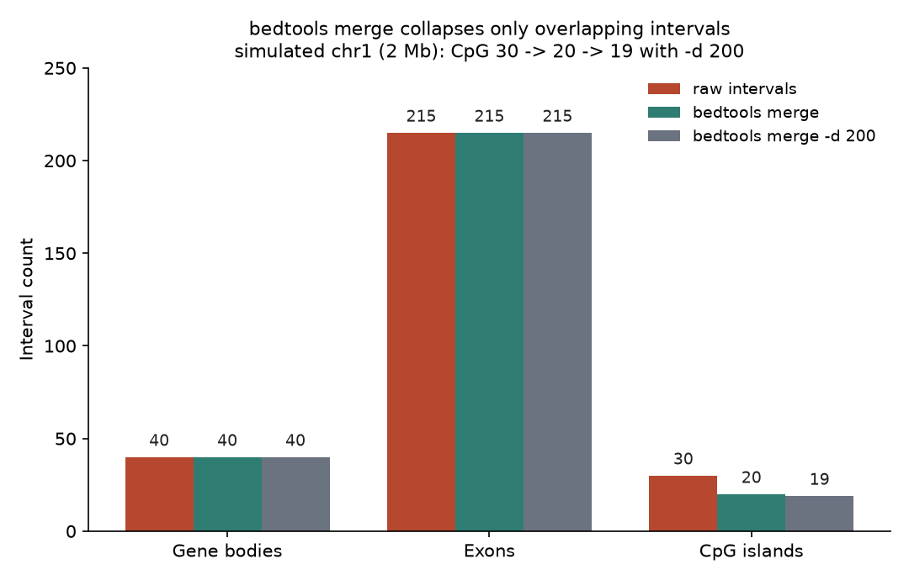
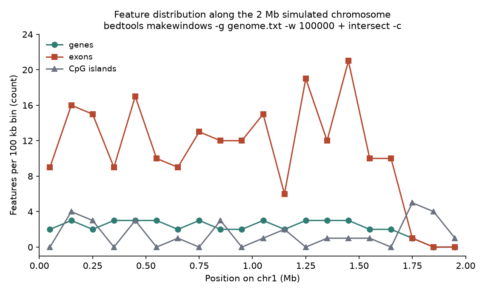
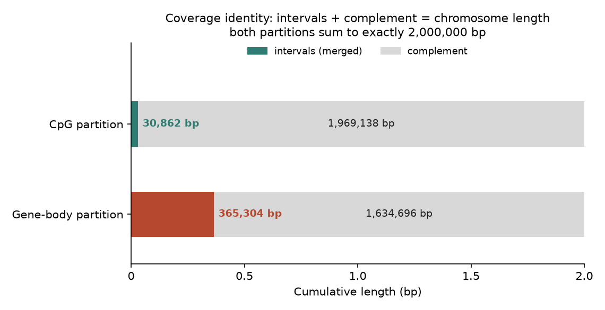

# 045 · bioSkills 真实试用：bed-file-basics（BED 格式基础）

## 功能定位与适用范围

`bed-file-basics` 讲解 **BED 格式基因组区间的读写、校验、排序与跨格式转换，以及整个区间类 skill 依赖的坐标系约定基底**，工具面覆盖 bedtools CLI 与 pybedtools/pyranges/pandas 三条 Python 路径。

- **适用**：建立 0-based 半开（BED）与 1-based 闭区间（GTF/VCF/SAM）的转换规则；生成 genome/chrom.sizes 文件；BED3 到 BED12 及 narrowPeak/broadPeak 的列结构校验；`-sorted` 排序契约；makewindows 分窗；BED 与 VCF/BAM/FASTA 之间的坐标换算；排查 off-by-one 与「空交集」问题。
- **不适用**：区间上的集合运算细节（导向 interval-arithmetic）；GTF/GFF 的父子公司层级解析（导向 gtf-gff-handling）；未 call 出的 peak（先走 peak-calling 类 skill）；跨基因组版本坐标重映射只给出入口（liftOver/CrossMap），本次未真跑。

## 属性表（本次真跑环境）

| 项 | 值 |
|---|---|
| bedtools | v2.31.1（conda env `bio`，WSL Ubuntu） |
| samtools | 1.24（htslib 1.24，用于 faidx 与 SAM→BAM） |
| Python | 3.11.16；pybedtools 0.12.1 可 import；pyranges 未安装（ModuleNotFoundError） |
| 模拟数据 | chr1 全长 2,000,000 bp（seed=45 随机 ACGT FASTA） |
| 特征规模 | 40 个基因 / 215 个外显子 / 30 个 CpG 岛 / 10 个 narrowPeak / 8 条 BED12 转录本 / 30 条 VCF 变异 / 6 条 SAM 比对 |
| 基因长度中位数 | 9,708 bp；外显子长度 50-300 bp |
| 实验产物 | `content/素材/genome-intervals/045-bed-file-basics/` |

## 成分拆解

### 1. 坐标约定是约定，不是数据

BED 文件的 `start` 列只是一个整数，文件内没有任何字段声明它是 0-based 还是 1-based——约定 keyed off 格式：BED 为 0-based 半开 `[start, end)`，GTF/GFF、SAM、VCF、wiggle 为 1-based 闭区间 `[start, end]`。由此推出两条可实测的规则：

- **转换只动 start**：`start_bed = start_1based - 1`，end 不变。GFF 闭区间的最后一个包含碱基与 BED 半开区间的第一个排除位置是同一条边界，所以 end 在两种记法下数值相同。「两端都减 1」是经典错误。
- **长度无 +1**：BED 中 `length = end - start`。本次对全部 215 个外显子执行 `bedtools getfasta`，逐条比对提取序列长度与 `end - start`，215/215 全部相等（首条 gene001.E1 为 30,739 - 30,450 = 289 bp）。

**1 bp 地标往返测试（实测通过）**：构造 GFF 记录 `chr1 1000 1000`（1-based 闭区间单碱基），转换后 BED 为 `chr1 999 1000`；三条独立途径取该碱基——`samtools faidx chr1.fa chr1:1000-1000`、`bedtools getfasta`（BED 区间）、VCF POS=1000 的 REF 列——结果均为 `T`，一致。

### 2. 两种真正的静默失败

**染色体名不匹配。** 将 `cpg.sorted.bed`（chrom=`chr1`）与改名后的 `cpg_bare.bed`（chrom=`1`）做 intersect：结果 0 行、退出码 0——一个完全合法的空结果，「没有重叠」看起来像生物学结论。实测细节：bedtools 2.31.1 会在 stderr 打印 `inconsistent naming convention` WARNING（共 2 条），这一点比旧版本友好，但结果与退出码仍表现为正常空集，不能依赖告警兜底。skill 给出的防线是跨文件操作前先 `cut -f1 | sort -u` 比对双方的染色体命名。

**CRLF 行尾。** Windows/Excel 经手的 BED 会在行尾附着 `\r`，`cat -A` 实测显示 `^I` 分隔正常、行尾为 `.^M$`——`\r` 粘在最后一个字段上。实测 5 行样本 5 行全部检出；`sed 's/\r$//'` 修复后与原始 LF 文件逐字节一致。症状特征是「部分工具正常、部分工具报 not an integer」。另一条格式纪律：不要用 Excel 打开 BED（日期吞并 `SEPT9`、大坐标浮点截断）。

### 3. `-sorted` 排序契约：会报错的与不报错的

- **会报错的一类（实测）**：`tac` 打乱 CpG 文件后加 `-sorted` 求 intersect，bedtools 立即退出（rc=1）：`Error: Sorted input specified, but the file cpg.unsorted.bed has the following out of order record`。同一对文件去掉 `-sorted`（内存路径）则正常出 9 行结果。
- **skill 强调的另一类**：两份输入分别按字典序（chr1, chr10, chr2）与版本序（chr1, chr2, chr10）排序。bedtools ≥2.25 会报 `chromosome sort ordering ... is inconsistent`，更早版本静默丢弃 chr10-chr22。本次模拟数据只有 1 条染色体，**该场景无法真实构造**（见「未覆盖」）。
- 防线：两份输入用完全相同的命令排序，或 `-g genome.txt` 钉住预期顺序；一次性任务直接省略 `-sorted`。

### 4. 列结构：BED3 到 BED12 是位置性的

字段按位置取义，不能跳位提供；每行字段数必须一致。实测五个文件的 `awk '{print NF}' | sort -u` 均只有一个值：BED6 文件（genes/exons/cpg）= 6，narrowPeak = 10，BED12 = 12。narrowPeak 是 BED6+4，`peak` 列是**相对 chromStart 的 0-based 偏移**，绝对 summit = `chromStart + peak`：

| 峰 | chromStart (bp) | peak 偏移 (bp) | 绝对 summit (bp) |
|---|---|---|---|
| peak01 | 575,414 | 383 | 575,797 |
| peak02 | 740,975 | 60 | 741,035 |
| peak03 | 1,481,932 | 359 | 1,482,291 |

`peak = -1` 表示未赋值（本次 peak10），此时 `chromStart - 1` 是无意义数字，不能当 summit 用；`pValue/qValue = -1` 同理是「未赋值」而非 0.1 这类真实概率。**首跑实测教训**：第一次求 summit 时误取第 8 列（pValue，浮点），得到 575,429 这类假值——narrowPeak 无表头，列语义完全靠位置记忆，错一列数值仍然合法。

### 5. genome.txt 必须来自同一份 FASTA

`slop / complement / shuffle / makewindows -g` 都依赖染色体长度文件。skill 的口径是从流程实际用的参考 FASTA 现场生成（`samtools faidx` 后 `cut -f1,2`），而不是下载一份通用 chrom.sizes。本次从 `chr1.fa` 生成 `genome.txt`（内容一行：`chr1 2000000`），并实测了它的两个用途：

- **slop 边界裁剪**：对 `chr1 0 100` 与 `chr1 1999500 2000000` 各外扩 500 bp，结果为 `0 600` 与 `1999000 2000000`——start 不小于 0、end 不超过染色体长，越界部分被 genome 文件截住，不产生非法区间。
- **shuffle 重排**：`bedtools shuffle -seed 45` 把 30 个 CpG 岛搬到随机位置，其中 3 个随机落回与原位有重叠（`intersect -u` 计数）。

### 6. 区间代数最小集（intersect/merge/complement）

- **merge 只折叠重叠或首尾相接的区间**：CpG 岛 30 → 20（默认，相邻 0 距离内合并）→ 19（`-d 200`，把 200 bp 内的间隙也桥接）；基因区 40 → 40、外显子 215 → 215——两组本身无重叠，merge 一个不变。merge 前必须先 sort。原始 CpG 文件碱基总量 36,369 bp 大于合并后的 30,862 bp，差值 5,507 bp 来自簇内互相重叠区间的重复计入。
- **intersect**：215 个外显子中 7 个与 CpG 岛有重叠，共 9 对、合计 994 bp 重叠。
- **complement 覆盖恒等式（实测精确成立）**：

| 划分 | 区间碱基 (bp) | complement 碱基 (bp) | 合计 (bp) |
|---|---|---|---|
| CpG（merge 后） | 30,862 | 1,969,138 | 2,000,000 |
| 基因区 | 365,304 | 1,646,696 | 2,000,000 |

这正是 genome 文件参与计算的守恒性质：划分 + 补集恒等于染色体全长。更深的集合运算属于 interval-arithmetic skill 的范围。

### 7. BED12 块不变量

BED12 不是平表：`blockStarts` 是相对 chromStart 的偏移，首块必须为 0，`blockStarts[last] + blockSizes[last]` 必须等于 `chromEnd - chromStart`，块升序且互不重叠；`thickStart/thickEnd` 是绝对坐标、独立于块（非编码特征两者都设为 chromStart）。本次按此口径校验 8 条转录本（共 47 块）全部通过；`bedtools bed12tobed6` 把模型炸开成 47 条 BED6，与 blockCount 之和一致，可作快速 sanity 重建。构造数据时的对齐细节：chromStart 取第一个外显子的起点（而非基因体起点），首块偏移才恒为 0。

### 8. 跨格式边界的坐标换算

- **VCF → BED**（1-based POS → 0-based start-1）：`grep -v '^#' in.vcf | awk 'BEGIN{OFS="\t"} {print $1, $2-1, $2}'`，30 条变异全部转换，首条 POS 1000 → BED `999 1000`（即第 6 节的地标）。
- **BAM → BED**：`bedtools bamtobed` 内部完成约定换算，实测 6 条 read 的 BED start 全部等于 SAM POS - 1（如 read1 POS 50,001 → start 50,000）；`-split` 把 CIGAR `50M100N50M` 的剪接 read 拆成 2 个块（150,000-150,050 与 150,150-150,200）。
- **BED → FASTA**：`getfasta -fi ref.fa -bed in.bed -name` 基于 `.fai` 索引随机访问，输出头形如 `gene001.E1::chr1:30450-30739`。

### 9. makewindows 分窗

同一 genome 文件下：固定窗 `makewindows -g genome.txt -w 10000` 得 200 个 10 kb 窗；滑动窗 `-w 10000 -s 5000 -i winnum` 得 400 个窗（编号 1-400，末窗 `chr1 1995000 2000000`）。分窗 × intersect 是区间分布统计的标准动作：本次以 20 个 100 kb bin 统计三类特征的分布（下图），末端 300 kb 无基因无外显子、CpG 岛占 10/30，符合模拟设置的随机落点。







## 严格复现（本次真跑，2026-09-03）

数据由 `make_inputs.py`（seed=45）落盘生成；全部命令与输出见素材目录 `repro_transcript.txt` 与 `_run.log`，关键数值汇总在 `bed_results.json`。

**① 命令链（conda env bio，bedtools v2.31.1）**

```
samtools faidx chr1.fa && cut -f1,2 chr1.fa.fai > genome.txt
bedtools sort -i cpg.bed | diff - <(sort -k1,1 -k2,2n cpg.bed)   # 结果 IDENTICAL
bedtools slop   -i edge.bed -g genome.txt -b 500                 # 端点裁剪实测
bedtools flank  -i genes.sorted.bed -g genome.txt -l 1000 -r 0
bedtools merge  -i cpg.sorted.bed [-d 200]
bedtools intersect -a exons.sorted.bed -b cpg.sorted.bed [-c]
bedtools complement -i cpg.sorted.bed -g genome.txt
bedtools shuffle -i cpg.sorted.bed -g genome.txt -seed 45
bedtools makewindows -g genome.txt -w 10000 [-s 5000 -i winnum]
bedtools getfasta -fi chr1.fa -bed exons.sorted.bed -name -fo exons.fa
awk 'BEGIN{OFS="\t"} {print $1, $2-1, $2}' <(grep -v ^# variants.vcf) > variants.bed
samtools view -bS reads.sam > reads.bam && bedtools bamtobed -i reads.bam [-split]
bedtools bed12tobed6 -i transcripts.bed12 > transcripts_exons.bed6
```

**② 关键实测数字**

| 检验 | 结果 |
|---|---|
| getfasta 长度 = end - start | 215/215 个外显子全部相等 |
| 1 bp 地标（GFF 1000-1000 ↔ BED 999-1000） | faidx / getfasta / VCF REF 三途径碱基一致（T） |
| bamtobed start = SAM POS - 1 | 6/6 条 read 成立 |
| VCF POS → BED start-1 | 30/30 条成立 |
| BED12 块不变量 | 8 模型 / 47 块全部通过 |
| merge：CpG / 基因 / 外显子 | 30→20→19（-d 200）/ 40→40 / 215→215 |
| intersect 外显子×CpG | 7 个外显子、9 对、994 bp |
| 覆盖恒等式 | 30,862 + 1,969,138 = 2,000,000 bp；365,304 + 1,646,696 = 2,000,000 bp |
| 染色体名不匹配 intersect | 0 行、rc=0（2.31.1 附 stderr WARNING） |
| `-sorted` 乱序输入 | rc=1 报错；去 `-sorted` 同输入得 9 行 |
| CRLF 检出/修复 | 5/5 行含 `\r`；sed 修复后与原文件一致 |

## 未覆盖（诚实标注）

- **跨组装 liftover**：liftOver / CrossMap 未安装、无 chain 文件，skill 该节仅为文档口径。
- **字典序 vs 版本序染色体排序冲突**（`-sorted` 静默丢 chr10-chr22 的经典场景）：模拟数据仅 1 条染色体，无法构造。
- **bedToBigBed / tabix 索引**：本机未安装，未真跑。
- **pyranges 路径**：未安装（0.x 与 pyranges1 存在 API 断裂），本次 Python 侧仅验证 pybedtools 0.12.1 可 import，区间操作全部走 bedtools CLI。

## 实践要点

- **narrowPeak 的 summit 在第 10 列**：首跑误用第 8 列（pValue）算出合法但错误的 summit。BED6+4 无表头，列语义纯靠位置记忆，写 awk 前逐列核对。
- **转换约定后必做 1 bp 地标往返**：`start-1、end 不变`对单碱基特征做一次三途径（faidx / getfasta / 源格式 REF）一致性核验，成本一行命令。
- **空交集先查染色体命名**：`chr1` vs `1` 产生合法空结果，2.31.1 只有 stderr WARNING 兜底；跨文件操作前 `cut -f1 | sort -u` 比对命名。
- **genome 文件现场生成**：`slop` 边界裁剪、`complement` 恒等式、`shuffle`、`makewindows` 全部依赖它；从流程实际用的 FASTA 用 `samtools faidx` + `cut -f1,2` 生成，不用下载的通用 chrom.sizes。
- **merge 前先 sort**；「merge 后计数不变」本身可当作该集合无重叠的快速检验（本次基因 40→40、外显子 215→215）。
- **BED12 构造时 chromStart 取第一个外显子起点**，首块偏移才恒为 0；`bed12tobed6` 炸开计数与 blockCount 求和一致可作校验。
- **`-sorted` 的收益要以排序纪律换**：两份输入同一命令排序或 `-g genome.txt` 钉序；乱序输入在 2.31.1 上会报错（rc=1），一次性任务直接省略该 flag。
- **BED 不要经手 Excel**：CRLF 污染之外还有日期吞并基因名、大坐标浮点截断；检出 `\r` 用 `sed 's/\r$//'` 或 dos2unix。

## 小结

bed-file-basics 的机制核心是「约定不在数据里」：BED 的 0-based 半开、GTF/VCF/SAM 的 1-based 闭区间全靠格式约定承载，转换规则收敛为 start-1、end 不变，并以 1 bp 地标往返作为可执行的验证动作。本次在 WSL 真跑闭环 bedtools v2.31.1 的 sort/slop/flank/merge/intersect/complement/shuffle/makewindows/getfasta/bamtobed/bed12tobed6 共 11 个子命令，实测坐标守恒性质（215/215 长度相等、6/6 POS-1、两条覆盖恒等式精确成立）与三类失败形态（染色体名不匹配的合法空集、CRLF 字段污染、`-sorted` 乱序报错），并记录了一次 narrowPeak 列位误用的真实教训。跨组装 liftover、bedToBigBed/tabix 与 pyranges 路径本机不可用，诚实标注为未覆盖。

（数据与可复现脚本见 `content/素材/genome-intervals/045-bed-file-basics/`，含 `make_inputs.py`、`_run.sh`、`_parse.py`、`repro_transcript.txt`、`bed_results.json` 及三张图。）
