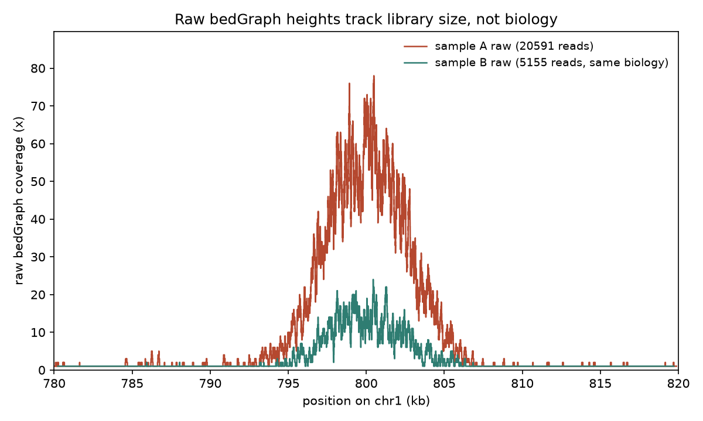
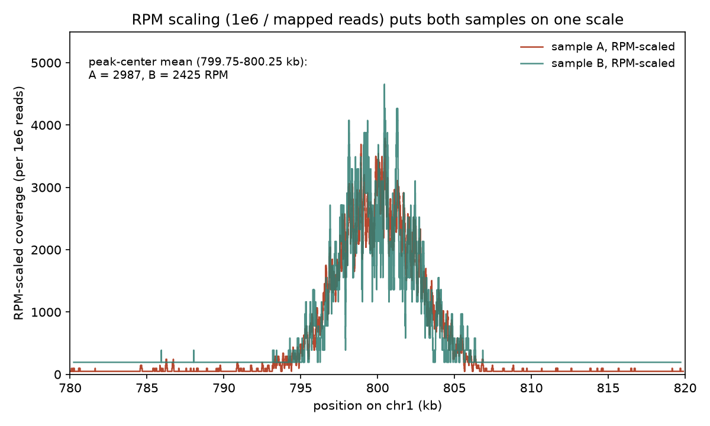
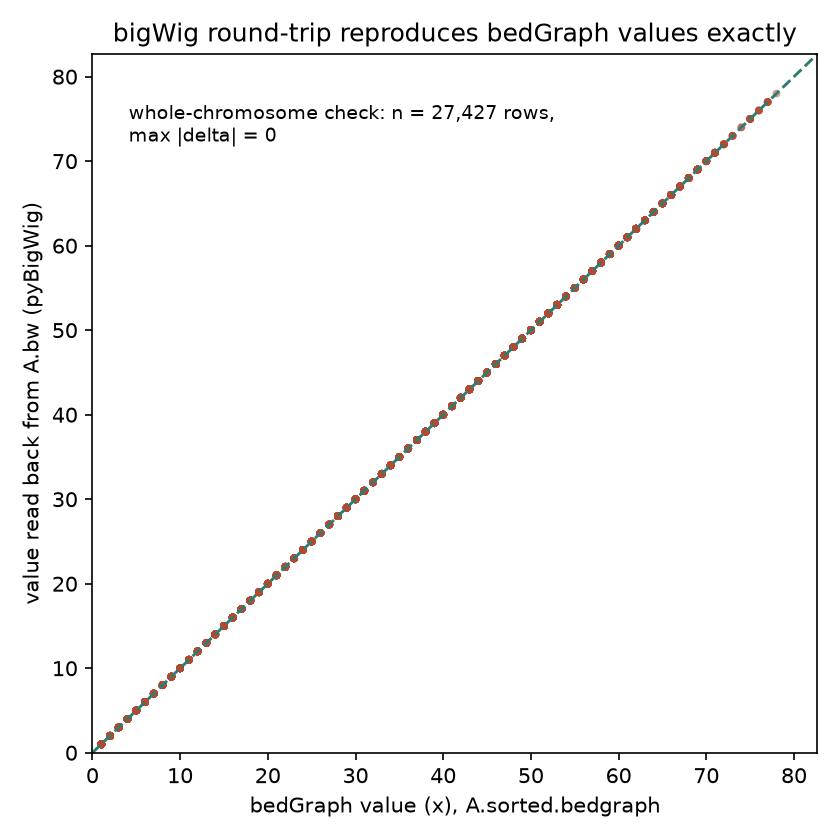

# 046 · bioSkills 真实试用：bedgraph-handling（bedGraph 信号轨道）

## 功能定位与适用范围

`bedgraph-handling` 讲解**覆盖/信号轨道的全生命周期：从 BAM 生成 bedGraph，按跨样本可比的口径做库深归一化，再把文本 bedGraph 转成浏览器可用的索引 bigWig**。

- **适用**：为单样本产出浏览器轨道（ChIP/ATAC/RNA 覆盖）；判断 CPM/RPKM/BPM/RPGC/spike-in 哪种归一化合法；bedGraph 转 bigWig 的排序/重叠/chrom.sizes 契约；排查「轨道能加载但数值不对」的病例；多样本值矩阵（unionbedg）。
- **不适用**：bigWig 的读取与摘要统计（见 bigwig-tracks）；per-base 深度分布诊断（见 coverage-analysis）；spike-in 的湿实验设计细节（见 chip-seq/spike-in-normalization）。

## 属性表（本次真跑环境）

| 项 | 值 |
|---|---|
| bedtools | v2.31.1（genomecov / merge / unionbedg） |
| samtools | v1.24（faidx / view / sort / depth） |
| bedGraphToBigWig | v2.10（bbi version 4，UCSC） |
| pyBigWig | v0.3.25（本次补装：`pip install pyBigWig`） |
| bigWigToBedGraph | 本环境未安装（回读改用 pyBigWig） |
| deepTools bamCoverage | 本环境未安装（该路线仅文档口径，未真跑） |
| 模拟参考 | chr1 = 2,000,000 bp 随机 ACGT（seed = 20260903） |
| 内嵌峰 | 4 个高斯形富集峰，高度 30-60x，sigma = 1500-3000 bp，背景 0.5x |
| 样本 A | 20,591 条单端 100 bp reads，平均深度 1.0295x，最高覆盖 78x |
| 样本 B | A 的 25% 随机子样本（5,155 条，3.99x 更浅，同一生物学） |
| 主产出 | A.bedgraph 27,427 行 → A.bw 233,698 字节（往返 max delta = 0） |
| 实验产物 | `content/素材/genome-intervals/046-bedgraph-handling/` |

## 成分拆解

### 1. bedGraph 格式要点：4 列、0-based 半开、稀疏 vs 连续

bedGraph 每行 4 列：chrom、start、end、value；坐标为 0-based 半开区间（与 BED 一致，与 SAM/FASTA 的 1-based 不同），value 是该区间的覆盖值或信号值。格式有两种等值段密度：`bedtools genomecov -bg` 把相等覆盖值的连续碱基折叠成区间，并**省略全部零覆盖区域**（稀疏形式）；`-bga` 在此之上用 `start=上个区间 end` 的零值区间**把整条染色体铺满**（连续形式），供下游需要显式 0 的工具使用。

本次实测（样本 A，2 Mb 染色体，背景 0.5x 泊松覆盖）：`-bg` 输出 27,427 行、仅覆盖 820,627 bp（占 41.0%）；`-bga` 输出 33,372 行、区间长度合计恰为 2,000,000 bp。同一 BAM 两种形式行数差 5,945，差额即被 `-bg` 省略的零覆盖段。样本 B 更浅，行数进一步降到 7,435（-bg）/ 9,669（-bga）：**覆盖越浅，等值段越碎、文件越大比例越高**——bedGraph 是逐段文本，体量与信号结构强耦合。

### 2. 第 4 列的本质：库深的函数，不是生物学

skill 的核心论断：原始覆盖 bedGraph 的第 4 列度量的是**测序深度**。两份生物学完全相同的样本，测序深度不同，同一位置的「峰高」就不同——跨样本比较未归一化轨道是范畴错误。本次用同批 reads 的 25% 子样本构造了极端对照：样本 A 与 B 的每一条 read 都来自同一池（同一生物学），仅深度差 3.99x，raw 轨道峰高即差约 4 倍（fig1：A 峰区最高 78x，B 最高 24x）。浏览器里「A 比 B 信号强」的视觉结论，100% 是库深伪影。

### 3. 归一化分类：五种库深法共享一条公理

| 方法 | 分母/口径 | 适用 | 失效场景 |
|---|---|---|---|
| None（原始计数） | 无 | 单样本检视 | 一切跨样本比较 |
| CPM | 每百万比对 reads | 深度对齐的快速跨样本 | 少数高覆盖 bin 主导；全局变化 |
| RPKM | CPM 再除 bin 长度（kb） | 遗留流程 | 同上；轨道场景已被 BPM 取代 |
| BPM | 全轨道 bin 值总和固定 1e6 | 组成偏斜下的跨样本默认 | 同上（仍是保守总量重标定） |
| RPGC（1x） | 有效基因组尺寸换算的 1x 平均覆盖 | ChIP/ATAC 浏览器轨道的字段标准 | 有效基因组尺寸错配（线性误差）；全局变化 |
| spike-in | 每细胞恒量外源参照（湿实验前置） | 全局水平变化可疑或为研究对象 | 无计算学失效——它不依赖样本 reads 定标 |

五种库深方法共享同一公理：**总信号在样本间守恒**。该公理在信号只做局部再分布时成立；当扰动改变全局水平（组蛋白修饰 KD、BET 抑制剂、pol-II 全局塌缩）时，真实的 3 倍全局上调会在归一化后被摊薄成「无变化」，且从归一化后的数据无法证伪——强制两边总和相等在定义上消除了全局差异。此时唯一补救是**上机前**决定的 spike-in 外参照（ChIP-Rx，Orlando 2014），按 spike-in reads 而非样本 reads 定标；没有 spike-in，全局尺度不可恢复。

本次的 RPM 演示即最朴素的 CPM：`genomecov -scale 1e6/nreads`，因子 A = 48.564907、B = 193.986421（比值恰为深度比 3.994）。缩放后两轨道重合（fig2），峰心 500 bp 均值 A = 2987、B = 2425 RPM——残余约 23% 的差来自 B 浅库的泊松噪声，这本身是归一化「对齐尺度、不制造精度」的实测注脚。

### 4. 决策树精要

- 单样本出轨道：`bamCoverage --normalizeUsing RPGC --effectiveGenomeSize <N>`（一步到位）或 genomecov 后手工转 bigWig。
- 跨样本且组成偏斜：BPM。
- 全局变化可疑：spike-in，库深归一化全部出局。
- ChIP/ATAC 轨道加 `--extendReads`（读段是片段端点，不延伸会出双驼峰）；RNA-seq 用 `-split`/`--filterRNAstrand`（剪接读段会涂满内含子）。
- 处理 vs input：`bamCompare`（先归一深度再做算术）；已归一化 bigWig 之间：`bigwigCompare`（只做算术）。
- 多样本值矩阵：`bedtools unionbedg -header -names`；样本相关性 QC：`multiBigwigSummary bins` + `plotCorrelation`。
- 要精确逐碱基算术：留在 bedGraph（精确文本）；要分发/浏览：转 bigWig（索引、随机访问、zoom 多分辨率）。

### 5. bedGraphToBigWig 的输入契约

转换器要求三件事同时满足：bedGraph 按 **`LC_COLLATE=C` 语义**按 chrom 再 start 排序；区间**互不重叠**；chrom.sizes 来自 reads 实际比对的那个 FASTA（`samtools faidx ref.fa && cut -f1,2 ref.fa.fai`）。违反的后果被**不一致地执行**：有的违规报错，有的生成能加载但数值错误、或整条染色体缺失的 bigWig——即「能加载但在说谎」。本次四项违规全部实测（见严格复现第③步），v2.10 对四类输入均显式报错退出（exit 255），未出现静默损坏路径。

另一个实测细节：SKILL.md 记录的未排序报错文案为 `is not case-sensitive sorted`，本 v2.10 实际输出 `is not sorted at line 2. Please use the -sort option to sort the input file.`——同一契约、不同措辞，诊断时以实际报错为准。

### 6. 有效基因组尺寸：两张表、约 7% 的漂移

RPGC 的分母 `--effectiveGenomeSize` 依赖读段过滤 regime：保留 multimapper 时用**非 N 长度**（GRCh38 = 2,913,022,398 bp；mm10 = 2,652,783,500 bp），MAPQ/唯一比对过滤后用**读长相关的唯一 k-mer 值**（GRCh38：50 bp 读长 2,701,495,711；100 bp 2,805,636,231；150 bp 2,862,010,428）。两套 GRCh38 数字在短读长下相差约 7%；RPGC 对该值线性缩放，研究内部比值抵消，跨研究整合时表现为一个恒定的虚假倍数差。非模式生物无表可查，需按 assembly 自行估计。

### 7. 分箱混叠

binSize 是一次性选定的低通滤波器：bin 宽于特征约一半时，尖锐峰被平均压低或跨边界分裂（相位伪影——重复样本因 bin 对齐不同而互相矛盾）。尖锐 TF/ATAC 用 10-25 bp，宽修饰用 50-200 bp；**相互比较的轨道必须共享 binSize**，`--smoothLength` 只是平滑显示，不能找回已丢弃的信息。

## 严格复现（本次真跑，2026-09-03）

完整命令与输出见素材目录 `_run.sh`、`_run.log`、`repro_transcript.txt`；造数 `make_inputs.py`（seed = 20260903）落盘可复现。

**① 主链路命令（conda env `bio`，WSL Ubuntu）**

```
samtools faidx ref.fa && cut -f1,2 ref.fa.fai > chrom.sizes   # chr1  2000000
samtools view -bS sampleA.sam | samtools sort -o sampleA.bam - && samtools index sampleA.bam
bedtools genomecov -ibam sampleA.bam -bg  > A.bedgraph          # 27,427 行
bedtools genomecov -ibam sampleA.bam -bga > A_bga.bedgraph      # 33,372 行
bedtools genomecov -ibam sampleA.bam -bg -scale 48.564907 > A_scaled.bedgraph
LC_COLLATE=C sort -k1,1 -k2,2n A.bedgraph > A.sorted.bedgraph
bedGraphToBigWig A.sorted.bedgraph chrom.sizes A.bw             # 233,698 字节
```

**② 链路关键数字（全部实测）**

| 度量 | 值 |
|---|---|
| reads：A / B | 20,591 / 5,155 条（深度比 3.99x） |
| 平均深度：A / B | 1.0295x / 0.2577x（samtools depth -a） |
| `-bg` vs `-bga` 行数：A | 27,427 / 33,372 行 |
| `-bg` vs `-bga` 行数：B | 7,435 / 9,669 行 |
| `-bga` 铺盖 | 2,000,000 bp（= 染色体全长，实测合计） |
| `-bg` 覆盖 >0 区域（A） | 820,627 bp（41.0%） |
| 最高原始覆盖（A） | 78x（peak2 区，设计 60x + 泊松涨落） |
| bigWigInfo（A.bw） | basesCovered 820,627 bp / mean 2.509179 / max 78 / zoomLevels 8 |
| 文本 → 二进制 | 613,417 字节 → 233,698 字节（38.1%，且获得索引与 zoom） |
| RPM 因子：A / B | 48.564907 / 193.986421（比值 = 深度比 3.994） |
| unionbedg 矩阵 | 28,103 行（含 header；27,427 + 7,435 行并成 28,102 个 union 区间） |
| bigWig 回读 | 27,427 行逐一比对，max abs delta = 0（无损往返，fig3） |
| `bw.stats` 窗口均值 | chr1:780000-820000 = 15.693（分箱摘要口径） |

**③ 错误契约四项实测（bedGraphToBigWig v2.10，全部 exit 255 显式报错）**

| 违规 | 实际报错（首行） |
|---|---|
| 未排序（`tac` 反转） | `A.unsorted.bdg is not sorted at line 2. Please use the -sort option to sort the input file.` |
| chrom.sizes 偏短（chr1 记 1,000,000 bp） | `End coordinate 1000122 bigger than chr1 size of 1000000 line 14191 of A.sorted.bedgraph` |
| 重叠区间（A、B 两轨道拼接，34,862 行） | `Error - overlapping regions in bedGraph line 10 of AB_overlap.bdg` |
| 命名错配（bedGraph 用 `1`，chrom.sizes 用 `chr1`） | `1 is not found in chromosome sizes file` |

重叠违规的修复路径同样实测：`bedtools merge -i AB_overlap.bdg -d 0 -c 4 -o max` 把 34,862 行折叠成 5,944 行互不重叠区间，转换一次通过（AB.bw 生成）。注意 `max`/`mean`/`sum` 是三种不同信号，不存在安全默认值。

两处与 SKILL.md 文案的差异（诚实记录）：未排序报错的实际措辞不同（见成分拆解第 5 节）；命名错配在本 v2.10 显式报错，未复现「整条染色体静默缺失」的行为——静默路径按 skill 记载存在于其他版本或其他违规组合中，本次未观察到。

**④ RPM 归一化对照（fig1 → fig2）**

原始轨道（fig1）：A 峰区最高 78x、B 最高 24x，形态一致、高度差随深度；RPM 缩放后（fig2）：两轨道重合，峰心 500 bp 均值 A = 2987、B = 2425 RPM（差约 23%，源于 B 的 4 倍更浅采样噪声）。

### 本次出图







## 未覆盖（诚实标注）

- deepTools 路线（bamCoverage 的 RPGC/BPM 一步归一、bamCompare、bigwigCompare、multiBigwigSummary + plotCorrelation）：环境未安装 deepTools，全部为文档口径，未真跑。
- `-split`（无剪接 RNA 数据可测）、`--extendReads`/`--centerReads`（deepTools 侧参数）、`--smoothLength`。
- spike-in 归一化的完整流程（属 chip-seq/spike-in-normalization，本次仅决策口径）。
- 「整条染色体静默缺失」的静默损坏路径：本 v2.10 对四类违规均显式报错，未能复现静默行为。
- 真实物种多染色体 chrom.sizes、`chr` 前缀之外的命名工程问题。

## 实践要点

- **比较轨道之前先问归一化合法性**：五种库深方法全部预设总信号守恒；全局变化（修饰 KD、BET 抑制剂）场景下它们会把真实变化定义为无变化，唯一出路是上机前的 spike-in。
- **rpm 演示只需 genomecov**：`-scale 1e6/nreads` 一个参数完成库深对齐；因子比值恒等于 reads 数比值（实测 3.994），可作管线自检。
- **`-bg` 与 `-bga` 按下游需求选**：只要非零段用 `-bg`（本次少 5,945 行）；下游需要显式 0（unionbedg、绘图铺底）用 `-bga`，其区间合计必等于染色体长度，可作完整性断言。
- **chrom.sizes 必须出自比对用的那个 FASTA**（`samtools faidx` + `cut -f1,2`），不是参考注释也不是记忆值。
- **排序用 `LC_COLLATE=C sort -k1,1 -k2,2n`**：locale 感知排序在登录节点能过、在调度器环境变量不同时失败，报错措辞还随版本变（本次实测与 skill 记载不同）。
- **拼接/合并轨道后先消重叠再转换**：`bedtools merge -d 0 -c 4 -o max|mean|sum`，聚合方式显式选择（实测 34,862 → 5,944 行）。
- **转换后做一次无损对账**：pyBigWig `bw.intervals()` 逐行回读（本次 27,427 行 max delta = 0）；`bw.stats()` 是分箱摘要，不等于逐碱基值。
- **分发用 bigWig，检视用文本**：本次 613,417 字节文本压到 233,698 字节并附带索引与 8 级 zoom；bedGraph 作为最终交付物会让浏览器全文件扫描。
- **相互比较的轨道必须共享 binSize**，且 bin 不宽于特征的一半，否则比值与峰形都是混叠伪影。
- **有效基因组尺寸按「assembly + 读长 + 过滤 regime」三要素选**，跨研究整合前核对，避免约 7% 的恒定虚假倍数差。

## 小结

bedgraph-handling 的主线是一条三段式管线：生成（genomecov/bamCoverage）、归一化（守恒总量公理的适用性裁决）、转换（排序/重叠/chrom.sizes 三重契约）。本次在 WSL 真跑闭环：2 Mb 合成染色体 + 4 内嵌峰、同批 reads 的 25% 子样本构造纯库深对照，实测到 raw 轨道 4 倍高度差经 RPM 因子（48.564907 vs 193.986421）缩放后对齐；`-bg`/`-bga` 的行数差与铺盖长度、bedGraph → bigWig 的 2.6 倍压缩与 27,427 行无损往返、错误契约四项全部以 exit 255 显式报错，其中两项行为与 SKILL.md 记载存在措辞/路径差异，均已如实记录。

（数据与可复现脚本见 `content/素材/genome-intervals/046-bedgraph-handling/`，含 `_run.sh`、`make_inputs.py`、`make_figs.py`、`repro_transcript.txt` 及三张图。）
