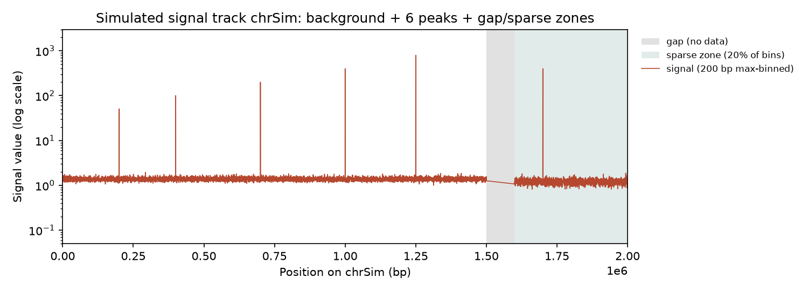
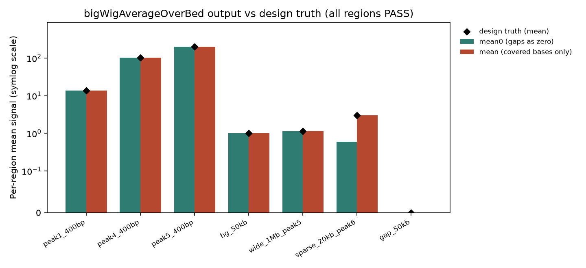
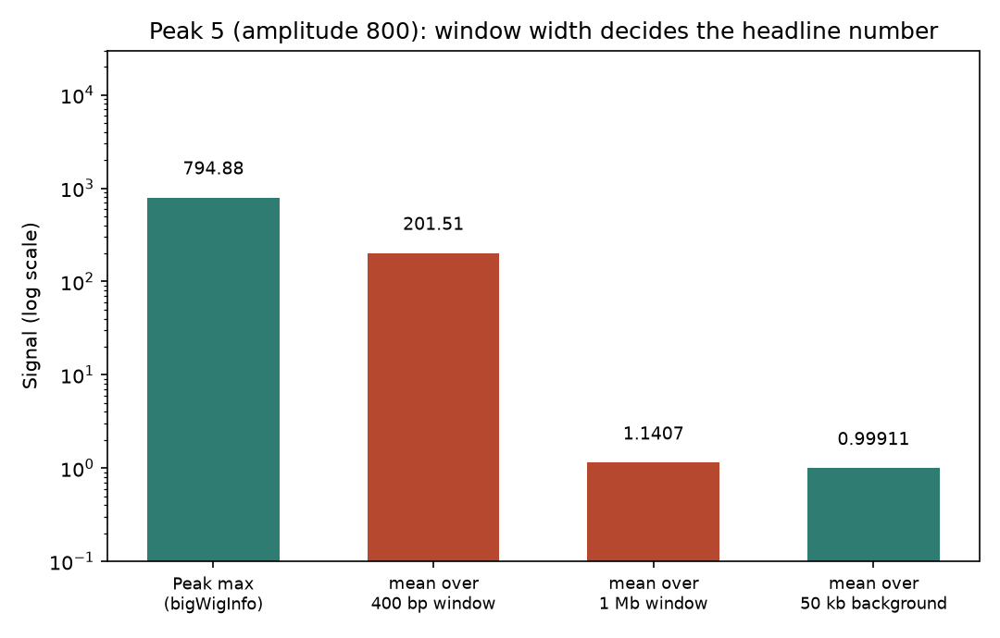

# 047 · bioSkills 真实试用：bigwig-tracks（bigWig 信号轨道）

## 功能定位与适用范围

`bigwig-tracks` 讲解**读取、查询与构建 bigWig 索引化二进制信号轨道**（覆盖深度、富集倍数、保守性、甲基化率等连续信号），工具面覆盖 pyBigWig（Python）、UCSC Kent 命令行（bedGraphToBigWig / bigWigInfo / bigWigSummary / bigWigAverageOverBed）与 deepTools（multiBigwigSummary / computeMatrix / bigwigCompare）。

- **适用**：按区间从 bigWig 提取信号（每基因/每峰一个数）；把 bedGraph 转成浏览器可用的轨道；在统计量（mean/max/sum/coverage/std）、精确度（exact 与否）、缺口口径（NaN 与零）三个层面做与生物学问题匹配的选择；构建 TSS/gene-body metaprofile。
- **不适用**：离散特征的存储（peaks/genes 应该用 bigBed，一个区间挨一个碱基的信号文件会用错格式）；BAM 到标准化覆盖轨道的生成与文库大小归一（skill 指向 chip-seq/chipseq-visualization）；浏览器级渲染出图（skill 指向 data-visualization/genome-tracks）。

## 属性表（本次真跑环境）

| 项 | 值 |
|---|---|
| bedGraphToBigWig | v2.10（bbi version 4；conda env `bio`，WSL Ubuntu） |
| bigWigInfo / bigWigAverageOverBed | 与上同构建（bigWigAverageOverBed 自报 v2） |
| bigWigSummary / bigWigToBedGraph / pyBigWig / deepTools | 环境未安装，本次未实测（笔记中仅文档口径） |
| bedtools | v2.31.1（本次流程未用到） |
| python | 3.11.16（make_inputs.py 与 reconcile.py，仅标准库） |
| 输入数据 | `sim.bedGraph`：158,000 条区间 × 10 bp/条，覆盖 chrSim（2,000,000 bp）中的 1,580,000 bp（79.0%） |
| 主产出 | `track.bw`：1,234,797 字节，为 bedGraph（4,359,932 字节）的 28.3% |
| 实验产物 | `content/素材/genome-intervals/047-bigwig-tracks/` |

## 成分拆解

### 1. bigWig 的提速结构：快是有代价的

bigWig（Kent 2010）在逐碱基数值之外预存一**组（级）zoom 汇总层**（每层每 bin 存 sum/sumSquared/min/max/nBasesCovered），用 B+ 树解析染色体名、R 树（cirTree）以 O(log n) 定位数据块、分块 zlib 压缩让文件比 bedGraph 小约一个数量级。**宽区间查询由 zoom 层近常数时间应答——读的是预计算摘要，不是逐碱基数据。**速度由三层叠加的近似换来，三层默认全部开启。

### 2. 三层叠加的近似（skill 的核心洞见）

1. **取哪个统计量。** 宽 bin 上的默认 `mean` 会把窄而高的特征稀释向背景：skill 举例，1 Mb 背景为 1 的海里一个 200 bp、高 500 的 ChIP summit，均值约 1.1，与背景无法区分；`type='max'` 则返回 500。同一文件、同一坐标，结论由统计量名称决定。`mean` 对宽特征（结构域、gene-body 覆盖）忠实，对窄特征失真；`max` 回答峰高，`sum` 回答总量（随宽度变化），`coverage` 回答有无数据的比例，`std` 回答波动。
2. **数值从哪一层来。** pyBigWig 默认 `exact=False`（bigWigSummary 与缩小后的浏览器同此）从最近的 zoom 层计算，粒度最多粗约 16 倍；探索无妨，**凡进入结果表、阈值判定的数字必须 `exact=True`（或 `values()`、或 bigWigAverageOverBed）**。这类失真不报错，只是把生物学悄悄取整。
3. **NaN 不是零。** 无覆盖位置在 `values()` 中是 NaN、在 `intervals()` 中表现为断口。对覆盖 30%、信号 10 的区域：`np.mean` 得 NaN；`np.nanmean` 得 10（只计有数据碱基，等于 bigWigAverageOverBed 的 `mean` 列）；缺口记零（`np.nan_to_num`、deepTools `--missingDataAsZero`、`mean0` 列）得 3.0。 headline 数字可摆动 3 倍以上，选哪个由生物学决定：深度/覆盖轨道缺口等价于零（用 `mean0`）；甲基化率、log2 倍数、保守性这类比值轨道缺口无定义（用 `mean`）。

### 3. 工具分工（skill 的分类表摘要）

| 工具 | 角色 | 适用时机 |
|---|---|---|
| pyBigWig | Python 读写 | 流程内自定义提取；写 bigWig |
| bigWigAverageOverBed | 每 BED 区间一行均值 | 「每基因/每峰平均信号」的专用工具；同时给 mean0 与 mean |
| bigWigSummary | 区间 → N 等分 bin | 命令行快速分箱轮廓（读 zoom 层） |
| bigWigInfo | 头信息体检 | 拿到陌生文件的第一件事 |
| bedGraphToBigWig | 文本 → 二进制 | 需要 排序 bedGraph + chrom.sizes |
| bigWigToBedGraph | 二进制 → 文本 | 精确算术、文本检视 |
| multiBigwigSummary / computeMatrix / bigwigCompare | 多轨道矩阵 / 区域矩阵 / 轨道运算 | 相关性、PCA、metaprofile、log2 比值轨道 |

### 4. 构建侧的硬约束

bedGraph 必须按 `-k1,1 -k2,2n` 排序且区间不重叠（信号是函数，一个位置一个值）；chrom.sizes 的名字与长度必须与 bedGraph 完全匹配（`chr1` 与 `1` 混用会报 chromosome not found 或静默丢弃）。pyBigWig 直写时 `addHeader` 必须先于 `addEntries`，条目按 (chrom, start) 有序添加，`close()` 时才构建 R 树索引与 zoom 阶梯。

## 严格复现（本次真跑，2026-09-03）

完整命令与输出见素材目录 `repro_transcript.txt`；全流程日志 `_run.log`，头信息存档 `_bigwiginfo.txt` / `_bigwiginfo_chroms.txt`。

**① 数据设计（make_inputs.py，seed=42）**：模拟 chrSim 长 2,000,000 bp，10 bp 一条区间；背景为均值 1.0、标准差 0.2 的截断高斯噪声；埋 6 个高斯形峰（sigma 40 bp，幅度依次 50/100/200/400/800/400）；[1,500,000, 1,600,000) 为整段无数据缺口；[1,600,000, 2,000,000) 为稀疏区（每 5 个 bin 保留 1 个，覆盖率 20%）。产出 158,000 条区间，覆盖 1,580,000 bp（79.0%），最大值 794.883。真值（每区间 base 加权均值）由同一脚本按写入区间精确算出，存 `truth.json`。

**② 构建（skill 的 build 三连）**：`sort -k1,1 -k2,2n` → `sort -c -k1,1 -k2,2n` 校验通过 → `bedGraphToBigWig sim.sorted.bedGraph chrom.sizes track.bw` 退出码 0。track.bw 1,234,797 字节，为 bedGraph 的 28.3%（约 3.5 倍压缩；skill 给的 ~10 倍是量级参考，实测比值依赖数据稀疏程度）。

**③ bigWigInfo 头信息（实测值）**：

| 字段 | 实测值 | 与设计的对照 |
|---|---|---|
| version / zoomLevels | 4 / 8 层 | 构建默认生成 zoom 阶梯 |
| chromCount | 1 条 | chrSim 一条 |
| basesCovered | 1,580,000 bp | 与设计值完全一致（1,500,000 + 20% × 400,000） |
| mean / std | 1.103765 / 6.302343 | 背景设计均值 1.0，峰拉高整体均值 |
| min / max | 0.073000 / 794.882996 | max 即峰 5 顶部 bin 理论值 793.8 + 噪声 |
| 索引占比 | 7,436 / 905,259 = 0.8% | skill 阈值「索引 < 数据的 ~1%」实测成立 |

**④ bigWigAverageOverBed 与设计真值对账（7 个区间全部 PASS）**：

| 区间（名称） | 窗口宽（bp） | 覆盖（bp） | 工具 mean | 设计真值 mean | 工具 mean0 |
|---|---|---|---|---|---|
| peak1_400bp | 400 | 400 | 13.5387 | 13.5387 | 13.5387 |
| peak4_400bp | 400 | 400 | 101.2410 | 101.2414 | 101.2410 |
| peak5_400bp | 400 | 400 | 201.5110 | 201.5111 | 201.5110 |
| bg_50kb | 50,000 | 50,000 | 0.999105 | 0.999105 | 0.999105 |
| wide_1Mb_peak5 | 1,000,000 | 1,000,000 | 1.1407 | 1.1407 | 1.1407 |
| sparse_20kb_peak6 | 20,000 | 4,000 | 3.00889 | 3.00889 | 0.601777 |
| gap_50kb | 50,000 | 0 | 0 | 无数据（NA） | 0 |

最大相对误差 3.70×10⁻⁶，容差 1×10⁻³，残差来源是 bigWig 的 float32 数值存储；对账结论：**bedGraph → bigWig → 区间均值的往返不引入超出存储精度的偏差**。gap 区间覆盖 0 时工具输出 0（不是报错也不是 NaN），解读时需自查 covered 列。

**⑤ 两个 headline 实测**：

- **宽窗口稀释窄峰**：峰 5 顶部值 794.883（bigWigInfo max）→ 400 bp 峰窗均值 201.511 → 1 Mb 宽窗均值 1.1407，而背景 50 kb 均值 0.999105。同一文件、同一统计量，仅窗口从 400 bp 换成 1 Mb，一个 800 高的峰在数值上与背景几乎重合——第 2 节近似 1 的量化复现。
- **mean 与 mean0 分叉**：稀疏区同一区间 mean = 3.00889、mean0 = 0.601777，相差 5.0 倍（该区间覆盖 20%）。第 2 节近似 3 的量化复现，选列依据轨道生物学而非偏好。

### 本次出图

## 未覆盖（诚实标注）

本次真跑为 CLI 最小闭环，以下 skill 内容**未实测**，仅为文档口径：

- pyBigWig 全部路径（`stats`/`values`/`intervals`、`exact=True` 与默认的数值差异、`addHeader`/`addEntries` 直写）——环境未安装。
- bigWigSummary（zoom 层读取的行为）、bigWigToBedGraph、bigWigToWig——环境未安装。
- deepTools（multiBigwigSummary / computeMatrix / bigwigCompare / plotHeatmap）——环境未安装。
- zoom 层近似的具体误差幅度（skill 称最多约 16 倍粗化）——无 pyBigWig 无法对照测量。
- 真实物种数据（hg38 等）与多染色体 chrom.sizes；IGV 渲染与 maxZooms 行为。

## 实践要点

- **拿到陌生 bigWig 先 bigWigInfo**：version、zoomLevels、chromCount、basesCovered、min/max/mean/std 一次拿全；basesCovered 远小于基因组大小意味着大部分位置无数据，mean 与 mean0 的选择随之变成承重决策。
- **统计量跟着生物学问题走**：问「有没有结合事件」用 max；问「总量」用 sum；问「多大比例有数据」用 coverage；宽特征才可用单 bin mean。
- **进结果表的数字走精确口径**：pyBigWig `exact=True`、`values()` 或 bigWigAverageOverBed；浏览器与缩略图级别的数字只作探索参考。
- **mean 与 mean0 按轨道类型选**：深度/覆盖轨道缺口记零（mean0）；比值型轨道（甲基化率、log2 倍数、保守性）缺口无定义（mean）；两者相差可超 3 倍，本次稀疏区实测 5.0 倍。
- **`sort -c` 校验要带与排序一致的 `-k` 参数**：`sort -c` 不带 key 时按整行字典序检查，会对坐标已排序的 bedGraph 误报 disorder；带上 `-k1,1 -k2,2n` 后校验通过（本次实测到该误报并修正）。
- **bigWigAverageOverBed 输出无表头**：6 列固定为 name/size/covered/sum/mean0/mean；BED 第 4 列需唯一命名，覆盖为 0 的区间输出 0 而非 NaN，需自查 covered 列。
- **压缩比依赖数据**：skill 给 ~10 倍量级，本次致密 10 bp bin 数据实测 3.5 倍；索引占比实测 0.8%，符合「索引 < 数据的 ~1%」阈值。
- **float32 存储决定对账精度下限**：本次 7 区间对账最大相对误差 3.7×10⁻⁶，即为存储舍入量级，属于格式固有而非流程缺陷。

## 小结

bigwig-tracks 的机制核心是「zoom 阶梯换速度，速度带三层近似」：统计量选择、数值来源层级、缺口语义，三者共同决定从同一个 bigWig 里读出哪个数字。本次在 WSL 真跑闭环：seed=42 生成带已知信号结构的 158,000 条 bedGraph 区间（2 Mb 染色体、6 峰、整段缺口、20% 稀疏区），bedGraphToBigWig v2.10 构建成功，bigWigInfo 头信息与设计逐项吻合（basesCovered 1,580,000 bp 完全一致，索引占比 0.8%），bigWigAverageOverBed 7 区间对账全部 PASS（最大相对误差 3.7×10⁻⁶）；并量化复现了两个关键近似——峰高 794.9 的信号在 1 Mb 宽窗均值下塌缩到 1.1407（背景 0.9991），稀疏区 mean 与 mean0 相差 5.0 倍。

（数据与可复现脚本见 `content/素材/genome-intervals/047-bigwig-tracks/`，含 `make_inputs.py`、`_run.sh`、`reconcile.py`、`make_figs.py`、`repro_transcript.txt` 及三张图。）
