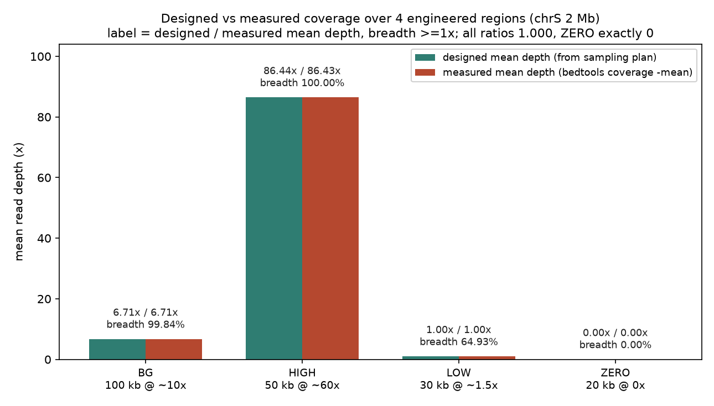
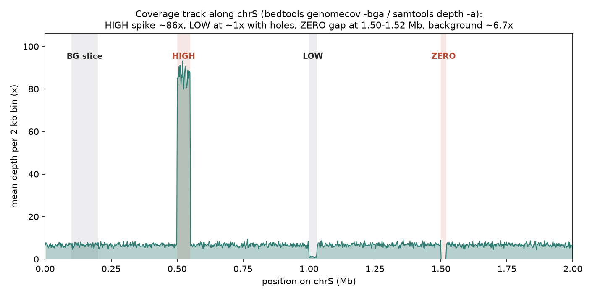
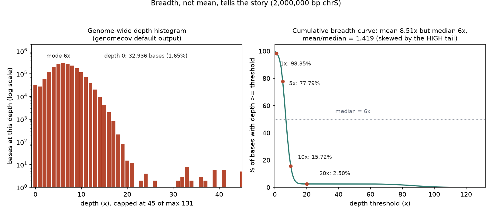

# 048 · bioSkills 真实试用：coverage-analysis（覆盖度分析）

## 功能定位与适用范围

`coverage-analysis` 讲解**把测序深度当作「位置上的分布」来测量与解读**：median、阈值 breadth（达到某深度的碱基比例）、evenness（均匀性）三个量一起报告，并区分每个工具默认到底计了什么。

- **适用**：判断测序量是否够用；构建浏览器覆盖 track（bedGraph）；计算 callable 区间；靶向捕获均匀性 QC；短插入文库的 mate-overlap 双计校正。
- **不适用**：bedGraph 归一化与跨样本可比 track（见 bedgraph-handling / chipseq-visualization）；browser 渲染（见 genome-tracks）；per-call DP/AD（覆盖度是变异检测的上游）。

## 属性表（本次真跑环境）

| 项 | 值 |
|---|---|
| bedtools | v2.31.1（conda env `bio`，WSL Ubuntu） |
| samtools | 1.24（htslib 1.24；≥1.13，`samtools depth` 无 8000 cap） |
| bwa | 0.7.19-r1273（比对） |
| Python | 3.11.16（数据生成与解析） |
| mosdepth | 未安装（skill 首选的现代工具，本次未真跑，见「未覆盖」） |
| 比对数据 | `aln.bam`：chrS 单染色体 2,000,000 bp；85,150 片段 / 170,300 条 reads（2×100 bp），比对率 100.00% |
| reads 来源 | python 按区间密度直接采样（seed 20260903）；dwgsim 不支持按区间控制密度与插片段长度，故未采用 |
| 覆盖设计 | BG 100 kb @ 10x 量级 / HIGH 50 kb @ 60x 量级（短插入 130 bp）/ LOW 30 kb @ 1.5x / ZERO 20 kb @ 0x |
| 主产出 | `cov.bedGraph`、`cov_hist.txt`、`frag.bedGraph`、`per_target.bed`、`samtools_coverage.txt`、`results.json` |
| 实验产物 | `content/素材/genome-intervals/048-coverage-analysis/` |

## 成分拆解

### 1. 均值是预算，不是结果

skill 开篇的核心命题：**「30x WGS」描述的是付费预算，不是测到的结果**。深度是位置上的分布，而均值是这个分布最差的概括——右侧肥尾（重复序列、rDNA、PCR 堆积）把均值拖高，左侧零深度墙（GC 极端、低 mappability 区）对均值不可见。两个均值同为 30x 的文库，可以一个均匀可调用、一个 20% 靶区不可调用，均值对两种失败都无感。因此 skill 要求报告四个量：

1. **median**：对右尾稳健；mean/median > 1.1-1.2 即偏态，均值在虚报典型深度。
2. **breadth 曲线**：「≥1x / ≥10x / ≥20x / ≥30x 的碱基比例」。充分性是 breadth 陈述——没盖到的碱基不因别处深而可调用。
3. **evenness**：CV、Fano factor、fold-80。过离散（Fano >> 1）说明加测数据也填不了洞，因为新 reads 沿同样的偏置分布落下。
4. **计数口径**：重复是否去除（前提是先标记）、secondary/supplementary 是否计入、MAPQ 过滤、read 跨度还是片段、mate-overlap 是否校正——每个工具默认值都不同。

### 2. 工具分类与「默认计了什么」

| 工具 | 默认计数口径 | 输出粒度 | 本次是否真跑 |
|---|---|---|---|
| bedtools genomecov | read 口径（mate 重叠双计）；`-pc` 为片段口径 | 逐碱基 / bedGraph / 直方图 | 已跑（`-bga`、裸默认、`-pc -bg`） |
| bedtools coverage | B 区间特征对 A 区间统计；v2.24.0 起方向为 A=统计对象 | 逐区间（`-d` 为逐碱基） | 已跑（默认 + `-mean`） |
| samtools coverage | 逐 contig 汇总；`coverage` 列 = breadth %，`meandepth` = 深度 | 逐 contig | 已跑 |
| samtools depth | 默认丢弃 UNMAP/SECONDARY/QCFAIL/DUP；`-s` 重叠 mate 计一次 | 逐碱基 | 已跑（默认 + `-s`） |
| mosdepth | 默认校正 mate-overlap；直出累积分布 | 窗口 / 逐区间 | 未安装，未跑 |

`samtools depth` 的 8000 cap 是版本行为差异：1.13 前默认截断在 8000 且无警告，1.13 起无上限。本次 1.24 实测直方图最大深度 131，未触及该问题，仅完成版本核对。

### 3. bedtools genomecov：裸默认是直方图，不是 track

不带输出标的 `bedtools genomecov -ibam in.bam` 产出 5 列直方图（chrom、depth、该深度碱基数、染色体长度、比例），末尾附 genome 汇总块；本次实测首行 `chrS 0 32936 2000000 0.016468`，即 1.65% 的碱基深度为 0。track 需要 `-bg`（不含零区）或 `-bga`（含零区，本次 263,984 行）。breadth 要自己对直方图的 fraction 列做积分求和——这正是 skill 更推荐 mosdepth 现成 dist 文件的原因。`-pc` 的本意是片段口径（mate 重叠只计一次），但本次实测出它另有前提，见复现第 ⑤ 节。

### 4. bedtools coverage：A/B 方向与 4 列输出

v2.24.0 起 `-a` 是统计对象（targets），`-b` 是 reads——旧教程的方向记忆会得到「格式良好但语义全错」的输出。默认给每个 A 区间追加 4 列：重叠 B 特征数、A 内覆盖 ≥1x 的碱基数、A 长度、覆盖比例（区间级 breadth）。本次 4 个目标输出 4 行，行数 sanity check 通过。`-mean` 输出区间平均深度（read 口径，重叠双计）。

### 5. samtools coverage 与 depth：列名的误导

`samtools coverage` 输出里名为 `coverage` 的列是 **breadth**（≥1x 碱基百分比），深度看 `meandepth`——本次 chrS 行：coverage 98.3532%、meandepth 8.51415，含义是全染色体平均 8.5x、98.4% 碱基至少 1x，两个数缺一不可。`samtools depth` 默认丢弃 UNMAP/SECONDARY/QCFAIL/DUP（前提是重复已被标记）；不带 `-a` 时零深度位置直接缺失，朴素 sum/lines 会高估均值。

## 严格复现（2026-09-03）

完整命令与输出见素材目录 `repro_transcript.txt`；主流程与解析各有落盘日志（`_run.log` / `_parse.log`）。

**① 输入数据（make_inputs.py，seed 20260903）**

chrS 单染色体 2,000,000 bp 随机序列；85,150 个片段（背景 65,000 + HIGH 短插入 20,000 + LOW 150，另拒绝 1,666 个与 LOW/ZERO 相交的背景候选）→ 170,300 条双端 reads（2×100 bp，1% 替换错误，Q30）。四个工程化区间（targets.bed）：

| 区间 | 位置（chrS） | 长度（bp） | 设计口径 |
|---|---|---|---|
| BG | 100,001-200,000 | 100,000 | 背景，插片段 300 bp |
| HIGH | 500,001-550,000 | 50,000 | 背景 + 短插入文库（insert 130 bp，mate 重叠 70 bp） |
| LOW | 1,000,001-1,030,000 | 30,000 | 约 1.5x 片段深度 |
| ZERO | 1,500,001-1,520,000 | 20,000 | 0x（不采样） |

**② 命令链（bio 环境）**

```
bwa index ref.fa && samtools faidx ref.fa
bwa mem -t 4 -R "@RG\tID:rg1\tSM:sample1\tPL:ILLUMINA\tLB:lib1" \
    ref.fa reads_1.fq.gz reads_2.fq.gz | samtools sort -o aln.bam -
bedtools genomecov -ibam aln.bam -bga > cov.bedGraph
bedtools genomecov -ibam aln.bam > cov_hist.txt
bedtools genomecov -ibam aln.bam -pc -bg > frag.bedGraph
bedtools coverage -a targets.bed -b aln.bam > per_target.bed
bedtools coverage -a targets.bed -b aln.bam -mean > per_target_mean.bed
samtools coverage aln.bam
samtools depth -a aln.bam
samtools depth -a -s -r chrS:500001-550000 aln.bam
samtools depth -a -r chrS:1500001-1520000 aln.bam
```

比对率 170,300 / 170,300 = 100.00%（flagstat）。

**③ 核心实测一：设计覆盖率 vs 实测覆盖率对账（bedtools coverage 口径）**

| 区间 | 设计期望深度（x） | 实测深度（x） | 实测/设计 | breadth ≥1x（%） |
|---|---|---|---|---|
| BG | 6.71 | 6.71 | 1.000 | 99.84 |
| HIGH | 86.44 | 86.43 | 1.000 | 100.00 |
| LOW | 1.00 | 1.00 | 1.000 | 64.93 |
| ZERO | 0.00 | 0.00 | n/a | 0.00 |

四个区间实测/设计比全部为 1.000：bedtools coverage `-mean` 的口径就是朴素 read 深度，与采样设计逐位一致。LOW 区是「均值 1x 不等于全覆盖」的直接展示——breadth 只有 64.93%，约 35% 的碱基一条 reads 都没有。ZERO 区被三套口径一致检出：`samtools depth -a` 输出 20,000 个位置全部为 0；`genomecov -bga` 在区间内非零 span 为 0 个；`bedtools coverage` breadth 0.00%。

**④ 核心实测二：全基因组分布（cov_hist.txt + 逐碱基深度）**

| 指标 | 实测值 |
|---|---|
| mean / median | 8.51x / 6x（mean:median = 1.419，超过 1.1-1.2 偏态阈值） |
| breadth ≥1x / ≥5x / ≥10x / ≥20x | 98.35% / 77.79% / 15.72% / 2.50% |
| ≥20x breadth 的构成 | 2.50% 恰等于 HIGH 区面积占比（50 kb / 2 Mb）：深度 ≥20x 的碱基几乎只在 HIGH 区 |
| CV / Fano factor | 1.517 / 19.59（Poisson 理想 Fano = 1） |
| 最大深度 | 131x（直方图 genome 块） |

mean 8.51x vs median 6x 的 1.419 倍差距，全部来自 HIGH 区右尾——skill「均值被尾部拖高」的命题在受控数据上被定量复现。

**⑤ 核心实测三：mate-overlap 双计与 `-pc` 的隐藏前提（HIGH 区）**

| 口径 | 实测均值（x） | 说明 |
|---|---|---|
| 朴素 read 深度（coverage -mean / depth 默认） | 86.43 | 重叠 70 bp 双计；read 口径设计期望 86.44 |
| `samtools depth -s`（重叠计一次） | 58.44 | 片段设计期望 61.66；差值来自重叠区错配使有效重叠略增 |
| `genomecov -pc`（片段口径） | 9.64 | 只剩背景水平，HIGH 的 20,000 对短插入 reads 整体缺失 |

朴素口径相对 `-s` 膨胀 1.48 倍，即短插入文库不校正时深度虚高的幅度。`-pc` 的实测发现：它只统计 proper pair（flag 含 0x02），而 bwa mem 对重叠 mate（重叠区含错配，实测多条 NM:i:1）不标 0x02（flag 97/145），于是整批短插入 reads 被 `-pc` 静默丢弃。skill 列出的三个去重选项里，短插入 + bwa mem 场景下可用的是 `samtools depth -s` 与 mosdepth 默认，`-pc` 需先确认比对器的 proper pair 标记行为。

### 本次出图







## 未覆盖（诚实标注）

本次真跑为 DNA 单端均匀 + 四区间工程化数据的最小闭环，以下仅为文档口径：

- mosdepth（skill 首选现代工具）：本机未安装，`--by` 窗口、`--quantize` callable BED、`*.global.dist.txt` breadth 曲线均未真跑。
- `samtools depth` 8000 cap：仅完成版本核对（1.24 ≥ 1.13 无上限），未在旧版本实测截断行为。
- `-split`（spliced RNA-seq）：无剪切读段数据，未测。
- Picard CollectHsMetrics 与原生 fold-80：未跑；正文 evenness 用 CV/Fano，d80 口径为直方图积分近似。
- CRAM 输入与 `--reference` 路径；MAPQ 过滤（`-Q`）在重复序列上的行为；ENCODE blacklist 屏蔽。

## 实践要点

- **报告顺序固定为 median → breadth → evenness → 计数口径**：本次 mean 8.51x 单独看是「约 9x 的基因组」，实际 10x 以上 breadth 只有 15.72%，2.5% 的碱基贡献了全部高深度。
- **设计 vs 实测对账是验证口径的最好方式**：seed 固定的采样设计给出逐位期望深度，实测比 1.000 说明工具口径与预期一致；没有对账时，一个深度数字无法区分「测到了」与「算对了」。
- **均值 1x 的区间有 35% 碱基零覆盖（LOW 区实测 breadth 64.93%）**：低均值区的判断必须看 breadth，不是看均值。
- **短插入数据去重优先 `samtools depth -s`**：本次 `-s` 均值 58.44x 对账片段期望 61.66x；`genomecov -pc` 依赖比对器 proper pair 标记，bwa mem 对含错配的重叠 mate 不给 0x02，20,000 对 reads 被整对静默丢弃（实测仅剩背景 9.64x）。
- **genomecov 裸默认是 5 列直方图**：要 track 加 `-bga`/`-bg`；breadth 需对 fraction 列自行积分。
- **bedtools coverage 记住 A=统计对象、B=特征**（v2.24.0 起），输出行数必须等于 targets 数，本次 4 行对 4 个目标。
- **`samtools coverage` 的 coverage 列是 breadth %**：chrS 实测 coverage 98.3532% / meandepth 8.51415，后者才是深度。
- **Fano factor 19.59（理想 1）**：本次过离散完全来自设计区间，真实数据里同样的信号指向重复/PCR 堆积，加测不解决。

## 小结

coverage-analysis 的机制核心是「深度是分布不是标量：median、breadth、evenness 三个量一起报告，并声明每个工具默认计了什么」。本次在 WSL 真跑闭环：python 按区间密度构造 2 Mb 四形态覆盖数据（BG/HIGH/LOW/ZERO，seed 20260903），bwa-mem 比对 170,300 条 reads（100% mapped），bedtools genomecov/coverage 与 samtools coverage/depth 按 skill 口径全链实测。三个可复核结果：设计 vs 实测深度四区间比值全部 1.000（ZERO 区 20,000 个位置三套口径一致检出为 0）；mean/median 1.419 与 Fano 19.59 在受控数据上定量复现「均值被尾部拖高」；短插入区朴素深度 86.43x 相对 `depth -s` 58.44x 膨胀 1.48 倍，并实测出 `genomecov -pc` 依赖 proper pair 标记、在 bwa-mem 短插入数据上整对丢 reads 的隐藏前提。

（数据与可复现脚本见 `content/素材/genome-intervals/048-coverage-analysis/`，含 `make_inputs.py`、`_run.sh`、`parse_results.py`、`make_figs.py`、`repro_transcript.txt` 及三张图。）
