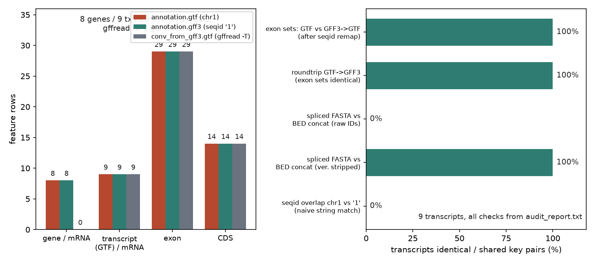
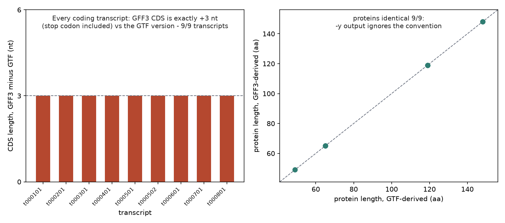
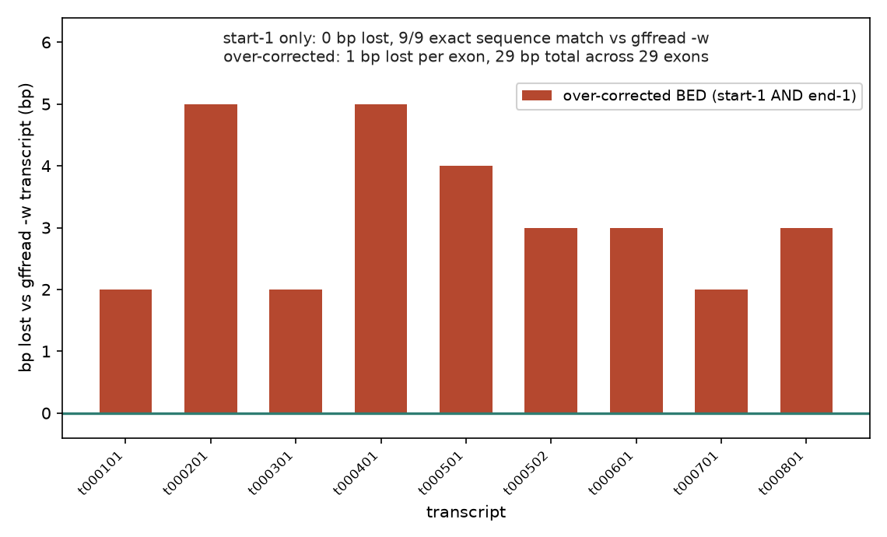

# 049 · bioSkills 真实试用：gtf-gff-handling（GTF/GFF3 注释操作）

## 功能定位与适用范围

`gtf-gff-handling` 讲解**解析、查询、转换 GTF/GFF3 基因模型注释，并从中提取特征或序列**。核心主张：注释文件不是区间表，而是序列化存储的基因模型树，绝大多数错误来自把它当 CSV 处理，或来自工具从不告警的坐标/命名空间错配。

- **适用**：GTF↔GFF3 互转与 GTF→BED；提取转录本/CDS/蛋白 FASTA；遍历 gene→transcript→exon/CDS 层级并推导内含子等隐含特征；诊断计数矩阵全零、注释 join 丢行这类坐标/命名空间错配。
- **不适用**：判断注释本身的质量（见 annotation-qc）；对 reads 做定量（见 featurecounts-counting，链特异性与 seqid 的计数级问题在彼处处理）。

## 属性表（本次真跑环境）

| 项 | 值 |
|---|---|
| gffread | 0.12.9（conda env `bio`，WSL Ubuntu） |
| bedtools | v2.31.1（getfasta 作独立序列对照） |
| Python | 3.11.16（九列解析与审计脚本） |
| 注释数据 | seed=49 自包含迷你集：1 条 2,000,000 bp 染色体 chr1；8 个基因 / 9 条转录本 / 29 个外显子 / 14 段 CDS |
| GTF 版约定 | seqid=chr1；GENCODE 风格属性（gene_type）；版本化 ID（G0001.1）；CDS 不含终止密码子 |
| GFF3 版约定 | seqid=1；ID/Parent 层级 + gene_biotype；无版本后缀；CDS 含终止密码子 |
| 主产出 | 转换文件 2 个、FASTA 7 个、BED 3 个、audit_report.txt 1 份、audit.json 1 份 |
| 实验产物 | `content/素材/genome-intervals/049-gtf-gff-handling/` |

## 成分拆解

### 1. 九列结构实测：GTF 平铺属性 vs GFF3 层级属性

两版文件逐行解析均为 9 列（本次 5 个 GXF 文件全部通过列数检查）。属性字段实测键清单：

| 文件 | 实测属性键 |
|---|---|
| annotation.gtf | exon_number、gene_id、gene_name、gene_type、transcript_id（共 5 个） |
| annotation.gff3 | ID、Name、Parent、gene_biotype、rank（共 5 个） |

同一份模型在两种格式里属性命名完全不同：biotype 筛选按 gene_type 还是 gene_biotype 取决于来源，查错键返回空集且无告警。版本后缀实测：GTF 60 行带版本化 ID，GFF3 0 行；GTF→GFF3 往返后 9 行 ID 保留版本号。这些正是 skill 点名的两类跨文件键错配，在合成数据上得到复刻。

### 2. 坐标转换只动 start：序列级 9/9 全等

skill 口径：BED = start−1、end 不变（1-based 包含端与 0-based 排他端的数值相同）。实测：exons.bed（start−1，按转录方向排列）经 bedtools getfasta 提取并按转录本拼接，与 gffread -w 转录本 FASTA 逐序列比对 **9/9 条逐碱基全等**（含 4 条负链的反向互补）。过度校正对照组（start−1 且 end−1）每外显子丢 1 bp：9 条转录本合计丢 29 bp，单条损失 2-5 bp，恰好等于各自外显子数——这种位移在覆盖度/overlap 分析里不可见，进入翻译即移码。

### 3. 静默错配家族：seqid 与 ID 版本

chr1 vs 1：两文件 seqid 交集为空集，按字符串相等统计"共享特征"为 0/60 行。gffread 对 seqid 不匹配的提取并非静默：实测报错 `no genomic sequence available`、退出码 1、输出 0 条记录；skill 强调的 featureCounts/htseq 静默零矩阵行为属计数级（本次无 BAM，未测，见"未覆盖"）。ID 版本后缀：BED 特征名与 GTF FASTA 头（T000101.1）直接取交集 0/9 条，剥离 `.版本号` 后 9/9 条——join 丢行不报错，只有行数变化。

### 4. phase 全链一致（5 个文件 0 错配）

audit 按"转录 5'端起累积编码长度 mod 3"独立重算每段 phase，与文件第 8 列比对：5 个 GXF 文件（两版源文件、重映射版、双向转换产物）全部 0 错配。两版各自的 CDS 链虽相差终止密码子 3 nt，但因差异位于链尾，前段 phase 不受影响——phase 的正确性依赖链内累积，任何手改坐标都必须整链重算。

### 5. 终止密码子约定：恰差 3 nt，蛋白 9/9 一致

GTF 版 CDS 排除终止密码子，GFF3 版包含。实测 9/9 条编码转录本：gffread -x 提取的 CDS 长度 GFF3 版比 GTF 版**恰好 +3 nt**；gffread -y 蛋白 9/9 条逐残基一致（末端不输出 *）。gffread -w 的 FASTA 头直接可见差异：`CDS=56-499`（GTF 版） vs `CDS=56-502`（GFF3 版）。跨来源比较 CDS/蛋白长度出现 3 nt / 1 aa 的差时，先查约定再查代码。

### 6. gffread 转换行为（0.12.9 实测）

GFF3→GTF（-T）：输出 52 行（9 转录本 + 29 外显子 + 14 CDS），**gene 行 0 条**（源 GTF 8 条）——gffread 不为 GFF3 gene 记录合成 GTF gene 行；ID 前缀原样保留（`transcript_id "transcript:T000101"`），版本号被剥除。GTF→GFF3（默认输出）：9/9 条转录本外显子集合一致，`ID=T000101.1` 版本号保留。按 gene 聚合或按版本 join 的下游步骤使用转换产物时需注意这两点。

## 严格复现（本次真跑，2026-09-03）

完整命令与输出见素材目录 `repro_transcript.txt`；主流程与审计日志 `_run.log`。

**① 命令链（conda env bio）**

```
python3 make_inputs.py                              # seed=49 注释集 + genome.fa
gffread annotation.gff3 -T -o conv_from_gff3.gtf    # GFF3 -> GTF
gffread annotation.gtf -o conv_from_gtf.gff3        # GTF -> GFF3
gffread -w tx_from_gtf.fa -g genome.fa annotation.gtf
gffread -x cds_from_gtf.fa -g genome.fa annotation.gtf
gffread -y prot_from_gtf.fa -g genome.fa annotation.gtf
gffread -w tx_from_gff3_asis.fa -g genome.fa annotation.gff3   # seqid 不匹配对照
python3 make_bed.py                                 # start-1 BED + 过度校正对照 + seqid 重映射
bedtools getfasta -fi genome.fa -bed exons.bed -s -name -fo exons_bed_sense.fa
gffread -w tx_from_gff3.fa -g genome.fa annotation_chr1.gff3   # 重映射后提取
python3 audit.py                                    # 九列/phase/一致性审计
```

**② 转换一致性（核心实测）**

| 检查项 | 实测结果 |
|---|---|
| 外显子坐标集：GTF vs GFF3→GTF（seqid 归一后） | 9/9 条一致 |
| GTF→GFF3 往返外显子坐标集 | 9/9 条一致 |
| CDS 长度差（GFF3 − GTF） | 9/9 条均为 +3 nt |
| 提取蛋白序列：GTF 版 vs GFF3 版 | 9/9 条逐残基一致 |
| phase 重算错配（5 个文件） | 0 段 |
| BED 拼接序列 vs gffread -w（start−1 口径） | 9/9 条逐碱基全等 |
| BED 过度校正（end−1）损失 | 29 个外显子合计 29 bp |

**③ 命名空间与 ID 键**

| 检查项 | 实测结果 |
|---|---|
| seqid 交集 chr1 ∩ {1} | 0 个 |
| 字符串相等"共享特征"行 | 0/60 行 |
| seqid 重映射（1→chr1）后提取 | 9 条转录本 FASTA |
| FASTA 头 join（原始 ID） | 0/9 条 |
| FASTA 头 join（剥版本后） | 9/9 条 |
| seqid 不匹配直接提取 | 0 条记录（exit 1） |

**④ 提取产物规模**

| 产物 | 记录数 | 长度 |
|---|---|---|
| 转录本 FASTA（-w） | 9 条 | 中位 905 nt（523-1622 nt） |
| CDS FASTA（-x） | 9 条 | 中位 357 nt |
| 蛋白 FASTA（-y） | 9 条 | 中位 119 aa |

**复现备注（诚实记录）**：生成器初版把负链转录本的终止密码子裁剪端点写在了基因组右端，而负链的转录 3' 端在基因组左端，导致 6 条负链转录本的 GTF 版蛋白丢失 N 端甲硫氨酸（少 1 aa）；该错误由"蛋白 GTF vs GFF3 逐残基比对"审计项抓出，修正端点后 9/9 一致。审计口径独立于生成器，序列级交叉验证能抓住数据生成自身的错误。

**未覆盖（诚实标注）**：

- gffutils（SQLite 树查询）、gtfparse/pyranges（dataframe 解析）、AGAT（ malformed 文件清洗）均未安装、未真跑；树遍历与 dataframe 部分为 skill 文档口径。
- GTF→BED 按 skill 口径（start−1、end 不变）用等价 python 解析实现（gtfparse 不可用），逻辑与 skill 示例一致。
- 计数器（featureCounts/htseq）的静默全零矩阵行为未实测（无 BAM）。
- 第 2 条转录本（可变外显子异构体）的 CDS 窗口延伸进随机序列，属合成数据简化。

### 本次出图







## 实践要点

- **跨文件先做集合交集审计**：seqid 与 gene ID 两组键都用程序求交集，不靠肉眼（实测 chr1 vs 1 交集 0 个、原始 ID join 0/9 条）。
- **BED 转换只动 start**：start−1、end 不变；过度校正每外显子丢 1 bp（实测 29 个外显子共丢 29 bp）。
- **CDS 长度差 3 nt 先查约定**：GTF 排除 / GFF3 常含终止密码子，不是坐标 bug；gffread -x/-y 知道该约定，蛋白输出不受影响。
- **gffread -T 会丢 gene 行并剥 ID 版本号**（8 条→0 条），下游按 gene 聚合的步骤改用转换产物前先核对行数。
- **phase 用程序重算校验**：任何 CDS 坐标手改都应触发整链重算（累积长度 mod 3）。
- **版本化 ID join 前双侧剥 `\.\d+$`**（实测 0/9 → 9/9 条），存储侧保留版本号做溯源。
- **区分显式报错与静默零结果**：gffread 对 seqid 不匹配直接报错退出；计数器字符串匹配不报错，只有全零矩阵。
- **合成注释集要内置约定分裂**（seqid、属性键、终止密码子、版本号），否则测不出转换器与解析器的行为差异。

## 小结

本次在 WSL 用 gffread 0.12.9 完成 GTF/GFF3 双版迷你注释集（8 基因 / 9 转录本 / 29 外显子 / 14 段 CDS）的全链路真跑：双向转换、7 个 FASTA 提取、BED 坐标转换与独立审计。核心实测：坐标转换 start−1 后与 gffread 序列 9/9 条逐碱基全等、过度校正丢 29 bp；终止密码子约定使 CDS 恰 +3 nt 而蛋白 9/9 条一致；seqid 与 ID 版本两组键 naive join 均为 0、归一后全部恢复；phase 全链 0 错配。gffutils/gtfparse/AGAT 未覆盖，已诚实标注。

（数据与可复现脚本见 `content/素材/genome-intervals/049-gtf-gff-handling/`，含 make_inputs.py、make_bed.py、audit.py、_run.sh、repro_transcript.txt 与三张图。）
