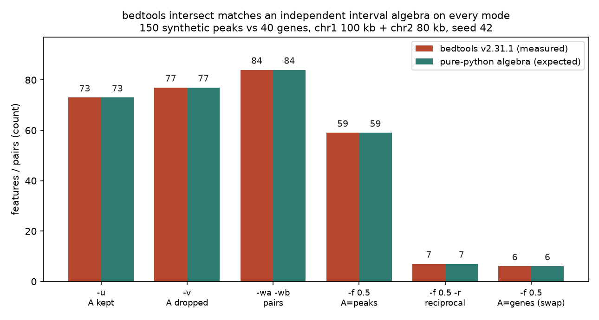
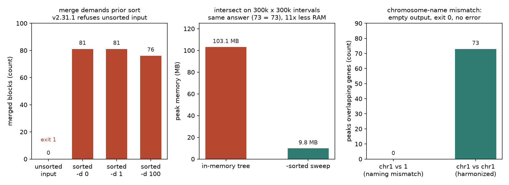
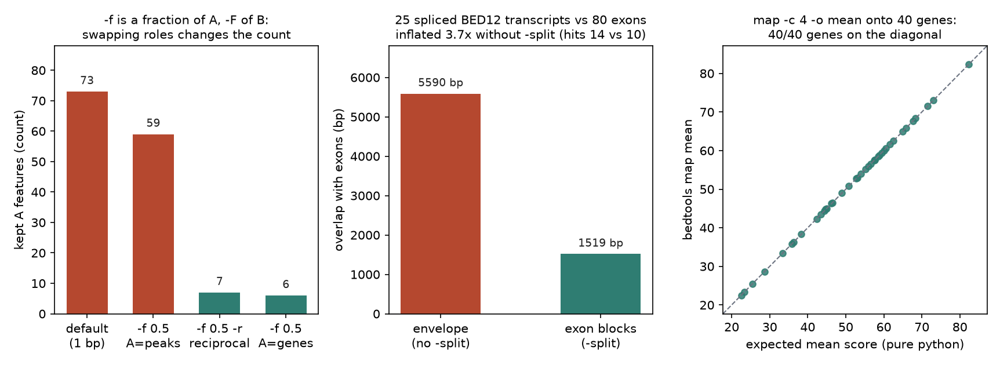

# 050 · bioSkills 真实试用：interval-arithmetic（bedtools 区间运算）

## 功能定位与适用范围

`interval-arithmetic` 讲解**对基因组区间做精确集合运算**：bedtools 的 intersect 七种输出模式、subtract/merge/complement/cluster、map/groupby 值转移、multiinter/unionbedg 多样本对照，以及 jaccard/fisher 两个相似度机制。它的核心论点只有一句：**区间算术本身精确且确定，错误几乎全部藏在四个静默前置条件里**——输入未排序、`-sorted` 的染色体顺序约定、该加 `-split` 而未加、染色体命名不一致。

- **适用**：找两组 BED/峰文件的重叠或独有区间；用 `-d N` 合并重复峰构建共识集；剔除 blacklist 区区段；把信号值按区间聚合到基因上；算两个数据集的 jaccard 相似度做聚类前筛。
- **不适用**：判断重叠是否超过随机水平（skill 明确路由到 overlap-significance，原始重叠数受长度与覆盖混杂）；峰值尚未调用时的上游流程（chip-seq/atac-seq 的 peak-calling）；closest/window/slop 等邻近操作（proximity-operations）。

## 属性表（本次真跑环境）

| 项 | 值 |
|---|---|
| bedtools | v2.31.1（conda env `bio`，bioconda 通道，WSL Ubuntu） |
| Python / pybedtools | 3.11.16 / 0.12.1（pybedtools 平行校验通过，bedtools CLI 为参照实现） |
| 模拟基因组 | chr1 100000 bp + chr2 80000 bp，合计 180000 bp（seed 42，纯 python 生成） |
| 区间集 | peaks 150 条（300–1200 bp，合并前覆盖 84943 bp ≈ 47.2% 基因组）；genes 40 条（1000–3000 bp，互不重叠）；blacklist 25 条（500–2000 bp）；exons 80 条（各 300 bp）；BED12 转录本 25 条（跨 2000 bp，3×150 bp 外显子）；重复峰集 3 批（各 55 共享位点 + 8 私有峰）；bedGraph 360 个 bin（250 bp 窗、500 bp 步长） |
| 期望值来源 | make_inputs.py 内置的独立纯 python 区间代数（排序扫掠实现，与 bedtools 无代码共享） |
| 对账结果 | 40 项 measured vs expected 全部一致（results.txt） |
| 实验产物 | `content/素材/genome-intervals/050-interval-arithmetic/`（2026-09-03） |

## 成分拆解

### 1. 输出模式只改打印什么，不改谁与谁重叠

intersect 的七个模式是同一几何计算的七种投影，这是本 skill 点名的头号困惑源：

| 模式 | 语义（实测行数） | 期望 |
|---|---|---|
| `-u` | 有重叠的整条 A，每 A 至多一行（73 条） | 73 条 |
| `-v` | 无任何重叠的 A（77 条） | 77 条 |
| `-c` | 每条 A 追加命中计数列，0 也保留（150 行，其中计数 >0 的恰 73 行） | 同 |
| `-wa -wb` | 整条 A + 整条 B，每对一行（84 行） | 84 行 |
| `-loj` | 左外连接：重叠对照打，无重叠的 A 补 NULL 行（161 行 = 84 对 + 77 空转） | 161 行 |
| `-wo` | A + B + 重叠 bp，只含有重叠的（合计 49087 bp） | 49087 bp |
| `-wao` | 同 `-wo`，但无重叠的 A 保留（161 行 = 84 对 + 77 空转） | 161 行 |

实测有一个反直觉细节：`-loj` 不是直觉上的「每条 A 一行」（那会输出 150 行），而是**每个重叠对一行、无命中的 A 各补一行**，因此行数与 `-wao` 相同（161 = 84 + 77）。二者区别只在无命中行的 B 列填充：`-loj` 填 `.，-1，-1`，`-wao` 填 `.，0`。

### 2. 排序契约：`-sorted` 是内存换正确性的开关

skill 把「先 sort」列为 merge/cluster/map/groupby 的硬前提，把 `-sorted` 描述为把内存区间树换成低内存染色体扫掠。本次用 30 万 × 30 万条区间（250 Mb 合成染色体）实测：

| 方式 | 耗时 | 峰值内存（/usr/bin/time 实测） |
|---|---|---|
| 内存区间树（默认） | 0.50 s | 105568 KB ≈ 103.1 MB |
| `-sorted -g genome.txt` 扫掠 | 0.35 s | 9996 KB ≈ 9.8 MB |

同一数据两种方式给出的 `-u` 计数完全一致（73 条 = 73 条），符合「算术精确」的论断；差异只在资源。

### 3. `-split`：外显子级真值与包络膨胀

25 条 BED12 转录本（各 3 个 150 bp 外显子、约 775 bp 内含子）对 80 条外显子求交：按整条包络计算重叠 5590 bp、14 条转录本命中；加 `-split` 后只剩 1519 bp、10 条转录本——**包络口径把内含子当成实心，膨胀 3.7 倍**。RNA-seq 读段对比外显子组时，漏掉 `-split` 就是这个形态。

### 4. `-f` / `-F` 的不对称：A 的角色是「被阈值化的一方」

同一对文件，四个口径的命中数：默认 1 bp 重叠 73 条；`-f 0.5`（A=peaks，要求峰的一半以上落在单个基因内）59 条；`-f 0.5 -r`（双向各 50%）7 条；交换 `-a`/`-b` 后的 `-f 0.5`（A=genes）6 条。**阈值加在谁身上、谁是 A，直接改变答案**——判断「是否同一事件」要用 `-f 0.5 -r`，阈值应加在较小的特征集上。

### 5. subtract 的两种语义与 complement 的 genome 文件依赖

`subtract` 逐段裁剪：150 条峰对 25 条 blacklist 裁剪后剩 137 段 / 94033 bp；换 `-A` 则整条丢弃，直接剩 109 条（41 条峰因任何部分重叠被整体删除）。`complement` 必须给 `-g genome.txt`，否则不知道染色体终点：实测返回 83 段 / 95057 bp，与「基因组 180000 bp − 峰覆盖 84943 bp」精确吻合。

### 6. 值转移与多样本：map、groupby、multiinter、unionbedg

`map -c 4 -o mean` 把 bedGraph 信号均值聚合到 40 条基因，逐基因与纯 python 期望比对，0 个不一致（bedtools 打印均值时截断到 8 位小数，比对容差取 1e-6）；`intersect -wo | groupby` 按基因求和重叠 bp，40 条基因同样 0 错。多样本侧，`multiinter` 给出 3 批重复峰的共有区间 41 段 / 20286 bp；`unionbedg` 把三份 bedGraph 堆成信号矩阵，350 行与「任一样本出现过的 bin 数」一致。

### 7. jaccard 与 fisher：只是机制，不是结论

`jaccard`（在合并后的峰/基因上）实测 0.28398，交 33703 bp / 并 118681 bp，n_intersections 41 与独立实现一致——它只是一个相似度标量，无 p 值。`fisher` 的 2×2 表则暴露了它的启发式本质：本次输出中「in -a 且 not in -b」「not in -a 且 not in -b」两格均为 0（后者由平均区间长度启发式估出），two-tail p = 1。按 skill 的定位，它只能当快速分诊，显著性结论需置换检验（overlap-significance）。

## 严格复现（本次真跑，2026-09-03）

完整命令与输出见素材目录 `repro_transcript.txt`（23 段日志拼合，含环境版本、全流程与对账表）；脚本已落盘：`make_inputs.py`（造数 + 期望值）、`_run.sh`（主流程）、`parse_results.py`（对账）、`pybedtools_check.py`、`perf_gen.py`（性能夹具）、`make_figs.py`。

**① 主流程命令链（bio 环境，bedtools v2.31.1）**

```
python3 make_inputs.py                                   # 造数 + 纯 python 期望值
bedtools sort -g genome.txt -i peaks.bed > peaks_sorted.bed
bedtools intersect -a peaks_sorted.bed -b genes_sorted.bed -u|-v|-c|-wa -wb|-loj|-wo|-wao
bedtools intersect ... -f 0.5 [-r] / 交换 -a -b
bedtools subtract -a peaks_sorted.bed -b blacklist.bed [-A]
bedtools merge [-d 0|1|100] [-c 4,5 -o distinct,sum] -i peaks_sorted.bed
bedtools complement -i peaks_sorted.bed -g genome.txt
bedtools sort -i peaks.bed | bedtools cluster -d 0
bedtools map -a genes_sorted.bed -b scores_sorted.bedgraph -c 4 -o mean
bedtools intersect -a genes_sorted.bed -b peaks_sorted.bed -wo | bedtools groupby -g 1,2,3,4 -c 12 -o sum
bedtools multiinter -header -names rep1 rep2 rep3 -i rep1.bed rep2.bed rep3.bed
bedtools unionbedg -header -names rep1 rep2 rep3 -i ubg1.bedgraph ubg2.bedgraph ubg3.bedgraph
bedtools jaccard / fisher -a merge_d0.bed -b genes_d0.bed -g genome.txt
bedtools intersect -a spliced.bed12 -b exons_sorted.bed -wo [-split]
```

**② 对账结果：40 项 measured vs expected 全部一致（核心实测）**

| 运算 | 实测 | 期望 | 一致 |
|---|---|---|---|
| intersect `-u` / `-v` / 配对数 / 重叠 bp | 73 条 / 77 条 / 84 行 / 49087 bp | 同 | ✓ |
| `-loj` 与 `-wao` 行数 | 161 行 = 161 行 | 84 对 + 77 空转 | ✓ |
| `-f 0.5` / `-f 0.5 -r` / 换角色 | 59 条 / 7 条 / 6 条 | 同 | ✓ |
| subtract 残段 / `-A` 剩余 | 137 段 94033 bp / 109 条 | 同 | ✓ |
| merge `-d 0` / `-d 1` / `-d 100` | 81 / 81 / 76 块 | 同 | ✓ |
| merge `-c 5 -o sum` 分数守恒 | 78826 | 原始分数总和 78826 | ✓ |
| complement | 83 段 / 95057 bp | 180000 − 84943 bp | ✓ |
| cluster 数 = merge 块数 | 81 = 81 | 同 | ✓ |
| map / groupby 不一致基因数 | 0 条 / 0 条（各 40 条基因） | 0 条 | ✓ |
| multiinter 三集共有 | 41 段 / 20286 bp | 同 | ✓ |
| unionbedg 行数 | 350 行 | 350 行 | ✓ |
| jaccard（值 / 交 / 并 / n_inter） | 0.28398 / 33703 bp / 118681 bp / 41 | 同 | ✓ |
| BED12 包络 vs `-split` | 5590 bp / 14 条 vs 1519 bp / 10 条 | 同 | ✓ |

pybedtools 0.12.1 平行校验：`intersect(u=True)` 73 条、`merge()` 81 块、`map(c=4, o='mean')` 均值与 CLI 完全一致——wrapper 只是壳出 bedtools 二进制，结果天然同源。

**③ 三个与 SKILL.md 文字口径的实测偏差（诚实记录）**

- **「merge 未排序静默欠合并」在 v2.31.1 不复现。** SKILL 描述的行为（重叠区间因文件顺序不相邻而存活、无警告）是旧版口径；实测 v2.31.1 对未排序输入直接报错退出（exit 1，`Error: Sorted input specified, but the file peaks.bed has the following out of order record`），输出 0 行。防御从「靠用户自觉」变成了「工具拒绝」，skill 的失败模式一节未更新这一点。
- **染色体命名错配并非完全静默。** SKILL 称 `chr1` vs `1` 「返回空结果且无错误」；实测 exit 0、输出 0 行属实，但 v2.31.1 在 stderr 打了 220 字节的命名不一致 WARNING（`inconsistent naming convention`）。结论方向不变（计数为 0、退出码不报警），但日志里并非毫无痕迹。
- **`-sorted` 的染色体顺序错误与未排序错误是两条不同报错**：前者 `... different sort order than the genomeFile genome.txt`，后者 `... out of order record`，均为 exit 1；给 `-g genome.txt` 钉住顺序后扫掠结果与内存版一致（73 条 = 73 条）。

### 本次出图







### 未覆盖（诚实标注）

- pyranges 与 bioframe 两条纯 python 引擎未安装、未实测（本机仅 pybedtools 0.12.1 可用）；skill 提到的 v0/v1 API 分裂风险只能标注、不能验证。
- BED12 之外，spliced BAM 的 `-split` 与 BED12 内部块结构的等价性未单独验证。
- `fisher` 的低 p 膨胀未做模拟校验（skill 本身将其定位为弱筛选并路由 overlap-significance）。
- 大于 30 万 × 30 万的整基因组规模、多染色体乱序基因组文件（`-g` 顺序与字典序不一致的组合）未压测。

## 实践要点

- **先写期望，再跑工具**：造数时用独立实现（本次是纯 python 扫掠）算好期望值，bedtools 输出逐项对账——40 项一致才算闭环，这比任何单点抽查都便宜。
- **输出模式选错不报错**：同一份交集，`-u` 打 73 行、`-loj` 打 161 行、`-wo` 汇总 49087 bp，全部 exit 0；拿不准时先 `-c` 看计数分布，再选打印模式。
- **`-loj`/`-wao` 行数 = 重叠对数 + 无命中 A 数**，不是「每 A 一行」；下游按行数统计特征时按 A 的第 1–3 列去重。
- **merge/cluster/map/groupby 前置 sort 是硬纪律**：v2.31.1 会拒绝未排序输入，但别依赖报错兜底——旧版本或某些子命令仍可能静默出错。
- **`-sorted -g` 值得写进流程**：实测同样结果下峰值内存 103.1 MB 降到 9.8 MB（10.6 倍），`-g` 同时钉住染色体顺序，让报错更可诊断。
- **`chr1` vs `1` 的错配要靠对账发现**：输出为空且 exit 0，只有 stderr 一条 WARNING；跨团队交数据先统一命名再跑交集。
- **RNA 类数据对比外显子必须 `-split`**：包络口径把重叠高估 3.7 倍（本次实测），且命中条数也会虚多（14 条 vs 10 条）。
- **`-f` 阈值加在小集合上**，判「同一事件」用 `-f 0.5 -r`；A/B 角色一换，73 → 59 → 6 的差距就是误用空间。
- **jaccard 只做数据集聚类的前筛，fisher 的 p 只当分诊**；显著性结论交给置换检验。
- **bedtools 的浮点输出截断到 8 位小数**，脚本化比对时容差别设成机器精度（1e-9 会误报）。

## 小结

interval-arithmetic 的方法论可以压缩成一个等式：**精确的区间算术 + 被核验的前置条件 = 可信的基因组集合运算**。本次在 WSL 真跑闭环：seed 42 合成双染色体区间集，独立纯 python 代数产出 40 项期望，bedtools v2.31.1 的 intersect 全模式、subtract 双语义、merge 三档 `-d`、complement、cluster、map、groupby、multiinter、unionbedg、jaccard 全部对账一致；pybedtools 平行校验同源。三个与 SKILL.md 文字的偏差（v2.31.1 对未排序 merge 直接报错、命名错配带 WARNING、`-loj` 行数语义）均如实记录。3 张图分别落在「模式与阈值」「排序契约」「-split 与值转移」三个实证面上。

（数据与可复现脚本见 `content/素材/genome-intervals/050-interval-arithmetic/`，含 `make_inputs.py`、`_run.sh`、`parse_results.py`、`repro_transcript.txt` 及三张图。）
