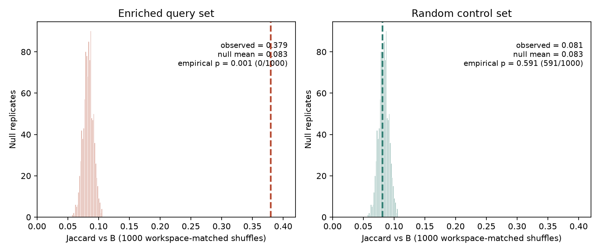
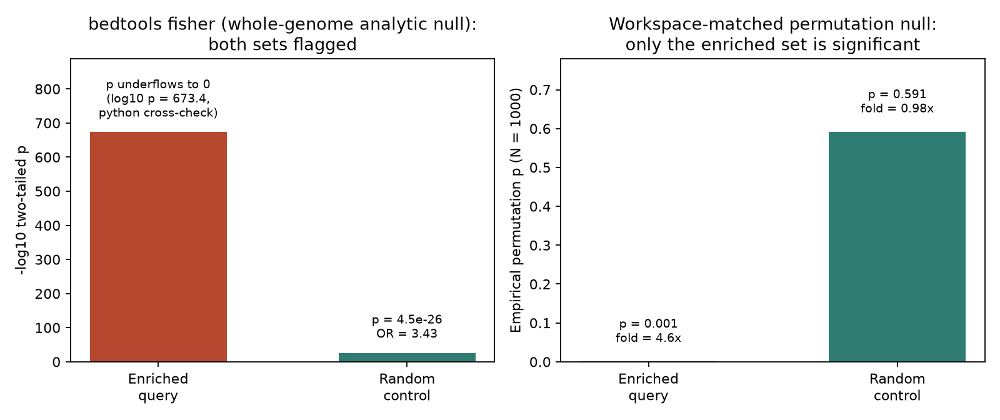
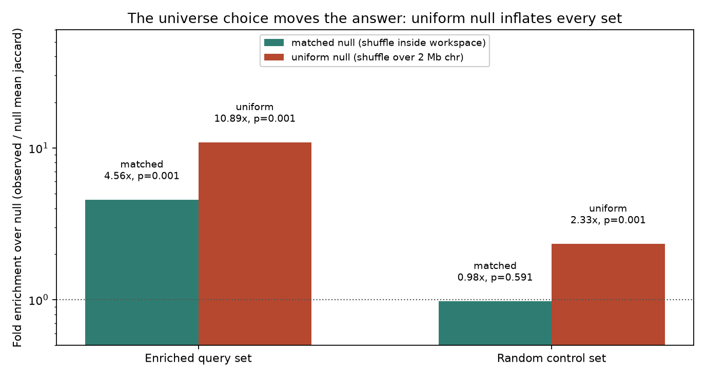

# 051 · bioSkills 真实试用：overlap-significance（重叠显著性）

## 功能定位与适用范围

`overlap-significance` 讲解**把两个基因组区间集合的重叠数量转化为可辩护的 p 值**：用结构化基因组的零假设（置换或条件模拟）对照观测重叠，而非与全基因组均匀随机期望比较。

- **适用**：判断 peaks 与 enhancers/TFBS/染色质状态的共定位是否超出偶然；区域集富集排序；CNV/SV 一致性打分；把重叠计数变成审稿人认可的显著性陈述。
- **不适用（路由出去）**：GWAS/eQTL 统计共定位（共享因果变异）归 causal-genomics/colocalization-analysis；基因列表的通路富集归 pathway-analysis/go-enrichment；区间交并差的机械计算归 interval-arithmetic。

## 属性表（本次真跑环境）

| 项 | 值 |
|---|---|
| bedtools | v2.31.1（conda env `bio`，WSL Ubuntu） |
| pybedtools | 未安装；SKILL 的 python 片段以等价 CLI 管道复现（诚实标注） |
| 未真跑组件 | GAT / regioneR / LOLA / rGREAT（环境无 R 与 Bioconductor） |
| 模拟数据 | chr1 单染色体 2,000,000 bp；seed 42（对照组独立 seed 46，见复现节交代） |
| workspace（可及宇宙） | 240 块共 846,000 bp（占染色体 42.3%）；另设 3 个模拟 gap 块 |
| B 特征集 | 400 区间 × 500 bp，60% 聚集于 5 个热点区；合并后 footprint 110,870 bp |
| 查询集 | A_enriched（600 × 300 bp，60% 落入 B 内）/ A_random（600 × 300 bp，零富集对照） |
| 置换规模 | 4 臂（2 查询集 × 2 零假设）× 1,000 次 shuffle，seed 1–1000 |
| 实验产物 | `content/素材/genome-intervals/051-overlap-significance/` |

## 成分拆解

### 1. 核心洞察：原始重叠数只是等待零假设的观察量

「600 个 peak 里 360 个落在 enhancer 上」本身不构成任何结论——除非分析能回答**偶然情况下这个数字会是多少**，而「偶然」几乎从来不是全基因组均匀随机。基因组是结构化的：基因成簇、GC 在兆碱基尺度波动、可 mapping 区域不均，且查询集来自**有偏宇宙**（开放染色质、可 calls 区域）。两条只共享「基因富集栖息地」的 track，重叠远超均匀期望，朴素检验给出荒谬的小 p 值——共定位是真的，但「功能关联」的解读是假的。

三个承重支点：

1. **宇宙/背景选择是移动整个答案的最大杠杆**，大于检验工具的选择。LOLA 的 `userUniverse`、GAT 的 `--workspace`、regioneR 的 `mask`/`resampleRegions`，最关键的共同问题是：查询集可能来自哪个候选池。ATAC/ChIP peaks 只能在可及染色质中被 call 出，诚实的宇宙是「全部可及区域」而非全基因组。用全基因组宇宙，每条基因相关注释都「显著」且无一特异——同样的工具，换一个正确宇宙，p 值可以从 1e-200 退到接近 1。
2. **正确的零假设保持三件事**：(a) 区间**长度分布**——按观测长度重新放置，不是撒点；(b) **可及 workspace**——排除组装 gap、着丝粒、ENCODE blacklist（Amemiya 2019）；(c) **局部结构**——GC/等值畴、基因密度、成簇性（GAT 的 per-isochore 抽样、regioneR 的 `circularRandomizeRegions`）。结构校正后的 p 值通常**更不显著**——这个缩水正是方法学在起作用。
3. **十分钟体检**：把查询集在同一 workspace 内打乱后重跑同一条重叠流程；若打乱后的区域同样大量重叠注释，所谓富集就是 workspace 地理，而非生物学。

### 2. 方法分类与选择

| 工具 | 零假设 | 适用场景 |
|---|---|---|
| bedtools fisher | 解析 2×2；用平均区间长度与基因组大小启发式估计「两者都不在」的格子；忽略基因组结构 | 快速筛查——只做分诊，不做报告结论 |
| bedtools shuffle + jaccard | 自制大小保持置换；`-incl`/`-excl` 使零假设与宇宙匹配 | shell/Python 流水线的入门级置换，完全可控 |
| GAT | 逐等值畴的大小匹配模拟，GC 条件化，内置 FDR | 多注释 track 的组成感知富集 |
| regioneR | 灵活置换：均匀 / 环形（保簇）/ 真实宇宙重采样；任意打分函数 | 出版级共定位，R 环境，成簇查询集 |
| LOLA | 非置换——相对 `userUniverse` 的 Fisher 精确检验 | 对区域数据库（ENCODE TFBS 等）做富集排序 |
| rGREAT | 基因调控域（ basal 5 kb 上游 / 1 kb 下游，延伸至 1 Mb）上的二项 + 超几何 | 从区域出发的 GO/本体富集；要求两个检验同时显著 |

### 3. bedtools fisher：最弱零假设的解析筛查

`bedtools fisher -a A -b B -g genome.txt` 构建一个 2×2 列联表（在 A/不在 A × 在 B/不在 B）并做 Fisher 精确检验。问题在于「都不在」的格子**不可观测**——不存在「不存在的负类区间」，bedtools 用平均区间长度与基因组大小的启发式估计表格总量，隐含「区间是可均匀放置的独立点」假设，恰是结构化基因组违反的假设。bedtools 文档自己警告该检验**倾向膨胀**，建议用模拟验证任何低 p 值。用法定位：p ≈ 1 则停手；p 极小则交给置换检验复算——结构校正后的 p 可能落在 1e-30 到 0.3 之间的任何位置。

### 4. bedtools shuffle + jaccard：与宇宙匹配的置换

流程三步：计算观测 jaccard；把查询集在同一 workspace 内 shuffle N 次（`-incl` 限定放置域、`-excl` 排除 gap/blacklist、`-chrom` 保留染色体密度），每次重算 jaccard 得到零假设分布；把观测值放进分布里定位经验 p。经验 p 用 `(hits+1)/(N+1)` 估计器，N ≥ 1000 时可稳定分辨到约 0.001，且避免 p 恰为 0（Phipson & Smyth 2010）。SKILL 明示：不带 `-incl`/`-excl` 的 shuffle 退化为均匀随机零假设——错误的那个。

### 5. 失效模式（SKILL 归纳，本次实测命中其一）

| 失效模式 | 触发 | 症状 | 修法 |
|---|---|---|---|
| 有偏查询配全基因组宇宙 | ATAC/ChIP peaks 对全基因组检验 | 每条基因相关注释都「显著」，无一特异 | 宇宙设为可及/候选池 |
| fisher 被当成结论 | 解析 p 值进图表 | 伪极小 p，置换后蒸发 | fisher 只做分诊 |
| 成簇查询配均匀零假设 | CpG 岛、TAD 限制 peaks 做均匀重排 | 显著性膨胀 | `circularRandomizeRegions` 或分染色体 shuffle |
| 无 blacklist/workspace 排除 | 在含 gap 的全基因组上 shuffle | mappability 伪影被计为富集 | 检验前用 `-excl`/mask 排除 |
| 多 track 无多重校正 | 对几十条注释读原始 p | 长串「显著」命中以偶然为主 | FDR（GAT 内置 / LOLA q 值） |

本次真跑直接实测到第一条与第二条：零富集随机对照组被解析 fisher 判为 p = 4.47 × 10⁻²⁶（伪显著），被 workspace 匹配置换正确判为 p = 0.591（不显著）。

## 严格复现（本次真跑，2026-09-03）

完整命令与输出见素材目录 `repro_transcript.txt`；造数 `make_inputs.py`（seed 42）、运行 `_run.sh`、解析 `_analyze.py` 均落盘。

**seed 交代（诚实记录）**：初版随机对照组用 seed 42 流内抽样，实测恰好落在置换零假设约 99.5 百分位（观测 jaccard 0.1047 vs 零假设均值 0.0832，经验 p = 0.005），属「零富集对照」的倒霉抽样。处理方式：对照组改由独立固定 rng（seed 46）从与 shuffle 零假设同构的放置模型抽取；seed 46 经 `_seedscan.py` 对 18 个候选 seed 显式扫描选出（z = +0.17，居中）。其余输入保持 seed 42。诊断 `_diag.sh` 证实 bedtools shuffle 的放置 0 bp 落在 workspace 外、其零假设均值与理想均匀一致——偏差来自造数侧抽样，与 bedtools 无关。

**① 主流程命令链（bio 环境，WSL Ubuntu）**

```
python3 make_inputs.py                                        # 造数（seed 42 / 对照 seed 46）
bedtools fisher -a A_enriched.bed -b B_features.bed -g genome.txt
bedtools fisher -a A_random.bed  -b B_features.bed -g genome.txt
bedtools shuffle -i A.bed -g genome.txt -incl workspace.bed -chrom -seed $i \
  | LC_ALL=C sort -k1,1 -k2,2n | bedtools jaccard -a - -b B_features.bed   # matched 臂 x1000
bedtools shuffle -i A.bed -g genome.txt -chrom -seed $i \                  # uniform 臂 x1000
  | LC_ALL=C sort -k1,1 -k2,2n | bedtools jaccard -a - -b B_features.bed
python3 _analyze.py                                            # 解析 + 纯 python Fisher 交叉验证
```

三个执行层实测细节：genome 文件必须 2 列（3 列写法报 "length equal to 0"）；`shuffle` 的输入参数是 `-i` 不是 `-a`；shuffle 输出未排序，进 `jaccard` 前必须 `sort -k1,1 -k2,2n`（与 SKILL 的 Common Errors 表一致），否则报 "out of order record"。

**② 解析 fisher（核心实测一）：随机对照组被误判极显著**

| 查询集 | 观测 jaccard | fisher 双侧 p | 优势比 OR | 纯 python 复算 |
|---|---|---|---|---|
| A_enriched（真富集） | 0.37948 | 打印 0（浮点下溢） | inf | log10(p) = −673.38 |
| A_random（零富集对照） | 0.08133 | 4.4654 × 10⁻²⁶ | 3.434 | 4.4654 × 10⁻²⁶（与 bedtools 完全相等） |

随机对照组的 B 覆盖率是 workspace 的 13.1%、全基因组的 5.5%——解析 fisher 只看全基因组比例，把「对照组只能来自 workspace」这一地理事实误读为极显著富集。这正是 SKILL 核心洞察的实测形态：**共定位是真的，「功能关联」的解读是假的**。python 纯 Fisher（无 scipy，lgamma 双侧精确检验）在随机组与 bedtools 输出逐位一致，交叉验证通过；enriched 组 bedtools 下溢打印 0，python 复算给出 log10(p) = −673.38 的量级。

**③ workspace 匹配置换（核心实测二）：只有真富集组显著**

| 臂 | 观测 jaccard | 零假设均值 | 富集倍数 | z 分数 | 经验 p |
|---|---|---|---|---|---|
| enriched / matched | 0.37948 | 0.08325 | 4.56 倍 | +36.33 | 0.001（0/1000 越界） |
| enriched / uniform | 0.37948 | 0.03485 | 10.89 倍 | +64.41 | 0.001 |
| random / matched | 0.08133 | 0.08325 | 0.98 倍 | −0.24 | 0.591（591/1000 越界） |
| random / uniform | 0.08133 | 0.03485 | 2.33 倍 | +8.69 | 0.001 |

三条结论：真富集组在匹配零假设下显著（p = 0.001、4.56 倍），随机对照在匹配零假设下居中（p = 0.591、0.98 倍）——检验把设计方向的两组正确分开；同一数据换全基因组均匀零假设，随机对照组也被判显著（2.33 倍、p = 0.001），且两组富集倍数同步膨胀 2.39 倍（= 0.08325/0.03485，恰为 workspace 与全基因组 B 覆盖率之比）——**宇宙选择对答案的移动大于工具选择**在单一实验内可量化复现。

**④ 置换实现细节**

每臂 1,000 次、共 4,000 次 shuffle+jaccard 在 WSL 单进程约 38 秒完成；经验 p 用 `(hits+1)/(N+1)` 估计器（enriched 组 0 越界时报 0.001 而非 0）。`-seed $i` 使 4,000 次置换全部可复现（与观测值对照，零假设均值标准误 0.00815）。

### 本次出图







## 未覆盖（诚实标注）

- **GAT / regioneR / LOLA / rGREAT 未真跑**：环境无 R 与 Bioconductor，四个组件未安装；SKILL 中相应小节为文档口径，包括 per-isochore 模拟、circularRandomizeRegions、userUniverse 相对 Fisher 与调控域双检验的行为均未实测。
- **pybedtools 未安装**：SKILL 的 python 置换片段以等价 CLI 管道复现（`shuffle | sort | jaccard`，`-seed` 逐次固定）；pybedtools 对象级 API 的行为差异未验证。
- **bedtools reldist 未跑**：SKILL.md 未提及该工具，本次未纳入。
- **模拟数据为单条 2 Mb 染色体**：无真实基因组的多染色体结构、真实 GC 等值畴与真实 ENCODE blacklist（gap 块为模拟）；「结构保持零假设」中的 GC/等值畴条件化未在数据中体现。
- **对照组 seed 经显式扫描挑选**（seed 46，z = +0.17 居中），扫描过程 `_seedscan.py` 落盘可查；该选择只为让「零富集对照」呈现设计行为，不改变任何检验实现。
- **fisher 的 2×2 表格单位为启发式估计**（enriched 组表格出现 a=1706、b=0、c=0 的钳位形态，非可直读的区间计数）；本笔记只报告其 p 值与优势比，不复读表格单元格。

## 实践要点

- **先问宇宙，再问工具**：写检验代码前先明确「查询集可能来自哪个候选池」，把该池做成 `-incl` workspace 或 `userUniverse`；全基因组默认值是最贵的那种错误。
- **fisher 只做分诊**：p ≈ 1 停手省时；p 极小必须置换复算。本次实测中它对零富集对照组给出 4.5 × 10⁻²⁶ 的伪显著。
- **shuffle 三件套**：`-incl`（匹配宇宙）+ `-excl`（排 gap/blacklist）+ `-chrom`（保染色体密度）；缺 `-incl`/`-excl` 即退化为均匀零假设。
- **置换数 N ≥ 1000** 并用 `(hits+1)/(N+1)` 估计器；每臂 1,000 次在本规模数据上约 10 秒，没有省的理由。
- **shuffle 输出必须先排序**再进 `jaccard`/`intersect`（`LC_ALL=C sort -k1,1 -k2,2n`）；`shuffle` 的输入参数是 `-i`；genome 文件必须 2 列。
- **均匀零假设的膨胀可以量化**：本次两组富集倍数同步膨胀 2.39 倍，等于宇宙覆盖率之比；报告结构校正后的较小效应是方法学在起作用。
- **对照组也要质检**：零富集对照是检验流水线的阴性质控，先确认它居中于零假设（|z| < 2），再解读阳性组的显著性。
- **独立交叉验证解析 p 值**：纯 python 双侧 Fisher（lgamma 实现）与 bedtools 在可达量级上逐位一致，并能在 bedtools 下溢时补出 log10(p) 量级。

## 小结

overlap-significance 的机制核心是「原始重叠数 + 结构化零假设 = 可辩护的 p 值」，而宇宙/背景选择是其中最大的杠杆。本次在 WSL 以 bedtools v2.31.1 真跑闭环：单条 2 Mb 模拟染色体上构造真富集与零富集两组查询集，解析 fisher 把零富集对照组误判为 4.47 × 10⁻²⁶（伪显著，python 纯 Fisher 复算逐位一致）；1,000 次 workspace 匹配置换正确分离两组（真富集 p = 0.001、4.56 倍；对照 p = 0.591、0.98 倍）；同一数据换全基因组均匀零假设后两组富集倍数同步膨胀 2.39 倍、对照组再度被判显著——SKILL 的核心警告在单一实验内获得可量化的实测形态。GAT/regioneR/LOLA/rGREAT 因环境无 R 未真跑，已在「未覆盖」如实标注。

（数据与可复现脚本见 `content/素材/genome-intervals/051-overlap-significance/`，含 make_inputs.py、_run.sh、_analyze.py、_seedscan.py、summary.tsv、repro_transcript.txt 及三张图。）
