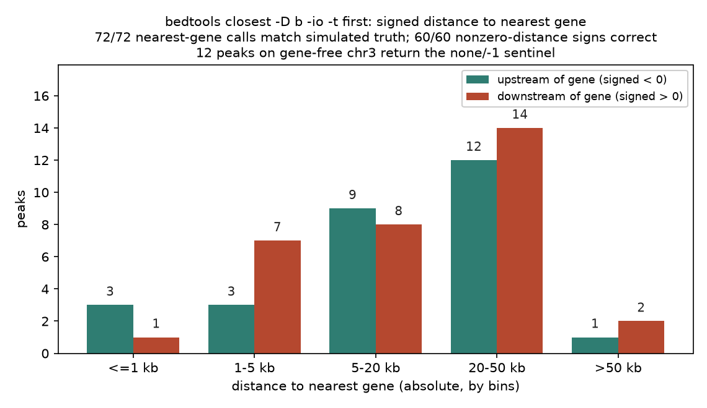
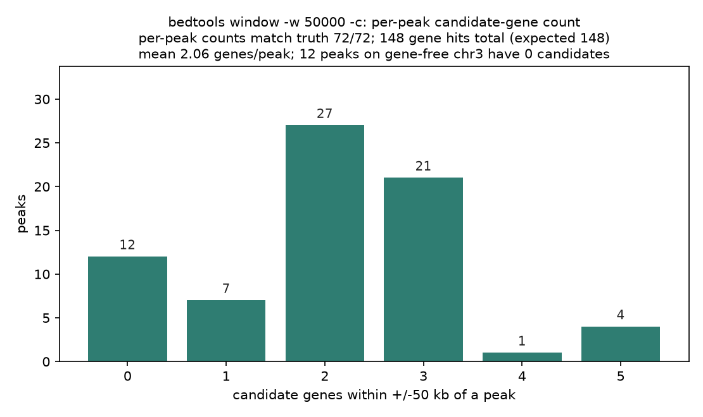
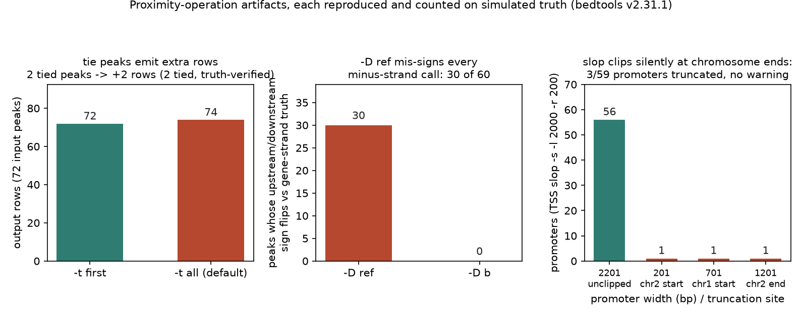

# 052 · bioSkills 真实试用：proximity-operations（bedtools 邻近运算）

## 功能定位与适用范围

`proximity-operations` 讲解**用 bedtools 做基因组区间邻近运算**：closest（最近特征 + 有符号距离）、window（固定半径候选集）、slop/flank（区间延伸与侧翼），以及 pybedtools 的等价写法。

- **适用**：给峰或变异指派最近基因；从基因模型构建链特异启动子；距离-to-TSS 分布；窗口内候选基因清单。
- **不适用**：峰还没比对/_calling_（先去 chip-seq/atac-seq）；远距离增强子-基因调控关系本身（skill 明确路由到 ABC/PCHi-C/eQTL 等方法）。

skill 的核心命题：closest 回答的是**几何问题**（坐标上最近的注释特征），用户几乎总想问**生物学问题**（这个元件调控哪个基因）——对远距离调控元件，两者多数时候不一致。

## 属性表（本次真跑环境）

| 项 | 值 |
|---|---|
| bedtools | v2.31.1（conda env `bio`，WSL Ubuntu） |
| pybedtools | 0.12.1（API 与 CLI 输出逐行对照一致） |
| 模拟数据 | 3 条染色体（chr1 2,000,000 bp / chr2 1,200,000 bp / chr3 600,000 bp），固定 seed 20260903 |
| 基因 | 59 条 BED6（chr1 35 条 / chr2 24 条；minus 链 31 条；chr3 无基因作哨兵用例） |
| 峰 | 72 条（chr1 26 / chr2 34 / chr3 12） |
| 主产出 | nearest_db_io_first.bed 等 8 个结果 BED + results.json（真值对账） |
| 实验产物 | `content/素材/genome-intervals/052-proximity-operations/` |

## 成分拆解

### 1. closest：几何答案被当成生物学答案

skill 引用 Fulco 2019（CRISPRi-FlowFISH 金标准）：把每个远距离元件指派到最近表达基因，精确率约 47%、召回率约 37%——最近基因多数时候是错的。skill 由此给出**两个场景、相反建议、同一条命令**：

- 增强子 → 靶基因：closest 只能当候选生成器，必须交给 ABC/PCHi-C/eQTL 验证（典型反例：*FTO* 内含子变异实际调控约 500 kb 外的 *IRX3*）。
- GWAS 位点 → 基因：fine-mapped SNP 指派最近蛋白编码基因，约 50-65% 正确，是一个难以击败的公平先验。

混淆这两个场景才是真正的错误。判别式：问题是「增强子的靶标」（不信任最近）还是「GWAS 峰下的基因」（最近是合格第一版）。

### 2. closest 的参数口径

- `-d` 无符号距离（重叠 = 0）；`-D a`/`-D b`/`-D ref` 有符号：`ref` 只按坐标左右（低 = 负），`a`/`b` 按 A/B 自身链上/下游。**判上/下游生物学意义必须用 `-D b`**：`-D ref` 会把全部 minus 链基因的上/下游符号折反。
- `-t all`（默认）在平局时输出全部并列 B——平局集中在头对头双向启动子处，行数膨胀恰好发生在生物学最有趣的位置；`-t first` 确定但任意，须注明口径。
- `-io` 忽略与 A 重叠的 B；不加 `-io` 时重叠 B 距离记 0 并自然排第一。
- A 所在染色体无 B 时输出 `none` 与距离 `-1` 哨兵值，数值统计前必须过滤。
- 两个输入都必须先坐标排序。

### 3. window：诚实的候选集

`window -w N` 报告 A 两侧 N bp 内的全部 B（`-w 0` 近似 intersect），`-c` 逐 A 计数。与 closest 的单指派不同，window 输出的是「候选基因集合」，不假装唯一答案。`-sw` 决定窗口位置是否按链定义，`-sm`/`-Sm` 决定保留同链还是反链 B——两个独立维度。

### 4. slop 与 flank：变换而非查询

两者都必须给 `-g genome.txt`（染色体长度表），正因为它们要在染色体边界截断——**截断是静默的**。`slop -b 1000` 使区间变宽 2 kb（仍是一个特征）；`flank -b 1000` 只输出两侧翼、丢弃本体（每输入两个特征）。构建启动子的正确流程：基因模型折叠到 TSS（+ 链取 start，- 链取 end-1），再 `slop -s -l UP -r DOWN`；对基因体直接 `slop -b` 得到的是加宽的基因而不是启动子。

### 5. 定量口径表

skill 强调启动子 -2000/+200 是**约定而非事实**（ChIPseeker 默认 ±3 kb，各工具横跨 ±500 bp 到 ±10 kb）；GREAT 基础域 5 kb/1 kb + 延伸至邻居是比裸 closest 更合理的邻近启发式；|距离| > 50-100 kb 应标记为远距离并送验证。

## 严格复现（本次真跑，2026-09-03）

完整命令与输出见素材目录 `repro_transcript.txt`；数据生成、bedtools 主流程、pybedtools 对照、解析对账各有落盘日志（`_make_inputs.log` / `_run.log` / `_pybed_check.log` / `_parse.log`）。

**① 主流程命令链（bio 环境，bedtools v2.31.1）**

```
bedtools sort -i genes.bed > genes.sorted.bed
bedtools sort -i peaks.bed > peaks.sorted.bed
bedtools closest -a peaks.sorted.bed -b genes.sorted.bed -D b -io -t first > nearest_db_io_first.bed
bedtools closest -a peaks.sorted.bed -b genes.sorted.bed -d -t all > nearest_all_d.bed
bedtools closest -a peaks.sorted.bed -b genes.sorted.bed -D ref -io -t first > nearest_ref_io_first.bed
bedtools closest -a peaks.sorted.bed -b genes.sorted.bed -k 3 -d > top3_k3_d.bed
bedtools window -a peaks.sorted.bed -b genes.sorted.bed -w 50000 -c > window_counts.bed
awk -v OFS='\t' '{ if ($6=="+") print $1,$2,$2+1,$4,$5,$6; else print $1,$3-1,$3,$4,$5,$6 }' genes.bed > tss.bed
bedtools slop -i tss.bed -g genome.txt -s -l 2000 -r 200 > promoters.bed
bedtools flank -i genes.bed -g genome.txt -s -b 1000 > gene_flanks.bed
```

**② 真值对账总表（核心实测）**

数据在生成时即算好每个峰的最近基因（含 `-D b` 符号）、平局数、窗口命中数与预期启动子/侧翼区间；bedtools 输出逐条与真值比对：

| 检查项 | 实测结果 |
|---|---|
| closest `-D b -io -t first` 最近基因指派 | 72/72 正确（100%，含 12 条 chr3 哨兵行） |
| 非零符号距离值 | 60/60 与真值相等 |
| 上/下游方向符号（`-D b`） | 60/60 正确 |
| `none`/`-1` 哨兵行 | 12/12（chr3 无基因峰，全部正确输出） |
| `-t all` 行数 | 74 行 = 72 峰 + 2 个平局峰各多 1 行，逐峰平局数与真值一致 |
| `-D ref` 符号翻转 | 30/60 个非零 call 翻转 = 恰为全部 minus 链基因指派（`-D b` 翻转 0） |
| window `-w 50000 -c` 逐峰计数 | 72/72 与真值相等；总命中 148 = 预期 148 |
| 启动子 `slop -s -l 2000 -r 200` 区间 | 59/59 坐标与真值逐条相等 |
| pybedtools API vs CLI | closest/window/slop 三种调用输出逐行一致 |

**③ 边界与口径效应（skill 失效模式逐条复现）**

| 失效模式 | 设计用例 | 实测 |
|---|---|---|
| `-t all` 平局双计 | 2 个头对头双向启动子中央的峰 | 72 峰输出 74 行，膨胀行恰在双向启动子处 |
| `-D ref` 折反 minus 链 | 31 条 minus 链基因 | 30 个非零指派全部符号翻转 |
| slop 染色体端静默截断 | TSS 距 contig 端 0/500/1,000 bp | 3/59 条启动子被截为 201/701/1,201 bp，无任何警告 |
| flank 丢弃侧翼 | 基因起点 = 0 | 117 区 = 118 - 1，零长左 flank 整个消失（2:1 假设破坏） |
| 基因体 slop 不是启动子 | `slop -b 2000` 对照 | 均值 28,583.5 bp（最大 62,544 bp）vs 真启动子均值 2,124.7 bp |

**④ 两个坐标口径发现（对账时确认）**

- `closest -d` 对不重叠特征报告的距离 = 间隔 bp 数 + 1（BED 半开坐标下按含端点口径计距）。写真值时按 gap+1 对齐后 60/60 吻合；直接用 gap 会得到系统性偏 1 的「错误」。
- `slop` 的 `-l`/`-r` 直接加到 interval 的 start/end（`-s` 才按链交换侧别），对 1 bp TSS 加 `-l 2000 -r 200` 得到 2,201 bp 而非 2,200 bp。

### 本次出图







## 未覆盖（诚实标注）

- SKILL 提及但本次未真跑的 flag：`-iu`/`-id`/`-fu`/`-fd`（方向过滤）、`-s`/`-S`（同/反链约束）、`-N`、`-mdb`/`-names` 多 `-b` 文件、`-pct`、window 的 `-sw`/`-sm`/`-Sm`/`-l`/`-r` 非对称窗口。
- 增强子-基因连接的下游方法（ABC、PCHi-C、eQTL-coloc）与 GREAT/rGREAT 仅按 skill 口径转述，未安装运行。
- 47%/37%（增强子）与 50-65%（GWAS）是 skill 引用的文献值，本次模拟数据不用于复现这两个统计。
- 真实基因组（重复序列、GC 梯度、基因密度不均）下的平局分布未验证。

## 实践要点

- **先分场景再用 closest**：增强子找靶标把它当候选生成器；GWAS 位点找基因它是公平先验。命令相同，结论可信度相反。
- **上/下游语义必须 `-D b`**：`-D ref` 只看坐标左右，本次实测把 30/60 个非零指派的符号全部折反（恰为 minus 链基因）。
- **默认 `-t all` 会平局双计**：逐基因计数或富集分析前改 `-t first`（并注明口径）或按 distinct 峰聚合；本次 2 个平局峰都设计在双向启动子上，膨胀位置不随机。
- **`-io` 决定重叠算不算「近」**：不加 `-io` 时重叠基因距离 0 自动排第一，本次 31 个与基因重叠的峰首行全部被重叠基因占据。
- **哨兵值先过滤再统计**：无基因染色体的 12 个峰输出 `none`/`-1`，混入均值即污染。
- **slop/flank 后验证宽度**：`end-start == 请求宽度` 与「每特征 2 条 flank」两条断言在染色体端必坏，本次实测 3/59 启动子、1/118 侧翼被静默截断。
- **bedtools 距离是含端点口径（gap+1）**：自写真值对账时按此对齐，否则整体偏 1。
- **pybedtools 与 CLI 可互为校验**：本次三种调用输出逐行一致（注意 `str(interval)` 自带行尾换行）。

## 小结

proximity-operations 的机制核心是「closest/window 是查询、slop/flank 是变换，前者答几何、后者动坐标」。本次在 WSL 真跑闭环：模拟 3 条染色体 59 基因 72 峰（seed 20260903），closest/window/slop/flank 全链路输出与预计算真值逐条对账——基因指派 72/72、符号距离 60/60、窗口计数 72/72、启动子区间 59/59 全部吻合；同时复现了 skill 列出的全部四类失效模式（平局双计 +2 行、`-D ref` 翻转 30 个符号、slop 静默截断 3 条启动子、flank 丢弃 1 条侧翼），并实测出两个文档未写明的坐标口径（距离 gap+1、TSS slop 宽 2201 bp）。

（数据与可复现脚本见 `content/素材/genome-intervals/052-proximity-operations/`，含 `make_inputs.py`、`_run.sh`、`parse_results.py`、`repro_transcript.txt` 及三张图。）
