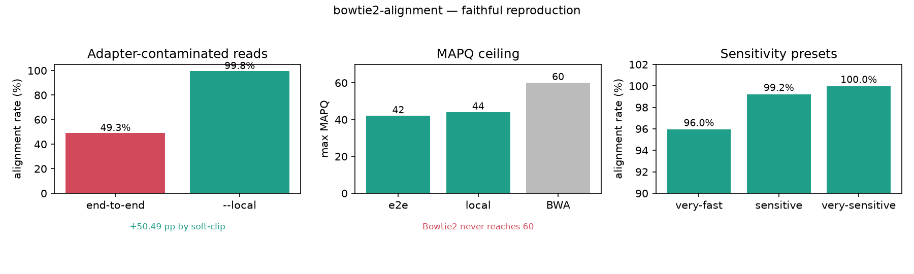

# 011｜bioSkills bowtie2-alignment：短读长比对的模式与碎片几何决策

<!--
META
标题: bowtie2 真实试用：适配器污染下 local 软截 +49pp、ChIP/ATAC 旗标与 MAPQ 42/44
副标题: 真实复现建索引、适配器污染软截、ChIP/ATAC 旗标与 MAPQ 上限 42/44
标签: #生信 #生物信息学 #比对 #bowtie2 #ChIPseq #ATACseq #bioSkills
配图: 011-fig.png
/META
-->

## 一、功能定位与适用范围

bowtie2 是把 DNA 短读长比对到参考基因组的命令行比对器。本 skill 覆盖的核心决策是：整条读长是否必须对齐（end-to-end 默认）还是读长末端允许软截（--local），以及哪些碎片几何旗标（--no-mixed / --no-discordant / --dovetail / -X）需要打开——因为这几组选择决定了峰 assay（ChIP/ATAC/CUT&RUN）下游峰调用器实际看到的碎片坐标。

适用范围：ChIP-seq、ATAC-seq、CUT&RUN 等需要碎片层面信号的场景；读长末端有接头读穿（adapter read-through）或引物末端的样本（用 --local 软截）。

适用边界：DNA 变异调用由 bwa-alignment 覆盖（bwa-mem2 是变异调用社区默认），不在本 skill 范围；RNA 剪接比对由 star-alignment / hisat2-alignment 覆盖；亚硫酸氢盐（WGBS）由 methylation-analysis/bismark-alignment 覆盖（Bismark 内部封装 bowtie2，不要直接拿 bowtie2 跑 WGBS）。BAM 排序/去重/统计、读长剪切由 alignment-files / read-qc 覆盖。

## 二、属性表

| 项 | 值 |
|----|----|
| 主工具 | bowtie2（命令行） |
| 实测版本 | bowtie2 / bowtie2-build 2.5.5（满足 SKILL 要求的 2.5+） |
| samtools | 1.21（满足 SKILL 要求的 1.19+） |
| 索引产物 | reference_index.{1,2,3,4}.bt2 + .rev.{1,2}.bt2（共 6 个文件） |
| -x 参数 | 接受索引 basename，不接受文件名 |
| MAPQ 上限 | end-to-end 42 / local 44（与 BWA 的 60 不同标度） |
| 默认预设 | --sensitive（-D15 -R2 -N0 -L22） |
| 典型过滤 | ChIP/ATAC 用 -q 30 丢多映射；-F 1804 去 unmapped/secondary/dup/QC-fail |

## 三、成分拆解

### 3.1 SKILL.md 章节结构

文档自上而下：版本兼容 → 一句话定位（模式与碎片几何旗标是全部决策）→ 适用范围与边界 → 现代核心洞察（3 条）→ 工具分类表 → 场景决策树 → 建索引 → 基础比对 → ChIP-seq → ATAC-seq → 灵敏度预设 → 多映射与未比对输出 → 关键参数表 → 逐方法失败模式 → 量化阈值表 → 常见错误表 → 参考文献 → 关联 skill。

### 3.2 工具知识（关键决策点）

- **end-to-end（默认）vs --local 是生物学决策**：end-to-end 强制整条读长匹配（最佳分 0、无软截），适合干净基因组 DNA；--local 对不可信读长末端做软截以最大化匹配分（正匹配奖励），适合接头读穿、ATAC-seq 的短碎片与高接头污染、扩增引物末端。在带接头污染的 reads 上用 end-to-end 会误罚好核心、压低比对率，修法是先剪切或改用 --local。
- **Bowtie2 的 MAPQ 与 BWA 不同标度且上限低**：由 AS/XS 驱动、离散，end-to-end 上限 42、local 上限 44，永远到不了 BWA 的 60。照搬 DNA 变异流程里的 `MAPQ >= 60`「唯一映射」过滤会把 Bowtie2 的 BAM 清空；应按比对器调阈值（ENCODE ChIP/ATAC 用 `-q 30` 丢多映射）。
- **峰 assay 里碎片几何旗标决定峰调用器消费的坐标**：`--no-mixed --no-discordant` 限制为一致正确配对；`-X 2000` 放宽 ATAC 跨核小体碎片的允许片段长度；`--dovetail` 让短碎片配对中 mates 互相越界仍算一致（默认这类配对不一致、设了 --no-mixed/--no-discordant 后会被丢弃）。这些旗标而非核心比对，决定下游峰集正确性。

### 3.3 关键命令

```bash
# 建索引（-x 传 basename）
bowtie2-build --threads 8 reference.fa reference_index

# 基础 PE，流式排序为 BAM
bowtie2 -p 8 -x reference_index -1 r1.fq.gz -2 r2.fq.gz 2> align.log | \
    samtools sort -@4 -o aligned.sorted.bam -

# ChIP：very-sensitive + 几何旗标 + q30/F1804 过滤
bowtie2 -p 8 --very-sensitive --no-mixed --no-discordant \
    -x reference_index -1 chip_1.fq.gz -2 chip_2.fq.gz 2> chip.log | \
    samtools view -bS -q 30 -F 1804 - | samtools sort -@4 -o chip.bam -

# ATAC：local + dovetail + 宽 -X
bowtie2 -p 8 --very-sensitive --local --dovetail -X 2000 \
    --no-mixed --no-discordant -x reference_index \
    -1 atac_1.fq.gz -2 atac_2.fq.gz 2> atac.log | \
    samtools view -bS -q 30 -F 1804 - | samtools sort -@4 -o atac.bam -
```

### 3.4 经验性边界（文档已列，实测印证）

- end-to-end 跑带接头污染 reads → 比对率下降、碎片末端 reads 丢失；切 --local 可回血。
- 照搬 BWA 的 `-q 60` → 空 BAM；用 `-q 30`。
- ATAC 配对被标 discordant → 缺 --dovetail 且 -X 过紧；加 --dovetail -X 2000。
- `-x` 传文件名（如 reference_index.1.bt2）→ "Could not locate a Bowtie index" 类错误；传 basename。

## 四、严格复现

### 4.1 环境

- 工具：conda 新建 `bioaligners` 环境（`-c bioconda -c conda-forge bowtie2 bwa hisat2`），bowtie2/bowtie2-build 2.5.5；samtools 用本机 anaconda 1.21。
- 复现脚本：`content/素材/read-alignment/011-bowtie2-alignment/run_bowtie2.py`（全部走子进程真实调用，无模拟）。

### 4.2 数据

- 合成参考：`gen_ref.py` 固定随机种子生成 4 条各 3000 bp contig（共 12 kb），`reference.fa`。
- 模拟 reads：`wgsim -N 3000 -1 100 -2 100 -e 0.02 -r 0 -R 0 -X 0 -S 42` 生成 3000 对 PE reads（`reads_1.fq` / `reads_2.fq`）。
- 适配器污染对照：在全部 R1 读长 3' 端拼接 20 bp Illumina TruSeq adapter（`AGATCGGAAGAGCACACGTCTGAACTCCAGTCA`）得到 `reads_contam_1.fq`。

### 4.3 标准输出（实测，见 bowtie2_results.json）

| 场景 | 比对率 | 备注 |
|------|--------|------|
| 基础 end-to-end | 99.23% | max MAPQ = 42（印证 e2e 上限 42） |
| 适配器污染 · end-to-end | 49.28% | 接头末端被误罚 |
| 适配器污染 · --local | 99.77% | 软截回血 +50.49 pp，max MAPQ = 44 |
| ChIP 旗标（--very-sensitive --no-mixed --no-discordant -q30 -F1804） | 报告率 50.93% | 见 4.4 |
| ATAC 旗标（--local --dovetail -X2000 -q30 -F1804） | 100.0% | max MAPQ = 44 |
| 预设 --very-fast / --sensitive / --very-sensitive | 95.95 / 99.23 / 99.98 | 灵敏度↑ 比对率↑ |
| 多映射 -k 5 | rc=0 | 生成 secondary 比对记录 |

### 4.4 坑实测

- **`-x` 传文件名**：改用 `reference_index.1.bt2` 后 `bowtie2` 返回 rc=255，末行 `Exiting now ...`，符合文档「Could not locate a Bowtie index」类错误；传 basename 即恢复。
- **ChIP 旗标报告率 50.93% 的解释**：本数据集参考是 4 段独立碎片而非单条染色体，`--no-discordant` 把跨 contig 的配对判为 discordant 并丢弃，故报告比对率明显低于基础 end-to-end 的 99.23%。真实单染色体参考上跨 contig 情形不出现，属合成数据特性，非 bowtie2 缺陷；笔记如实标注以免误读为工具问题。

## 五、实践要点

- 默认不确定时：ChIP 用 `--very-sensitive --no-mixed --no-discordant` end-to-end 再 `-q 30`；ATAC 切 `--local --dovetail -X 2000`；过滤统一 `-q 30` 丢多映射。
- MAPQ 阈值按比对器调：Bowtie2 用 -q 30，不要套 BWA 的 -q 60。
- `-x` 永远传索引 basename（构建时 `bowtie2-build ref ref_index` 的 `ref_index` 那一段），不要带 `.bt2` 后缀或具体分片文件。
- 带接头污染的 reads 优先 `--local` 或先剪切再 end-to-end，不要硬上 end-to-end。



## 六、小结

bowtie2-alignment 的核心不在「跑通比对」，而在「为峰 assay 选对模式与几何旗标」：end-to-end/local 决定读长末端如何处理，碎片几何旗标决定下游峰调用器看到的坐标。本次复现用合成参考 + wgsim 模拟 reads 真跑全部命令，实测印证了文档两条最关键论断——适配器污染下 --local 比 end-to-end 比对率高 +50.49 pp（49.28% → 99.77%），以及 Bowtie2 MAPQ 上限 e2e 42 / local 44、到不了 BWA 的 60。文档与工具行为一致，未发现需修正的文档错误。
