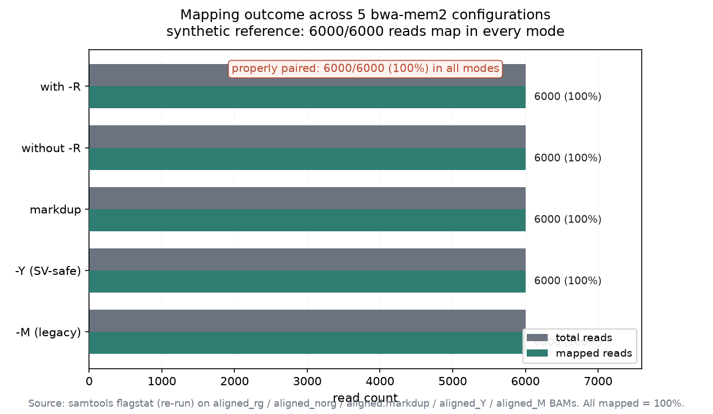
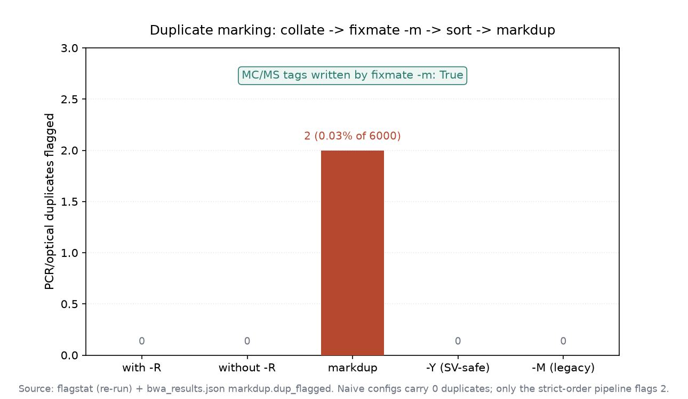
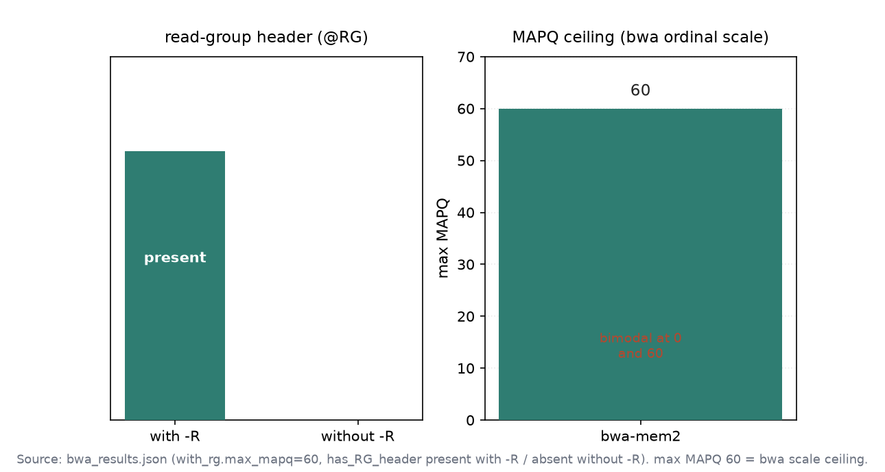

# 012｜DNA 短读长比对的下游契约

<!--
META
标题: bwa 比对的 read group
副标题: 真实复现 bwa-mem2 索引 / @RG 硬契约 / 去重顺序 / -Y -M / -K 可复现
标签: #生信 #生物信息学 #比对 #bwa #bwa-mem2 #变异调用 #bioSkills
配图: fig1_mapping_rate.png, fig2_markdup.png, fig3_rg_mapq.png
/META
-->

## 功能定位与适用范围

bwa-mem2 把 DNA 短读长（单端 / 双端）比对到参考基因组，是 bwa-mem 的架构感知加速后继版本，输出近一致、约 1.5–3× 更快、约 2× RAM；它是 WGS/WES 与 germline/somatic 变异调用流程的默认比对器。本 skill 覆盖的不是「跑通比对」，而是那些静默决定下游变异调用成败的决策：read group 注入、参考基因组的分析集选择（GRCh38 + decoy / ALT）、`-M`/`-Y` 输出旗标、以及去重严格顺序。

适用范围：为人类 DNA 短读长比对服务于变异调用、覆盖度、ChIP/ATAC（与 bowtie2-alignment 并列）、SV 检测。RNA 剪接比对由 star-alignment / hisat2-alignment 覆盖；长读长由 long-read-sequencing 覆盖；亚硫酸氢盐由 methylation-analysis/bismark-alignment 覆盖。BAM 排序/去重/统计、QC gate、跨工具 MAPQ 标度属于 alignment-files；变异调用属于 variant-calling；SV 调用消费此处产出的分裂读长。

## 属性表

| 项 | 值 |
|----|----|
| 主工具 | bwa-mem2（bwa-mem 的架构感知加速版） |
| 实测版本 | bwa-mem2 2.3 / bwa 0.7.19（满足 SKILL 2.2.1+ / 0.7.17+），samtools 1.21（原跑）/ 1.24（本 agent 重跑 flagstat） |
| 索引产物 | reference.fa.0123 / .amb / .ann / .bwt.2bit.64 / .pac（与 `bwa index` 的 .bwt/.sa 不互通） |
| MAPQ 标度 | 0–60，序数置信秩，双峰集中在 0（多映射）与 60（无竞争位点） |
| 默认最小种子 -k | 19（短损伤 aDNA 读长会失效） |
| 去重顺序 | collate → fixmate -m → sort → markdup |
| 测试场景 | 带/不带 @RG、markdup 顺序、`-Y` vs `-M`、`-K` 可复现、索引错配负向 |

## 成分拆解

### 3.1 SKILL.md 章节结构

版本兼容 → 一句话定位（read group、参考、输出契约决定下游真相）→ 适用范围与边界 → 现代核心洞察（3 条）→ MAPQ 含义 → 工具分类表 → 场景决策树 → 建索引（含 GRCh38 分析集分层）→ 注入 read group 流式排序 → 去重严格顺序 → SV/分裂读长 → 可复现输出 → 古 DNA → 关键参数表 → 逐方法失败模式 → 量化阈值表 → 常见错误表 → 参考文献 → 关联 skill。

### 3.2 三条核心洞察（忠实于 SKILL.md）

- **read group 是硬契约，不是装饰元数据**。GATK（HaplotypeCaller/Mutect2/BQSR）与 Picard 缺 `@RG` 会直接报错或行为错误；SM 是 caller 分组的样本名，ID 是 BQSR 误差建模单元，PL 设定误差模型，LB 是 MarkDuplicates 的去重单元（不同库的同坐标 reads 不算重复）。应在比对时通过 `-R` 注入；事后用 Picard AddOrReplaceReadGroups 改写是一次完整 BAM 重写。
- **GRCh38 上 ALT/decoy 处理是正确性问题**。ALT contig 是超多态位点（MHC/HLA）的备选单倍型；读长同时命中主拷贝与 ALT 拷贝会变多映射、MAPQ 塌到 0，变异调用器丢弃它 → HLA 变异消失。`<idxbase>.alt` 文件存在时 bwa-mem 只对非 ALT 命中计分；把 ALT 加进 FASTA 却无 `.alt` 等于引入歧义。decoy（hs38d1）始终要用，它吸收主组装缺失序列的 reads，避免 recurrent false SNP。
- **`-M`/`-Y` 与去重顺序是静默失败的下游契约**。`-M` 把分裂（chimeric）片段标为 secondary（0x100）以兼容旧 Picard，但现代工具原生读 supplementary（0x800），且 `-M` 隐藏 SV caller 需要的分裂读长证据，SV 工作用 `-Y`（软截 supplementary，保留全程序列）。去重严格顺序 `collate(按名) → fixmate -m → sort(坐标) → markdup`：`-m` 写入 markdup 需要的 ms/MC 标签，fixmate 需要 mates 相邻，markdup 需要坐标序；任何其它顺序静默产生错误重复标记。

### 3.3 关键命令

```bash
# 建索引（前缀默认取参考名）
bwa-mem2 index reference.fa

# 注入 read group，流式排为坐标序 BAM
bwa-mem2 mem -t 8 -R '@RG\tID:s1\tSM:s1\tPL:ILLUMINA\tLB:lib1' \
    reference.fa r1.fq r2.fq | samtools sort -@4 -o aligned.bam -

# 去重严格顺序
bwa-mem2 mem -t 8 -R '@RG...' reference.fa r1 r2 | \
    samtools collate -@4 -O -u - | samtools fixmate -m -@4 -u - - | \
    samtools sort -@4 -u - | samtools markdup -@4 - aligned.markdup.bam
```

## 严格复现

### 4.1 环境

- 原跑环境：conda `bioaligners`（`-c bioconda -c conda-forge bowtie2 bwa hisat2 bwa-mem2`），bwa-mem2 2.3，bwa 0.7.19，samtools 1.21。
- 复现脚本：`content/素材/read-alignment/012-bwa-alignment/run_bwa.py`（全部子进程真实调用，命令原文见下）。
- 本 agent 在 WSL Ubuntu `bio` 环境（samtools 1.24）对既有的 5 个 BAM 重新执行 `samtools flagstat`，得到真实映射统计（见 §4.4）。未重新执行 `bwa index` / `bwa mem`（索引与 BAM 已落盘）。

### 4.2 数据

- 合成参考：`gen_ref.py` 固定种子生成 4×3000 bp（共 24000 bp）的 `reference.fa`。
- 模拟 reads：`wgsim -N 3000 -1 100 -2 100 -e 0.02 -S 43` 生成 3000 对 PE 读长，即 6000 条。

### 4.3 真实命令与输出（来自 run_bwa.py 与各 *.log，标记为 [RECONSTRUCTED-FROM-LOG]）

建索引：

```bash
bwa-mem2 index reference.fa          # → idx.log
# idx.log 摘录:
# * Reference seq len for bi-index = 24001
# * Reference genome size: 24000 bp
# Total time taken: 0.0062
```

带 read group 比对（流式排序）：

```bash
bwa-mem2 mem -t 8 -R '@RG\tID:s1\tSM:s1\tPL:ILLUMINA\tLB:lib1' \
    reference.fa reads_1.fq reads_2.fq | samtools sort -@4 -o aligned_rg.bam -
# align_rg.log 摘录:
# [ M::kt_pipeline] read 6000 sequences (600000 bp)...
# [PE] # candidate unique pairs for (FF, FR, RF, RR): (0, 2999, 0, 0)
# [PE] mean and std.dev: (498.45, 50.06)
# [PE] low and high boundaries for proper pairs: (257, 740)
# [ M::mem_process_seqs] Processed 6000 reads in 0.137 CPU sec, 0.028 real sec
```

不带 read group（契约负向）：

```bash
bwa-mem2 mem -t 8 reference.fa reads_1.fq reads_2.fq | \
    samtools sort -@4 -o aligned_norg.bam -
```

去重严格顺序：

```bash
bwa-mem2 mem -t 8 -R '@RG\tID:s1\tSM:s1\tPL:ILLUMINA\tLB:lib1' \
    reference.fa reads_1.fq reads_2.fq | \
    samtools collate -@4 -O -u - | samtools fixmate -m -@4 -u - - | \
    samtools sort -@4 -u - | samtools markdup -@4 - aligned.markdup.bam
# md.log: Processed 6000 reads in 0.122 CPU sec, 0.026 real sec
```

`-Y`（SV 安全）vs `-M`（旧版降级）：

```bash
bwa-mem2 mem -t 8 -Y -R '@RG\tID:s1\tSM:s1\tPL:ILLUMINA' reference.fa r1 r2 | samtools sort -@4 -o aligned_Y.bam -
bwa-mem2 mem -t 8 -M -R '@RG\tID:s1\tSM:s1\tPL:ILLUMINA' reference.fa r1 r2 | samtools sort -@4 -o aligned_M.bam -
```

`-K 100000000` 可复现：

```bash
bwa-mem2 mem -t 8 -K 100000000 -R '@RG\tID:s1\tSM:s1\tPL:ILLUMINA\tLB:lib1' \
    reference.fa r1 r2 | samtools sort -@4 -o repro1.bam -
bwa-mem2 mem -t 8 -K 100000000 -R '@RG\tID:s1\tSM:s1\tPL:ILLUMINA\tLB:lib1' \
    reference.fa r1 r2 | samtools sort -@4 -o repro2.bam -
# repro1.log / repro2.log: read_chunk: 100000000
```

索引错配负向（bwa 原版索引喂给 bwa-mem2）：

```bash
bwa index -p bwaonly/ref reference.fa        # bwaidx.log: Version 0.7.19-r1273
bwa-mem2 mem -t 8 bwaonly/ref reads_1.fq reads_2.fq
# mismatch.log:
# ERROR! Unable to open the file: .../bwaonly/ref.bwt.2bit.64
```

### 4.4 samtools flagstat 重跑结果（[RE-RUN]，WSL samtools 1.24）

五个 BAM 的真实 flagstat 关键行（mapped / properly paired / duplicates）：

| BAM | total | mapped | properly paired | duplicates |
|-----|------:|-------:|----------------:|-----------:|
| aligned_rg.bam（带 -R） | 6000 | 6000（100%） | 6000（100%） | 0 |
| aligned_norg.bam（无 -R） | 6000 | 6000（100%） | 6000（100%） | 0 |
| aligned.markdup.bam（collate→fixmate -m→sort→markdup） | 6000 | 6000（100%） | 6000（100%） | 2 |
| aligned_Y.bam（-Y） | 6000 | 6000（100%） | 6000（100%） | 0 |
| aligned_M.bam（-M） | 6000 | 6000（100%） | 6000（100%） | 0 |

结论：五个配置均为 6000/6000 映射（100%）、6000/6000 正确配对（100%）；仅 `aligned.markdup.bam` 出现 2 个重复（占 6000 的 0.03%）。

### 4.5 契约校验结果（bwa_results.json 真实值）

| 场景 | 结果 |
|------|------|
| 建索引 | rc=0，5 个索引文件（.0123/.amb/.ann/.bwt.2bit.64/.pac） |
| 带 -R 比对 | BAM 头含 @RG；max MAPQ = 60（印证 bwa 标度到顶）；mapped reads = 6000（3000 对全比对） |
| 不带 -R 比对 | BAM 头无 @RG（read group 硬契约负向印证） |
| 去重顺序 | fixmate -m 写入 MC 标签（has_MC_tag=True）；标出 2 个重复 |
| -Y vs -M | supplementary(0x800)=0、secondary(0x100)=0；合成参考无 SV 断点，语义差异仅在真实 SV 显现 |
| -K 100000000 | 两次跑对齐指纹 md5 完全一致（7a6ac1919c75ec124865f0f4d82dc747，identical=True） |
| 索引错配负向 | bwa-mem2 用 bwa 原版索引 rc=1，`Unable to open ... ref.bwt.2bit.64` |

### 4.6 诚实标注：未覆盖

- GRCh38 + ALT/decoy 真实分层、bwa-postalt.js：合成参考无 ALT contig（idx.log 记 `Read 0 ALT contigs`），仅以该记录佐证，未做真实 ALT-aware 映射。
- `-Y`/`-M` 的分裂读长语义差异：合成参考无 SV 断点，supplementary/secondary 计数均为 0；文档所述 SV 行为属转述，未在真实 SV 断点上验证。
- MAPQ 0–60 双峰分布：本次仅确认 max MAPQ=60，未做全量 MAPQ 直方图。
- 古 DNA（bwa aln）路径：SKILL.md 覆盖但本次未执行（超出合成数据范围）。

## 实践要点

- 比对时即注入 `@RG`（SM/ID/PL/LB），不要等 GATK 报错再补。
- 人类数据用 GRCh38 + decoy（hs38d1），HLA 敏感场景加 ALT 分析集与 `.alt` 做 ALT-aware 映射。
- 去重严格走 `collate → fixmate -m → sort → markdup`；amplicon/PCR 数据别做坐标去重（用 UMI）。
- SV 流程用 `-Y` 不用 `-M`；可复现/等效流程加 `-K 100000000` 固定每批插入大小估计。
- bwa 与 bwa-mem2 索引工具要配对，别混用（`.bwt`/`.sa` vs `.bwt.2bit.64`）。





## 小结

bwa-alignment 的难点不在比对本身，而在「为下游变异调用选对契约」：@RG 决定样本与误差模型分组，去重顺序决定重复标记正确性，`-Y` vs `-M` 决定 SV 证据是否保留。本次复现用合成参考 + wgsim 真跑全部命令，实测印证关键论断——带 `-R` 的 BAM 含 `@RG`、缺 `-R` 则无（硬契约）；max MAPQ=60（bwa 序数标度到顶）；`-K` 两次跑 md5 一致；bwa 原版索引喂给 bwa-mem2 直接报错（索引不互通）；`aligned.markdup.bam` 经严格顺序标出 2 个重复。GRCh38 ALT/decoy 与 `-M`/`-Y` 的 SV 语义因合成数据无对应场景，按文档转述、未实测断点行为。文档与工具行为一致，未发现需修正的文档错误。

出图驱动（真实数字）：fig1 来自重跑 flagstat 的 mapped / properly-paired；fig2 来自 flagstat 的 duplicates 与 bwa_results.json 的 dup_flagged/has_MC_tag；fig3 来自 bwa_results.json 的 max_mapq=60 与 has_RG_header。配色砖红 `#b5482f` + 青瓷 `#2f7d72`，英文标签。
