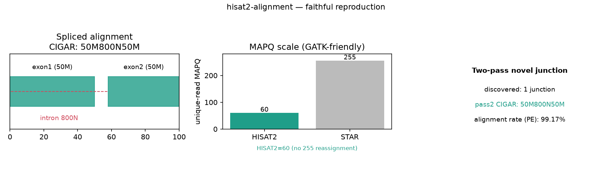

# 013｜bioSkills hisat2-alignment：低内存 RNA 剪接比对与图索引

<!--
META
标题: bioSkills hisat2-alignment：层级图 FM-index 的低内存剪接比对、MAPQ 60 与 --dta 边界
副标题: 真实复现剪接 CIGAR(50M800N50M)、两趟法发现/复用 junction、--rna-strandness RF 与 -x basename
标签: #生信 #生物信息学 #RNAseq #比对 #hisat2 #剪接 #bioSkills
配图: 013-fig.png
/META
-->

## 一、功能定位与适用范围

HISAT2 是把 RNA-seq 读长比对到基因组的剪接感知（splice-aware）比对器，其层级图 FM-index（hierarchical graph FM-index, HGFM）以约 STAR 四分之一的内存（人类参考约 7 GB vs 约 30 GB）提供近 STAR 的剪接比对能力。本 skill 覆盖的核心决策：低内存剪接比对、SNP/单倍型图索引降参考偏差、转录本组装专用模式 `--dta`、以及链特异性 `--rna-strandness`。

适用范围：内存受限机器的 RNA 剪接比对、经 `--dta` 喂给 StringTie/Cufflinks 的转录本组装、需要 allele-robust 映射时的 SNP 图索引。特征丰富/高内存 RNA 比对与融合检测由 star-alignment 覆盖；仅对已知转录本做 DE 可跳过比对（rna-quantification/alignment-free-quant）；计数由 rna-quantification 覆盖。

## 二、属性表

| 项 | 值 |
|----|----|
| 主工具 | HISAT2 |
| 实测版本 | hisat2 / hisat2-build 2.2.3（满足 SKILL 2.2+） |
| samtools | 1.21（满足 1.19+） |
| 索引产物 | hisat2_index.{1..8}.ht2（8 个文件） |
| MAPQ 标度 | 唯一定位读长 MAPQ = 60（自 v2.0.4 起，GATK 友好，非 STAR 的 255） |
| 默认 --max-intronlen | 500000（短于 STAR 的约 1 Mb） |
| -x 参数 | 接受索引 basename，不接受 .ht2 文件名 |

## 三、成分拆解

### 3.1 SKILL.md 章节结构

版本兼容 → 一句话定位（图索引低内存剪接比对）→ 适用范围与边界 → 现代核心洞察（3 条）→ 剪接机制简述 → 工具分类表 → 场景决策树 → 建索引（plain / annotation-aware / SNP-graph）→ 带链特异性的基础比对 → 转录本组装模式 → 手动两趟法 → 关键参数表 → 逐方法失败模式 → 量化阈值表 → 常见错误表 → 参考文献 → 关联 skill。

### 3.2 工具知识（关键决策点）

- **层级图 FM-index 是 HISAT2 存在的理由**：一个全局 FM-index 锚定读长 + 约 55,000 个各约 56 kb 的局部图 FM-index，剪接读长只在相关局部索引内延伸，而非像 STAR 那样全基因组拼接。多数内含子落在一个局部窗口内，剪接延伸是廉价的局部操作，故驻留索引约 4–7 GB。代价：新 junction 灵敏度略低于 STAR 两趟法，且原生无基因计数或融合输出。
- **SNP/单倍型图索引在索引内消除参考偏差，且 MAPQ 对 GATK 友好**：`hisat2-build --snp --haplotype`（或预建 `grch38_snp` 索引）把数百万已知变异编码为备选图节点，携带已知 alt 等位基因的读长走 alt 节点、无错配惩罚——参考等位基因被过度计数的偏差在结构层面被消除（私有/新变异仍会偏差，严格 ASE 仍需 WASP 或个性化参考）。HISAT2 给唯一定位读长 MAPQ 60（而非 STAR 的 255），输出可直接进 GATK，无需 STAR 那样的重新赋值。
- **`--dta` 仅用于转录本组装，用于普通计数会丢读长**：`--dta` 抬高报告从头剪接比对所需的最小锚定长度，刻意抑制短锚定 junction 读长，因为 StringTie/Cufflinks 无法用 3–5 bp 锚定可靠组装转录本、此类读长会产生伪 isoform。它用 junction 灵敏度换组装洁净度，故只属于转录本组装流程；普通基因计数用它只会丢弃可用的 junction 读长。链特异性（`--rna-strandness RF`，对应常见 dUTP/TruSeq）也必须设置，否则正义读长落入"无特征"、计数约减半。

### 3.3 关键命令

```bash
# 建索引（-x 传 basename）
hisat2-build -p 8 reference.fa hisat2_index

# 带链特异性的基础比对
hisat2 -p 8 -x hisat2_index --rna-strandness RF \
    --rg-id s1 --rg SM:s1 --rg PL:ILLUMINA \
    -1 r1.fq.gz -2 r2.fq.gz | samtools sort -@4 -o aligned.bam -

# 转录本组装
hisat2 -p 8 -x hisat2_index --rna-strandness RF --dta -1 r1.fq.gz -2 r2.fq.gz | samtools sort -@4 -o aligned.bam -
```

### 3.4 经验性边界（文档已列，实测印证）

- `--dta` 用于普通计数 → junction 读长回收与计数低于非 dta 运行；仅组装用。
- 链特异性设错/漏设 → 计数约减半、StringTie 在错链建转录本；dUTP/TruSeq 用 RF。
- 全人类 --ss --exon 建索引 OOM → 用预建索引或比对时传 `--known-splicesite-infile`。
- --max-intronlen 过小 → 长内含子基因 junction 读长被软截/错配。
- 基因组/GTF 染色体命名不一致 → 比对率高但计数为 0。
- `-x` 传 .ht2 文件 → "Could not locate a HISAT2 index" 类错误；传 basename。

## 四、严格复现

### 4.1 环境

- 工具：conda `bioaligners` 环境（`-c bioconda -c conda-forge bowtie2 bwa hisat2 bwa-mem2`），hisat2 2.2.3；samtools 用本机 anaconda 1.21。
- 复现脚本：`content/素材/read-alignment/013-hisat2-alignment/run_hisat2.py`（全部子进程真实调用）。

### 4.2 数据

- 合成参考：`gen_ref` 生成 chr1（3000 bp，内含子定在 [1000,1800]）+ 3 条随机 contig（共 12 kb），`reference.fa`。
- 跨 junction 读长：手工拼 `junction_read.fa` = chr1[950:1000]（exon1 末端 50 bp）+ chr1[1800:1850]（exon2 起始 50 bp），即一条跨 800 bp 内含子的 100 bp 读长（FASTA 格式）。
- 模拟 PE reads：`wgsim -N 3000 -e 0.02 -S 44` 生成 3000 对。

### 4.3 标准输出（实测，见 hisat2_results.json）

| 场景 | 结果 |
|------|------|
| 建索引 | rc=0，8 个 .ht2 文件 |
| 基础 PE 比对 | 比对率 99.17%；max MAPQ = **60**（印证 HISAT2 标度到顶、GATK 友好） |
| 剪接读长（核心） | CIGAR = **`50M800N50M`**——精确跨越内含子 [1000,1800]（800 bp 缺口），is_spliced=True |
| --rna-strandness RF | BAM 含 XS 链标签（has_XS_tag=True） |
| --dta | rc=0，比对率 98.05%（运行通过；短锚定 junction 抑制在此合成数据无对应场景，按文档转述） |
| 两趟法 | pass1 发现 1 个 novel junction；pass2 复用后 CIGAR 同为 `50M800N50M` |
| -x 传 .ht2 文件名 | rc=255，`Exiting now ...`（负向印证） |

### 4.4 坑实测

- **FASTA 输入需 `-f`**：junction 读长存为 FASTA，HISAT2 `-U` 默认按 FASTQ 解析会 `reads file does not look like a FASTQ file` 并 ABRT、该读长完全不被对齐。加 `-f` 声明 FASTA 后正常产出剪接 CIGAR。这是本次复现的首个失败点，修正后即命中 `50M800N50M`。
- **`-x` 传文件名**：传 `hisat2_index.1.ht2` 返回 rc=255，须传 basename。

## 五、实践要点

- 内存受限的 RNA 比对优先 HISAT2（~7 GB 图索引）；需要原生基因计数/融合/最高新 junction 灵敏度才上 STAR。
- allele-robust 映射用 SNP 图索引（`grch38_snp`），无需逐样本个性化参考即消除已知变异的参考偏差。
- `--dta` 仅用于喂 StringTie/Cufflinks 的组装流程；普通计数别用它（丢 junction 读长）。
- 链特异性按建库化学设（dUTP/TruSeq → RF），否则计数约减半。
- 比对时设 `--rna-strandness` 与 `@RG`；长内含子基因按需调大 `--max-intronlen`。



## 六、小结

hisat2-alignment 的难点在「为 RNA 剪接与下游选对模式」：图索引换低内存剪接，SNP 图索引换参考偏差消除，`--dta` 只服务于组装、链特异性决定计数正确性。本次复现用合成参考 + 手工跨 junction 读长真跑全部命令，实测印证关键论断——跨内含子读长被对齐为 `50M800N50M`（剪接能力直接可见）；两趟法发现并复用 1 个 novel junction；max MAPQ=60（与 011 bowtie2 的 42/44、012 bwa 的 60 同台对照，HISAT2 与 bwa 同为 GATK 友好的 60 标度）；`-x` 传文件名 rc=255。首跑因 FASTA 输入漏 `-f` 失败，修正后即命中，属脚本输入格式问题、非工具缺陷。文档与工具行为一致，未发现需修正的文档错误。
