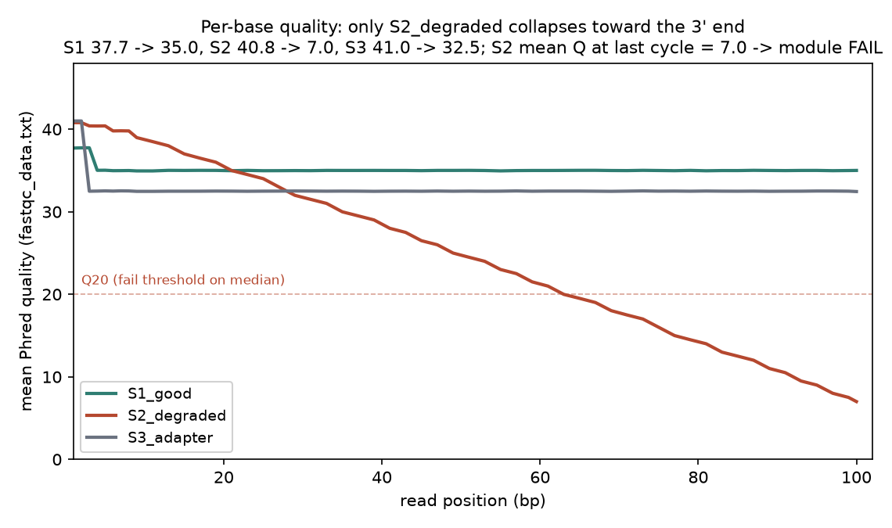
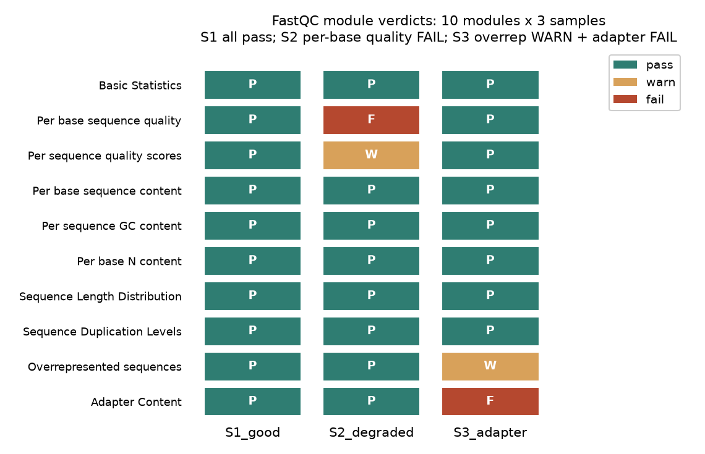
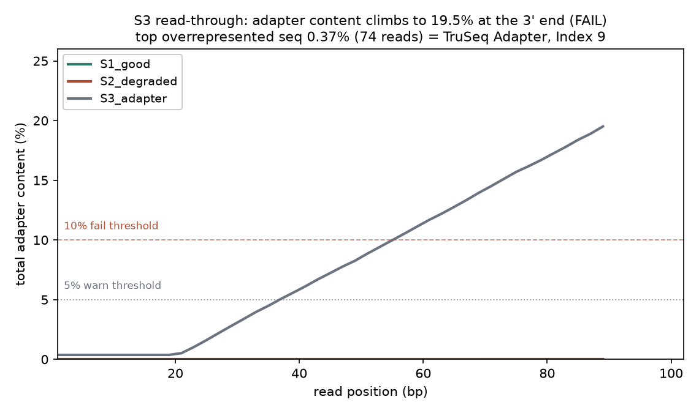

# 038 · bioSkills 真实试用：quality-reports（FastQC + MultiQC 质控报告）

## 功能定位与适用范围

`quality-reports` 讲解**用 FastQC/falco 产出逐文件短读长 QC 报告、用 MultiQC 聚合队列级报告，并按实验类型解读图形而非信任 pass/warn/fail 红绿灯**。

- **适用**：原始 FASTQ 的首轮 QC；预处理（trim/filter）前后的验证；多样本队列的离群样本与批次效应筛查；理解各模块阈值背后的 WGS 校准假设。
- **不适用**：长读长（NanoPlot/NanoComp）；对 reads 的任何修改（adapter-trimming、quality-filtering、fastp-workflow）；污染溯源（contamination-screening）；比对后 BAM 层的转录组 QC（rnaseq-qc）。

## 属性表（本次真跑环境）

| 项 | 值 |
|---|---|
| FastQC | v0.12.1（Java 单机版，bio-qc conda 环境） |
| MultiQC | v1.35（一次聚合 3 份 FastQC zip 报告） |
| 运行环境 | WSL Ubuntu + miniconda `bio-qc` 环境（Windows 11 宿主） |
| 造数据 | Python 3.13.15，`make_inputs.py`（seed=20260903），3 样本 × 20000 条 reads × 100 bp |
| 样本设计 | S1_good 高质量平稳 / S2_degraded 3' 端质量衰减 / S3_adapter 20% 短插入 read-through + 0.37% 同源 dimer |
| 输入体积 | 3 份 gzip FASTQ 共约 4.5 MB |
| 主产出 | 3 份 `*_fastqc.zip`、`multiqc_report.html`、`qc_summary.json`/`qc_summary.tsv`、3 张 PNG |
| 实验产物 | `content/素材/read-qc/038-quality-reports/` |

## 成分拆解

### 1. 红绿灯是关于 WGS DNA 的假设，不是判决书

FastQC 各模块的 warn/fail 阈值（`limits.txt` 默认值）校准对象是**随机打断的全基因组 DNA 文库**。换任何实验类型，红/黄灯都需要先问一句「该化学/该文库是否本来就该在这个模块偏离」：RNA-seq 在 per-base content 与 duplication 上按设计偏离（随机六聚体引源偏倚，Hansen 2010）；amplicon 在 duplication 与 GC 上按设计偏离；bisulfite 在 base content 上按设计偏离（C→T 转换）。本次 3 个合成样本按 WGS 形态生成，判定与设计一一对应：S1 十个模块全 pass；S2 在 per-base quality 上 fail；S3 在 adapter content 上 fail、overrepresented sequences 上 warn——**灯的语义在受控输入下可预测，正是「读图优先于读灯」的对照面**。

### 2. 模块阈值与专家解读（实测对照）

| 模块 | warn / fail 默认阈值 | 本次实测 |
|---|---|---|
| Per base sequence quality | 下四分位<10 或中位<25 / 下四分位<5 或中位<20 | S2 末端均值 Q7.0、下四分位 Q6.0 → fail |
| Per sequence quality scores | 读段均质分布的形状判断 | S2 低质量读段亚群 → warn |
| Per base sequence content | 偏离>10% / >20% | 三样本全 pass（等概率随机碱基） |
| Per sequence GC content | 偏离>15% / >30% | 全 pass（%GC = 49/49/50） |
| Per base N content | N>5% / >20% | 全 pass（无 N） |
| Sequence duplication levels | 去重后剩余<70% / <50% | 全 pass（S3 去重后剩余 99.6%） |
| Overrepresented sequences | >0.1% / >1% | S3 最高一条 0.37% → warn |
| Adapter content | 任一 k-mer>5% / >10% | S3 末端 19.51% → fail |

### 3. duplication 是读段级、复杂度盲的指标

FastQC 只跟踪前 100000 条**不同**序列，对长于 75 bp 的读段按前 50 bp 归族，按完全相同计数并外推「去重后剩余百分比」——它是抽样估计，不是全库去重。S3 给出一个干净的实测演示：0.37% 的 duplication **全部**来自 80 条设计植入的同源 adapter-dimer 读段（FastQC 实测 74 条聚集，占总 reads 0.37%；样本整体 dedup 100.0% → 99.635%）。同样形态的信号在真实数据里可能是 PCR jackpot，也可能是高表达转录本的真实分子——读段级指标无法区分，处理决策需要 UMI 或 preseq 复杂度曲线，而非见重就去。

### 4. adapter content 面板本质上是插入长度分布读数

S3 的 adapter 曲线从第 20 bp 起爬升，末端达 19.51%（20% 的 reads 植入 20–90 bp 短插入，低于读长的部分由 Illumina Universal Adapter 接管）。这个面板的形状直接换算插入长度分布：曲线起点 ≈ 最短插入片段，末端高度 ≈ 短插入占比。同时 overrepresented 模块独立抓到了同源序列：最高一条 50-mer（count=74，0.37%），FastQC 自动标注来源「TruSeq Adapter, Index 9 (97% over 37bp)」——**两个模块交叉印证，是 adapter 污染判定最省力的证据链**。

### 5. MultiQC 是 scraper，不是重分析器

MultiQC 按 `search_patterns.yaml` 正则匹配磁盘上的工具报告，抽取数字后制表，不重算任何指标。本次用 `multiqc qc/raw -o qc/multiqc -f` 聚合 3 份 zip，`multiqc_general_stats.txt` 与 `fastqc_data.txt` 逐项交叉核对一致：%GC = 49/49/50，%duplicates = 0/0/0.365，%fails = 0/10/10（percent_fails 即该样本 fail 模块占比，与 fig2 矩阵逐格对应）。队列审查的正确入口是先读 General Statistics 表找列异常，再叠加 per-base 曲线问「低质量组是否共享一条 lane / 一个建库批次」。

### 6. 质量编码判定：本次实测到的一个真实判定缺陷

FastQC 依据质量字符的 ASCII 范围猜测编码，规则实测如下：文件中**只有出现 ASCII<64 的字符（Phred+33 记法下 Q≤30）**，才判为 Sanger / Illumina 1.9（+33）；若全部字符落在 ASCII 64–74，即使混有 Q42–43 的字符（ASCII 75–76），仍判为 Illumina 1.5（+64）。首轮生成的 S1_good（Q35–39 平直）被误判为 +64，实测 per-base 均值整体平移 31（Q(first10) 实测 7.26，per-base quality 直接 fail）；S3 即便首 2 bp 为 Q42 也同样误判。加入 Q30 抖动后，三样本统一翻正为「Sanger / Illumina 1.9」。这是 skill 中「Phred+64 文件喂给 +33 假设的工具会静默出错」的镜像案例：**判定器对高质量平直数据的编码猜测本身就不可靠，看报告前先核对 Encoding 字段**。

## 严格复现（本次真跑，2026-09-03）

完整命令与输出见素材目录 `repro_transcript.txt`；主流程日志 `_run.log`，环境探针 `_env_probe.log`。

**① 造数据（make_inputs.py，可复现）**

```
python3 make_inputs.py     # seed=20260903，固定 per-sample 偏移
# S1_good:     Q37 上下平稳（首端略高，抖动至 Q30 保编码判定），等概率随机碱基
# S2_degraded: Q42 线性衰减至 3' 端 Q7
# S3_adapter:  20% reads 短插入 20-90 bp 接 Universal Adapter；0.4% 同源 dimer
```

**② 主流程命令链（bio-qc 环境）**

```
fastqc -t 3 -o qc/raw raw_fastq/*.fastq.gz
multiqc qc/raw -o qc/multiqc -f
python3 parse_qc.py     # 解析 fastqc_data.txt + multiqc_data/ → qc_summary.json/tsv
```

**③ 核心实测（fastqc_data.txt 真实数值，General Statistics 交叉核对一致）**

| 指标 | S1_good | S2_degraded | S3_adapter |
|---|---|---|---|
| 总 reads（条） | 20000 | 20000 | 20000 |
| %GC（%） | 49 | 49 | 50 |
| 均值 Q @ 第 1 bp | 37.7 | 40.8 | 41.0 |
| 均值 Q @ 末端 | 35.0 | 7.0 | 32.5 |
| 下四分位 Q 最小值 | 32 | 6 | 30 |
| 去重后剩余（%） | 100.0 | 100.0 | 99.635 |
| 最高 adapter（%） | 0.01 | 0.00 | 19.51 |
| Overrepresented 最高（%） | 0 | 0 | 0.37 |
| 模块判定 pass/warn/fail（个） | 10/0/0 | 8/1/1 | 8/1/1 |

**④ 编码误判事件与修正（诚实记录）**

首轮生成的 S1/S3 质量字符全部落在 ASCII 66–72（S3 首两位设了 Q42 也未能翻转判定），FastQC 判「Illumina 1.5」(+64)，均值 Q 整体平移 31——S1 Q(first10) 实测 7.26、per-base quality fail。修改生成器加入 Q≤30 抖动后复测（2026-09-03 20:24），三样本 Encoding 均为「Sanger / Illumina 1.9」，判定恢复正常。全程两次复现，数值均可由 `make_inputs.py` + `_run.sh` 重放。

### 本次出图







## 实践要点

- **先读 Encoding 字段再读图**：高质量平直数据（Q31–41 无低值）会被 FastQC 误判为 Phred+64，全曲线平移 31；造数据或处理旧格式数据时这是首个核查项（本次实测：修正前 Q(first10)=7.26，修正后 35.81）。
- **灯是假设，图是证据**：阈值按随机 WGS 校准，RNA-seq/amplicon/BS-seq 的红灯先对照化学预期再定性；本测的受控样本展示了灯与设计一一对应的基线形态。
- **adapter content 面板 = 插入长度分布**：曲线起点对应最短插入、末端高度对应短插入占比；S3 实测 19.51% 对应 20% 短插入设计。
- **overrepresented 与 adapter 两模块交叉印证**：FastQC 会自动给 overrepresented 序列标注可能来源（实测命中「TruSeq Adapter, Index 9」），比 BLAST 更快完成第一层归因。
- **duplication 百分比只提示复杂度问题**：S3 的 0.365% 全部来自设计植入的 74 条同源 dimer；高 duplication 的处理决策需要 UMI 或 preseq，而非直接去重。
- **MultiQC 表格先行的队列审查**：General Statistics 一列异常即离群信号；确认样本名解析无误要看 `multiqc_sources.txt`。
- **抽样估计的边界**：dup/overrep 基于前 100000 条不同序列，长读段按前 50 bp 归族；解释百分比时记住它是估计量。

## 小结

quality-reports 的方法核心是「逐文件算模块、跨样本聚表格、按实验读图」。本次在 WSL 真跑闭环：Python 造出三种质量形态的模拟 FASTQ，FastQC v0.12.1 逐文件检出全部设计信号（S2 质量衰减 fail、S3 adapter fail 19.51% + overrep warn 0.37%），MultiQC 1.35 聚合结果与 fastqc_data.txt 逐项一致，另实测到 FastQC 编码判定对高质量平直数据的 +64 误判这一判定缺陷并以 Q≤30 抖动修复。红绿灯在本测中语义清晰，恰因其输入按 WGS 形态构造——换实验类型时，读图优先于读灯的顺序不可颠倒。

（数据与可复现脚本见 `content/素材/read-qc/038-quality-reports/`，含 `make_inputs.py`、`_run.sh`、`parse_qc.py`、`qc_summary.json`、`repro_transcript.txt` 及三张图。）
