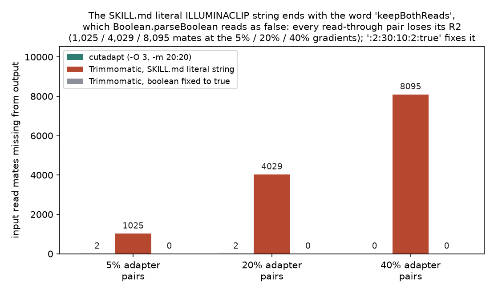
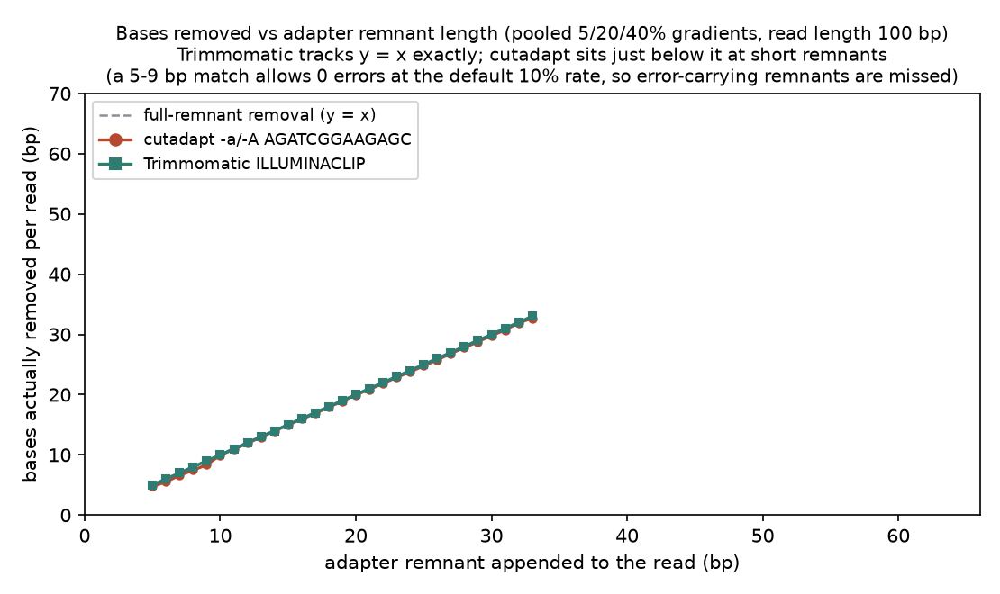
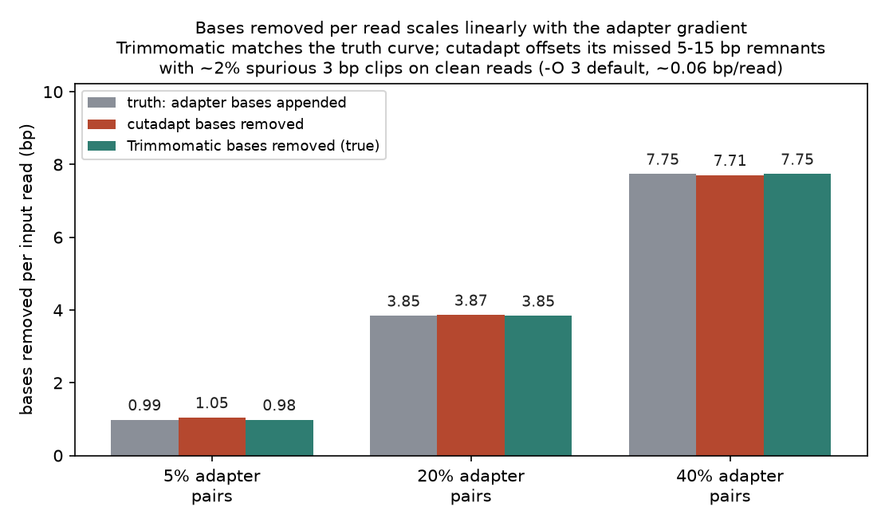

# 039 · 接头去除真实试用

## 功能定位与适用范围

`adapter-trimming` 讲解**用 Cutadapt 与 Trimmomatic 去除 FASTQ 读段中的 3' 接头序列**，覆盖双端 read-through、small-RNA 3' 接头、扩增子引物、锚定/链接接头等场景。SKILL.md 将其定位为「接头/引物去除的唯一负责模块」。

- **适用**：FastQC adapter-content 曲线向 3' 端爬升时；插入片段短于读长的文库（small-RNA 约 22 nt、cfDNA 约 167 bp、FFPE、降解 RNA、古 DNA）；组装或 k-mer 分析之前。
- **不适用**：质量/长度过滤（read-qc/quality-filtering）；一步式修剪+QC（read-qc/fastp-workflow）；PhiX/载体 k-mer 去除（read-qc/contamination-screening）；以质量修剪为独立目标（比对前通常不需要，见下文成分拆解第 2 点）。

## 属性表（本次真跑环境）

| 项 | 值 |
|---|---|
| Cutadapt | v5.2（conda env `bio-qc`，WSL Ubuntu） |
| Trimmomatic | v0.41（同环境，OpenJDK 25.0.2-internal） |
| 接头 fasta | `$CONDA_PREFIX/share/trimmomatic-0.41-0/adapters/TruSeq3-PE-2.fa`（内置 8 个 fasta 之一） |
| 测试数据 | `make_inputs.py` 造数据：seed 39，每档 20,000 read 对、读长 100 bp、1% 替换错误 |
| 梯度设计 | 3 档：5%/20%/40% 的 read 对为 read-through（接头残留 5–33 bp），实测 5.12%/20.14%/40.48% |
| 接头序列 | SKILL.md「Verified Adapter Sequences」原版：R1 3' `AGATCGGAAGAGCACACGTCTGAACTCCAGTCA`，R2 3' `AGATCGGAAGAGCGTCGTGTAGGGAAAGAGTGT` |
| 真值基准 | `truth.tsv.gz`（120,000 行逐读段真值） |
| 实验产物 | `content/素材/read-qc/039-adapter-trimming/` |

## 成分拆解

### 1. 接头内容就是插入片段分布的直接读数

文库结构为 `[P5]-[insert]-[P7]`，读段从插入片段边界起始、沿 5'→3' 方向测序；只有当插入片段短于读长时，聚合酶才会读进 3'/P7 侧接头（read-through）。因此 FastQC 的 adapter-content 曲线向 3' 端爬升，本身就是插入片段分布的信号：short-insert 文库（small-RNA、cfDNA、FFPE）以 read-through 为主，长插入 WGS 几乎没有。标准 Illumina 的接头修剪因此是 **3' 端专属**操作。

### 2. Cutadapt：半全局比对 + 两个关键默认值

Cutadapt 对接头与读段做**半全局（overlap）比对**，所以读段末端的 partial 3' 接头也能被检出。两个默认值决定行为：

- **`-e`（错误率，默认 0.1）按匹配区长度计**，不是按整条接头计：8 bp 匹配带 1 个错误即 0.125，超过默认阈值被拒。本次实测：接头残留 5–9 bp 的读段召回率 93.40%（4,205/4,502 条），显著低于 10–15 bp 箱的 99.59%——5–9 bp 匹配在默认错误率下允许 0 个错误，带 1% 测序错误的残留被漏检。
- **`-O`（最小重叠，默认 3）**：随机 3-mer 匹配会在干净读段上造成误剪。本次实测干净读段被误剪 825/646/456 条（占干净读段 2.17%/2.02%/1.92%，三档梯度），对应的碱基代价约 0.06 bp/read。

### 3. Trimmomatic ILLUMINACLIP：六参数形态与 palindrome 双模式

Trimmomatic 0.41 的 `ILLUMINACLIP` 参数串为 `<fa>:<seedMismatches>:<palindromeClip>:<simpleClip>:<minAdapterLen>:<keepBothReads>`。本次用参数探针实测了参数个数语法：

| 参数形态（seed:palindrome:simple 后的内容） | 结果 |
|---|---|
| `10:true`（4 参数） | `NumberFormatException: For input string: "true"`（第 5 位按 Integer 解析） |
| `10:false`（5 参数） | 同上 |
| `10:2:true`（6 参数） | 正常运行 |

SIMPLE 模式逐条接头对逐条读段做匹配；PALINDROME 模式（仅 PE）把 R1+接头与 R2+接头的反向互补对齐，即使接头只剩几个碱基或完全越过了读段末尾也能检出 read-through。末位 `keepBothReads` 由 `Boolean.parseBoolean` 解析——**SKILL.md 命令示例中的字面单词 `keepBothReads` 被解析为 false**（`Boolean.parseBoolean` 对非 "true" 字符串一律返回 false），等价于显式关闭保留。本次实测后果见严格复现第 ③ 节。

### 4. 两种工具对成对读段的处置差异

- Cutadapt PE 模式：`--pair-filter` 默认 `any`，过滤类选项命中任一 mate 即丢整对；带 `-m 20:20` 时本次仅 2/2/0 对被丢。
- Trimmomatic PE 模式：输出 4 个文件（paired + unpaired/orphan）；palindrome 检出 read-through 后，`keepBothReads=false` 时 R2 作为 R1 的反向互补被视为冗余而丢弃，`true` 时保留。比对器需要双 mate 时必须设 `true`。

### 5. 场景决策树（SKILL.md 口径）

| 场景 | 选择 | 理由 |
|---|---|---|
| 常规 Illumina PE WGS/WES/RNA | fastp，或 cutadapt + TruSeq 茎环 | overlap 分析无需接头序列 |
| small-RNA / miRNA | cutadapt `-a TGGAATTCTCGGGTGCCAAGG -m 18 -M 30 --discard-untrimmed` | 每条 read 都带接头，无接头 read 应丢弃（与基因组 DNA 逻辑相反） |
| 扩增子 / 16S 引物 | cutadapt linked/anchored | 引物位置固定，需精确放置 |
| PE read-through 且序列未知 | fastp overlap 或 Trimmomatic palindrome | 从 R1/R2 重叠推出 read-through |
| 亚硫酸氢盐 / RRBS | Trim Galore `--rrbs` | 处理 MspI 填补与 Bismark 约定 |
| NextSeq/NovaSeq poly-G | fastp 自动或 cutadapt `--nextseq-trim` | 高质量 poly-G 不是接头，常规接头剪不掉 |

### 6. 两条边界认知（SKILL.md 陈述，本次未实测）

- **接头修剪近乎普适，质量修剪不是**：BWA-MEM、STAR 等 local 比对器会软剪低质量尾巴，比对流程前做质量修剪冗余甚至有害（MacManes 2014、Williams 2016）；但比对器不会可靠去除接头——接头是带真实碱基质量的外源序列，可能锚定错误位置。结论：剪接头，质量修剪按需。
- **二色化学 poly-G**：NextSeq/NovaSeq 的高质量 poly-G 尾不是接头，需要化学感知的 poly-G 修剪，接头工具不会处理。

## 严格复现（本次真跑，2026-09-03）

完整命令与输出见素材目录 `repro_transcript.txt`；主流程日志 `_run.log`，参数探针日志 `_probe.log`。

**① 主流程命令链（bio-qc 环境）**

```
python3 make_inputs.py                 # seed 39 造 3 档梯度 + truth.tsv.gz
cutadapt -a AGATCGGAAGAGC -A AGATCGGAAGAGC -m 20:20 \
  -o ca_${G}_R1.fq.gz -p ca_${G}_R2.fq.gz grad${G}_R1.fq.gz grad${G}_R2.fq.gz
trimmomatic PE -phred33 -threads 4 grad${G}_R1.fq.gz grad${G}_R2.fq.gz \
  tm_${G}_R1_p.fq.gz tm_${G}_R1_u.fq.gz tm_${G}_R2_p.fq.gz tm_${G}_R2_u.fq.gz \
  ILLUMINACLIP:TruSeq3-PE-2.fa:2:30:10:2:keepBothReads MINLEN:36    # SKILL.md 字面口径
trimmomatic PE ... ILLUMINACLIP:TruSeq3-PE-2.fa:2:30:10:2:true MINLEN:36  # 修正布尔位
python3 analyze_results.py             # 以 truth.tsv.gz 统一口径评估
```

**② 造数据真值（每档 20,000 对，实测分布）**

| 梯度 | read-through 对（对） | 接头读段占比（%） | 接头碱基总量（bp） |
|---|---|---|---|
| 5% | 1,025 / 20,000 | 5.12% | 39,402 bp |
| 20% | 4,029 / 20,000 | 20.14% | 153,854 bp |
| 40% | 8,095 / 20,000 | 40.48% | 309,810 bp |

**③ 核心实测：SKILL.md 字面参数串每个 read-through 对丢一条 R2**

三种口径在三档梯度上的汇总（`results.tsv`）：

| 梯度 | 工具口径 | 输出读段（条） | 丢失读段（条） | 召回率（%） | 误剪读段（条） | 去除碱基/读段（bp） |
|---|---|---|---|---|---|---|
| 5% | cutadapt | 39,998 | 2 | 98.34% | 825 | 1.049 |
| 5% | Trimmomatic 字面串 | 38,975 | 1,025 | 100.00% | 0 | 3.055 |
| 5% | Trimmomatic `:true` | 40,000 | 0 | 100.00% | 0 | 0.985 |
| 20% | cutadapt | 39,998 | 2 | 98.32% | 646 | 3.867 |
| 20% | Trimmomatic 字面串 | 35,971 | 4,029 | 100.00% | 0 | 11.996 |
| 20% | Trimmomatic `:true` | 40,000 | 0 | 100.00% | 0 | 3.846 |
| 40% | cutadapt | 40,000 | 0 | 98.44% | 456 | 7.713 |
| 40% | Trimmomatic 字面串 | 31,905 | 8,095 | 100.00% | 0 | 24.110 |
| 40% | Trimmomatic `:true` | 40,000 | 0 | 100.00% | 0 | 7.745 |

关键对应关系：字面串口径下 Forward Only Surviving 数（1,025 / 4,029 / 8,095 条）**恰好等于各档真值 read-through 对数**——palindrome 模式检出 read-through 后，`keepBothReads` 字面词被 `Boolean.parseBoolean` 解析为 false，每对的 R2 被整条丢弃；把末位改为 `true` 后三档均 0 丢失，去除碱基量与真值完全一致（39,402 / 153,854 / 309,810 bp）。字面串口径下「去除碱基/读段」虚高，是因为该口径把整条被丢 R2 的 100 bp 也计入了去除量。

**④ cutadapt 的两个默认值实测**

- 残留长度分箱召回（`bins.tsv`，Trimmomatic `:true` 口径各箱均 100.00%）：

| 残留长度（bp） | 真值读段（条） | cutadapt 召回率（%） |
|---|---|---|
| 5–9 | 4,502 | 93.40% |
| 10–15 | 5,352 | 99.59% |
| 16–24 | 8,096 | 99.44% |
| 25–33 | 8,348 | 99.32% |

- 默认 `-O 3` 在干净读段上的误剪：825 / 646 / 456 条（占干净读段 2.17% / 2.02% / 1.92%），对应约 0.06 bp/read 的碱基代价。
- cutadapt 官方报告口径：R1 带接头比例 7.2% / 21.4% / 41.1%，与造数据梯度一致。

### 本次出图







### 未覆盖（诚实标注）

以下内容本次未真跑，仅为 SKILL.md 文档口径：

- fastp PE overlap 模式（无需接头序列）与 `--nextseq-trim` poly-G 修剪。
- small-RNA 流程（`--discard-untrimmed` + `-m 18 -M 30` 长度门）。
- 扩增子 linked/anchored 引物（`-g ^FWD...REV`）、`-b`/`-g`/`-B`/`-G` 其他接头形态。
- Trim Galore（RRBS/Bismark）与 BBDuk（PhiX/载体 k-mer 去除）。
- 质量修剪 `-q`（cutadapt）与 Trimmomatic 其他 step（SLIDINGWINDOW、MAXINFO 等，见 040）。
- real data 验证（本次全部为 seed 39 合成梯度数据）。

## 实践要点

- **ILLUMINACLIP 末位布尔位要写显式 `true`/`false`，不要照抄单词 `keepBothReads`**：Trimmomatic 0.41 用 `Boolean.parseBoolean` 解析该位，单词被解析为 false；0.41 还要求完整 6 参数形态，4/5 参数形态直接 `NumberFormatException`（实测）。
- **`keepBothReads=false` 的可见症状是「R2 少了一半 read-through」**：比对器报 R1/R2 数目不齐时先查该位，再查是否单独处理了 mate。
- **cutadapt 漏检集中在 5–9 bp 短残留**（默认参数下召回 93.40%）：原因是 `-e 0.1` 按匹配区长度计错配、短匹配不允许错误；带测序错误的短残留可提高 `-e` 或改用 palindrome 类重叠检测。
- **默认 `-O 3` 有约 2% 的干净读段误剪率**（本次 2.17%/2.02%/1.92%）：误剪代价约 0.06 bp/read，敏感场景可提 `-O` 到 5。
- **评估修剪工具必须逐读段对真值**：单看工具自带报告看不到「丢了哪条读段」；本次用 `truth.tsv.gz` 逐 read_id 对齐后，才把字面串口径的 R2 丢失定位为逐对、精确等于 read-through 数。
- **接头序列按试剂盒核对**：TruSeq R1/R2 3' 接头互为反向互补关系，共用 13 bp 茎环 `AGATCGGAAGAGC` 可同时覆盖两个 mate；Nextera/Tn5 与 small-RNA 接头序列不同。
- **Trimmomatic 步骤按命令行顺序执行**：ILLUMINACLIP 放最前、MINLEN 放最后，长度门槛才能反映全部前置修剪。

## 小结

adapter-trimming 的机制核心是「短插入片段的 read-through 检测」：cutadapt 用半全局比对逐条读段找 3' 接头，Trimmomatic 用 palindrome 模式从 R1/R2 重叠检出 read-through。本次在 WSL 真跑闭环：seed 39 造 5%/20%/40% 三档梯度（每档 20,000 对、100 bp、1% 错误），cutadapt 5.2 与 Trimmomatic 0.41 各按两种口径跑通，并以 120,000 行逐读段真值统一评估。实测到的关键事实：SKILL.md 命令示例中的字面词 `keepBothReads` 被 Trimmomatic 0.41 解析为 false，导致每个 read-through 对丢一条 R2（1,025/4,029/8,095 条，精确等于真值对数），改为 `true` 后 0 丢失且去除碱基量与真值一致；cutadapt 召回 98.3–98.4%，缺口全部集中在 5–9 bp 短残留（该箱 93.40%），默认 `-O 3` 另有约 2% 干净读段误剪。两种工具的正确配置下都能把接头剪干净，差异在短残留与参数写法。

（数据与可复现脚本见 `content/素材/read-qc/039-adapter-trimming/`，含 `_run.sh`、`_probe.sh`、`make_inputs.py`、`analyze_results.py`、`make_figs.py`、`repro_transcript.txt` 及三张图。）
