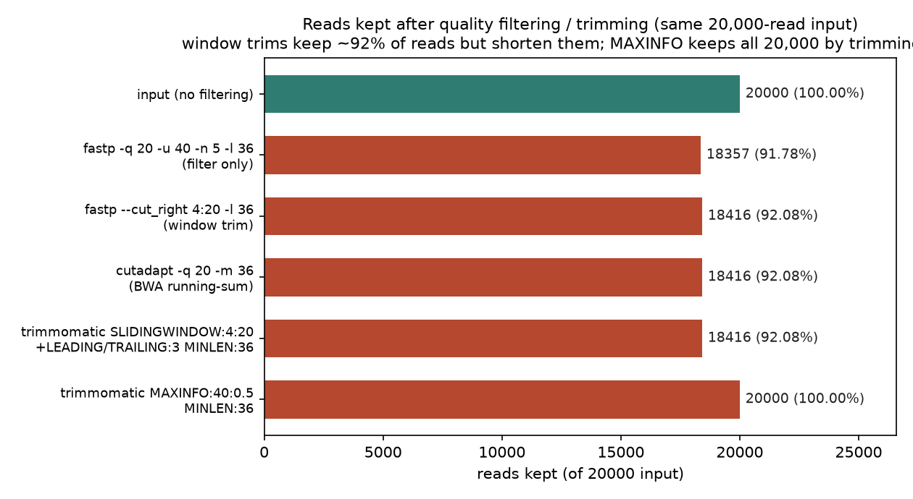
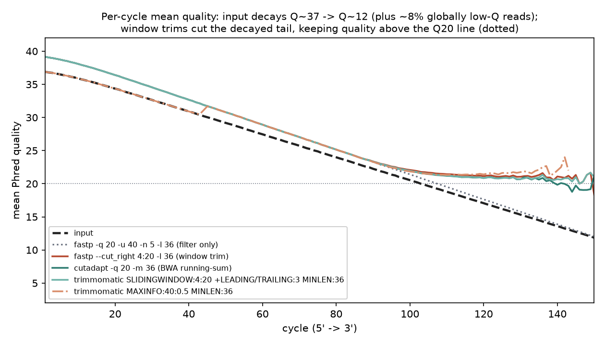
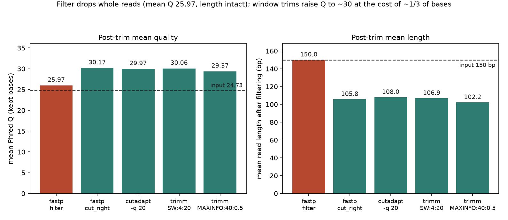

# 040 · bioSkills 真实试用：quality-filtering（读段质量过滤）

## 功能定位与适用范围

`quality-filtering` 讲解**用 Trimmomatic、fastp、Cutadapt 按质量、长度、N 含量与复杂度过滤读段**，覆盖整条读段丢弃（filter）与读段内碱基修剪（trim）两类操作。

- **适用**：读段带低质量尾巴需要切除；组装、k-mer/伪比对、小 RNA、扩增子等对错误敏感的流程需要干净输入；存在整体低质量的「坏 read」亚群需要整条丢弃；选定 SLIDINGWINDOW 还是 MAXINFO 等参数取舍。
- **不适用**：接头移除（见 adapter-trimming）；一步式预处理全家桶（见 fastp-workflow）；质量图解读（见 quality-reports）；污染清除（明确划出范围）。

## 属性表（本次真跑环境）

| 项 | 值 |
|---|---|
| fastp | v1.3.6（conda env `bio-qc`，WSL Ubuntu） |
| Cutadapt | v5.2（Python 3.13.15，同环境） |
| Trimmomatic | v0.41（同环境；skill 兼容口径 Trimmomatic 0.39+ / fastp 0.23+ / Cutadapt 4.4+，均满足） |
| 输入数据 | `input_grad.fq.gz`：20,000 条 reads × 150 bp（合计 3,000,000 bp），seed 20260903 |
| 质量设计 | 92% reads 逐 cycle 质量从 5' 端 Q36.9 线性衰减到 3' 端 Q11.9；8% 全局低质量 junk 亚群（实测 1,584 条，占 7.9%） |
| 输入质量 | 整体平均 Q24.73；Q20 以上碱基占 67.52%；Q30 以上占 34.62% |
| 主产出 | 5 组过滤输出 FASTQ + fastp JSON/HTML 报告 + cutadapt 报告 + trimmomatic 日志 + `results.json` |
| 实验产物 | `content/素材/read-qc/040-quality-filtering/` |

## 成分拆解

### 1. 丢弃与修剪是两类操作

skill 开篇第一条现代洞见：**质量过滤（丢整条读段）与质量修剪（切读段内的碱基）是不同操作，用不同工具参数表达**。

- fastp 的 `-q/-u/-n` 是**逐条过滤**：低于 Q 值的碱基记为「不合格」，不合格比例超过 `-u`（默认 40%）或 N 数超过 `-n`（默认 5）则整条丢弃；`-e` 按平均质量整条丢弃。
- fastp 的 `--cut_right`、Trimmomatic 的 `SLIDINGWINDOW` 是**窗口修剪**：从 5' 向 3' 扫描，窗口均值低于阈值处切断，丢弃 3' 残段。
- Cutadapt 的 `-q` 用 BWA 式**运行部分和**算法：不是固定截断，低质量区段中单个高 Q 碱基不会中止修剪。

选哪种取决于问题形态：**部分 read 全程差（质量分布双峰）→ 过滤；所有 read 尾部差（逐 cycle 质量衰减）→ 修剪**。本次模拟数据同时含两种形态（8% junk 亚群 + 全体 3' 衰减），因此两类操作的差异可以直接观测。

### 2. 激进质量修剪有代价：文献口径

skill 引用的三条证据链指向同一结论——**轻修剪或不修剪是默认，激进修剪是例外**：

| 证据 | 结论 |
|---|---|
| Williams 2016（BMC Bioinformatics 17:103） | 激进修剪使超过 10% 基因的表达估计发生偏移；补最小长度过滤可缓解大部分畸变 |
| Del Fabbro 2013（PLoS ONE 8:e85024） | 修剪严到 Q30 以上会劣化 de novo 组装 |
| MacManes 2014（Frontiers in Genetics 5:13） | RNA-seq 只去掉 Phred 2-5 以下的碱基已足够 |
| GATK 官方口径 | 有 BQSR 的变异检测流程不做质量修剪（BQSR 自己重校准质量值） |

真正需要质量修剪的流程：de novo 组装（约 Q20 + 长度门槛）、k-mer/伪比对（错误制造幽灵 k-mer）、小 RNA、扩增子、无 BQSR 的变异检测。依赖局部比对软切割（soft-clip）的比对器（BWA-MEM、STAR、Bowtie2 local）会自行吸收低质量尾巴，修剪收益有限。

### 3. 修剪必须搭配最小长度门槛

修剪后的短 read 会错误定位（mis-map），因此 `MINLEN`（Trimmomatic，永远放最后一步）、`-l`（fastp）、`-m`（cutadapt）不是可选项，而是**让修剪变得安全的安全机制**。Williams 2016 的结论是：加最小长度过滤后，修剪引入的表达畸变大部分消失，因为过度修剪的片段被丢弃而非错误定位。本次实测中，三组窗口修剪各有 1,584 条 reads（占 7.92%）因剪后短于 36 bp 被丢弃——门槛承担了全部丢弃动作。

### 4. 三工具机制对比

| 工具 | 机制 | 参数口径（skill 原文） | 适用场景 |
|---|---|---|---|
| fastp | 逐条过滤 + 窗口切割一体 | `-q 20 -u 40 -n 5 -l 36`；`--cut_right --cut_window_size 4 --cut_mean_quality 20` | 默认首选：一次快速跑完过滤与修剪 |
| Trimmomatic | 有序步骤流水线 | `LEADING:3 TRAILING:3 SLIDINGWINDOW:4:20 MINLEN:36`；`MAXINFO:40:0.5` | 遗留流程复现；MAXINFO 做长度-质量自适应平衡 |
| Cutadapt | BWA 运行部分和修剪 | `-q 20 -m 36`（5',3' 双端形式为 `-q 15,20`） | 已在用 cutadapt 去接头时顺带做；单端精确控制 |

Trimmomatic 步骤按**命令行顺序**执行，质量步骤须放在 `MINLEN` 之前，长度判定才反映全部修剪结果。`MAXINFO:L:S` 在目标长度 L 与错误率之间自适应权衡，严格度 S 低于 0.2 偏向保长、高于 0.8 偏向保正确。

### 5. 二色仪器的两个特例

- **质量分箱**：NextSeq/NovaSeq 的质量值只发 4 个档（RTA3：2、12、23、37），SLIDINGWINDOW:4:15 这类阈值实际是在 12 与 23 两档之间划线，行为呈台阶状，HiSeq 时代连续质量上调好的阈值不可直接移植。
- **poly-G 不怕质量过滤**：二色化学下多 G 尾端质量值很高，质量过滤与修剪都不动它，需要 `fastp --trim_poly_g` 或 cutadapt `--nextseq-trim`（本 skill 划给 poly-G/接头处理，但口径在此交代）。

### 6. 按下游流程选策略

```
下游是什么？
├── 比对型 DNA/RNA（BWA-MEM / STAR / Bowtie2 local / HISAT2）-> 轻修剪或不修剪（软切割自吸收）
├── GATK 变异检测（有 BQSR）-> 不修剪
├── de novo 组装 -> 适度修剪（约 Q20）+ 最小长度门槛
├── k-mer / 伪比对（kallisto / salmon）-> 轻修剪 + 去接头
├── 质量分布双峰（存在坏 read 亚群）-> 整条过滤（fastp -e / AVGQUAL）
└── 无 BQSR 的变异检测 -> 适度修剪 + 最小长度门槛
拿不准时：去接头 + 轻窗口修剪 + 长度门槛，再用 FastQC 确认。
```

## 严格复现（2026-09-03）

完整命令与输出见素材目录 `repro_transcript.txt`；主流程与指标解析有落盘日志（`_run.log` / `_wsl_run.log`）。

**① 输入数据（make_inputs.py，seed 20260903）**

20,000 条 reads × 150 bp：92% 逐 cycle 质量从 Q36.9 衰减到 Q11.9（带逐 read 抖动，测序错误按 P=10^(-Q/10) 注入）；8% 全局低质量亚群（Q8-14 波动，实测 1,584 条 / 7.9%）。无接头（属 adapter-trimming 范围）。整体平均 Q24.73。

**② 五组过滤命令链（bio-qc 环境，同一输入）**

```
fastp -i input_grad.fq.gz -o out_fastp_filter.fq.gz -q 20 -u 40 -n 5 -l 36
fastp -i input_grad.fq.gz -o out_fastp_cutright.fq.gz --cut_right --cut_window_size 4 --cut_mean_quality 20 -l 36
cutadapt -q 20 -m 36 -o out_cutadapt.fq.gz input_grad.fq.gz
trimmomatic SE -phred33 input_grad.fq.gz out_trimm_sw.fq.gz LEADING:3 TRAILING:3 SLIDINGWINDOW:4:20 MINLEN:36
trimmomatic SE -phred33 input_grad.fq.gz out_trimm_maxinfo.fq.gz MAXINFO:40:0.5 MINLEN:36
```

**③ 核心实测结果（parse_results.py 从输出 FASTQ 与各工具报告解析）**

| 配置 | 保留 reads（条） | 保留率 | 保留碱基率 | 修剪后平均 Q | 修剪后平均读长（bp） | 丢弃原因（工具报告） |
|---|---|---|---|---|---|---|
| 输入（不过滤） | 20,000 | 100% | 100% | 24.73 | 150.0 | — |
| fastp 过滤（-q 20 -u 40 -n 5 -l 36） | 18,357 | 91.78% | 91.78% | 25.97 | 150.0 | low_quality 1,643 条 |
| fastp --cut_right 4:20 -l 36 | 18,416 | 92.08% | 64.92% | 30.17 | 105.8 | too_short 1,584 条 |
| cutadapt -q 20 -m 36 | 18,416 | 92.08% | 66.30% | 29.97 | 108.0 | too short 1,584 条（7.9%） |
| trimmomatic SLIDINGWINDOW:4:20 | 18,416 | 92.08% | 65.63% | 30.06 | 106.9 | Dropped 1,584 条（7.92%） |
| trimmomatic MAXINFO:40:0.5 | 20,000 | 100% | 68.15% | 29.37 | 102.2 | Dropped 0 条 |

三个可复核的实测观察：

- **过滤与修剪的形态差异**：fastp 逐条过滤只把平均 Q 从 24.73 提到 25.97（+1.24），读长不动（150.0 bp）；三种窗口修剪把平均 Q 提到 29.37-30.17（约 +5），代价是读长缩到 102-108 bp、碱基少拿约三分之一。junk 亚群（1,584 条）只能靠过滤整条去掉；坏尾只能靠修剪去掉，二者不可互替。
- **三种窗口修剪高度收敛**：阈值同为 Q20 时，三种算法保留的 reads 完全相同（18,416 条，92.08%），修剪后平均 Q 最大差 0.20，平均读长差 2.2 bp。算法差异（滑动窗口 / BWA 运行和 / fastp 窗口）的影响小于阈值选择本身。
- **MAXINFO 在 0.5 严格度下修剪最狠但零丢弃**：平均读长压到 102.2 bp（五组最短），被修剪最重的 1,584 条 reads 全部落入 36-60 bp 区间但没有一条跌破 MINLEN:36，因此 20,000 条全保留。trimmomatic 日志原文：`Input Reads: 20000 Surviving: 20000 (100.00%) Dropped: 0 (0.00%)`。

**④ fastp 报告的顺序证据**

`--cut_right` 模式的 fastp JSON 报告 `filtering_result` 为：low_quality_reads = 0、too_short_reads = 1,584。即窗口修剪先移除低质量尾段之后，逐条质量过滤不再有可剔除对象，全部丢弃都来自长度门槛——与「修剪在前、过滤在后」的流水线顺序一致。

### 本次出图







## 实践要点

- **先看问题形态再选操作**：FastQC 的 per-sequence-quality 图出现低质量峰 → 整条过滤（fastp `-e` / `-q`+`-u`）；per-base-quality 图尾部衰减 → 窗口修剪。本次数据两者并存，两类操作的效果差异被直接测出。
- **阈值比工具重要**：Q20 阈值下三种算法结果几乎重合；换工具的收益远小于认真选阈值。
- **最小长度门槛必须存在**：三组窗口修剪各丢 1,584 条（7.92%）短于 36 bp 的读段，门槛是修剪安全性的来源；`MINLEN` 放 Trimmomatic 命令最后。
- **轻修剪是默认**：Q20 已属温和；文献口径下 Q25-30 以上的激进修剪损害表达估计与组装，配软切割比对器时可以更轻。
- **fastp 一条命令同时做两件事**：`--cut_right` + `-l 36` + 默认逐条过滤（-q 15 / -u 40）即可覆盖本 skill 主线；其 JSON 报告的 `filtering_result` 能直接对账丢弃原因。
- **MAXINFO 适合「宁短勿错」场景**：0.5 严格度下它把重病 read 修到 36-60 bp 仍保留，读长最短、零丢弃；偏向保正确时提高严格度到 0.8。
- **二色仪器两个特例**：质量只有 4 档，阈值行为呈台阶；poly-G 尾端质量高，质量过滤删不掉。
- **不要用 HEADCROP 修 per-base content 波动**：那是随机六聚体引物偏差（Hansen 2010），切首 12 bp 只丢数据不去偏差。

## 小结

quality-filtering 的机制核心是「丢弃与修剪是两类操作、修剪必配最小长度门槛、轻修剪是默认」。本次在 WSL 真跑闭环：seed 固定的质量梯度模拟数据（20,000 条 × 150 bp，8% junk 亚群）经 fastp 1.3.6 / cutadapt 5.2 / trimmomatic 0.41 五组配置过滤，实测到三个可复核结果——过滤只提 1.24 个 Q 且不动读长，窗口修剪提约 5 个 Q 但碱基少拿三分之一；Q20 阈值下三种窗口修剪算法保留完全相同的 18,416 条 reads；MAXINFO:40:0.5 修剪最狠（均值 102.2 bp）却零丢弃，全部由 36 bp 长度门槛兜底的结构与 skill 文档口径一致。

（数据与可复现脚本见 `content/素材/read-qc/040-quality-filtering/`，含 `make_inputs.py`、`_run.sh`、`parse_results.py`、`make_figs.py`、`repro_transcript.txt` 及三张图。）
