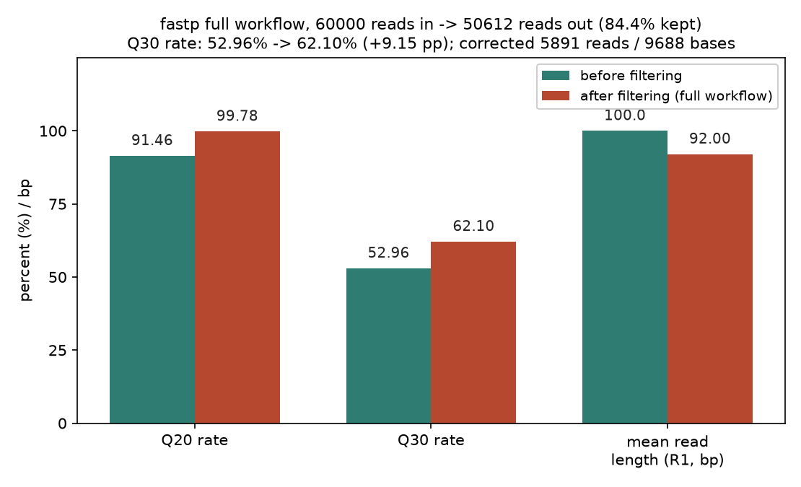
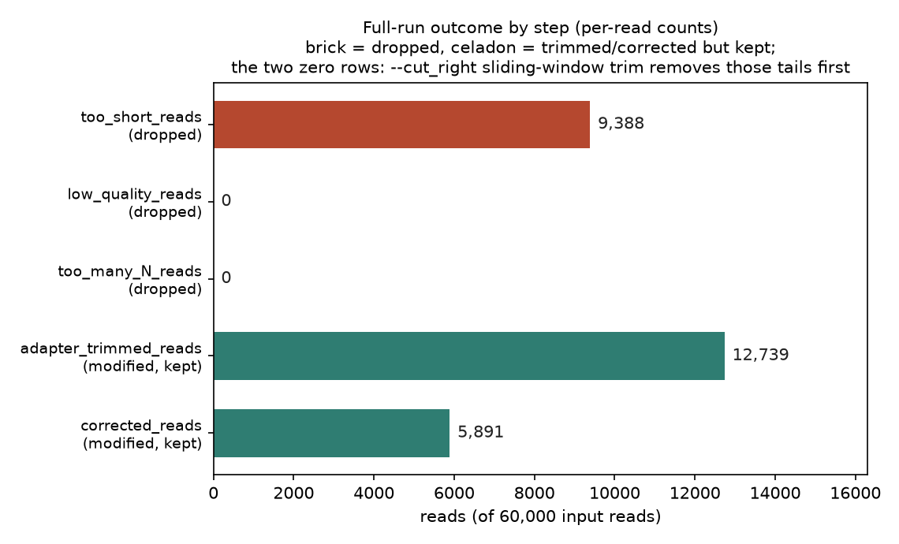
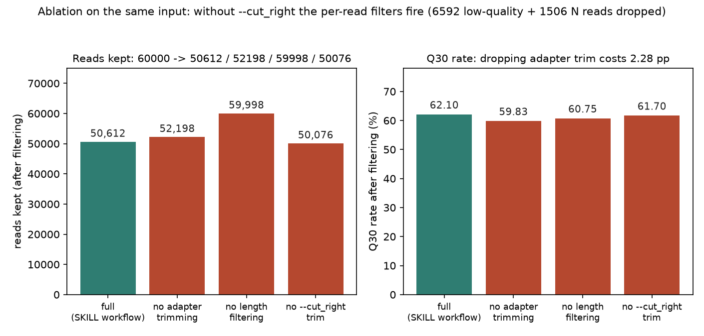

# 041 · bioSkills 真实试用：fastp-workflow（fastp 一站式 FASTQ 预处理）

## 功能定位与适用范围

`fastp-workflow` 讲解**用 fastp 单次运行完成 Illumina FASTQ 预处理**：PE overlap 分析去接头、质量/长度过滤、滑窗质量剪裁、2 色仪器 poly-G 去除、重叠区碱基校正，并同轮产出 HTML/JSON QC 报告。

- **适用**：bulk WGS/WES/RNA/cfDNA 的 PE 预处理；想用一个工具替代 Cutadapt + Trimmomatic + FastQC 三步；JSON 报告直接喂 MultiQC 做队列聚合。
- **不适用**：小 RNA/扩增子/锚定接头的精确裁剪（skill 指向 read-qc/adapter-trimming，用 cutadapt）；分子级 UMI 去重与共识（read-qc/umi-processing）；`--dedup` 不适用于 RNA-seq 定量（序列一致性去重会误删真实生物学重复）。

## 属性表（本次真跑环境）

| 项 | 值 |
|---|---|
| fastp | v1.3.6（conda env `bio-qc`，WSL Ubuntu） |
| 数据生成 | python3 3.13.15，`make_inputs.py`，固定种子 20260412 |
| 输入数据 | 30,000 PE 读对 × 100 bp（60,000 条读 / 6,000,000 碱基）模拟 Illumina 数据 |
| 缺陷设计 | 24.3% 读带 read-through 接头 / 12% 读对低质量 / 3.0% 读带 6-12 连续 N / 5% 读对 insert < 36 bp |
| 运行组数 | 4 组：全流程 + 3 组消融（关接头去除 / 关长度过滤 / 关滑窗剪裁） |
| 单组耗时 | 1 秒（fastp 报告 time used: 1 seconds，-w 8 线程） |
| 主产出 | `clean_R1/R2.fq.gz` + `report_full.json`（109 KB）/ `report_full.html`（458 KB） |
| 实验产物 | `content/素材/read-qc/041-fastp-workflow/` |

## 成分拆解

### 1. overlap 分析一体三用（fastp 的核心机制）

fastp 把 R1 与 R2 的反向互补做对齐，找出 insert 来源的重叠区。这一套 overlap 分析在一条流水线上服务三件事：

- **接头去除（默认开启，无需给接头序列）**：insert 短于读长时，read-through 部分就是接头。overlap 对齐定位出 insert 边界，边界之外全部裁掉——因为不依赖序列匹配，接头残余可以裁到只剩 1 个碱基，而序列匹配类工具（cutadapt 默认）最少需要 3 个碱基。`--detect_adapter_for_pe` 是在此之上**追加**序列法检测，不是替代。
- **碱基校正（`--correction`，默认关闭）**：重叠区内两条 mate 理论上应一致；不一致且一侧质量高、另一侧质量低时，用高质量碱基覆盖低质量碱基。
- **读对合并（`--merge`）**：短 insert 文库（cfDNA、小 RNA）把重叠读对合并成单端全 insert 序列，产出 merged / un_R1 / un_R2 三股流。

### 2. 剪裁与过滤是两道独立工序，且剪裁在前

fastp 内部处理顺序是：接头去除 → 质量剪裁（`--cut_front/--cut_tail/--cut_right` 滑窗，默认关闭）→ poly-G/poly-X → **逐条过滤**（`-q` 合格质量、`-u` 不合格碱基占比上限 40%、`-n` N 上限 5、`-l` 最短长度 15）。过滤评判的是**剪裁之后**的读。

这个顺序有一个实测才能体会的后果：滑窗剪裁会把低质量尾巴和多 N 区段先剪掉，逐条过滤器就拿不到可判「失败」的读——剪裁抢走了过滤的活。本次数据里故意埋了可过滤缺陷，全流程下 `low_quality_reads` 与 `too_many_N_reads` 计数均为 0，关掉 `--cut_right` 后两者才分别变为 6,592 和 1,506 条（见第 4 节）。

### 3. poly-G：2 色仪器的无信号 call

NextSeq/NovaSeq 这类 2 色化学中，G 是无信号位置的输出，高质量 poly-G 尾巴对质量过滤不可见，所以 fastp 从机器 ID 自动识别 2 色仪器并启用 `--trim_poly_g`（`--poly_g_min_len 10`）。4 色仪器（HiSeq/MiSeq）数据不自动启用，需要时须显式加参。`--trim_poly_x` 处理 3' 端 poly-A 等同聚物。

### 4. `--dedup` 的边界与 duplication rate 的正确用法

fastp 的 `--dedup` 是 FASTQ 层面的**序列一致性**去重：无比对坐标、无 UMI，因此高度表达转录本产生的相同片段、靶向扩增管的相同扩增子都会被当作重复删掉。skill 的立场明确：RNA-seq 定量、扩增子实验禁用；DNA 变异检测应走到比对后用坐标法（duplicate-handling）；分子级需求走 UMI。JSON 报告里的 `duplication.rate` 是诊断输出（本次数据无重复设计，实测 0），不构成自动去重的理由。

### 5. 报告即产物

`-j/--json` 与 `-h/--html` 同轮产出，JSON 含 before/after 汇总、filtering_result 各计数、adapter_cutting 明细（含检测到的接头序列与频数）、corrected 计数、insert size 分布、duplication rate，可直接被 MultiQC 聚合。

## 严格复现（本次真跑，2026-09-03）

完整命令与输出见素材目录 `repro_transcript.txt`；主流程与四组运行各有落盘日志（`_run.log`）。未覆盖项诚实标注：poly-G（本次为 4 色口径模拟数据，未启用）、`--merge`、UMI 提取、`--dedup` 均未真跑，以上机制描述为 skill 文档口径。

**① 造数据（make_inputs.py，让每道工序都有活干）**

| 设计缺陷 | 参数化 | 目标工序 |
|---|---|---|
| insert 45-100 bp 或 20-44 bp | 25% 读对，read-through 接头循环填充至 100 bp | PE overlap 接头去除 |
| insert 110-199 bp | 25% 读对，重叠区注入 1-2 处「R1 高质量 / R2 低质量(Q7)」错配 | `--correction` |
| 质量沿 3' 衰减 | 12% 读对，Q20 以下碱基占比 > 40% | `-q 20 -u 40` |
| 连续 N | 3.0% 读对，6-12 个 N，质量 Q2 | `-n 5` |
| insert < 36 bp | 5% 读对 | `-l 36` |

实测输入统计：60,000 条读全部 100 bp、6,000,000 碱基；R1 带 AGATCG 接头读 7,297 条（24.3%）；带 N run 读 905 条（3.0%）；before Q20 率 91.46%、Q30 率 52.96%。

**② 命令链（bio-qc 环境，全流程组）**

```
fastp -i raw_R1.fq.gz -I raw_R2.fq.gz -o clean_R1.fq.gz -O clean_R2.fq.gz \
      --detect_adapter_for_pe --correction \
      --cut_right --cut_window_size 4 --cut_mean_quality 20 \
      -q 20 -l 36 -w 8 \
      -h report_full.html -j report_full.json
```

消融组在同命令上分别追加 `--disable_adapter_trimming` / `--disable_length_filtering` / 去掉 `--cut_right` 三连参数。

**③ 全流程 before/after（解析自 report_full.json）**

| 指标 | before | after |
|---|---|---|
| reads | 60,000 | 50,612（保留 84.4%） |
| bases | 6,000,000 | 4,677,400 |
| Q20 率 | 91.46% | 99.78% |
| Q30 率 | 52.96% | 62.10%（+9.15 个百分点） |
| R1 平均读长 | 100 bp | 92 bp |

**④ 各工序贡献（四组真跑对比，解析自各组 JSON）**

| 工序 | 实测计数（full 组） | 消融对照 |
|---|---|---|
| 接头去除 | 12,739 reads / 451,574 bases 被裁 | 关闭后保留 52,198 reads（+1,586），Q30 降至 59.83%（-2.28 pp），R1 均长 99 bp（接头残留） |
| 滑窗剪裁 `--cut_right` | 使 low_quality / too_many_N 计数为 0 | 去掉后 low_quality_reads 6,592、too_many_N_reads 1,506、too_short 1,826，保留 50,076 reads（少 536 条） |
| 逐条长度过滤 | too_short_reads 9,388 被丢弃 | 关闭后保留 59,998 reads，R1 均长 82 bp |
| 碱基校正 | 5,891 reads / 9,688 bases 被修正 | nocut 组 6,047 reads / 10,032 bases（剪裁会先消耗部分可校正位点） |
| duplication（诊断） | rate = 0 | 未启用 `--dedup`（数据无重复设计） |

上表滑窗剪裁行中保留读数更低是真实差异：剪裁救回的短读多于过滤器丢弃的读，净多保留 536 条。

**⑤ 出图（make_figs.py → 3 张 PNG，全部解析自真实 JSON）**







自检：3 × [PASS]，`FIGURE QUALITY: TOTAL FAILS = 0`（2026-09-03）。

## 实践要点

- **PE 接头去除默认开启且无需接头序列**：overlap 分析自动定位 read-through；`--detect_adapter_for_pe` 只是追加序列法检测。SE 数据没有 mate 可对齐，必须显式给 `--adapter_sequence`。
- **滑窗剪裁会掩盖逐条过滤器的存在感**：解读 fastp 报告时，`low_quality_reads = 0` 不代表数据没有低质量读，可能只是被 `--cut_right` 先剪掉了；想看过滤器真实开工情况需另跑一组去掉剪裁的对照（本次 nocut 组实测 6,592 条低质量 + 1,506 条多 N）。
- **`--correction` 默认关闭**，是唯一需要显式开启的 overlap 功能；其收益在测序错误非对称分布（一高一低）的重叠区，本次 6,000,000 碱基修正 9,688 个。
- **报告键名随版本漂移**：fastp 1.3.6 的修正计数在 `filtering_result.corrected_reads`，不在独立 `correction` 节点；解析脚本应做键存在性检查（本次首次解析即因键名预设错误取到 None）。
- **`--dedup` 只用于确认安全的非 UMI 文库**；RNA-seq/扩增子禁用；duplication rate 仅作诊断。
- **JSON 报告直接喂 MultiQC**：`multiqc .` 聚合队列级 QC（见 read-qc/quality-reports）。
- **接头残余可裁到 1 个碱基**是 overlap 法相对序列匹配法（最少 3 碱基）的结构性优势。

## 小结

fastp-workflow 的机制核心是「一套 overlap 分析服务接头去除、碱基校正、读对合并三件事，外加剪裁在前、过滤在后的两段式质量控制」。本次在 WSL 真跑闭环：模拟 30,000 PE 读对（接头 + 低质量 + N 污染 + 超短 insert 四类缺陷）、按 skill 口径跑全流程并做三组消融。实测全流程保留 84.4% 读，Q30 率 52.96% → 62.10%；接头去除 12,739 条、碱基校正 5,891 条均在无人工指定接头序列下完成；并实测到剪裁与过滤的工序屏蔽效应——全流程下逐条过滤计数为 0，关掉 `--cut_right` 后 6,592 条低质量读与 1,506 条多 N 读才被过滤器显式丢弃。

（数据与可复现脚本见 `content/素材/read-qc/041-fastp-workflow/`，含 `make_inputs.py`、`_run.sh`、`parse_reports.py`、`make_figs.py`、`repro_transcript.txt` 及三张图。）
