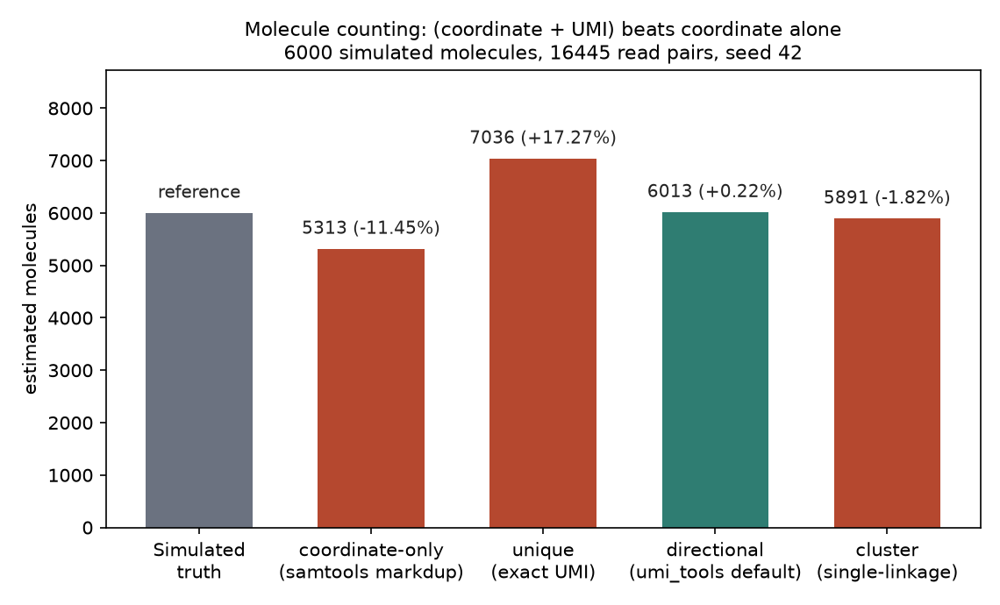
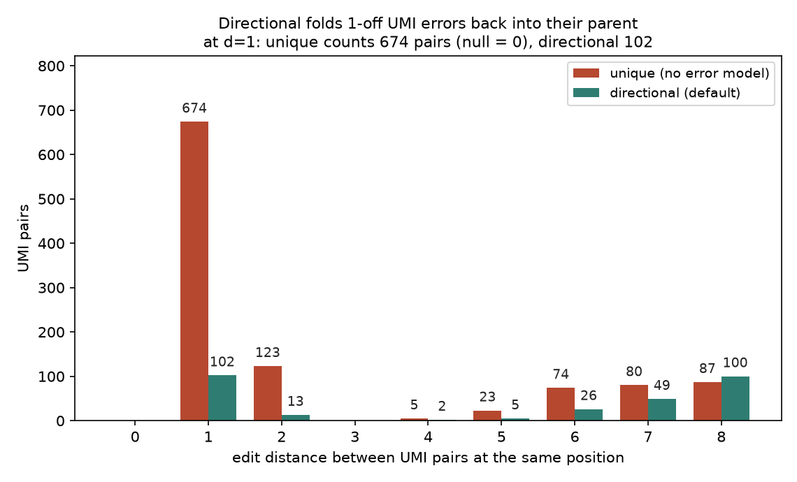
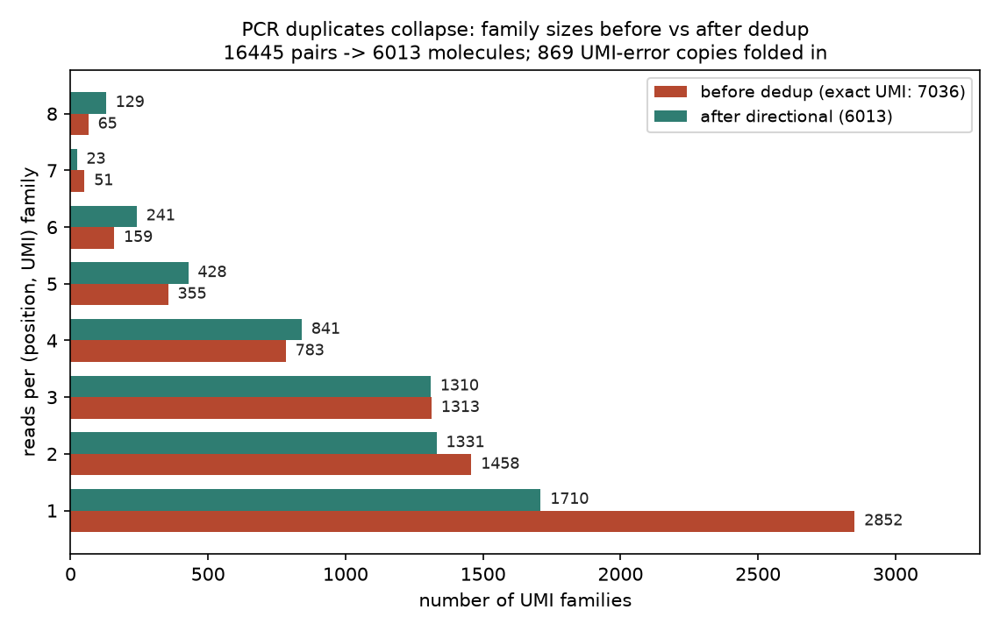

# 042 · bioSkills 真实试用：umi-processing（UMI 分子计数）

## 功能定位与适用范围

`umi-processing` 讲解**把 UMI 从读段中提取出来、按（坐标 + UMI）折叠 PCR 重复以计数原始分子，以及用 fgbio 构建错误校正共识读段**。

- **适用**：带 UMI 文库的分子计数（bulk / 靶向 RNA 或 DNA）；低投入 RNA-seq 与靶向 panel 的重复鉴别；单细胞矩阵产出；ctDNA / MRD 的亚 0.1% VAF 错误校正（fgbio duplex 共识）。
- **不适用（路由出去）**：QC 阶段的 UMI 提取归 fastp-workflow；非 UMI bulk RNA-seq 不做去重（高表达基因的重复坐标是生物学事实，归 rnaseq-qc）；CellRanger / STARsolo 输出已做过 UMI 折叠，不得再 dedup；非 UMI DNA 的坐标去重归 duplicate-handling。

## 属性表（本次真跑环境）

| 项 | 值 |
|---|---|
| umi_tools | v1.1.6（conda env `bio-umi`，bioconda + conda-forge 通道，python 3.11.16，WSL Ubuntu） |
| 安装方式实测 | conda 一次装成；`pip install umi-tools` 在 python 3.13 下 sdist 构建失败（其 ez_setup.py 引导脚本报 `OSError: Could not build the egg`），1.1.6 的构建脚本未适配 py3.13，应走 conda |
| 版本核对 | `umi_tools version` 子命令在 1.1.6 损坏（AttributeError: module 'umi_tools.version' has no attribute 'main'）；版本经 `conda list` 与 dedup 日志头双重确认 |
| 比对与排序 | bwa 0.7.19 + samtools 1.24（conda env `bio`） |
| 比对结果 | `sorted.bam`：32890 条 reads，mapped 100.00%，properly paired 99.82% |
| reads 来源 | `make_inputs.py`（seed 42，python3）：2 条 contig × 20000 bp 合成参考；6000 个原始分子，各带 12 nt 随机 UMI（空间 4^12 = 16777216）；产出 16445 对 reads；869 份拷贝带 1 碱基 UMI 错误（8%），167 对 reads 的 UMI 含 N 碱基（1%） |
| 设计干扰 | 300 对分子共享完全相同坐标：150 对 UMI 汉明距离 = 1（家族规模 3~4 份拷贝），150 对汉明距离 ≥ 4 |
| 主产出 | `dedup_directional.bam`：6013 个分子（truth = 6000，偏差 +0.22%） |
| 实验产物 | `content/素材/read-qc/042-umi-processing/` |

## 成分拆解

### 1. 流程顺序是硬约束：先 extract，再比对，最后 dedup

「用 UMI 去重」包含三步固定次序。`umi_tools extract` 在 FASTQ 阶段把 UMI 从读段序列移入读段名（/ RX 标签）；`--bc-pattern` 字符串法中 N = UMI 碱基、C = 细胞条码、X = 回贴碱基。这一步必须在比对之前，否则比对器会把 UMI 碱基当基因组序列去映射。dedup 则必须等比对完成：重复判定的另一半依据是映射坐标——同一个坐标上的两条 reads，UMI 相同才是同一分子的 PCR 拷贝，UMI 不同就是两个独立分子。坐标法的混淆在高覆盖度、高表达、扩增子（所有分子共享引物定义的端点）和低投入场景最强。

### 2. directional（默认）的算法：count-gradient 有向图

UMI 内的测序/PCR 错误会把真 UMI 变成 1-off 邻居，朴素精确折叠会把每个邻居都数成新分子。directional 把同一位置的 UMI 建成有向图：当 a、b 编辑距离为 1 且计数满足 n_a ≥ 2·n_b − 1（父本至少约两倍于错误子代，因为错误比原始分子稀有）时连一条 a→b 边，每个连通网络折叠为一个分子。skill 给出五种方法的行为对照：

| 方法 | 行为 | 结论 |
|---|---|---|
| directional（默认） | count-gradient 图，折叠 UMI 错误 | 最佳，默认选择 |
| adjacency | 按丰度逐分量解析 | 合理 |
| cluster | 每个连通分量一个分子（单连通） | 过合并，少计 |
| unique | 仅精确 UMI，无错误模型 | 多计，仅适合无 PCR / 高多样性 |
| percentile | 低于均值 1% 的 UMI 丢弃 | 粗降噪 |

`--edit-distance-threshold` 默认 1；`--output-stats` 会写出编辑距离观测 vs 零假设的分布文件，是验证「错误确实被折叠」的直接证据。

### 3. 计数分子与构建共识是两条不同的产品线

umi_tools 回答「有多少个原始分子」；fgbio 回答「这个分子的共识序列是什么」。单链共识（CallMolecularConsensusReads）在一条链的家族内投票，错误率大约减半，但拦不住在第一份拷贝之前就已固定进分子的损伤（8-oxo-G、C>T 脱氨）；duplex 共识（CallDuplexConsensusReads）只在双链一致时保留碱基，错误率可低于 1e-7，代价是约 2 倍原始 reads（缺一条链的家族被丢弃）。共识之后必须跑 FilterConsensusReads。本次真跑只覆盖 umi_tools 计数线，fgbio 线未跑。

### 4. 饱和与碰撞

L-mer 随机 UMI 有 4^L 个序列（L=12 → 约 16.8M）。bulk / RNA 场景去重键是坐标 + UMI，UMI 空间按坐标切分，碰撞罕见；扩增子场景所有分子共享坐标，UMI 独自承担分子区分，深测序 panel 需要更长的 UMI（AmpUMI 用于设计）。UMI 不修复标记之前的捕获/连接偏好，也不修复低文库复杂性。

## 严格复现（本次真跑，2026-09-03）

完整命令与输出见素材目录 `repro_transcript.txt`；各步骤均有落盘日志（`00_env_versions.log` ~ `09_parse.log`），解析结果在 `results.json` / `results.txt`。

**① 主流程命令链（bio-umi 环境，比对在 bio 环境）**

```
umi_tools extract --stdin=R1.fq.gz --read2-in=R2.fq.gz \
    --stdout=R1_umi.fq.gz --read2-out=R2_umi.fq.gz \
    --bc-pattern=NNNNNNNNNNNN --log=extract.log
bwa mem -t 4 -R "@RG\tID:rg1\tSM:sample1\tLB:lib1\tPL:ILLUMINA" \
    ref.fa R1_umi.fq.gz R2_umi.fq.gz | samtools sort -o sorted.bam
samtools index sorted.bam
umi_tools dedup -I sorted.bam -S dedup_directional.bam --paired --output-stats=stats_dir
umi_tools dedup -I sorted.bam -S dedup_unique.bam  --paired --method=unique   # 对照
umi_tools dedup -I sorted.bam -S dedup_cluster.bam --paired --method=cluster  # 对照
# 坐标法对照：fixmate -m 预处理 + samtools markdup -s
```

**② 提取：成功率 100.00%，但 string 法不丢含 N 的 UMI（实测）**

extract 日志：Input Reads 16445 条，Reads output 16445 条（100.00%）。提取后 UMI 长度分布：12 nt 占 16445 / 16445 = 100.00%（构造使然，作为链路完整性检查）。值得记录的真实行为：167 个含 N 碱基的 UMI（1% 设计比例）**全部原样放行**——string 法的 N 匹配任意碱基（含 N 本身），不执行丢弃；这些 N-UMI 会作为独立 UMI 进入下游计数。需要显式丢含 N 读段时应使用 regex 法的 `(?P<discard_1>...)` 组。

**③ 四种方法对同一份 BAM 的分子计数（核心实测，truth = 6000 个分子）**

| 方法 | 保留分子数（个） | 相对 truth 偏差 | 判定机制 |
|---|---|---|---|
| 坐标法（samtools markdup） | 5313 | −11.45% | 仅坐标 |
| unique（精确 UMI） | 7036 | +17.27% | 无错误模型 |
| directional（默认） | 6013 | +0.22% | count-gradient 折叠 |
| cluster（单连通） | 5891 | −1.82% | 连通分量全并 |

同一份输入，四种方法给出 5313 ~ 7036 的区间（跨度 ±6% 以上），directional 偏差 +0.22% 最接近 truth。markdup 附带输出 ESTIMATED_LIBRARY_SIZE = 5612，同样低估。去重日志：total_umis 16445，去重前 unique UMI 数 7010，去重位置 5340 个，平均每位置 1.32 个 unique UMI（最多 7 个）。

**④ 编辑距离分布：674 个 d=1 邻居是错误，不是分子（observed vs null）**

`stats_dir_edit_distance.tsv` 实测：同位置 UMI 对在编辑距离 1 处，unique 方法观测 674 对、随机 UMI 零假设 0 对——随机 12-mer 空间里 d=1 邻居几乎不可能自然出现，这 674 对全部是错误产物；directional 折叠后剩 102 对。编辑距离 2 处：unique 123 对 → directional 13 对。观测与零假设的分离直接验证了「错误被折叠」，与 skill 第 2 条洞察一致。

**⑤ 同坐标不同 UMI 干扰对：坐标法会错杀，cluster 过合并，directional 有边界情形**

300 对共享坐标的分子对（150 对 UMI 汉明距离 = 1、计数相近；150 对汉明距离 ≥ 4）去重后逐对核查（`_verify_pairs.sh` 实测）：坐标法对两类干扰对都是 0 / 150 保留——只要坐标相同就合并，与 UMI 无关，这是 −11.45% 低估的直接来源。

| 方法 | 汉明 1 对：两分子均保留 | 汉明 ≥4 对：两分子均保留 |
|---|---|---|
| 坐标法（markdup） | 0 / 150 | 0 / 150 |
| unique | 150 / 150 | 150 / 150 |
| directional | 123 / 150 | 150 / 150 |
| cluster | 1 / 150 | 150 / 150 |

两个值得记录的细节。其一，directional 折叠了 27 对汉明 1 对：当两族观测计数悬殊（如 4 份拷贝 vs 2 份，4 ≥ 2×2−1 成立）时 count-gradient 会把低丰度真分子当作错误折入——这是该规则的已知边界情形，家族计数越不均匀风险越大。其二，cluster 把 149 / 150 的真分子对合并成 1 个分子，过合并幅度与 skill 的「under-counts」判定一致。

**⑥ 家族规模与保留率**

去重前（精确 UMI）7036 个（坐标, UMI）家族 → 去重后 6013 个分子，读对保留率 36.56%（6013 / 16445）。家族规模分布：单拷贝家族 2852 → 1710 个（错误子代折入母本后单拷贝减少）；5 拷贝家族 355 → 428 个、6 拷贝 159 → 241 个、8 拷贝 65 → 129 个（子代并入母本后大家族增多）。869 份带 1 碱基 UMI 错误的拷贝中，绝大部分被 directional 并回母本。

**未覆盖（诚实标注）**：fgbio GroupReadsByUmi / 单链与 duplex 共识 / FilterConsensusReads；umi_tools count 与 group；10x 结构（16C+12N 双段 pattern）；双端 UMI（pattern2）；真实数据集。

### 本次出图







## 实践要点

- **次序不可换**：extract 必须在比对前（UMI 碱基不能进比对序列），dedup 必须在比对后（需要坐标）；dedup 前 sort + index。
- **默认 directional 即可**：实测 +0.22% 偏差；unique 的 +17.27% 多计与 cluster 的 −1.82% 少计都有实测数字支撑。
- **count-gradient 有边界情形**：同坐标两个真分子若 UMI 恰为 1-off 且计数悬殊（≥2 倍），directional 会折叠它们；家族计数高度不均的深扩增子数据要意识到这一点。
- **string 法不丢含 N 的 UMI**：`--bc-pattern=NNNN` 对 N 碱基照常匹配；要显式丢弃用 regex 法 discard 组。
- **--output-stats 必开**：edit distance 的 observed vs null 是「错误被折叠」最直接的验证证据，成本为零。
- **扩增子要更长 UMI**：所有分子共享坐标时 UMI 独自承担区分，4^L 空间要按位点深度核算碰撞。
- **不要对非 UMI bulk RNA-seq dedup，不要重去重 CellRanger 输出**：两者都属 skill 明确的路由禁区。
- **安装走 conda**：bioconda 的 py311 包可用；pip 在 python 3.13 下构建失败（ez_setup.py 报错）；`umi_tools version` 子命令损坏，用 `conda list` 或真实子命令验证版本。

## 小结

umi-processing 的机制核心是「提取挪位 →（坐标 + UMI）分组 → count-gradient 折叠」。本次在 WSL 用 6000 个模拟分子（12 nt UMI，含 869 份 UMI 错误拷贝与 300 对同坐标干扰对）真跑闭环：extract 100.00% 提取，四种方法对账 truth——坐标法 −11.45%、unique +17.27%、directional +0.22%、cluster −1.82%，方向性排序与 skill 的方法学判定完全一致；编辑距离观测（d=1 处 674 对 vs 零假设 0 对）直接展示了 UMI 错误的形态与折叠效果。两个真实边界行为也有实测：string 法放行含 N UMI，directional 在计数悬殊的 1-off 真分子对上会折叠 27 / 150。

（数据与可复现脚本见 `content/素材/read-qc/042-umi-processing/`，含 `make_inputs.py`、`_run.sh`、`parse_results.py`、`make_figs.py`、`repro_transcript.txt` 及三张图。）
