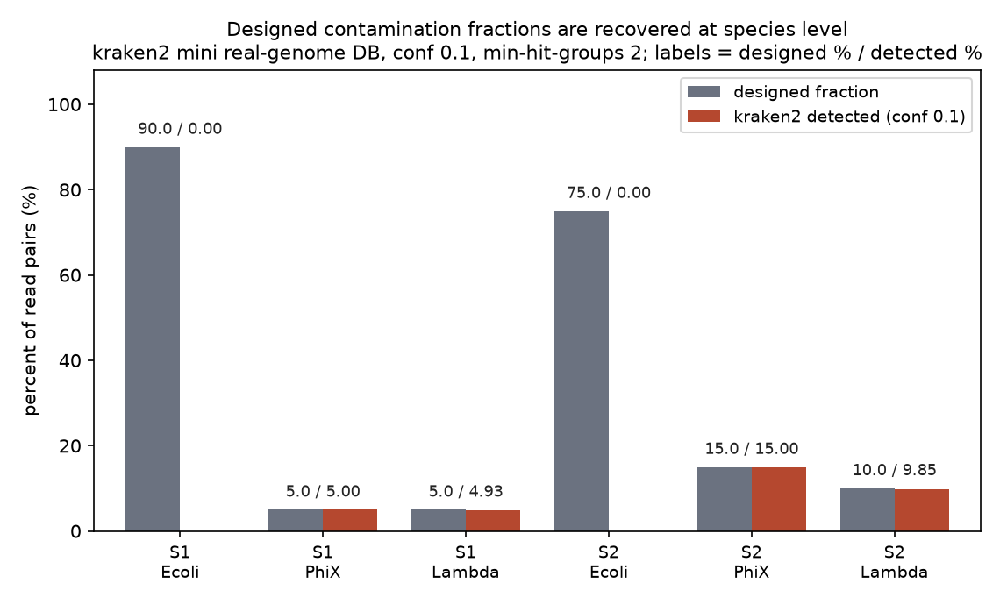
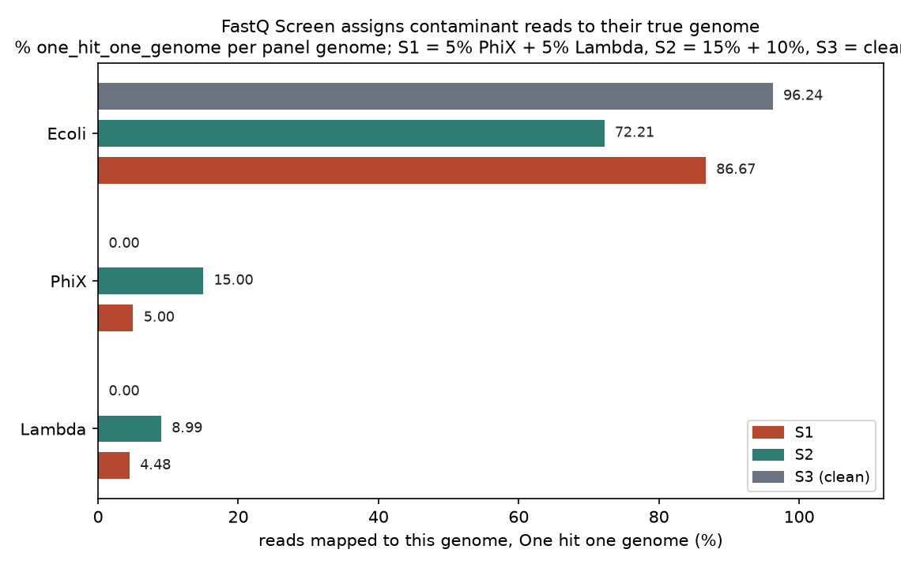
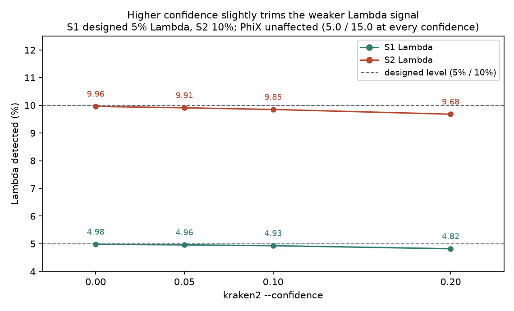

# 043 · bioSkills 真实试用：contamination-screening（污染筛查）

## 功能定位与适用范围

`contamination-screening` 讲解**用基因组面板筛查（FastQ Screen）与读段级物种分类（kraken2）检测跨物种污染，并据此做「报告 / 过滤 / 合并参考」决策**。

- **适用**：判断样本是否混入外源物种（PDX 供体鼠读段、PhiX 测序对照、克隆载体）；为污染比例给出定量估计；解读 FastQ Screen 命中类别与 kraken2 报告；对特定污染决定报告还是去除。
- **不适用（路由出去）**：同种样本交换与 index hopping——物种筛查对此结构性不可见，需 SNP 指纹工具（verifyBamID2 / NGSCheckMate / somalier）；深度物种丰度谱归 metagenomics/kraken-classification；接头去除归 read-qc/adapter-trimming；rRNA 比例作为 RNA 制备质量指标归 read-qc/rnaseq-qc。

## 属性表（本次真跑环境）

| 项 | 值 |
|---|---|
| kraken2 | v2.17.1（conda env `bio-qc`，bioconda 通道，WSL Ubuntu） |
| FastQ Screen | v0.16.0（bowtie2 2.5.5 为比对后端，4 线程） |
| multiqc | v1.35（汇总 `*_screen.txt`） |
| 数据库路线 | 真实迷你库：3 个 NCBI 真实基因组自建 kraken2 库（k=35、l=31）+ 3 组 bowtie2 面板索引 |
| 基因组 | E. coli K-12 MG1655（NC_000913.3，4641652 bp）；phiX174（NC_001422.1，5386 bp）；lambda（NC_001416.1，48502 bp） |
| 分类树 | NCBI Taxonomy eutils 子集（nodes.dmp / names.dmp 各 31 节点，含完整 lineage；非完整 taxdump，见「未覆盖」） |
| reads 来源 | make_inputs.py（seed 42）：从三个真实基因组按设计比例抽样 2×150 bp 读段，每样本 50000 对 |
| 设计混合 | S1 = 90% E. coli + 5% PhiX + 5% lambda；S2 = 75% + 15% + 10%；S3 = 100% E. coli（阴性对照） |
| 库规模 | kraken2 库 13 MB（4695540 bp，32 个分类节点，哈希表 1483627 项）；bowtie2 索引 31 MB |
| 实验产物 | `content/素材/read-qc/043-contamination-screening/` |

## 成分拆解

### 1. FastQ Screen 的机制与正确读法

FastQ Screen 把每个文件的子样本（默认 `--subset` 100000 条 reads）比对到一组基因组参考（面板），然后把每条 read 按跨面板的命中情况分类：`One_hit_one_genome`（唯一归属一个基因组）、`Multiple_hits_one_genome`、`One_hit_multiple_genomes`、`Multiple_hits_multiple_genomes`、`Hit_no_genomes`。

正确读法是**看 `One_hit_one_genome`，而不是看「%mapped」**：污染信号集中在意外基因组的 One_hit_one_genome 列；同源区域（rRNA、线粒体、保守位点）会摊进两个 multiple 类别；高 `Hit_no_genomes` 意味着接头二聚体、面板缺参考或未知物种——它是诊断线索，不是结论。

### 2. kraken2 的分类机制与 confidence 的作用

kraken2 对每条 read 的 k-mer（k=35，minimizer 间隔 l=31）查精确哈希表，沿 NCBI 分类树做最低共同祖先（LCA）判定。默认 `--confidence 0.0` 会**过量报告**一长串痕迹物种——几条共享 k-mer 就足以把 read 抬到物种级；SKILL 建议提到 0.05–0.1 并保持 `--minimum-hit-groups 2`（自建库可用 3）。kraken2 给的是「分类」，丰度重估计需另接 Bracken。

### 3. 五类污染、五条通路，物种筛查只覆盖其一

SKILL 把污染分为五类，每类有不同的检测工具与修法：

| 类别 | 检测工具 | 修法 |
|---|---|---|
| 跨物种 | FastQ Screen、kraken2 | 合并参考比对；定向 k-mer 去除（先报告） |
| 同种交叉 / index hopping | verifyBamID2、NGSCheckMate、somalier | 制备端 UDI；demux 丢弃不可能索引对 |
| 载体 / PhiX / 接头 | UniVec、FastQ Screen 接头库 | BBDuk `ref=phix` 定向 k-mer 过滤 |
| rRNA 过表达 | SortMeRNA、ribodetector | 重新制备 / 改进去除，不靠筛查后过滤 |
| 细胞系枝原体 / 错认 | kraken2 查 Mollicutes；STR 鉴定 | 清洗培养或弃样；STR 鉴定 |

核心洞察是**正交性**：物种筛查回答「有哪些物种在这里」，SNP 指纹回答「这些 DNA 是谁的、是不是混合物」。一个人类 A + 人类 B 的混合样本，或一份贴错标签的人类文件，在物种筛查里呈现完全干净的单物种轮廓——只跑 FastQ Screen 就宣布数据干净的流程，五项检查只做了一项。patterned flowcell（NovaSeq 等）上的 index hopping 约把 0.1–2% reads 撒进错误样本，对低 VAF 工作（ctDNA、单细胞、体细胞）是致命的，UDI（每样本独占 i7+i5）是唯一干净解。

### 4. 默认「筛查—报告」，不做全量过滤

物种筛查是 QC 门闸；低比例污染下，把 reads 比对到正确参考本来就放不下它们，全量过滤会同时丢掉属于样本的保守 rRNA/线粒体 reads，**使组成偏移**。只对具名污染（组装前的 PhiX、比对前的接头）用精确 k-mer 去除（BBDuk `ref=phix`）。PDX 场景应对合并的人+鼠参考比对后保留人 reads，或用基准测试过的分类器（XenofilteR 的 SNV 假阳性率优于 Xenome），二者都胜过对单一基因组的硬预过滤。

### 5. 参考库自身也会被污染

「人类」命中可能来自错误沉积进人类组装的细菌序列——Conterminator 在 GenBank 中找到超过 200 万条受污染条目。任何 `--confidence` 都修不好一个错误的库；应使用去污过的库，把出乎意料的单一来源命中当作库伪影处理，排除前不轻信。

## 严格复现（本次真跑，2026-09-03）

完整命令与输出见素材目录 `repro_transcript.txt`（STAGE 0–8 全落盘）；解析结果在 `results.json`。

**① 主流程命令链（bio-qc 环境，WSL Ubuntu）**

```
python3 make_inputs.py                       # 设计混合 reads（seed 42）
bash build_db.sh                             # eutils 分类子集 + kraken2-build + bowtie2 索引
kraken2 --db db/k2_mini --threads 4 --confidence 0.1 \
        --minimum-hit-groups 2 --paired --use-names \
        --report kraken2/S1.kreport reads/S1_1.fq.gz reads/S1_2.fq.gz
fastq_screen --conf fastq_screen.conf --threads 4 --outdir screen reads/S1_1.fq.gz
multiqc screen/ -o multiqc
```

**② 建库（核心实测）**

kraken2-build 一次通过：3 条序列共 4695540 bp 入库，分类树 32 节点，哈希表 1483627 项，建库总耗时 0.675 s。`kraken2-inspect` 确认 k=35、l=31；库文件 13 MB，bowtie2 索引 31 MB。

**③ 设计比例 vs 检出比例（核心定量结果，kraken2 conf 0.1）**

| 样本 | 设计（物种 = %reads 对） | kraken2 检出（物种 = %reads 对） | 未分类 |
|---|---|---|---|
| S1 | E. coli 90% / PhiX 5% / lambda 5% | 89.98% / 5.00% / 4.93% | 0.01% |
| S2 | E. coli 75% / PhiX 15% / lambda 10% | 74.99% / 15.00% / 9.85% | 0.00% |
| S3 | E. coli 100% | 99.98%（无其他物种，0 假阳性） | 0.01% |

三个样本的物种数检出均为 3/3/1，与设计一致；最大偏差出现在 S2 的 lambda（10% 设计 vs 9.85% 检出，绝对差 0.15 个百分点）。

**④ FastQ Screen 面板归属（%One_hit_one_genome）**

| 样本 | Ecoli 面板 | PhiX 面板 | Lambda 面板 |
|---|---|---|---|
| S1 | 86.67% | 5.00% | 4.48% |
| S2 | 72.21% | 15.00% | 8.99% |
| S3 | 96.24% | 0.00% | 0.00% |

PhiX 命中比例与设计精确相等（5.00% / 15.00%）；lambda 唯一命中略低于设计（4.48% / 8.99%），差值落在 `One_hit_multiple_genomes`（S1 0.64%、S2 1.12%）——这部分 reads 同时命中多个面板基因组，被分到多重命中类别而非丢失。S3 阴性对照在 PhiX 面板 0 命中。

**⑤ confidence 扫描（S1 / S2，conf 0.0 → 0.2）**

PhiX 检出在全部置信度下完全稳定（5.00% / 15.00%）；lambda 弱信号被轻微修剪：S1 4.98% → 4.82%，S2 9.96% → 9.68%。提高 confidence 的代价由弱污染信号承担，强污染信号不受影响。

### 本次出图







## 未覆盖（诚实标注）

- **同种污染与 index hopping 未真跑**：verifyBamID2 / NGSCheckMate / somalier 需要人类群体 SNP 频率面板，本次 3 基因组迷你库不适用；SKILL 中该分支仅为文档口径。
- **Bracken 丰度重估计、BBDuk 定向去除、PDX 合并参考、rRNA 与枝原体筛查均未跑**。
- **reads 为模拟抽样**：make_inputs.py 从三个真实基因组按设计比例抽样并注入测序错误（seed 42），非测序仪产出；检出精度因此代表工具对已知真值的上界，不等于真实样本表现。
- **分类树为 eutils 子集**：完整 NCBI taxdump（约 75 MB）当日网络速度约 18 KB/s，下载不可行，改用 eutils 逐 taxid 拉 lineage 构造 31 节点子集（格式为标准 dmp）。生产环境应使用官方完整分类树。
- **面板仅 3 个基因组**，无人类 / 鼠参考；标准库（kraken2 Standard、FastQ Screen 预构建面板）的行为未实测。

## 实践要点

- **自建迷你库可作定量基准**：3 个真实基因组 + eutils 分类子集即可搭起「设计比例 vs 检出比例」的可量化对账框架，比直接上标准库更能暴露工具行为。
- **标准库升级路径**：kraken2 侧用 `kraken2-build --download-taxonomy --download-library bacteria/viral/fungi` 或直接下载预构建 Standard DB；FastQ Screen 侧用官方预构建 bowtie2 面板索引（conf 中逐行 `DATABASE` 声明）；面板扩到人类 + 常见污染物（PhiX、rRNA、支原体）即覆盖生产场景主干。
- **kraken2 用 `--confidence 0.1 --minimum-hit-groups 2`**，压掉痕迹物种长尾；弱污染信号（本次 lambda）会被轻微修剪，属可接受代价。
- **看 `One_hit_one_genome`，不看「%mapped」**：多重命中类别承担同源噪声，唯一命中才是归属证据。
- **dmp 格式是自建库第一坑**：kraken2 的分类树解析器按「TAB + 竖线 + TAB」（`\t|\t`）切分字段，节点行须写成标准 `taxid\t|\tparent\t|\trank\t|` 形态；分隔符写错时库照常建完但分类树不可达，表现为 100% 未分类——用 `kraken2-inspect` 的 `Total taxonomy nodes` 行核验（本次修正前恒为 6，修正后 32）。
- **FastQ Screen 复跑前清旧输出**：已存在的 `_screen.txt` 会被跳过（日志显式打印 Skipping），不清会误用上一轮结果。
- **筛查后默认报告而非过滤**；确需去除时只对具名污染用 BBDuk，别按「命中筛查即删」全量清理。
- **人类 / 单物种队列必须补 SNP 指纹检查**（somalier / NGSCheckMate），物种筛查对同种交换结构性失明。

## 小结

contamination-screening 的机制核心是「面板比对 + 命中类别」与「k-mer LCA」两条互补的物种筛查路径，且必须与 SNP 指纹检查配合才能覆盖五类污染。本次以三个 NCBI 真实基因组自建 kraken2 迷你库（13 MB、32 节点）与 bowtie2 面板，按 90/5/5、75/15/10、100% 三种设计比例混合 2×150 bp reads 各 50000 对：kraken2（conf 0.1）检出比例与设计最大偏差 0.15 个百分点、阴性对照 0 假阳性；FastQ Screen 的 One_hit_one_genome 对 PhiX 精确还原、对 lambda 差值落在多重命中类别；confidence 扫描显示修剪代价由弱污染信号承担。自建库过程中实测并修正了 dmp 分隔符格式导致的「库建完但全部未分类」问题，分类树因网络限制采用 eutils 子集（31 节点），已在「未覆盖」中如实标注。

（数据与可复现脚本见 `content/素材/read-qc/043-contamination-screening/`，含 make_inputs.py、build_db.sh、parse_results.py、make_figs.py、repro_transcript.txt 及三张图。）
