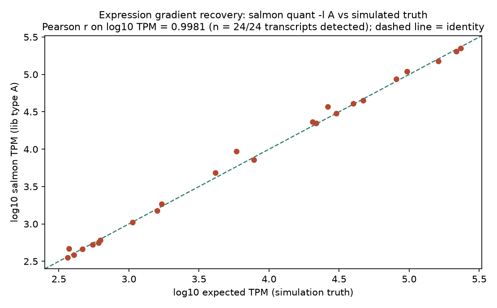
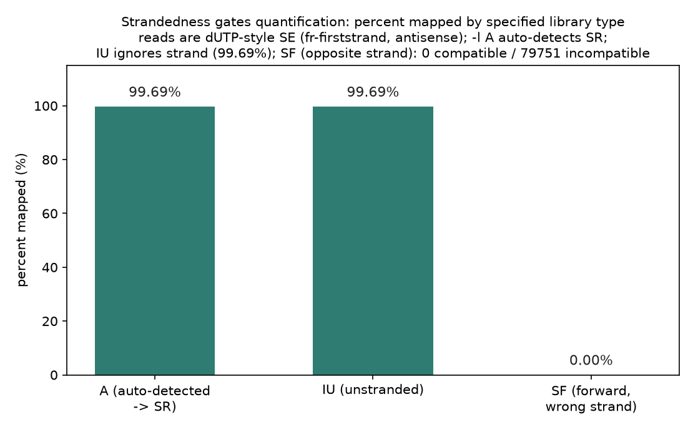
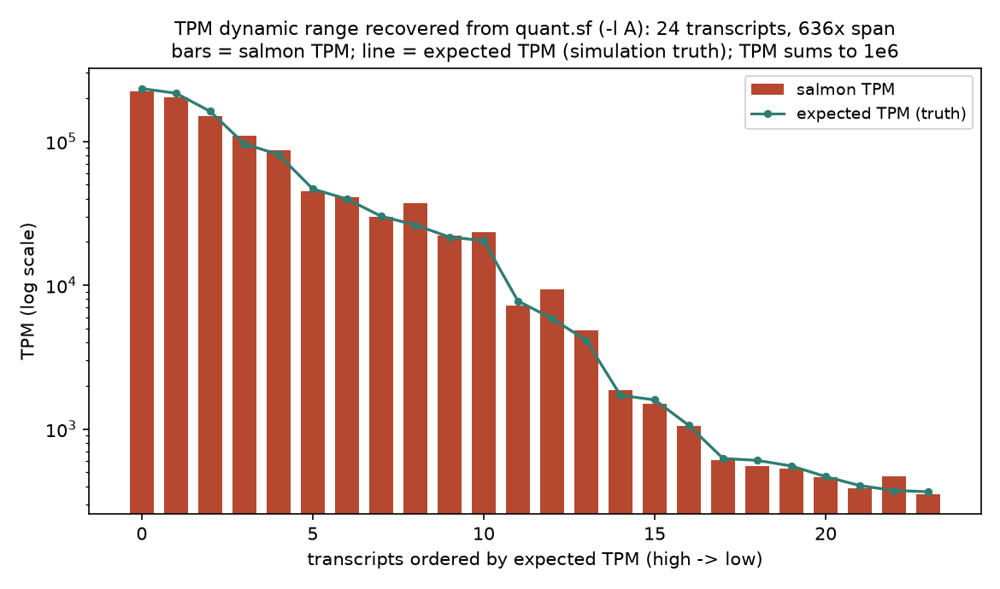

# 044 · bioSkills 真实试用：rnaseq-qc（RNA-seq 文库 QC）

## 功能定位与适用范围

`rnaseq-qc` 讲解**对齐之后的 RNA-seq 专有 QC**：链向判定、gene body 覆盖均一性、exonic/intronic/intergenic 读段分布、rRNA/globin/线粒体比例、转录本完整性（TIN）与饱和度，工具为 RSeQC / Qualimap / RNA-SeQC / Picard，输入是**比对 BAM + 基因模型**。

- **适用**：定量或差异表达前验证文库；诊断降解或 gDNA 污染；确定文库链向。
- **不适用**：原始 FASTQ 质控（见 quality-reports）；UMI 去重（见 umi-processing）；定量本身（见 featurecounts-counting）；差异表达（见 deseq2-basics）。

## 属性表（本次真跑环境）

| 项 | 值 |
|---|---|
| salmon | v2.7.0（conda env `bio-qc`，WSL Ubuntu，bioconda 预装） |
| 同环境工具 | fastp 1.3.6 / samtools 1.24（本次未用到） |
| 缺失工具 | RSeQC 全套脚本 / Picard / Qualimap / RNA-SeQC / SortMeRNA 均未安装 |
| 转录本参考 | `transcripts.fa`：24 条模拟转录本，536–2920 nt，合计 41280 bp |
| 表达梯度真值 | 分子占比 3.66×10⁻⁴–0.233（跨 636 倍），期望 TPM 366–233194 |
| reads | `reads_se.fq.gz`：80000 条单端 100 bp，dUTP 方向（反义链），1% 替换错误 |
| 主产出 | `quant_A/` `quant_IU/` `quant_SF/` 三个 quant 目录（quant.sf + lib_format_counts.json） |
| 实验产物 | `content/素材/read-qc/044-rnaseq-qc/` |

## 成分拆解

### 1. 与 FastQC 的分界：必须有 BAM + 基因模型

本 skill 的全部指标都站在**比对 BAM 与基因模型（BED12/GTF/refFlat/collapsed GTF）**之上。FastQC 回答「测序仪输出干净吗」；本 skill 回答「我测到的是我以为的那个转录组吗、链向对吗、完整吗」。链向、exonic 比例、rRNA 比例、5'-3' 偏置这些指标**没有 DNA 对应物**——DNA 没有外显子、没有转录链向、没有 rRNA 组分。最常见的配置错误是喂错基因模型格式：RSeQC 要 BED12，Qualimap 要 GTF，RNA-SeQC 要**坍缩 GTF**（每基因一条展平转录本），Picard 要 refFlat + rRNA 区间。

### 2. 链向：定量前必须实测，错链向静默归零

dUTP 类试剂盒（TruSeq Stranded mRNA、多数 rRNA 去除试剂盒）是 fr-firststrand = 反向 = featureCounts `-s 2` = salmon `ISR`（SE 为 `SR`）。按「正链」处理链特异性数据，读段落到反义基因上：计数趋向零、反义邻居膨胀，**全程无报错**。识别特征是巨量 "no feature" 或计数比无链运行低约 2 倍。skill 给出的口径是先经验判定（`infer_experiment.py` 或 salmon `-l A`）再定量，不要按试剂盒名称假设；salmon 自动判定结果看 `lib_format_counts.json` 的 `expected_format`。

### 3. 完整性与覆盖：RIN 是预测，TIN 是实测

3' 端堆积（coverage 集中在 3'）= RNA 降解或 oligo-dT 对降解/FFPE RNA 的引物化，因此 poly-A 流程在 FFPE 上失效，应改用 rRNA 去除 + 随机引物；5' 偏置少见（5' 捕获流程或伪影）；平坦 = 完整。RIN（1–10，制库前电泳估计）是预测值；gene body coverage 与 TIN 是从比对读段实测的「事后真相」。FFPE/存档样本用 DV200（大于 200 nt 片段百分比）替代 RIN；质量参差的队列把 medTIN 当协变量回归，而不是丢样本。

### 4. 读段分布与富集

高 INTRONIC = 前 mRNA/核 RNA 或 gDNA 污染（snRNA-seq 中这是信号不是失败）；高 INTERGENIC = gDNA 污染或注释缺口——gDNA 让 intronic 与 intergenic 同升，注释缺口只抬 intergenic。rRNA 比例是 poly-A 选择/rRNA 去除效率的读数（GTEx 门限小于 0.3；实践中小于 5% poly-A、小于 10% 去除库）。globin 挤占全血 PAXgene 文库；线粒体比例高 = 降解（bulk）或垂死细胞/环境污染（单细胞）。

### 5. 重复与饱和：诊断指标，不是去除步骤

无 UMI 的常规 bulk RNA-seq**不要标记或去除重复**：高表达基因天然产生大量同坐标片段，读段层面 PCR 重复与天然重复不可区分；坐标去重会优先删除最丰、最短转录本的读段，引入表达量与长度相关的偏置——与 DNA-seq 正好相反。重复率只作诊断（低复杂度/过度测序/低投入量）。唯一正确的去重方式是 UMI。`junction_saturation.py` 回答测序深度是否足够覆盖剪接。

### 6. 定量阈值（skill 给出的锚点）

| 指标 | 阈值 | 依据 |
|---|---|---|
| 比对率 | 大于 0.20（GTEx 剔除线）；典型大于 85% | GTEx v8 RNA-SeQC 门限 |
| intergenic 比例 | 小于 0.3 | GTEx；超出指向 gDNA/注释 |
| rRNA 比例 | 小于 0.3（GTEx） | 去除效率 |
| 唯一比对读段 | 不小于 30M（ENCODE 人类） | ENCODE 长 RNA 标准 |
| medTIN | 大于 70 良好，50–70 中等，小于 50 差 | RSeQC TIN |
| 5'-3' 偏置 | 接近 1 平坦；大于 2 强降解 | Picard MEDIAN_5PRIME_TO_3PRIME_BIAS |

阈值随流程而变：核 RNA 大于 50% intronic 属正常；FFPE 的 3' 偏置是预期。其上再叠队列离群逻辑。

## 严格复现（2026-09-03 真跑）

完整命令与输出见素材目录 `repro_transcript.txt`；环境核查、主流程、解析各有落盘日志（`_env_check.log` / `logs/_quant_*.log` / `logs/_parse.log`）。

**工具可得性交代（诚实记录）**：skill 的主位工具 RSeQC（infer_experiment / geneBody_coverage / tin / read_distribution / read_duplication / junction_saturation）与 Qualimap、RNA-SeQC、Picard、SortMeRNA 在本机均未安装，对应环节**未真跑**；skill 中可跑的 salmon 口径（链向判定一节的 `salmon quant -l A` 命令行与文库表）已完整真跑。本次数据为 python 生成的合成转录组（make_inputs.py 固定种子可复现），reads 按 dUTP 的 SE 口径取转录本反义链窗口并加 1% 替换错误。

**① 主流程命令链（bio-qc 环境）**

```
salmon index -t transcripts.fa -i salmon_index
salmon quant -i salmon_index -l A  -r reads_se.fq.gz -o quant_A
salmon quant -i salmon_index -l IU -r reads_se.fq.gz -o quant_IU
salmon quant -i salmon_index -l SF -r reads_se.fq.gz -o quant_SF
```

`-l A` 为 skill 给出的自动判定写法；`IU/SF/SR` 取自 skill 文库表，用作对照实验。

**② `-l A` 自动判定 SR，99.69% 比对（核心实测）**

| 项 | 实测值 |
|---|---|
| expected_format | SR（与模拟设定的 dUTP/fr-firststrand 一致） |
| 比对 | 79751 / 80000 条（99.69%） |
| compatible_fragment_ratio | 1.0（compatible 79751 / incompatible 0） |
| quant.sf | 24 条记录，TPM 合计恰为 1×10⁶，NumReads 合计 79751 |

**③ 表达梯度恢复：TPM 与真值高度一致**

24/24 条转录本检出（TPM 大于 0）。log10 TPM 对 log10 期望 TPM 的 Pearson r = **0.9981**，Spearman rho = 0.9948；观测/期望 TPM 比值中位数 0.9933，范围 0.92–1.59——最大偏离出现在最低丰度端（tx0013 期望 5863 TPM、仅 124 条 reads，实测 9313 TPM），属小计数统计涨落，非工具偏差。

**④ 文库表对照：无链不改变结果，错链向归零**

| 库型 | 比对/分配 | salmon 行为 |
|---|---|---|
| A（自动） | 99.69%，判定 SR | 正常定量 |
| IU（无链） | 99.69%，与 A 结果逐条相同 | WARN：「specified library type 'IU' disagrees with the observed format 'SR'」 |
| SF（错链向） | 0 / 80000（0.00%） | ERROR：「0 fragments mapped — the reference almost certainly does not match」；0 compatible / 79751 incompatible；quant.sf 24 条记录全为 0；进程退出码仍为 0 |

这正是 skill 关键论断的实测形态：链向错误**不抛异常**——SF 跑完照常写文件、退出码 0，唯一线索是日志 ERROR 与全零的 quant.sf；无链设定（IU）不丢计数但 salmon 会把观测到的链向作为警告回填。

### 本次出图







## 未覆盖（诚实标注）

以下 skill 环节因工具未安装而**未真跑**，仅为文档口径：

- RSeQC 全套：`infer_experiment.py`（BAM 版链向判定）、`geneBody_coverage.py`、`tin.py`、`read_distribution.py`、`read_duplication.py`、`junction_saturation.py`。
- Picard CollectRnaSeqMetrics（refFlat + rRNA 区间）、Qualimap rnaseq、RNA-SeQC 2（collapsed GTF）、SortMeRNA rRNA 过滤。
- 需要真基因组比对（STAR/HISAT2）才能产生的剪接位点与基因间区指标。
- 阈值表各锚点在本数据上的检验（合成数据无 gDNA/降解成分，无检出失败样本）。

## 实践要点

- **先验链向再定量**：salmon `-l A` 一条命令即可，结果读 `lib_format_counts.json` 的 expected_format；本次模拟 dUTP 数据实测判为 SR，与试剂盒口径一致。
- **错链向的失败是静默的**：SF 对照 0.00% 比对却退出码 0、照常产出全零 quant.sf——流水线只看退出码会放行空结果，必须检查 percent mapped 与日志 ERROR。
- **无链运行是安全的对照**：IU 与自动判定结果逐条相同（reads 全兼容），且 salmon 主动 WARN 观测链向，可作为链向存疑时的快速旁证。
- **TPM 精度受计数制约**：低丰度转录本（约 10² 条 reads）观测/期望比可达 1.6，高丰度端偏差小于 1%；解读低丰度差异要带区间。
- **salmon 2.7.0 的 quant 目录没有 meta_info.json**，percent mapped 需从 stdout 日志行读取；库型信息在 lib_format_counts.json。
- **RSeQC 系指标（TIN、gene body、分布、rRNA）需要 BAM + 基因模型**，salmon 准定量替代不了这层 QC；conda 环境缺 RSeQC 时这些门控是盲区，应补装后再出样本级报告。

## 小结

rnaseq-qc 的机制核心是「对齐后 + 基因模型」的转录组专有指标，其中链向是定量正确性的门闸。本次在 WSL 真跑闭环：python 合成 24 条跨 636 倍丰度的转录组与 8 万条 dUTP 方向单端 reads，按 skill 口径跑 salmon index + 三种库型 quant——`-l A` 自动判定 SR 且 99.69% 比对、TPM 与真值 r = 0.9981；错链向 SF 以 0.00% 比对、退出码 0、全零 quant.sf 完整复现了 skill 所述「错链向静默归零」。RSeQC/Picard 系环节因工具缺失未跑，已如实标注。

（数据与可复现脚本见 `content/素材/read-qc/044-rnaseq-qc/`，含 `make_inputs.py`、`_run.sh`、`parse_quant.py`、`make_figs.py`、`repro_transcript.txt` 及三张图。）
